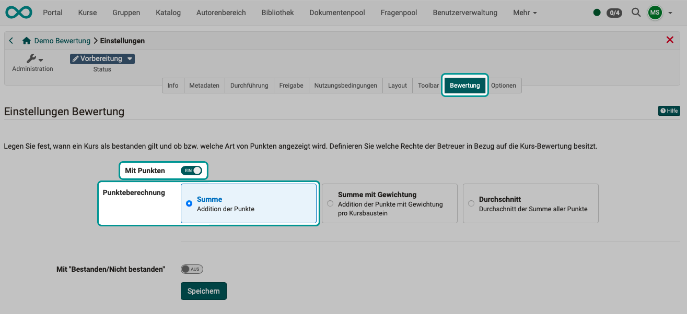
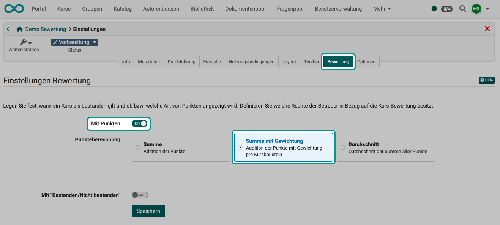
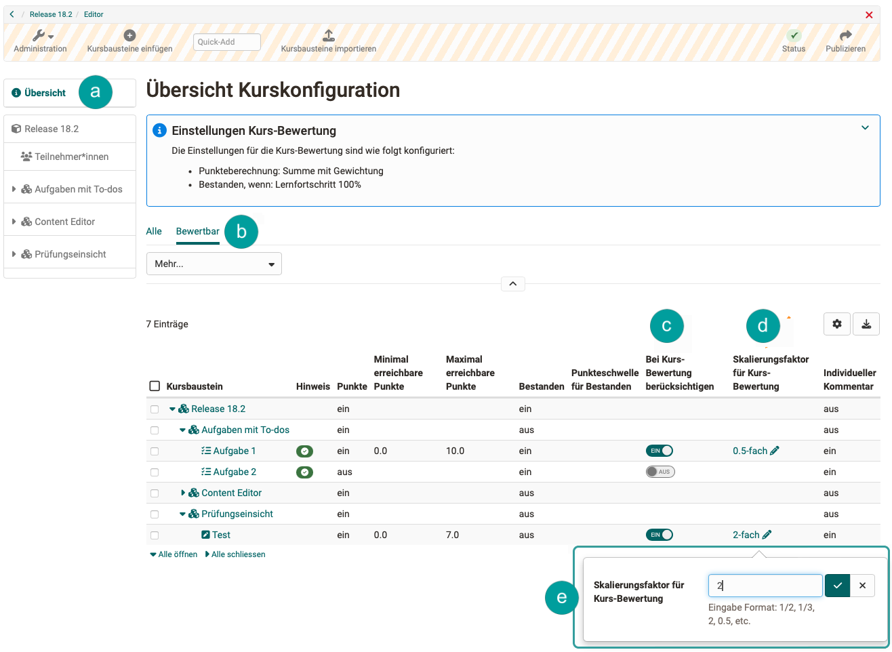
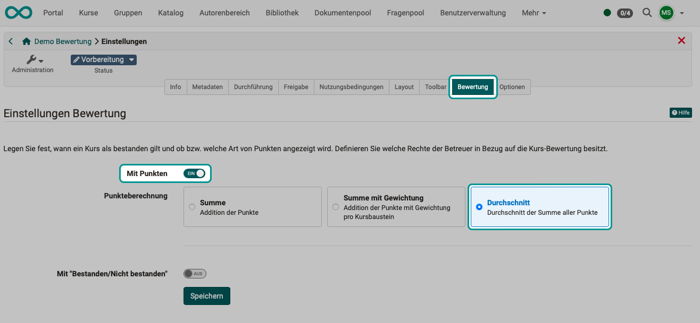
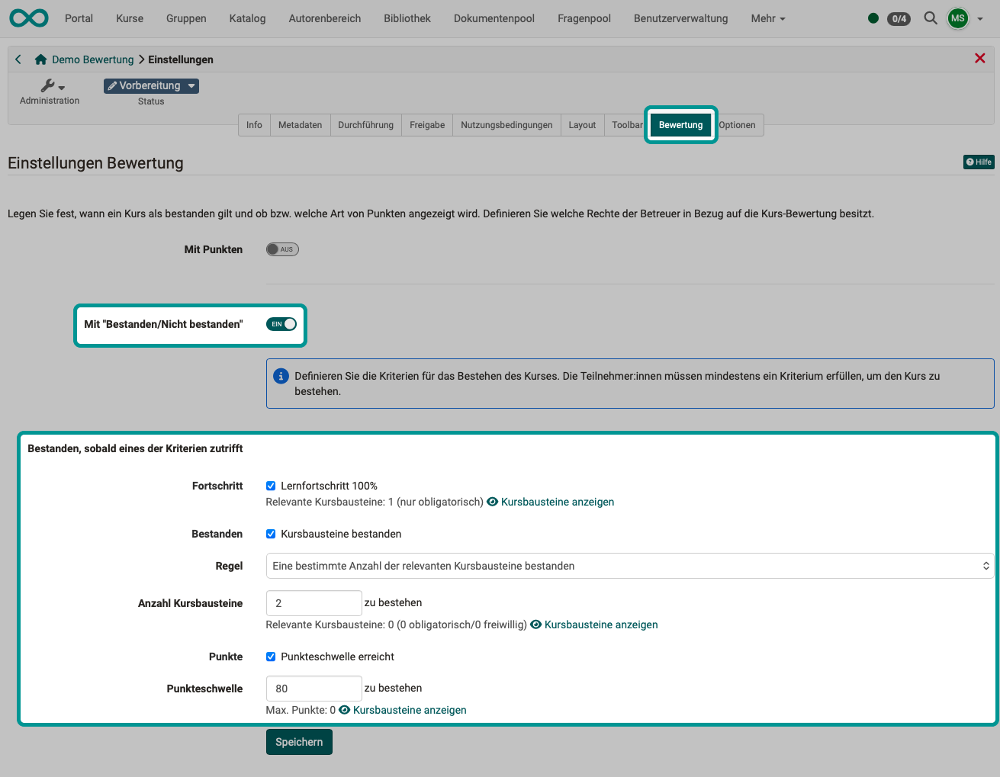

# Kurseinstellungen - Tab Bewertung {: #tab_assessment}

In Lernpfad-Kursen werden unter "Administration > Einstellungen" im Tab "Bewertung" die Einstellungen für die **Bewertungsmethode** und das **Bestehen** des Kurses definiert. 
Ausserdem können Sie die Verwendung von **Leistungsnachweisen** und die Vergabe von **Kreditpunkten**, **Zertifikaten** und **Badges** aktivieren. 

Die Optionen dazu finden Sie in den Abschnitten

 [Einstellungen Bewertung](#section_assessment_settings) 
 [Berechtigungen](#section_assessment_rights) 
 [Leistungsnachweis](#section_evidence_of_achievements) 
 [Kreditpunkte](#section_credit_points) 
 [Zertifikat](#section_certificate) 
 [Badges](#section_badges) 

{ class="shadow lightbox" }

[Zum Seitenanfang ^](#tab_assessment)

---

##  Abschnitt Einstellungen Bewertung {: #section_assessment_settings}

!!! info "Bewertung bei herkömmlichen Kursen"

    Die nachfolgenden Ausführungen beziehen sich auf Lernpfadkurse. Bei herkömmlichen Kursen werden die Kriterien für das Bestehen eines Kurses im Kurseditor auf dem obersten Kursbaustein im Tab "Punkte" eingestellt und das Ergebnis wird auf der Kursstartseite angezeigt.

Für Kursbewertungen gibt es 2 Einstellungen:

- **Mit Punkten** (nur bei Lernpfad-Kursen) {: #evaluation_with_points} 
    Hier können Sie einstellen, ob bzw. welche Art von Punkten angezeigt wird.
    Für die Kursbewertung mit Punkten stehen 3 Möglichkeiten zur Auswahl:

    * [Summe](#evaluation_with_points_sum)
    * [Summe mit Gewichtung](#evaluation_with_points_weighting) 
    * [Durchschnitt](#evaluation_with_points_average)

    { class="aside-right lightbox" }
    Wird in [Lernpfad-Kursen](Learning_path_course.de.md) mit **Punkten** bewertet, wirkt sich dies darauf aus, ob bzw. welche Art von Punkten noch ergänzend zu der Prozentanzeige im Kurs angezeigt wird. 
    
    Es kann mit Punkten bewertet werden, auch wenn sie nicht relevant für das Bestehen des Kurses sind.

- **Mit "bestanden/nicht bestanden"** 
  Hier können Sie einstellen, wann ein Kurs als bestanden gilt. Neben einer bestimmten erreichten Punktzahl können auch andere Kriterien zu einem "Bestanden" führen.  [Mehr dazu >](#evaluation_passed_failed)

    
[Zum Seitenanfang ^](#tab_assessment)

---

### Kursbewertung mit Punkten: Summe {: #evaluation_with_points_sum}

Es wird aus allen im Kurs erzielten Punkten die Summe gebildet.

{ class="shadow lightbox" }

[Zum Abschnitt Einstellungen Bewertung ^](#section_assessment_settings) 
[Zum Seitenanfang ^](#tab_assessment)

---

### Kursbewertung mit Punkten: Summe mit Gewichtung {: #evaluation_with_points_weighting}

Bei der Summenbildung fliesst die Gewichtung mit ein.

{ class="shadow lightbox" }

Sind in einem Kurs mehrere Leistungen zu erbringen, fliessen diese zum Teil mit unterschiedlicher Gewichtung in die Gesamtbewertung des Kurses ein. Die Option "Summe mit Gewichtung" für die Kurs-Bewertung ermöglicht es, **bei bewertbaren Bausteinen** einen **Skalierungsfaktor** für die Punkte zu hinterlegen. Voraussetzung ist, dass diese bewertbaren Bausteine bei der Kurs-Bewertung berücksichtigt werden.

In der **Kurs-Konfigurationsübersicht** kann die Skalierung für alle bewertbaren Bausteine geprüft und bei Bedarf direkt gesetzt bzw. editiert werden. Ein kompakte Ansicht über die bewertbaren Bausteine bietet der Vorfilter "Bewertbar".

{ class="shadow lightbox" title="Kurs-Konfiguration" }

Die gewichtete Punktzahl wird Betreuenden im Bewertungsformular angezeigt. Für Teilnehmende ist die gewichtete Punktzahl in der Leistungsübersicht des jeweiligen bewertbaren Bausteins sowie im Leistungsnachweis sichtbar.

[Zum Abschnitt Einstellungen Bewertung ^](#section_assessment_settings) 
[Zum Seitenanfang ^](#tab_assessment)

---

### Kursbewertung mit Punkten: Durchschnitt {: #evaluation_with_points_average}

{ class="shadow lightbox" }

!!! hint "Highscore"

    Nur wenn unter "Kursbewertung mit Punkten" **Summe** oder **Durchschnitt** gewählt wurde, kann im Kurseditor auch der Reiter "Highscore" des obersten Kursbausteins konfiguriert werden.

[Zum Abschnitt Einstellungen Bewertung ^](#section_assessment_settings) 
[Zum Seitenanfang ^](#tab_assessment)

---

### Kursbewertung mit "Bestanden/Nicht bestanden" {: #evaluation_passed_failed}

Ein Lernpfad-Kurs kann als bestanden gelten, sobald eines der Kriterien zutrifft:

* **Lernfortschritt 100%**:  Wenn alle obligatorischen Kursbausteine abgeschlossen wurden und 100 % angezeigt wird, gilt der Kurs automatisch als bestanden.
* **Regel "Alle Kursbausteine bestanden"**:  Der Kurs gilt als bestanden, wenn alle bewertbaren Kursbausteine, die mit einem "bestanden/nicht bestanden" versehen sind, bestanden wurden, egal ob es sich um obligatorische oder freiwillige Kursbausteine handelt. Um einzelne Kursbausteine auszunehmen, muss in der Konfiguration des Kursbausteins im Kurseditor "Bei Kurs-Bewertung ausschliessen" angehakt sein.
* **Regel "Eine bestimmte Anzahl der relevanten Kursbausteine bestanden"**:  Hier können Sie definieren, wie viele und welche Kursbausteine bestanden sein müssen, damit der gesamte Kurs als bestanden gilt. Ob ein Kursbaustein bei der Gesamtbewertung berücksichtigt wird, muss allerdings im Kurseditor direkt beim jeweiligen Kursbaustein angegeben werden (Tab Bewertung).  
* **Punktschwelle erreicht**:  Hier können Sie definieren, wie viele Punkte Lernende erreichen müssen, damit der gesamte Kurs als bestanden gilt. Ausserdem können Sie kontrollieren, von welchen Kursbausteinen die Punkte stammen müssen. Ob ein Kursbaustein bei der Gesamtbewertung berücksichtigt wird, muss im Kurseditor direkt beim jeweiligen Kursbaustein angegeben werden (Tab Bewertung).

{ class="shadow lightbox" }

!!! info "Bestanden-Kriterien"
      
    Die einzelnen Kriterien sind eine "Oder-Verknüpfung". Es genügt also, wenn eines der genannten Kriterien zutrifft.

!!! info "Welche Kursbausteine werden berücksichtigt?"
      
    Bei der Berechnung des **Lernfortschritts** zählen nur die **obligatorischen** Kursbausteine.
    
    Bei der Berechnung von "**Bestanden**" und **Punkten** zählen **obligatorische und freiwillige** Kursbausteine.

[Zum Abschnitt Einstellungen Bewertung ^](#section_assessment_settings) 
[Zum Seitenanfang ^](#tab_assessment)

---

##  Abschnitt Berechtigungen {: #section_assessment_rights}

{ class="lightbox" }

Betreuenden kann gestattet werden ...

* Daten von Teilnehmenden zurückzusetzen,
* eine Einstufung und Noten zuzuweisen,
* und die Bewertung für die Teilnehmer:innen freizugeben. 

[Zum Seitenanfang ^](#tab_assessment)

---

##  Abschnitt Leistungsnachweis {: #section_evidence_of_achievements}

{ class="lightbox" }

{ class="aside-right lightbox" }

Wenn Sie die Option "Leistungsnachweise verwenden" aktivieren, erscheint im Kurs im Toolbar Menü ["Mein Kurs"](../learningresources/Additional_Course_Features.de.md) die Option "Leistungsnachweis" und die Kursteilnehmenden sehen einen Überblick über die bewertbaren Kursbausteine mit ihrem jeweiligen aktuellen Bewertungsstatus.

Der Link zum Leistungsnachweis erscheint im Kurs erst dann, wenn im Kurs mindestens ein bewertbarer Kursbaustein existiert, und der Kursteilnehmer bereits mindestens eine Bewertung erhalten hat. Dies kann z.B. der Lösungsversuch eines Tests sein oder die Bewertung einer Aufgabe.

Wenn Sie die Funktion ausschalten, sehen Ihre Kursteilnehmenden keine Leistungsnachweise mehr. Die Leistungsnachweise gehen nicht verloren, sondern werden lediglich nicht mehr angezeigt. Wenn Sie den Leistungsnachweis wieder einschalten, stehen alle aktuellen Daten wieder zur Verfügung. Auch wenn Sie einen Kurs mit bestehenden Leistungsnachweisen löschen, können die Benutzer nach wie vor ihre Leistungsnachweise einsehen.

[Zum Seitenanfang ^](#tab_assessment)

---

##  Abschnitt Kreditpunkte {: #section_credit_points}

{ class="lightbox" }

Bei aktivierter Kreditpunktvergabe werden den Teilnehmer:innen nach Bestehen des Kurses automatisch Kreditpunkte gutgeschrieben. Dazu können verschiedene (von Administrator:innen definierte) Kreditpunktsysteme gewählt werden.

Als Kursbesitzer:in bestimmen Sie, wieviele Kreditpunkte vergeben werden, wenn dieser Kurs bestanden wird. 
Die Gültigkeitsdauer der Kreditpunkte kann auch begrenzt werden. 

!!! hint "Hinweis"

    Die Vergabe von Kreditpunkten ist auch innerhalb eines Zertifikatsprogramms von Bedeutung.

Weitere Informationen: 
[Kreditpunkte systemweit aktivieren >](../../manual_admin/administration/e-Assessment_Credit_Points.de.md) 

[Zum Seitenanfang ^](#tab_assessment)

---

##  Abschnitt (Kurs-)Zertifikat {: #section_certificate}

{ class="lightbox" }

Als Bestätigung für den Besuch eines Kurses bzw. der Erreichung von bestimmten kursbezogenen Aktivitäten kann ein **PDF-Zertifikat** ausgestellt werden.

[Details zu Zertifikaten in einem Kurs >](../learningresources/Course_Settings_Assessment_Certificate.de.md) 

Wurde ein Zertifikat mit einer begrenzten Gültigkeitsdauer vergeben, kann ein **Rezertifizierungsprozess** aktivert werden.  
[Details zur Rezertifizierung >](../learningresources/Course_Settings_Assessment_Certificate.de.md#recertification)

[Zum Seitenanfang ^](#tab_assessment)

---

##  Abschnitt Badges {: #section_badges}

{ class="lightbox" }

Um Badges in Kursen nutzen zu können, müssen sie hier im Tab "Bewertung" der Einstellungen aktiviert werden. Anschliessend gibt es einen neuen Menüpunkt in der Kurs-Administration und bei der Bearbeitung von Kursbausteinen "Bewertung" erscheint zusätzlich der Tab "Badge".

Eine manuelle Vergabe von Badges durch Kursbesitzer:innen ist immer möglich, Betreuer:innen können wahlweise ebenfalls berechtigt werden.

Weitere Infos zu Badges finden Sie hier:  
[Infos für Kursbesitzer:innen (Erstellen und Bearbeiten von Badges) >](../learningresources/OpenBadges.de.md) 
[Infos für Benutzer:innen (Badges bei den "Persönlichen Werkzeugen") >](../personal_menu/OpenBadges.de.md)  
[Infos für OpenOlat Administrator:innen >](../../manual_admin/administration/e-Assessment_openBadges.de.md)

[Zum Seitenanfang ^](#tab_assessment)

