# Kurseinstellungen - Tab Bewertung {: #tab_assessment}

In Lernpfad-Kursen werden unter `Kurs > Administration > Einstellungen > Tab "Bewertung"` die Einstellungen für die **Bewertungsmethode** und das **Bestehen** des Kurses definiert. 
Ausserdem können Sie die Verwendung von **Leistungsnachweisen** und die Vergabe von **Kreditpunkten**, **Zertifikaten** und **Badges** aktivieren. 
Den Tab bearbeiten alle, die das Menü "Einstellungen" des Kurses öffnen dürfen: Besitzer:innen des Kurses, Lernressourcenverwalter:innen und Administrator:innen sowie Personen mit dem Recht "Kurseditor", siehe [Kurseinstellungen](Course_Settings.de.md).

Die Optionen dazu finden Sie in den Abschnitten

[Einstellungen Bewertung](#section_assessment_settings) 
[Berechtigungen](#section_assessment_rights) 
[Leistungsnachweis](#section_evidence_of_achievements) 
[Kreditpunkte](#section_credit_points) 
[Zertifikat](#section_certificate) 
[Badges](#section_badges)

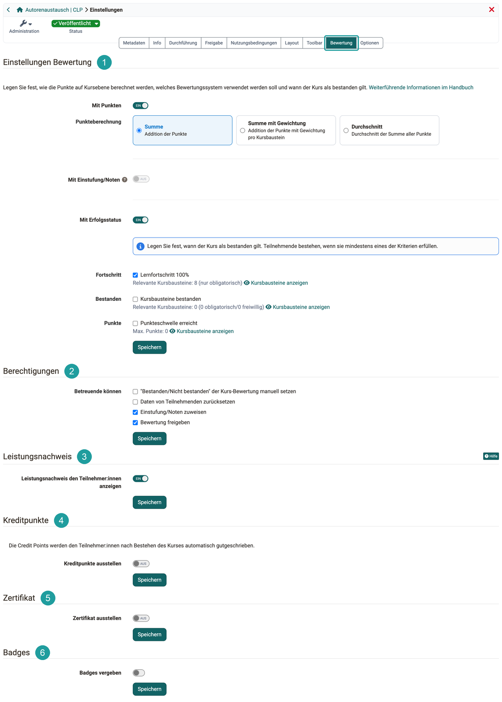{ class="shadow lightbox" title="Tab Bewertung in den Kurseinstellungen" }

[Zum Seitenanfang ^](#tab_assessment)

---

## Abschnitt Einstellungen Bewertung {: #section_assessment_settings}

!!! info "Bewertung bei herkömmlichen Kursen"

    Die nachfolgenden Ausführungen beziehen sich auf Lernpfadkurse. Bei herkömmlichen Kursen werden die Kriterien für das Bestehen eines Kurses im Kurseditor auf dem obersten Kursbaustein im Tab "Punkte" eingestellt und das Ergebnis wird auf der Kursstartseite angezeigt.

Für Kursbewertungen gibt es folgende Einstellungen:

- **Mit Punkten** (nur bei Lernpfad-Kursen) {: #evaluation_with_points} 
    Hier können Sie einstellen, ob bzw. welche Art von Punkten angezeigt wird.
    Für die Kursbewertung mit Punkten stehen 3 Möglichkeiten zur Auswahl:

    * [Summe](#evaluation_with_points_sum)
    * [Summe mit Gewichtung](#evaluation_with_points_weighting) 
    * [Durchschnitt](#evaluation_with_points_average)

    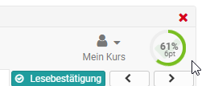{ class="aside-right lightbox" }
    Wird in [Lernpfad-Kursen](Learning_path_course.de.md) mit **Punkten** bewertet, wirkt sich dies darauf aus, ob bzw. welche Art von Punkten noch ergänzend zu der Prozentanzeige im Kurs angezeigt wird.

    Es kann mit Punkten bewertet werden, auch wenn sie nicht relevant für das Bestehen des Kurses sind.

- **Mit Einstufung/Noten** (nur bei Lernpfad-Kursen) 
  Bei aktiviertem Einstufungs-/Notenmodul weisen Sie dem Kurs auf Kursebene eine Note zu.  [Mehr dazu >](#evaluation_with_grades)

- **Mit Erfolgsstatus** 
  Hier können Sie einstellen, wann ein Kurs als bestanden gilt. Der Erfolgsstatus ist das Ergebnis der Kursbewertung: "Bestanden", "Nicht bestanden" oder "Keine Angabe". Neben einer bestimmten erreichten Punktzahl können auch andere Kriterien zu einem "Bestanden" führen.  [Mehr dazu >](#evaluation_passed_failed)

[Zum Seitenanfang ^](#tab_assessment)

---

### Kursbewertung mit Punkten: Summe {: #evaluation_with_points_sum}

Es wird aus allen im Kurs erzielten Punkten die Summe gebildet.

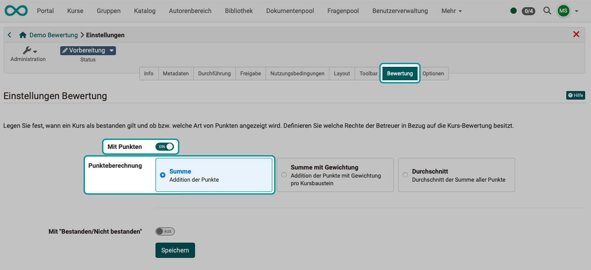{ class="shadow lightbox" title="Punkteberechnung im Abschnitt Einstellungen Bewertung" }

[Zum Abschnitt Einstellungen Bewertung ^](#section_assessment_settings) 
[Zum Seitenanfang ^](#tab_assessment)

---

### Kursbewertung mit Punkten: Summe mit Gewichtung [:octicons-tag-16:{ title="ab Release 18.2.0 (OO-7378)" }](https://track.frentix.com/issue/OO-7378) {: #evaluation_with_points_weighting}

Bei der Summenbildung fliesst die Gewichtung mit ein.

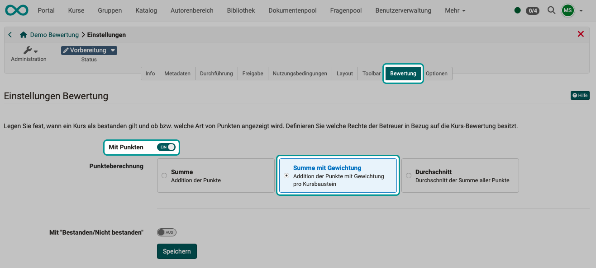{ class="shadow lightbox" title="Punkteberechnung im Abschnitt Einstellungen Bewertung" }

Sind in einem Kurs mehrere Leistungen zu erbringen, fliessen diese zum Teil mit unterschiedlicher Gewichtung in die Gesamtbewertung des Kurses ein. Die Option "Summe mit Gewichtung" für die Kurs-Bewertung ermöglicht es, **bei bewertbaren Bausteinen** einen **Skalierungsfaktor** für die Punkte zu hinterlegen. Voraussetzung ist, dass diese bewertbaren Bausteine bei der Kurs-Bewertung berücksichtigt werden.

In der **Übersicht Kurskonfiguration** des Kurseditors kann die Skalierung für alle bewertbaren Bausteine geprüft und bei Bedarf direkt gesetzt bzw. editiert werden. Eine kompakte Ansicht über die bewertbaren Bausteine bietet der Vorfilter "Bewertbar".

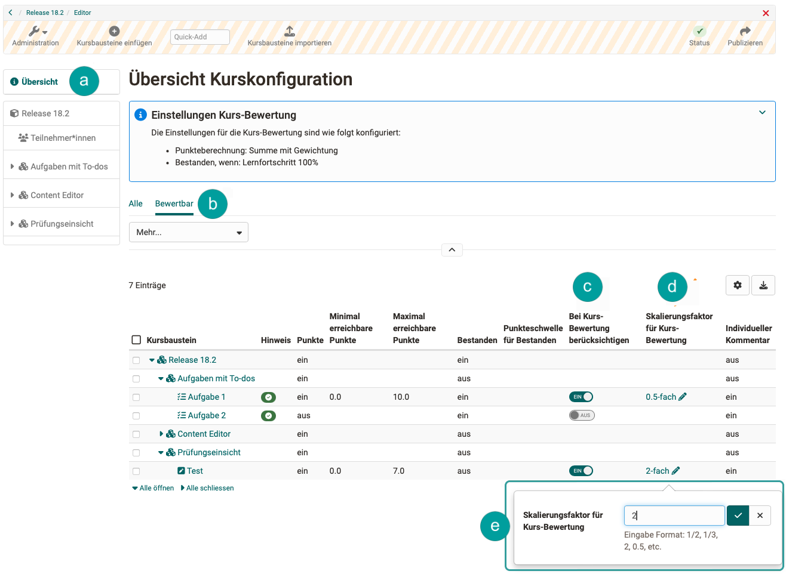{ class="shadow lightbox" title="Übersicht Kurskonfiguration im Kurseditor" }

Die gewichtete Punktzahl wird Betreuenden im Bewertungsformular angezeigt. Für Teilnehmende ist die gewichtete Punktzahl in der Leistungsübersicht des jeweiligen bewertbaren Bausteins sowie im Leistungsnachweis sichtbar.

[Zum Abschnitt Einstellungen Bewertung ^](#section_assessment_settings) 
[Zum Seitenanfang ^](#tab_assessment)

---

### Kursbewertung mit Punkten: Durchschnitt {: #evaluation_with_points_average}

Es wird der Durchschnitt aus den erzielten Punkten der bewertbaren Kursbausteine gebildet, die bei der Kurs-Bewertung berücksichtigt werden. Kursbausteine ohne Punktzahl zählen dabei nicht mit.

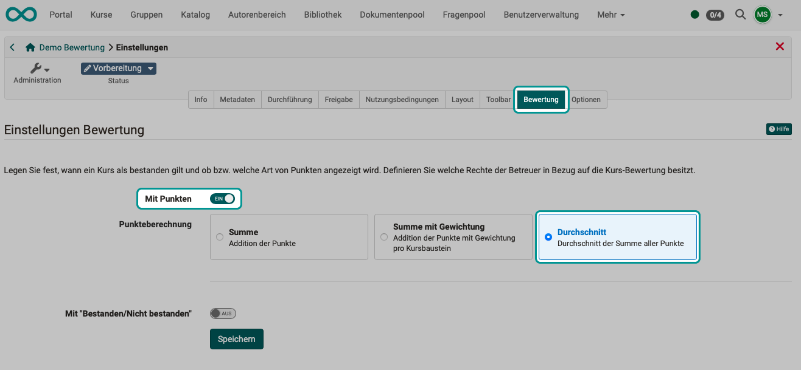{ class="shadow lightbox" title="Punkteberechnung im Abschnitt Einstellungen Bewertung" }

!!! info "HighScore"

    Ist "Mit Punkten" eingeschaltet, kann im Kurseditor auch der Tab "HighScore" des obersten Kursbausteins konfiguriert werden, bei jeder der drei Punkteberechnungen.

[Zum Abschnitt Einstellungen Bewertung ^](#section_assessment_settings) 
[Zum Seitenanfang ^](#tab_assessment)

---

### Kursbewertung mit Einstufung/Noten [:octicons-tag-16:{ title="ab Release 21.0 (OO-9511)" }](https://track.frentix.com/issue/OO-9511) {: #evaluation_with_grades}

Ist das Einstufungs-/Notenmodul aktiviert und wird der Kurs mit **Punkten** bewertet, können Sie mit der Option **"Mit Einstufung/Noten"** dem Kurs auf Kursebene eine Note zuweisen. Die Kursnote wird aus der Summe der Punkte der bewertbaren Kursbausteine gebildet (Summe, gewichtete Summe oder Durchschnitt gemäss der gewählten Punkteeinstellung) und über die gewählte **Bewertungsskala** in eine Note übersetzt.

Der Schalter lässt sich erst umlegen, wenn "Mit Punkten" eingeschaltet und "Mit Erfolgsstatus" ausgeschaltet ist. Fehlt eine der beiden Bedingungen, bleibt "Mit Einstufung/Noten" grau.

Ist "Mit Einstufung/Noten" aktiv, bestimmt die Bewertungsskala auch den **Erfolgsstatus** des Kurses: Der Kurs gilt als bestanden, wenn das **Erfolgskriterium** der Bewertungsskala erfüllt ist. Das Erfolgskriterium ist die tiefste Note oder Leistungsklasse der Bewertungsskala, mit der eine Leistung als bestanden gilt. "Mit Erfolgsstatus" bleibt dann ausgeschaltet und lässt sich nicht mehr ändern. Enthält die gewählte Bewertungsskala kein Erfolgskriterium, hat der Kurs auf Kursebene keinen Erfolgsstatus.

Die Note wird nicht automatisch vergeben: Die "Zuweisung" steht fest auf "Manuell". Kursbesitzer:innen und berechtigte Betreuer:innen weisen die berechnete Note im [Bewertungswerkzeug](Assessment_tool_overview.de.md) zu. Damit auch Betreuende ohne Besitzrecht zuweisen können, setzen Kursbesitzer:innen im [Abschnitt Berechtigungen](#section_assessment_rights) die Option "Einstufung/Noten zuweisen".

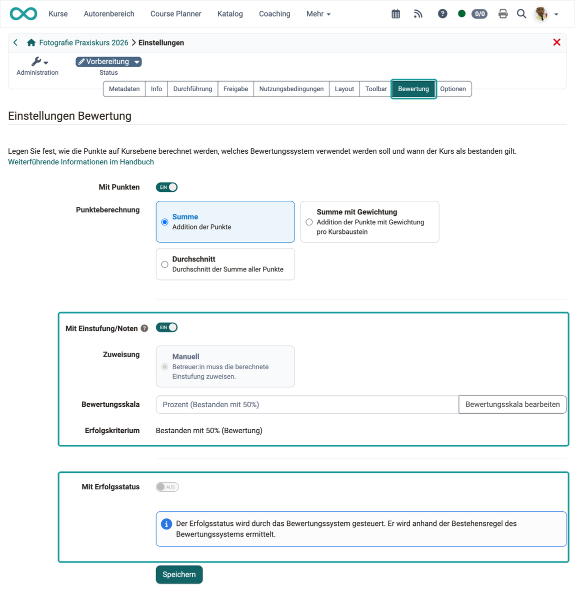{ class="shadow lightbox" title="Einstufung/Noten im Abschnitt Einstellungen Bewertung" }

[Zum Abschnitt Einstellungen Bewertung ^](#section_assessment_settings) 
[Zum Seitenanfang ^](#tab_assessment)

---

### Kursbewertung mit "Bestanden/Nicht bestanden" {: #evaluation_passed_failed}

Ein Lernpfad-Kurs kann als bestanden gelten, sobald eines der Kriterien zutrifft:

* **Lernfortschritt 100%**:  Wenn alle obligatorischen Kursbausteine abgeschlossen wurden und 100 % angezeigt wird, gilt der Kurs automatisch als bestanden.
* **Regel "Alle relevanten Kursbausteine bestanden"**:  Der Kurs gilt als bestanden, wenn alle bewertbaren Kursbausteine, die mit einem "bestanden/nicht bestanden" versehen sind, bestanden wurden, egal ob es sich um obligatorische oder freiwillige Kursbausteine handelt. Um einzelne Kursbausteine auszunehmen, schalten Sie in der Konfiguration des Kursbausteins im Kurseditor den Schalter "Bei Kurs-Bewertung berücksichtigen" aus.
* **Regel "Eine bestimmte Anzahl der relevanten Kursbausteine bestanden"**:  Hier können Sie definieren, wie viele und welche Kursbausteine bestanden sein müssen, damit der gesamte Kurs als bestanden gilt. Ob ein Kursbaustein bei der Gesamtbewertung berücksichtigt wird, muss allerdings im Kurseditor direkt beim jeweiligen Kursbaustein angegeben werden (Tab Bewertung).
* **Punkteschwelle erreicht**:  Hier können Sie definieren, wie viele Punkte Lernende erreichen müssen, damit der gesamte Kurs als bestanden gilt. Ausserdem können Sie kontrollieren, von welchen Kursbausteinen die Punkte stammen müssen. Ob ein Kursbaustein bei der Gesamtbewertung berücksichtigt wird, muss im Kurseditor direkt beim jeweiligen Kursbaustein angegeben werden (Tab Bewertung).

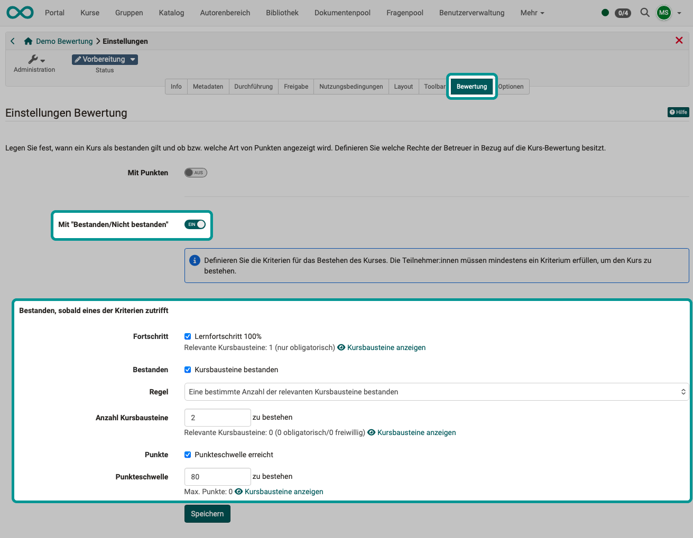{ class="shadow lightbox" title="Erfolgsstatus im Abschnitt Einstellungen Bewertung" }

!!! info "Bestanden-Kriterien"

    Die einzelnen Kriterien sind eine "Oder-Verknüpfung". Es genügt also, wenn eines der genannten Kriterien zutrifft.

!!! info "Welche Kursbausteine werden berücksichtigt?"

    Bei der Berechnung des **Lernfortschritts** zählen nur die **obligatorischen** Kursbausteine.

    Bei der Berechnung von "**Bestanden**" und **Punkten** zählen **obligatorische und freiwillige** Kursbausteine.

[Zum Abschnitt Einstellungen Bewertung ^](#section_assessment_settings) 
[Zum Seitenanfang ^](#tab_assessment)

---

## Abschnitt Berechtigungen {: #section_assessment_rights}

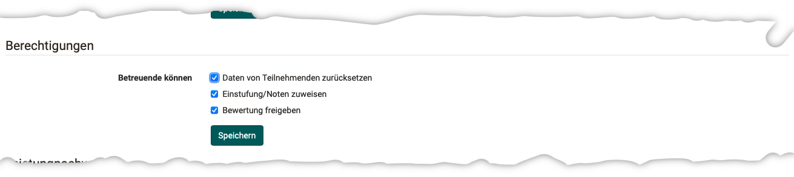{ class="lightbox" title="Abschnitt Berechtigungen" }

Betreuenden kann gestattet werden ...

* den Erfolgsstatus "Bestanden/Nicht bestanden" der Kurs-Bewertung manuell zu setzen,
* Daten von Teilnehmenden zurückzusetzen,
* eine Einstufung und Noten zuzuweisen,
* und die Bewertung für die Teilnehmer:innen freizugeben. 

Die Option für den manuellen Erfolgsstatus erscheint nur, wenn im [Abschnitt Einstellungen Bewertung](#section_assessment_settings) unter "Mit Erfolgsstatus" mindestens ein Kriterium angehakt ist. Wählbar ist sie erst, wenn auch "Bewertung freigeben" angehakt ist.

[Zum Seitenanfang ^](#tab_assessment)

---

## Abschnitt Leistungsnachweis {: #section_evidence_of_achievements}

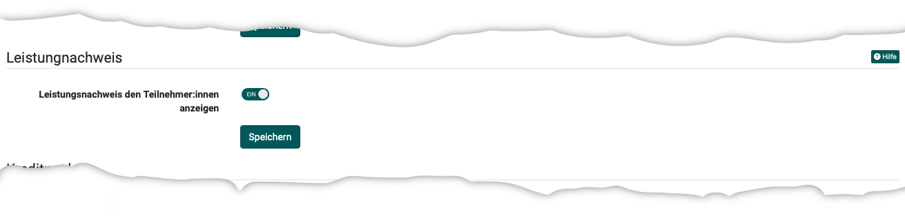{ class="lightbox" title="Abschnitt Leistungsnachweis" }

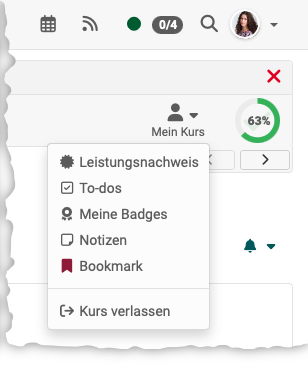{ class="aside-right lightbox" }

Wenn Sie die Option "Leistungsnachweis den Teilnehmer:innen anzeigen" aktivieren, erscheint im Kurs im Toolbar Menü ["Mein Kurs"](../learningresources/Additional_Course_Features.de.md) die Option "Leistungsnachweis" und die Teilnehmenden sehen einen Überblick über die bewertbaren Kursbausteine mit ihrem jeweiligen aktuellen Bewertungsstatus.

Der Eintrag "Leistungsnachweis" erscheint im Menü "Mein Kurs" für Teilnehmende, sobald diese Option eingeschaltet ist. Er erscheint auch bei ausgeschalteter Option, wenn im [Abschnitt Zertifikat](#section_certificate) "Zertifikat ausstellen" eingeschaltet ist. Gäste sehen den Eintrag nicht, und solange im Kurs eine Prüfung im [Prüfungsmodus](Assessment_mode.de.md) läuft, bleibt er ausgeblendet.

Wenn Sie die Funktion ausschalten, sehen Ihre Teilnehmenden keine Leistungsnachweise mehr. Die Leistungsnachweise gehen nicht verloren, sondern werden lediglich nicht mehr angezeigt. Wenn Sie den Leistungsnachweis wieder einschalten, stehen alle aktuellen Daten wieder zur Verfügung. Auch wenn Sie einen Kurs mit bestehenden Leistungsnachweisen löschen, können die Teilnehmenden ihre [Leistungsnachweise](../personal_menu/Evidence_of_Achievements.de.md) weiterhin einsehen. Dort fehlt für den gelöschten Kurs die Aktion "Kurs öffnen". [:octicons-tag-16:{ title="ab Release 21.0.3 (OO-8667)" }](https://track.frentix.com/issue/OO-8667)

[Zum Seitenanfang ^](#tab_assessment)

---

## Abschnitt Kreditpunkte [:octicons-tag-16:{ title="ab Release 20.1.1 (OO-8558)" }](https://track.frentix.com/issue/OO-8558) {: #section_credit_points}

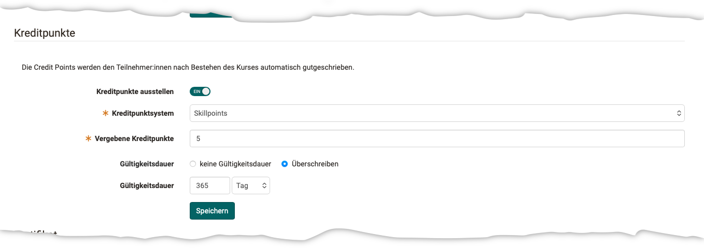{ class="lightbox" title="Abschnitt Kreditpunkte" }

Ist "Kreditpunkte ausstellen" eingeschaltet, werden den Teilnehmer:innen nach Bestehen des Kurses automatisch Kreditpunkte gutgeschrieben. Dazu können verschiedene (von Administrator:innen definierte) Kreditpunktsysteme gewählt werden.

Als Kursbesitzer:in bestimmen Sie, wieviele Kreditpunkte vergeben werden, wenn dieser Kurs bestanden wird. 
Die Gültigkeitsdauer der Kreditpunkte kann auch begrenzt werden. 

!!! note "Hinweis"

    Die Vergabe von Kreditpunkten ist auch innerhalb eines Zertifikatsprogramms von Bedeutung.

Weitere Informationen: 
[Kreditpunkte systemweit aktivieren >](../../manual_admin/administration/e-Assessment_Credit_Points.de.md) 

[Zum Seitenanfang ^](#tab_assessment)

---

## Abschnitt Zertifikat [:octicons-tag-16:{ title="ab Release 10.1 (OO-1254)" }](https://track.frentix.com/issue/OO-1254) {: #section_certificate}

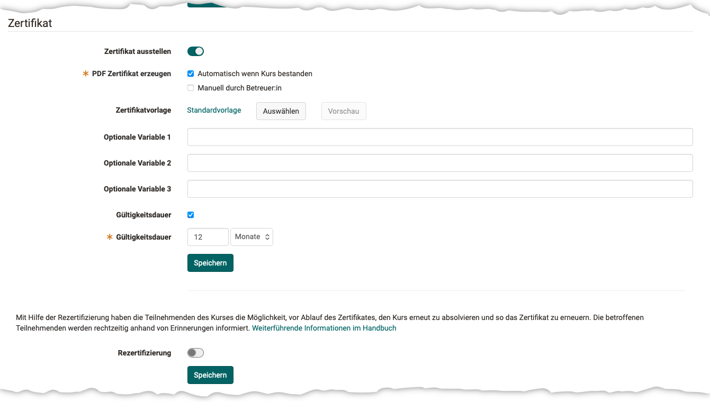{ class="lightbox" title="Abschnitt Zertifikat" }

Als Bestätigung für den Besuch eines Kurses bzw. der Erreichung von bestimmten kursbezogenen Aktivitäten kann ein **PDF-Zertifikat** ausgestellt werden.

[Details zu Zertifikaten in einem Kurs >](../learningresources/Course_Settings_Assessment_Certificate.de.md) 

Wurde ein Zertifikat mit einer begrenzten Gültigkeitsdauer vergeben, kann ein **Rezertifizierungsprozess** aktiviert werden.  
[Details zur Rezertifizierung >](../learningresources/Course_Settings_Assessment_Certificate.de.md#recertification)

[Zum Seitenanfang ^](#tab_assessment)

---

## Abschnitt Badges [:octicons-tag-16:{ title="ab Release 18.0.0 (OO-7003)" }](https://track.frentix.com/issue/OO-7003) {: #section_badges}

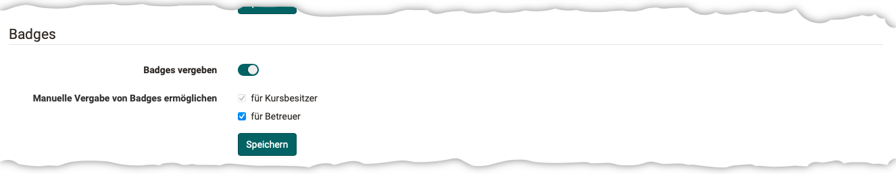{ class="lightbox" title="Abschnitt Badges" }

Um Badges in Kursen nutzen zu können, müssen sie hier im Tab "Bewertung" der Einstellungen aktiviert werden. Anschliessend gibt es einen neuen Menüpunkt in der Kurs-Administration und bei der Bearbeitung von Kursbausteinen "Bewertung" erscheint zusätzlich der Tab "Badge".

Eine manuelle Vergabe von Badges durch Kursbesitzer:innen ist immer möglich, Betreuer:innen können wahlweise ebenfalls berechtigt werden.

Weitere Infos zu Badges finden Sie hier:  
[Infos für Kursbesitzer:innen (Erstellen und Bearbeiten von Badges) >](../learningresources/OpenBadges.de.md) 
[Infos für Benutzer:innen (Badges bei den "Persönlichen Werkzeugen") >](../personal_menu/OpenBadges.de.md)  
[Infos für OpenOlat Administrator:innen >](../../manual_admin/administration/e-Assessment_openBadges.de.md)

[Zum Seitenanfang ^](#tab_assessment)

---

## Weiterführende Informationen {: #further_information}

**Auf dieser Seite erwähnt** 
[Kurseinstellungen >](Course_Settings.de.md) 
[Lernpfadkurs - Überblick >](Learning_path_course.de.md) 
[Bewertungswerkzeug - Übersicht >](Assessment_tool_overview.de.md) 
[Zusätzliche Kursfunktionen >](Additional_Course_Features.de.md) 
[Prüfungsverwaltung: Prüfungsmodus >](Assessment_mode.de.md) 
[Persönliche Erfolge/Leistungen: Leistungsnachweise >](../personal_menu/Evidence_of_Achievements.de.md) 
[e-Assessment Administration: Kreditpunkte >](../../manual_admin/administration/e-Assessment_Credit_Points.de.md) 
[Kurseinstellungen - Tab Bewertung: Zertifikate und Rezertifizierung >](Course_Settings_Assessment_Certificate.de.md) 
[Badges >](OpenBadges.de.md) 
[Persönliche Erfolge/Leistungen: Badges >](../personal_menu/OpenBadges.de.md) 
[e-Assessment Administration: OpenBadges >](../../manual_admin/administration/e-Assessment_openBadges.de.md)

**Weiterführend** 
[Einstufung/Noten >](Assessment_translate_points_in_grades.de.md) 
[Lernpfadkurs - Kurseditor >](Learning_path_course_Course_editor.de.md)

[Zum Seitenanfang ^](#tab_assessment)

