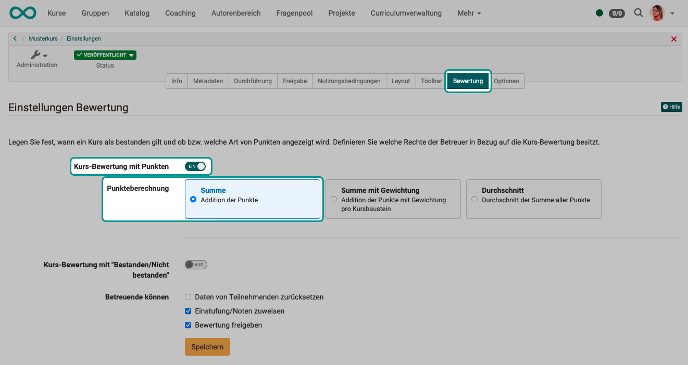
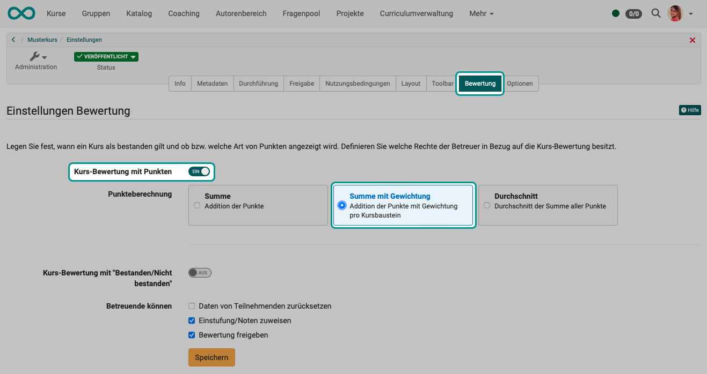
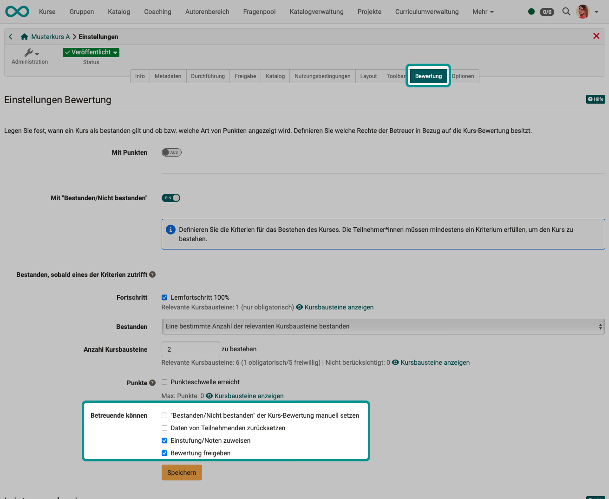
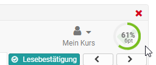
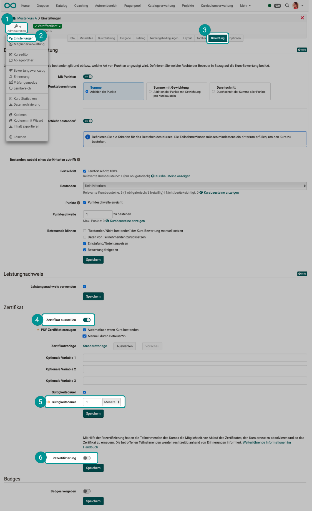

# Kurseinstellungen - Tab Bewertung {: }

In Lernpfad-Kursen werden in diesem Tab die Einstellungen für die **Bewertungsmethode** und das **Bestehen** des Kurses definiert. 
Ausserdem können Sie die Verwendung von **Leistungsnachweisen** und die Vergabe von **Zertifikaten** und **Badges** aktivieren. 

{ class="shadow lightbox" }

## Kursbewertung mit Punkten (nur bei Lernpfad-Kursen)

Für die Kursbewertung mit Punkten stehen 3 Möglichkeiten zur Auswahl:

* Summe
* Summe mit Gewichtung
* Durchschnitt

### Kursbewertung mit Punkten: Summe

Es wird aus allen im Kurs erzielten Punkten die Summe gebildet.

{ class="shadow lightbox" }

### Kursbewertung mit Punkten: Summe mit Gewichtung

Bei der Summenbildung fliesst die Gewichtung mit ein.

{ class="shadow lightbox" }

Sind in einem Kurs mehrere Leistungen zu erbringen, fliessen diese zum Teil mit unterschiedlicher Gewichtung in die Gesamtbewertung des Kurses ein. Die Option "Summe mit Gewichtung" für die Kurs-Bewertung ermöglicht es, **bei bewertbaren Bausteinen** einen **Skalierungsfaktor** für die Punkte zu hinterlegen. Voraussetzung ist, dass diese bewertbaren Bausteine bei der Kurs-Bewertung berücksichtigt werden.

In der **Kurs-Konfigurationsübersicht** kann die Skalierung für alle bewertbaren Bausteine geprüft und bei Bedarf direkt gesetzt bzw. editiert werden. Ein kompakte Ansicht über die bewertbaren Bausteine bietet der Vorfilter 'Bewertbar'.

{ class="shadow lightbox" title="Kurs-Konfiguration" }

Die gewichtete Punktzahl wird Betreuenden im Bewertungsformular angezeigt. Für Teilnehmende ist die gewichtete Punktzahl in der Leistungsübersicht des jeweiligen bewertbaren Bausteins sowie im Leistungsnachweis sichtbar.

### Kursbewertung mit Punkten: Durchschnitt

{ class="shadow lightbox" }

!!! hint "Highscore"

    Nur wenn unter "Kursbewertung mit Punkten" **Summe** oder **Durchschnitt** gewählt wurde, kann im Kurseditor auch der Reiter "Highscore" des obersten Kursbausteins konfiguriert werden.

[zum Seitenanfang ^](#assessment)

## Kursbewertung mit "Bestanden/Nicht bestanden"

Ein Lernpfad-Kurs kann als bestanden gelten, sobald eines der Kriterien zutrifft:

* **Lernfortschritt 100 %**:  Wenn alle obligatorischen Kursbausteine abgeschlossen wurden und 100 % angezeigt wird, gilt der Kurs automatisch als bestanden.
* **Alle Kursbausteine bestanden**:  Der Kurs gilt als bestanden, wenn alle bewertbaren Kursbausteine, die mit einem "bestanden/nicht bestanden" versehen sind, bestanden wurden, egal ob sich um obligatorische oder freiwillige Kursbausteine handelt. Um einzelne Kursbausteine auszunehmen, muss in der Konfiguration des Kursbausteins im Kurseditor "Bei Kurs-Bewertung ausschliessen" angehakt sein.
* **Anzahl Kursbausteine bestanden**:  Hier können Sie definieren, wie viele und welche Kursbausteine bestanden sein müssen, damit der gesamte Kurs als bestanden gilt. Ob ein Kursbaustein bei der Gesamtbewertung berücksichtigt wird, muss allerdings im Kurseditor direkt beim jeweiligen Kursbaustein angegeben werden (Tab Bewertung).  
* **Punktschwelle erreicht**:  Hier können Sie definieren, wie viele Punkte Lernende erreichen müssen, damit der gesamte Kurs als bestanden gilt. Ausserdem können Sie kontrollieren, von welchen Kursbausteinen die Punkte stammen müssen. Ob ein Kursbaustein bei der Gesamtbewertung berücksichtigt wird, muss im Kurseditor direkt beim jeweiligen Kursbaustein angegeben werden (Tab Bewertung).

{ class="shadow lightbox" }

!!! info "Bestanden-Kriterien"
      
    Die einzelnen Kriterien sind eine "Oder-Verknüpfung". Es genügt also, wenn eines der genannten Kriterien zutrifft.

!!! info "Welche Kursbausteine werden berücksichtigt?"
      
    Bei der Berechnung des **Lernfortschritts** zählen nur die **obligatorischen** Kursbausteine.
    
    Bei der Berechnung von "**Bestanden**" und **Punkten** zählen **obligatorische und freiwillige** Kursbausteine.

[zum Seitenanfang ^](#assessment)

## Bewertung durch Betreuende

Betreuenden kann gestattet werden ...

* "Bestanden/Nicht bestanden" manuell zu setzen, 
(Diese Option ist nur verfügbar, wenn das Feld "Bewertung freigeben" aktiviert ist. Nur in diesem Fall können Kursbetreuer:innen bzw. Besitzer:innen im Bewertungswerkzeug manuell einstellen, ob Kursteilnehmer:innen den Kurs bestanden haben oder nicht.)
* Daten von Teilnehmenden zurückzusetzen,
* eine Einstufung und Noten zuzuweisen,
* und die Bewertung für die Teilnehmer:innen freizugeben. 

{ class="shadow lightbox" }

!!! hint "Bewertung bei herkömmlichen Kursen"

    Bei herkömmlichen Kursen werden die Kriterien für das Bestehen eines Kurses im Kurseditor auf dem obersten Kursbaustein im Tab "Punkte" eingestellt und das Ergebnis wird auf der Kursstartseite angezeigt.

!!! hint "Punkteanzeige"

    Wird in [Lernpfad-Kursen](Learning_path_course.de.md) mit **Punkten** bewertet, .
    Hier kann definiert werden ob bzw. welche Art von Punkten noch ergänzend zu der Prozentanzeige im Kurs angezeigt wird. 
    { class="shadow lightbox" }
 
[zum Seitenanfang ^](#assessment)

## Leistungsnachweis 

Wenn Sie die Option "Leistungsnachweise verwenden" aktivieren, erscheint im Kurs im Toolbar Menü ["Mein Kurs"](../learningresources/Additional_Course_Features.de.md) die Option "Leistungsnachweis" und die Kursteilnehmenden sehen einen Überblick über die bewertbaren Kursbausteine mit ihrem jeweiligen aktuellen Bewertungsstatus.

Der Link zum Leistungsnachweis erscheint im Kurs erst dann, wenn im Kurs mindestens ein bewertbarer Kursbaustein existiert, und der Kursteilnehmer bereits mindestens eine Bewertung erhalten hat. Dies kann z.B. der Lösungsversuch eines Tests sein oder die Bewertung einer Aufgabe.

Wenn Sie die Funktion ausschalten, sehen Ihre Kursteilnehmenden keine Leistungsnachweise mehr. Die Leistungsnachweise gehen nicht verloren, sondern werden lediglich nicht mehr angezeigt. Wenn Sie den Leistungsnachweis wieder einschalten, stehen alle aktuellen Daten wieder zur Verfügung. Wenn Sie hingegen einen Kurs mit bestehenden Leistungsnachweisen löschen, können die Benutzer nach wie vor ihre Leistungsnachweise einsehen.

[zum Seitenanfang ^](#assessment)

## (Kurs-)Zertifikat

**Was ist ein Zertifikat?**

Als Bestätigung für den Besuch eines Kurses bzw. der Erreichung von bestimmten kursbezogenen Aktivitäten kann ein **PDF-Zertifikat** ausgestellt werden. Es ist auch möglich, ohne die Verwendung eines Leistungsnachweises ein Zertifikat auszustellen.

**Von wem wird ein Zertifikat ausgestellt?**

Als Autor:in wählen Sie aus, ob das Zertifikat **manuell** vom Betreuer ausgestellt wird, und/oder **automatisch** nach Bestehen des Kurses.

Die Auswahl "manuell" gestattet die Verwendung von Zertifikaten auch in Kursen ohne bewertbare Kurselemente. Wenn das Zertifikat manuell ausgestellt werden soll, kann der/die Betreuer:in dies **im Bewertungswerkzeug** in der Leistungsübersicht der einzelnen Benutzer:innen vornehmen.

**Wo sind die Zertifikate einsehbar?**

Sobald der/die Teilnehmende alle Bedingungen für einen bestandenen Kurs erfüllt hat, ist das Zertifikat in der **Toolbar des jeweiligen Kurses** unter "Mein Kurs" im Leistungsnachweis verfügbar. Die Benutzer:innen erhalten ausserdem automatisch eine **E-Mail-Benachrichtigung**, sobald ein Zertifikat ausgestellt worden ist.

**Wie wird die Gültigkeit überprüft?**

Für das Zertifikat kann eine **Gültigkeitsdauer** festgelegt werden. Sie legen dabei die Gültigkeitsdauer in Tagen, Wochen, Monaten oder Jahren fest. 

Um die Gültigkeit des Zertifikats zu überprüfen, muss der Vorlage das Attribut "certificateVerificationUrl" hinzugefügt werden. Dieses erlaubt es, **mittels QR-Code** das Zertifikat zu einem späteren Zeitpunkt nochmals zu generieren und mit der vorliegenden Version zu vergleichen. Sofern beide Versionen übereinstimmen, kann das Zertifikat als gültig erklärt werden. Der QR-Code zur Validierung ist allerdings nur bei Verwendung eines HTML-Formulars möglich.

**Was geschieht beim Ablauf eines Zertifikats?**

Anhand des Ausstellungsdatums sowie des Ablaufdatums des Zertifikats können [Erinnerungen](../learningresources/Course_Reminders.de.md) ausgelöst werden. Z.B. können Kursteilnehmer:innen eine Info erhalten, dass das Zertifikat abgelaufen ist oder in wenigen Tagen abläuft oder eine **Rezertifizierung** ab sofort möglich ist.

**Zertifikatsvorlage erstellen**

Als Vorlage für das Zertifikat dient in der Regel eine systemweite, vom Administrator festgelegte PDF-Vorlage. Wenn Sie eine eigene Vorlage verwenden möchten, können Sie diese unter  **Zertifikatvorlage**  hochladen.

Eine PDF-Vorlage ist keine gewöhnliche PDF-Datei, sondern muss mit HTML erzeugt werden, um Layout und Variablen zu gewährleisten.

Mit diesem [Zertifikatsbot](https://tools.vcrp.de/zertifikatsbot/){:target="_blank”} können einfach und schnell Zertifikatsvorlagen im HTML-Format erstellt werden. Wer den Bot an seine Bedürfnisse anpassen möchte, dem steht das [Repository](https://gitlab.vcrp.de/openolat/zertifikatsbot){:target="_blank”} mit dem öffentlich geschalteten Code (MIT Lizenz) zur Verfügung.

Die Formularfelder müssen bestimmte Variablen enthalten, die vom System später durch die spezifischen Daten ersetzt werden. Es können alle Attribute als Variablen verwendet werden. Bei PDF-Vorlagen werden die Variablennamen ohne $-Präfix, bei HTML-Formularen mit $-Präfix verwendet.

Zum Formatieren von Datumsformaten steht das "dateFormatter"-Objekt zur Verfügung. Damit lassen sich die "*Raw" formate mittels "formatDate()" formatieren oder mit formatDateRelative (Date baseLineDate, days, months, years) eine angegebene Periode addieren.

Unterschriften, Logos o.ä. können über die optionalen Variablen als statische Grafiken in das Zertifikat integriert werden. Die entsprechenden Dateien müssen dafür mit der Zertifikatsvorlage zur Verfügung stehen.

???+ note "Übersicht der wichtigsten Variablen:"

    _Benutzer:_

      * $fullName
      * $firstName
      * $lastName
      * $birthDay
      * $institutionalName
      * $orgUnit
      * $studySubject
      * ...

        Sämtliche Userattribute sind als Variable verfügbar.

    _Kurs:_

      * $title
      * $externalReference
      * $authors
      * $from (date)
      * $fromLong (date)
      * $location
      * $to (date)
      * $toLong (date)
      * $expenditureOfWork
      * $mainLanguage

    _Daten zur Leistung (alle Kurstypen):_

      * $score
      * $status
      * $grade
      * $gradeLabel
      * $gradeCutValue

    _Daten zur Leistung (nur Lernpfadkurs):_

      * $maxScore
      * $progress

    _Daten zum Zertifikat:_

      * $dateFirstCertification
      * $dateFirstCertificationLong
      * $dateFirstCertificationRaw
      * $dateCertification
      * $dateCertificationLong
      * $dateCertificationRaw
      * $dateNextRecertification
      * $dateNextRecertificationLong
      * $dateNextRecertificationRaw  

      * $certificateVerificationUrl

    _Relatives Datum:_

      Auf dem Zertifikat können Daten angegeben werden, die relativ zu einem Raw-Datum berechnet werden:

      Methode und Parameter | Beispiel: $dateNextRecertificationRaw = 15.11.2021 
      ---------|----------
      *Relatives Datum kurz* | *Output: 22.09.2031*
      $formatter.formatDateRelative(Originaldatum, "Sprachcode", +/- Tage, +/-  Monate, +/- Jahre) | $formatter.formatDateRelative($dateNextRecertificationRaw, "de", 7, -2, 10)
      *Relatives Datum lang* | *Output: 22. September 2031*
      $formatter.formatDateLongRelative(Originaldatum, "Sprachcode", +/- Tage, +/- Monate, +/- Jahre) | $formatter.formatDateRelative($dateNextRecertificationRaw, "de", 7, -2, 10)
     
    _Daten aus der Kursbeschreibung:_

      * $!description  
      * $!objectives  
      * $!requirements  
      * $!credits

    _Optionale Variablen:_

      * $custom1
      * $custom2
      * $custom3

Sollten Sie eine Zertifikatvorlage wünschen, kontaktieren Sie uns unter [support@frentix.com](mailto:support@frentix.com) für einen Kostenvoranschlag für eine Vorlage gemäss Ihren individuellen Wünschen.

[zum Seitenanfang ^](#assessment)

## Rezertifizierung

**Voraussetzungen**

Damit ein Prozess zur Rezertifizierung eingerichtet werden kann, muss vorher die Zertifikatserstellung aktiviert worden sein. Ist ein Zertifikat für einen Kurs abgelaufen, kann allen betroffenen Teilnehmer:innen die Rezertifizierung angeboten werden.

Die Option zur Rezertifizierung ist gekoppelt an

* eine bestehende frühere (Erst-)Zertifizierung
* eine definierte Angabe, ab wann frühestens eine Rezertifizierung möglich ist.

{ class="shadow lightbox" }

**Rezertifizierung aktivieren**

Wird die Rezertifizeriung aktiviert, muss eine Angabe gemacht werden, ab wann eine Rezertifizierung möglich sein soll: "frühestens ab ... Tage vor Ablauf Gültigkeit Zertifikat".

(Der Wert muss kleiner als die Gültigkeitsdauer sein.)

**Erinnerungen einrichten**

Bevor die Rezertifizierung endgültig aktiviert wird, werden Sie zur Einrichtung von Erinnerungen aufgefordert. Definieren Sie automatisch verschickte Meldungen an betroffene Teilnehmer:innen, z.B. sobald ihre Rezertifizierung möglich wird und/oder wenn die Gültigkeit des bisherigen Zertifikats abgelaufen ist.

Die Daten der teilnehmenden Personen werden bei der Rezertifizierung zurückgesetzt (Kurs-Reset).

Leistungsnachweise und Zertifikate früherer Durchgänge bleiben erhalten.

[zum Seitenanfang ^](#assessment)

## Badges

Um Badges in Kursen nutzen zu können, müssen sie hier im Tab "Bewertung" der Einstellungen aktiviert werden. Anschliessend gibt es einen neunen Menüpunkt in der Kurs Administration und bei Assessment Kursbausteinen erscheint zusätzlich der Tab "Badge".

Weitere Infos zu Badges finden Sie hier: 

* [Infos für Kursbesitzer:innen:](../learningresources/OpenBadges.de.md) Erstellen und Bearbeiten von Badges
* [Infos für Benutzer:innen:](../personal_menu/OpenBadges.de.md) Badges bei den "Persönlichen Werkzeugen: 
* [Infos für OpenOlat Administrator:innen](../../../manual_admin/docs/administration/e-Assessment_openBadges.de.md)

[zum Seitenanfang ^](#assessment)
