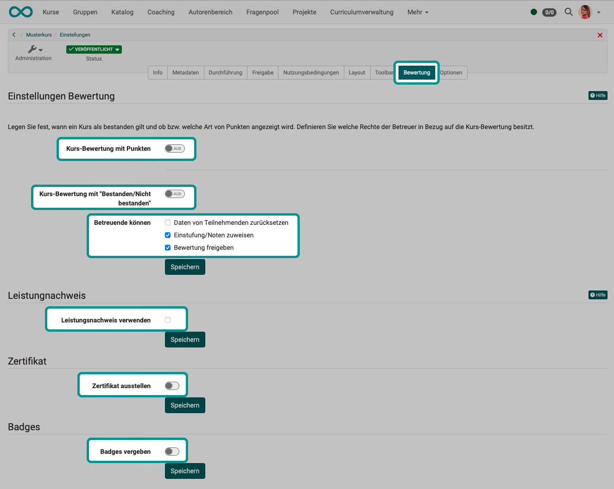
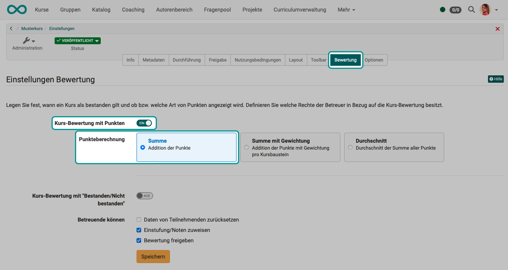
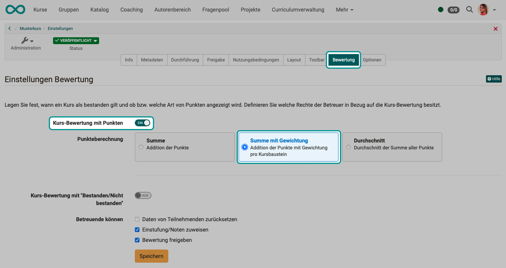
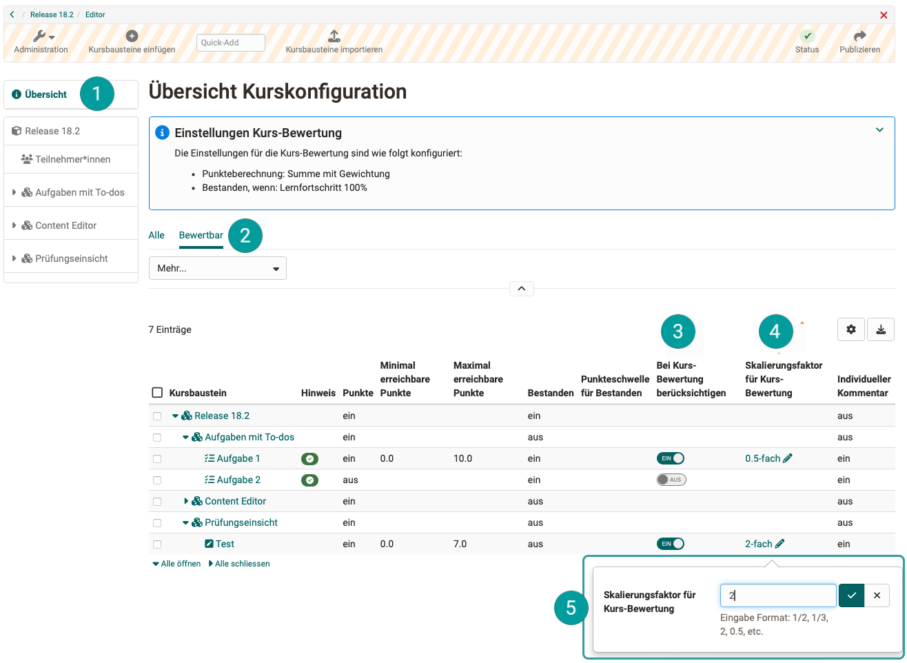
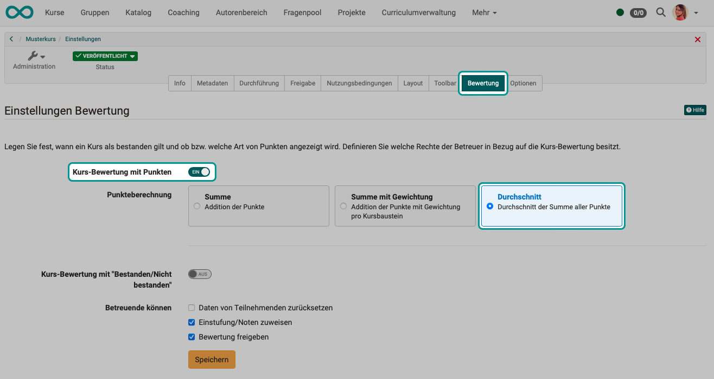
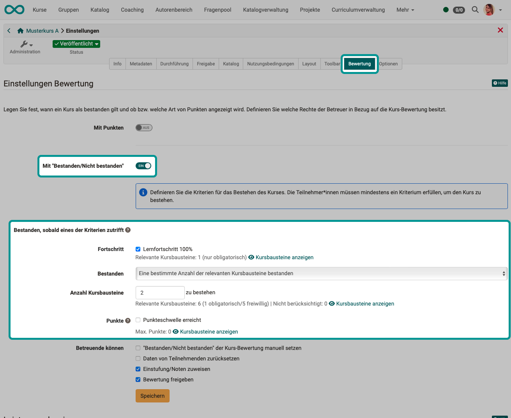
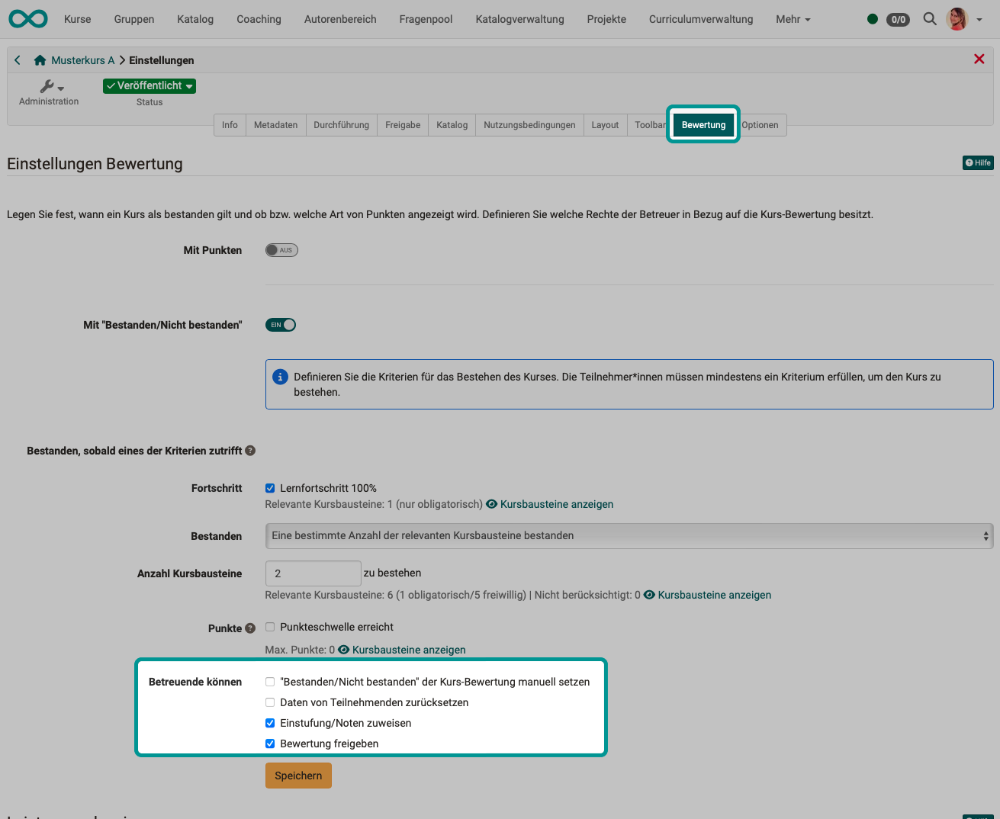
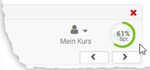
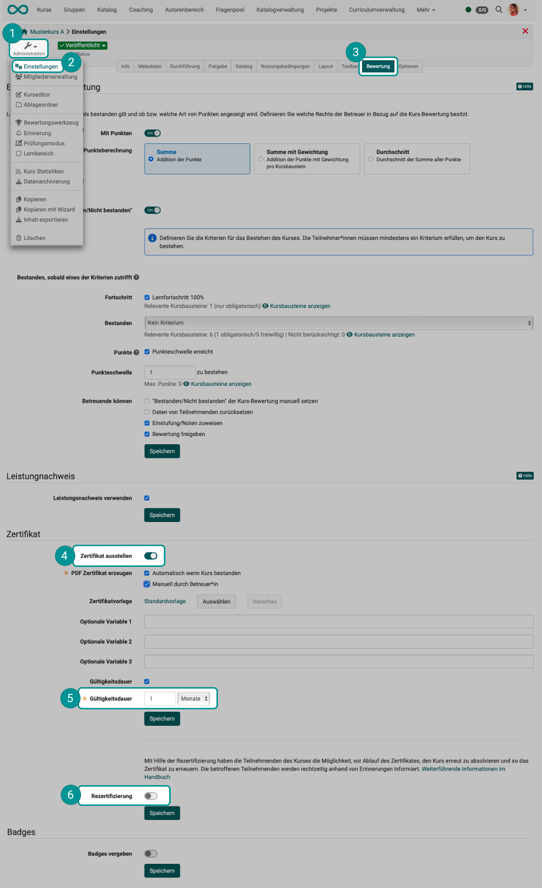

# Course Settings - Tab Assessment {: #tab_assessment}

In learning path courses, the settings for the **assessment method** and the **pass** of the course are defined in this tab. 
You can also activate the use of **credentials** and the awarding of **certificates** and **badges**. 

{ class="shadow lightbox" }

## Course assessment with points (only for learning path courses) {: #evaluation_with_points}

There are 3 options for the course assessment with points:

* Sum
* Sum with weighting
* Average

### Course assessment with points: Sum {: #evaluation_with_points_sum}

The sum of all points achieved in the course is calculated.

{ class="shadow lightbox" }

### Course evaluation with points: Sum with weighting {: #evaluation_with_points_weighting}

The weighting is taken into account when calculating the sum.

{ class="shadow lightbox" }

If there are several assessments to be completed in a course, these are sometimes included in the overall assessment of the course with different weightings. The "Sum with weighting" option for the course assessment allows you to enter a **scaling factor** for the points **for assessable modules**. The prerequisite is that these assessable modules are taken into account in the course assessment.

In the **Course configuration overview**, the scaling for all assessable modules can be checked and set or edited directly if required. The "Assessable" pre-filter provides a compact view of the rateable blocks.

{ class="shadow lightbox" title="Kurs-Konfiguration" }

The weighted score is displayed to coaches in the assessment form. For participants, the weighted score is visible in the performance overview of the respective assessable module and in the performance record.

### Course evaluation with points: Average {: #evaluation_with_points_average}

{ class="shadow lightbox" }

!!! hint "Highscore"

    The "Highscore" tab of the top course element can only be configured in the course editor if **Total** or **average** has been selected under "Course assessment with points".

[To the top of the page ^](#tab_assessment)

### Course assessment with "Passed/Failed" {: #evaluation_passed_failed}

A learning path course can be considered passed as soon as one of the criteria is met:

* **Learning progress 100%**:  If all mandatory course elements have been completed and 100% is displayed, the course is automatically deemed to have been passed.
* **All course components passed**:  The course is deemed to have been passed if all assessable course elements marked with a "pass/fail" have been passed, regardless of whether they are compulsory or optional course elements. To exclude individual course elements, "Exclude from course evaluation" must be ticked in the configuration of the course element in the course editor.
* **Number of course elements passed**:  Here you can define how many and which course elements must be passed for the entire course to be considered passed. However, whether a course element is included in the overall assessment must be specified directly in the course editor for the respective course element (Assessment tab).
* **Point threshold reached**:  Here you can define how many points learners must achieve for the entire course to be considered passed. You can also check which course elements the points must come from. Whether a course element is included in the overall assessment must be specified directly in the course editor for the respective course element (Assessment tab).

{ class="shadow lightbox" }

!!! info "Passed criteria"

    The individual criteria are an "or" link. It is therefore sufficient if one of the criteria applies.

!!! info "Which course elements are taken into account?"

    When calculating **learning progress**, only the **mandatory** course elements count.

    When calculating "**passed**" and **points**, **mandatory and voluntary**, course elements count.

[To the top of the page ^](#tab_assessment)

### Assessment by coaches {: #assessment_by_coach}

Coaches may be permitted ...

* Set "Passed/Failed" manually, 
(This option is only available if the "Share assessment" field is activated. Only in this case can course coaches or owners manually set in the assessment tool whether course participants have passed the course or not).
* Reset participant data,
* assign a classification and grades,
* and to release the assessment for the participants. 

{ class="shadow lightbox" }

!!! hint "Assessment for conventional courses"

    For conventional courses, the criteria for passing a course are set in the course editor on the top course element in the "Points" tab and the result is displayed on the course start page.

!!! hint "Points display"

    Is assessed with **points** in [Learning_path_courses](Learning_path_course.md).
    Here you can define whether or what type of points are displayed in addition to the percentage display in the course.
    { class="shadow lightbox" }

[To the top of the page ^](#tab_assessment)

## Evidences of achievement {: #evidence_of_achievements}

If you activate the option "Use evidences of achievement", the option "Evidence of achievement" appears in the course in the toolbar menu ["My course"](../learningresources/Additional_Course_Features.md) and the course participants see an overview of the assessable course elements with their current assessment status.

The link to the performance record only appears in the course if at least one assessable course element exists in the course and the course participant has already received at least one assessment. This can be, for example, the attempted solution to a test or the assessment of an assignment.

If you deactivate this function, your course participants will no longer see any evidences of achievement. The certificates are not lost, they are simply no longer displayed. If you reactivate the transcript of records, all current data will be available again. However, if you delete a course with existing evidences of achievements, users will still be able to view their evidences of achievement.

[To the top of the page ^](#tab_assessment)

## (Course) certificate {: #certificate}

**What is a certificate?**

A **PDF certificate** can be issued as confirmation that a course has been attended or that certain course-related activities have been achieved. It is also possible to issue a certificate without using a evidence of achievement.

**Who issues a certificate?**

As the author, you select whether the certificate is issued **manually** by the coach and/or **automatically** after passing the course.

The "manual" selection also allows certificates to be used in courses without assessable course elements. If the certificate is to be issued manually, the coach can do this **in the assessment tool** in the performance overview of the individual users.

**Where can the certificates be viewed?**

As soon as the participant has fulfilled all the conditions for a passed course, the certificate is available in the **toolbar of the respective course** under "My course" in the transcript of records. Users will also automatically receive an **e-mail notification** as soon as a certificate has been issued.

**How is the validity checked?**

A **validity period** can be set for the certificate. You specify the validity period in days, weeks, months or years.

To check the validity of the certificate, the "certificateVerificationUrl" attribute must be added to the template. This allows the certificate to be generated again at a later date using a QR code and compared with the current version. If both versions match, the certificate can be declared valid. However, the QR code for validation is only possible when using an HTML form.

**What happens when a certificate expires?**

[Reminders](../learningresources/Course_Reminders.md) can be triggered based on the date of issue and the expiration date of the certificate. For example, course participants can receive information that the certificate has expired or will expire in a few days or that **recertification** is now possible.

**Create certificate template**

A system-wide PDF template defined by the administrator is usually used as a template for the certificate. If you would like to use your own template, you can upload it under **Certificate template**.

A PDF template is not an ordinary PDF file, but must be created with HTML to ensure layout and variables.

This [certificate bot](https://tools.vcrp.de/zertifikatsbot/){:target="_blank"} can be used to quickly and easily create certificate templates in HTML format. If you want to customize the bot to your needs, you can use the [Repository](https://gitlab.vcrp.de/openolat/zertifikatsbot){:target="_blank"} with the public code (MIT license).

The form fields must contain certain variables that are later replaced by the system with the specific data. All attributes can be used as variables. For PDF templates, the variable names are used without a $ prefix, for HTML forms with a $ prefix.

The "dateFormatter" object is available for formatting date formats. This can be used to format the "*Raw" formats using "formatDate()" or to add a specified period using formatDateRelative (Date baseLineDate, days, months, years).

Signatures, logos, etc. can be integrated into the certificate as static graphics using the optional variables. The corresponding files must be available with the certificate template.

???+ note "Overview of the most important variables:"

    _User:_

      * $fullName
      * $firstName
      * $lastName
      * $birthDay
      * $institutionalName
      * $orgUnit
      * $studySubject
      * ...
  
         All user attributes are available as variables.

    _Course:_

      * $title
      * $externalReference
      * $authors
      * $from (date)
      * $fromLong (date)
      * $location
      * $to (date)
      * $toLong (date)
      * $expenditureOfWork
      * $mainLanguage

    _Data on the service (all course types):_

      * $score
      * $status
      * $grade
      * $gradeLabel
      * $gradeCutValue

    Performance data (learning path course only):_

      * $maxScore
      * $progress

    _Data on the certificate:_

      * $dateFirstCertification
      * $dateFirstCertificationLong
      * $dateFirstCertificationRaw
      * $dateCertification
      * $dateCertificationLong
      * $dateCertificationRaw
      * $dateNextRecertification
      * $dateNextRecertificationLong
      * $dateNextRecertificationRaw  

      * $certificateVerificationUrl
  
    _Relative Date:_

      Dates can be specified on the certificate that are calculated relative to a raw date:

      Method and parameters | Example: $dateNextRecertificationRaw = 15.11.2021
      ---------|----------
      *Relative date short* | *Output: 22.09.2031*
      $formatter.formatDateRelative(Original date, "Language code", +/- Days, +/-  Months, +/- Years) | $formatter.formatDateRelative
      ($dateNextRecertificationRaw, "en", 7, -2, 10)
      *Relative date long* | *Output: 22. September 2031*
      $formatter.formatDateLongRelative(Original date, "Language code", +/- Days, +/- Months, +/- Years) | $formatter.formatDateRelative($dateNextRecertificationRaw, "en", 7, -2, 10)

      _Data from the course description:_

      * $!description  
      * $!objectives  
      * $!requirements  
      * $!credits

  
    _Optionale Variablen:_

      * $custom1
      * $custom2
      * $custom3

If you would like a certificate template, please contact us at [support@frentix.com](mailto:support@frentix.com) for a cost estimate for a template according to your individual requirements.

[To the top of the page ^](#tab_assessment)

## Recertification {: #recertification}

**Requirements**

In order for a recertification process to be set up, certificate creation must first be activated. If a certificate for a course has expired, all affected participants can be offered recertification.

The option for recertification is linked to

* an existing previous (initial) certification
* a defined indication of the earliest date from which recertification is possible.

{ class="shadow lightbox" }

**Activate recertification**

If recertification is activated, a specification must be made as to when recertification should be possible: "at the earliest from ... days before the certificate expires".

(The value must be less than the validity period).

Please note that you can also display course elements only for the first certification or only for one of the recertifications. This can be determined in learning path courses via exceptions. [More >](../learningresources/Learning_path_course_Course_editor.md#exceptions)

**Set up reminders**

Before recertification is finally activated, you will be asked to set up reminders. Define automatically sent messages to affected participants, e.g. as soon as their recertification becomes possible and/or when the validity of the previous certificate has expired.

The data of the participants will be reset upon recertification (course reset).

Evidence of achievement and certificates from previous courses are retained.

[To the top of the page ^](#tab_assessment)

## Badges {: #badges}

To be able to use badges in courses, they must be activated here in the "Assessment" tab of the settings. There is then a new menu item in the course administration and the "Badge" tab also appears for assessment course elements.

Further information on badges can be found here: 

* [Info for course owners:](../learningresources/OpenBadges.md) Creating and editing badges
* [Info for users:](../personal_menu/OpenBadges.md) Badges in the "Personal tools: 
* [Info for OpenOlat administrators](../../manual_admin/administration/e-Assessment_openBadges.md)

[To the top of the page ^](#tab_assessment)