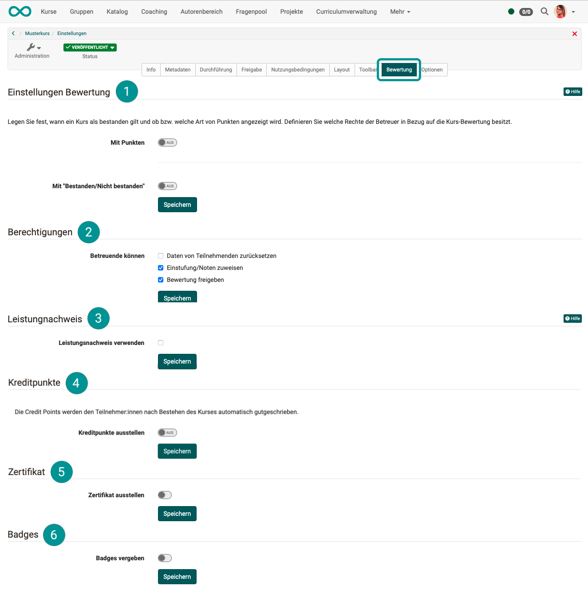
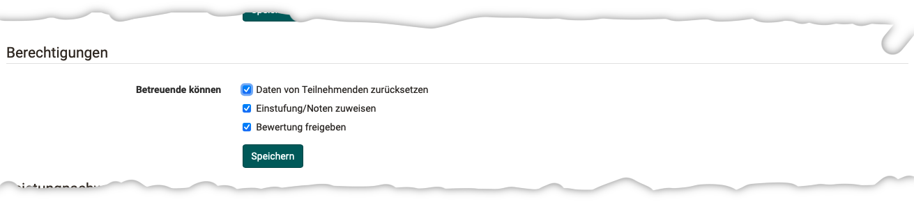
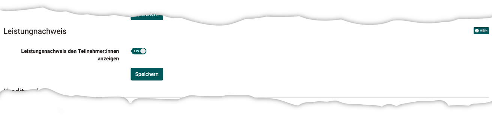
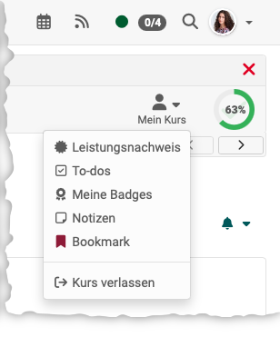
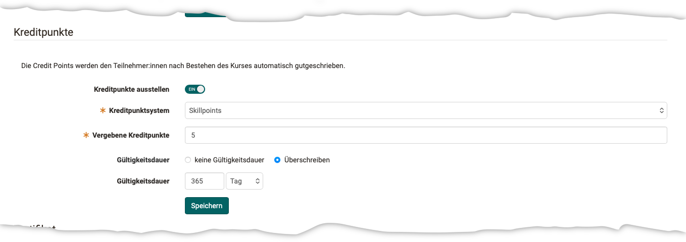
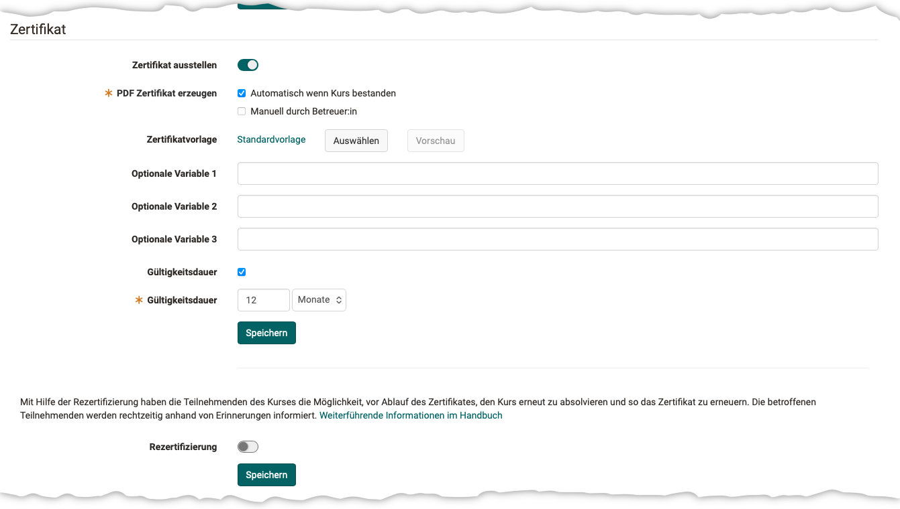
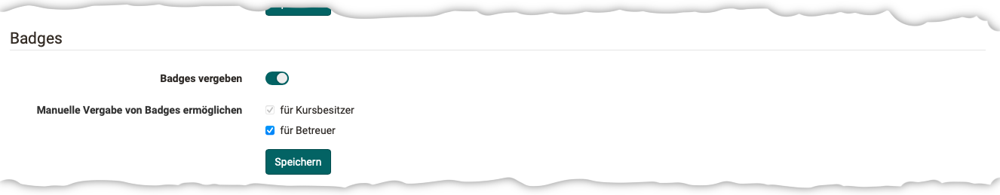

# Course Settings - Tab Assessment {: #tab_assessment}

In learning path courses, the settings for the **assessment method** and the **pass** of the course are defined in this tab. 
You can also enable the use of **performance records** and the awarding of **credit points**, **certificates**, and **badges**. 

You can find the options for this in the sections

 [Assessment settings](#section_assessment_settings) 
 [Assessment rights](#section_assessment_rights) 
 [Evidence of achievement](#section_evidence_of_achievements) 
 [Credit points](#section_credit_points) 
 [Certificate](#section_certificate) 
 [Badges](#section_badges) 

{ class="shadow lightbox" }

[To the top of the page ^](#tab_assessment)

---

##  Section Assessment Settings {: #section_assessment_settings}

!!! info "Assessment in traditional courses"

    The following information refers to learning path courses. For conventional courses, the criteria for passing a course are set in the course editor on the top course element in the “Points” tab, and the result is displayed on the course start page.

There are two settings for course assessments:

- **With points** (only with learning path courses) {: #evaluation_with_points} 
    Here you can set whether and what type of points are displayed.
    There are 3 options to choose from for course evaluation with points:

    * [Sum](#evaluation_with_points_sum)
    * [Sum with weighting](#evaluation_with_points_weighting) 
    * [Average](#evaluation_with_points_average)

    { class="aside-right lightbox" }
    If [learning path courses](Learning_path_course.md) are graded with **points**, this affects whether and what type of points are displayed in addition to the percentage display in the course. 

    It can be graded with points, even if they are not relevant for passing the course.

- **Mit "passed/didn't pass"** 
  Here you can set when a course is considered passed. In addition to a certain number of points achieved, other criteria can also lead to a "pass."  [Find out more >](#evaluation_passed_failed)

[To the top of the page ^](#tab_assessment)

---

### Course assessment with points: Sum {: #evaluation_with_points_sum}

The sum of all points achieved in the course is calculated.

{ class="shadow lightbox" }

[Find out more about Assessment Settings ^](#section_assessment_settings) 
[To the top of the page ^](#tab_assessment)

---

### Course evaluation with points: Sum with weighting {: #evaluation_with_points_weighting}

The weighting is taken into account when calculating the sum.

{ class="shadow lightbox" }

If there are several assessments to be completed in a course, these are sometimes included in the overall assessment of the course with different weightings. The "Sum with weighting" option for the course assessment allows you to enter a **scaling factor** for the points **for assessable modules**. The prerequisite is that these assessable modules are taken into account in the course assessment.

In the **Course configuration overview**, the scaling for all assessable modules can be checked and set or edited directly if required. The "Assessable" pre-filter provides a compact view of the rateable blocks.

{ class="shadow lightbox" title="Kurs-Konfiguration" }

The weighted score is displayed to coaches in the assessment form. For participants, the weighted score is visible in the performance overview of the respective assessable module and in the performance record.

[Find out more about Assessment Settings ^](#section_assessment_settings) 
[To the top of the page ^](#tab_assessment)

---

### Course evaluation with points: Average {: #evaluation_with_points_average}

{ class="shadow lightbox" }

!!! hint "Highscore"

    The "Highscore" tab of the top course element can only be configured in the course editor if **Total** or **average** has been selected under "Course assessment with points".

[Find out more about Assessment Settings ^](#section_assessment_settings) 
[To the top of the page ^](#tab_assessment)

---

### Course assessment with "Passed/Failed" {: #evaluation_passed_failed}

A learning path course can be considered passed as soon as one of the criteria is met:

* **Learning progress 100%**:  If all mandatory course elements have been completed and 100% is displayed, the course is automatically deemed to have been passed.
* **All course components passed**:  The course is deemed to have been passed if all assessable course elements marked with a "pass/fail" have been passed, regardless of whether they are compulsory or optional course elements. To exclude individual course elements, "Exclude from course evaluation" must be ticked in the configuration of the course element in the course editor.
* **Number of course elements passed**:  Here you can define how many and which course elements must be passed for the entire course to be considered passed. However, whether a course element is included in the overall assessment must be specified directly in the course editor for the respective course element (Assessment tab).
* **Point threshold reached**:  Here you can define how many points learners must achieve for the entire course to be considered passed. You can also check which course elements the points must come from. Whether a course element is included in the overall assessment must be specified directly in the course editor for the respective course element (Assessment tab).

{ class="shadow lightbox" }

!!! info "Passed criteria"

    The individual criteria are an "or" link. It is therefore sufficient if one of the criteria applies.

!!! info "Which course elements are taken into account?"

    When calculating **learning progress**, only the **mandatory** course elements count.

    When calculating "**passed**" and **points**, **mandatory and voluntary**, course elements count.

[Find out more about Assessment Settings ^](#section_assessment_settings) 
[To the top of the page ^](#tab_assessment)

---

##  Section rights {: #section_assessment_rights}

{ class="lightbox" }

Coaches may be permitted to...

* Reset participant data,
* Assign a grade and marks,
* And release the assessment to the participants. 

[To the top of the page ^](#tab_assessment)

---

##  Evidences of achievement {: #section_evidence_of_achievements}

{ class="lightbox" }

{ class="aside-right lightbox" }

If you activate the option "Use evidences of achievement", the option "Evidence of achievement" appears in the course in the toolbar menu ["My course"](../learningresources/Additional_Course_Features.md) and the course participants see an overview of the assessable course elements with their current assessment status.

The link to the performance record only appears in the course if at least one assessable course element exists in the course and the course participant has already received at least one assessment. This can be, for example, the attempted solution to a test or the assessment of an assignment.

If you deactivate this function, your course participants will no longer see any evidences of achievement. The certificates are not lost, they are simply no longer displayed. If you reactivate the transcript of records, all current data will be available again. However, if you delete a course with existing evidences of achievements, users will still be able to view their evidences of achievement.

[To the top of the page ^](#tab_assessment)

---

##  Section credit points {: #section_credit_points}

{ class="lightbox" }

When credit points are enabled, participants are automatically credited with credit points after passing the course. Various credit point systems (defined by administrators) can be selected for this purpose.

As the course owner, you determine how many credits are awarded when this course is passed. 
The validity period of credit points may also be limited. 

!!! hint "Note"

  The awarding of credit points is also important within a certificate program.

Further information: 
[Activate credit points system-wide >](../../manual_admin/administration/e-Assessment_Credit_Points.md) 

[To the top of the page ^](#tab_assessment)

---

##  Section (Course) certificate {: #section_certificate}

{ class="lightbox" }

A **PDF certificate** can be issued as confirmation of attendance at a course or completion of certain course-related activities.

[Details about certificates in a course >](../learningresources/Course_Settings_Assessment_Certificate.md) 

If a certificate with a limited period of validity has been issued, a **recertification process** can be activated. 
[Details on recertification >](../learningresources/Course_Settings_Assessment_Certificate.md#recertification)

[To the top of the page ^](#tab_assessment)

---

##  Section Badges {: #section_badges}

{ class="lightbox" }

To use badges in courses, they must be activated here in the "Assessment" tab of the settings. A new menu item will then appear in the course administration, and the "Badge" tab will also appear when editing course elements under "Assessment."

Course owners can always award badges manually, and supervisors can also be authorized to do so if desired.

Further information about badges can be found here:  
[Infos for course owners (Creation and editing of badges) >](../learningresources/OpenBadges.md) 
[Infos for owners (Badges in "Personal Tools") >](../personal_menu/OpenBadges.md)  
[Infos for OpenOlat administrators >](../../manual_admin/administration/e-Assessment_openBadges.md)

[To the top of the page ^](#tab_assessment)
