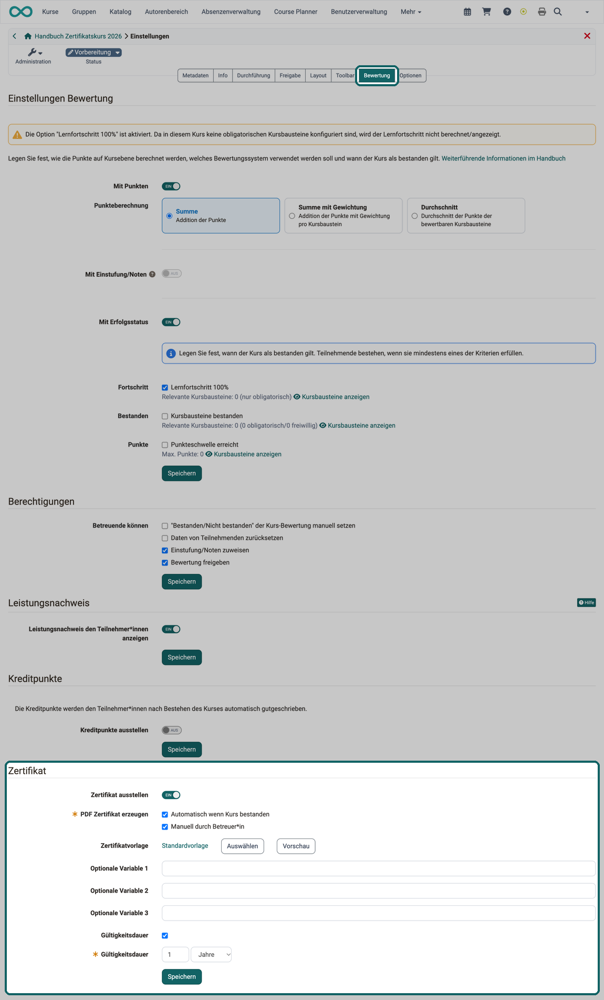
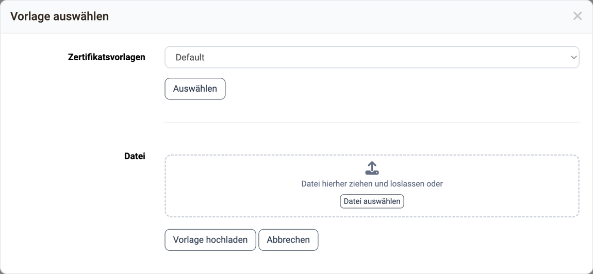
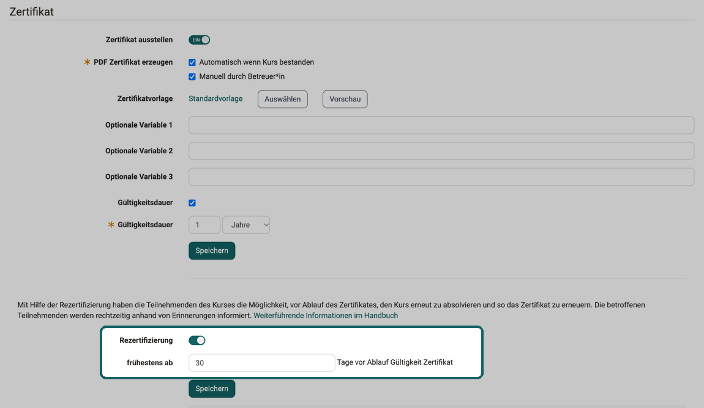

# Kurseinstellungen - Tab Bewertung: Zertifikate und Rezertifizierung {: #certificate_and_recertification}

Die Konfiguration eines Zertifikates für einen Kurs erfolgt unter: 
`Kurs > Administration > Einstellungen > Tab "Bewertung"`

{ class="shadow lightbox" title="Tab Bewertung in den Kurseinstellungen · 2026.10.07" }

## Zertifikate [:octicons-tag-16:{ title="ab Release 10.1 (OO-1254)" }](https://track.frentix.com/issue/OO-1254) {: #certificate}

### Was ist ein Zertifikat? {: #certificate_description}

Als Bestätigung für den Besuch eines Kurses bzw. der Erreichung von bestimmten kursbezogenen Aktivitäten kann ein **PDF-Zertifikat** ausgestellt werden. Es ist auch möglich, ohne die Verwendung eines Leistungsnachweises ein Zertifikat auszustellen.

Neben diesen Kurszertifikaten kann mit dem Zertifikatsprogramm auch ein Zertifikat für den Besuch mehrerer Kurse ausgestellt werden. Solche Zertifikate werden innerhalb des Course Planners (Durchführung) vergeben. 
[Mehr zu Zertifikatsprogrammen >](../area_modules/Course_Planner_Certification_Programs.de.md) 

Ist der Kurs Teil einer Durchführung, die mit einem Zertifikatsprogramm verknüpft ist, zeigt der Tab "Bewertung" anstelle des Abschnitts "Zertifikat" den Abschnitt "Zertifikatsprogramme" mit dem Hinweis "Teil eines Zertifikatsprogramms". Zertifikat und Rezertifizierung richten Sie dann im Zertifikatsprogramm ein, nicht im Kurs. [:octicons-tag-16:{ title="ab Release 20.2 (OO-8559)" }](https://track.frentix.com/issue/OO-8559)

**Die nachfolgenden Ausführungen beziehen sich auf das Zertifikat in einem einzelnen Kurs.**

### Von wem wird ein Zertifikat ausgestellt? {: #certificate_issuer}

Als Autor:in wählen Sie beim Feld "PDF Zertifikat erzeugen" aus, ob das Zertifikat **manuell** von Betreuer:innen ausgestellt wird, und/oder **automatisch** nach Bestehen des Kurses.

Die Auswahl "manuell" gestattet die Verwendung von Zertifikaten auch in Kursen ohne bewertbare Kurselemente. Wenn das Zertifikat manuell ausgestellt werden soll, kann der/die Betreuer:in dies im [Bewertungswerkzeug](Assessment_tool_overview.de.md) in der Leistungsübersicht der einzelnen Benutzer:innen vornehmen. Dort lassen sich ausgestellte Zertifikate auch später einsehen und verwalten. Nach dem Ausstellen meldet OpenOlat "Das Zertifikat wird in ein paar Sekunden erstellt." und erzeugt die PDF-Datei im Hintergrund.

### Wo sind die Zertifikate einsehbar? {: #certificate_view}

Sobald der/die Teilnehmende alle Bedingungen für einen bestandenen Kurs erfüllt hat, ist das Zertifikat in der **Toolbar des jeweiligen Kurses** unter "Mein Kurs" im Leistungsnachweis verfügbar. OpenOlat stellt das Zertifikat sofort aus und erzeugt die PDF-Datei danach im Hintergrund. Sie steht in der Regel nach kurzer Zeit bereit, und die Benutzer:innen erhalten dann automatisch eine **E-Mail-Benachrichtigung**. Bis dahin lässt sich das Zertifikat noch nicht herunterladen, im persönlichen Menü trägt es in der Detailansicht den Vermerk "Hängig". [:octicons-tag-16:{ title="ab Release 21.1 (OO-9128)" }](https://track.frentix.com/issue/OO-9128) 
[Mehr zu den Zertifikaten im persönlichen Menü >](../personal_menu/Certificates.de.md)

### Wie wird die Gültigkeit überprüft? [:octicons-tag-16:{ title="ab Release 11.0 (OO-2071)" }](https://track.frentix.com/issue/OO-2071) {: #certificate_validation}

Für das Zertifikat kann eine **Gültigkeitsdauer** festgelegt werden. Setzen Sie dazu das Häkchen "Gültigkeitsdauer". Im zweiten Feld mit derselben Beschriftung "Gültigkeitsdauer" tragen Sie die Dauer in Tagen, Wochen, Monaten oder Jahren ein.

Um die Gültigkeit des Zertifikats zu überprüfen, muss der Vorlage das Attribut "certificateVerificationUrl" hinzugefügt werden. Dieses erlaubt es, **mittels QR-Code** das Zertifikat zu einem späteren Zeitpunkt nochmals zu generieren und mit der vorliegenden Version zu vergleichen. Sofern beide Versionen übereinstimmen, kann das Zertifikat als gültig erklärt werden. Der QR-Code zur Validierung ist allerdings nur bei Verwendung eines HTML-Formulars möglich.

### Was geschieht beim Ablauf eines Zertifikats? [:octicons-tag-16:{ title="ab Release 17.2 (OO-6671)" }](https://track.frentix.com/issue/OO-6671) {: #certificate_expiry}

Anhand des Ausstellungsdatums sowie des Ablaufdatums des Zertifikats können [Erinnerungen](../learningresources/Course_Reminders.de.md) ausgelöst werden. Z.B. können Teilnehmende eine Info erhalten, dass das Zertifikat abgelaufen ist oder in wenigen Tagen abläuft oder eine **Rezertifizierung** ab sofort möglich ist.

### Zertifikatsvorlage erstellen {: #certificate_template}

Als Vorlage für das Zertifikat dient standardmässig die mitgelieferte Standardvorlage. Administrator:innen stellen darüber hinaus weitere systemweite Vorlagen zur Auswahl. Wenn Sie eine eigene Vorlage verwenden möchten, laden Sie diese hoch unter: 
`Kurs > Administration > Einstellungen > Bewertung > Abschnitt "Zertifikat" > Zertifikatvorlage`

!!! note "Hinweis"

    Wenn Sie den Button "**Vorschau**" verwenden, wird Ihnen immer nur ein Dummy angezeigt.
    In einer Vorschau werden grundsätzlich nur Dummy-Daten verwendet und keine echten Werte aus der Datenbank. Es steht z.B. überall das aktuelle Datum. Es soll gar nicht der Eindruck entstehen, dass das ein echtes Zertifikat sein könnte. Eine Vorschau muss absichtlich und offensichtlich falsch sein.

Eine Zertifikatsvorlage ist keine gewöhnliche PDF-Datei. Zwei Formate sind möglich: eine HTML-Vorlage, die Sie als ZIP-Datei mit der Datei "index.html" im Hauptverzeichnis hochladen, oder ein PDF-Formular mit Formularfeldern, das Sie als PDF-Datei hochladen.

Die mitgelieferte Standardvorlage ist HTML-basiert und schlicht gehalten. HTML-Vorlagen sind die empfohlene Variante; PDF-Formulare funktionieren weiterhin, sollten aber nur eingesetzt werden, wenn der Gotenberg-PDF-Dienst nicht installiert ist. [:octicons-tag-16:{ title="ab Release 21.0 (OO-9585)" }](https://track.frentix.com/issue/OO-9585)

Wie die Standardvorlage aussieht, prüfen Sie direkt in OpenOlat: Der Button "Vorschau" erzeugt aus der aktuell gewählten Vorlage die PDF-Datei "Certificate_preview.pdf". Öffnen Sie diese Datei, um Layout und Platzierung der Variablen zu beurteilen.

Der Button "Auswählen" beim Feld "Zertifikatvorlage" öffnet den Dialog "Vorlage auswählen". Dort stehen die systemweiten Vorlagen mit dem Eintrag "Default" für die Standardvorlage zur Wahl, darunter das Feld für eine eigene Datei.

{ class="shadow lightbox" title="Dialog Vorlage auswählen" }

Mit diesem [Zertifikatsbot](https://tools.vcrp.de/zertifikatsbot/){:target="_blank"} können einfach und schnell Zertifikatsvorlagen im HTML-Format erstellt werden. Wer den Bot an seine Bedürfnisse anpassen möchte, dem steht das [Repository](https://gitlab.vcrp.de/openolat/zertifikatsbot){:target="_blank"} mit dem öffentlich geschalteten Code (MIT Lizenz) zur Verfügung.

#### Variablen in der Zertifikatsvorlage {: #certificate_variables}

Die Formularfelder müssen bestimmte Variablen enthalten, auch Platzhalter genannt. Das System ersetzt sie beim Ausstellen des Zertifikats durch die Daten der Person und des Kurses. Es können alle Attribute als Variablen verwendet werden. Bei PDF-Vorlagen werden die Variablennamen ohne $-Präfix, bei HTML-Formularen mit $-Präfix verwendet.

Zum Formatieren von Datumsformaten steht das "dateFormatter"-Objekt zur Verfügung. Damit lassen sich die "*Raw" formate mittels "formatDate()" formatieren oder mit formatDateRelative (Date baseLineDate, days, months, years) eine angegebene Periode addieren.

Unterschriften, Logos o.ä. können über die optionalen Variablen als statische Grafiken in das Zertifikat integriert werden. Die entsprechenden Dateien müssen dafür mit der Zertifikatsvorlage zur Verfügung stehen.

!!! note "Übersicht der wichtigsten Variablen"

    _Benutzer:_

      * $fullName
      * $firstName
      * $lastName
      * $birthDay
      * $institutionalName
      * $orgUnit
      * $studySubject
      * ...

    Sämtliche Userattribute sind als Variable verfügbar.

    _Kurs:_

      * $title
      * $externalReference
      * $authors
      * $from (date)
      * $fromLong (date)
      * $location
      * $to (date)
      * $toLong (date)
      * $expenditureOfWork
      * $mainLanguage

    _Daten zur Leistung (alle Kurstypen):_

      * $score
      * $status
      * $grade
      * $gradeLabel
      * $gradeCutValue

    _Daten zur Leistung (nur Lernpfadkurs):_

      * $maxScore
      * $progress

    _Daten zum Zertifikat:_

      * $dateFirstCertification
      * $dateFirstCertificationLong
      * $dateFirstCertificationRaw
      * $dateCertification
      * $dateCertificationLong
      * $dateCertificationRaw
      * $dateCertificateValidUntil
      * $dateCertificateValidUntilLong
      * $dateCertificateValidUntilRaw  

      * $certificateVerificationUrl

    _Relatives Datum:_

      Auf dem Zertifikat können Daten angegeben werden, die relativ zu einem Raw-Datum berechnet werden:

      Methode und Parameter | Beispiel: $dateNextRecertificationRaw = 15.11.2021 
      ---------|----------
      *Relatives Datum kurz* | *Output: 22.09.2031*
      $formatter.formatDateRelative(Originaldatum, "Sprachcode", +/- Tage, +/-  Monate, +/- Jahre) | $formatter.formatDateRelative($dateNextRecertificationRaw, "de", 7, -2, 10)
      *Relatives Datum lang* | *Output: 22. September 2031*
      $formatter.formatDateLongRelative(Originaldatum, "Sprachcode", +/- Tage, +/- Monate, +/- Jahre) | $formatter.formatDateRelative($dateNextRecertificationRaw, "de", 7, -2, 10)

    _Daten aus der Kursbeschreibung:_

      * $!description
      * $!objectives
      * $!requirements
      * $!credits

    _Optionale Variablen:_

      * $custom1
      * $custom2
      * $custom3

Sollten Sie eine Zertifikatsvorlage wünschen, kontaktieren Sie uns unter [contact@frentix.com](mailto:contact@frentix.com) für einen Kostenvoranschlag für eine Vorlage gemäss Ihren individuellen Wünschen.

[Zum Seitenanfang ^](#certificate_and_recertification)

---

### Druckversion für vorgedrucktes Papier [:octicons-tag-16:{ title="ab Release 21.0 (OO-9568)" }](https://track.frentix.com/issue/OO-9568) {: #print_template}

Manche Organisationen drucken Zertifikate auf hochwertiges, vorgedrucktes Papier, das Hintergrund, Grafiken oder Prägungen bereits enthält. Für diesen Fall gibt es eine zusätzliche **Druckvorlage**, die nur die variablen Inhalte ohne die vorgedruckten Elemente enthält.

Die Druckversion konfigurieren Sie nicht in den Kurseinstellungen, sondern im Zertifikatsprogramm. 
[Mehr zur Druckversion im Zertifikatsprogramm >](../area_modules/Course_Planner_Certification_Programs.de.md#config_tab_settings)

[Zum Seitenanfang ^](#certificate_and_recertification)

---

## Rezertifizierung [:octicons-tag-16:{ title="ab Release 18.0 (OO-6808)" }](https://track.frentix.com/issue/OO-6808) {: #recertification}

### Voraussetzungen {: #recertification_conditions}

Damit ein Prozess zur Rezertifizierung eingerichtet werden kann, muss vorher die Zertifikatserstellung aktiviert und eine Gültigkeitsdauer gesetzt sein. Ohne Gültigkeitsdauer erscheint der Schalter "Rezertifizierung" nicht. Läuft ein Zertifikat für einen Kurs ab, kann allen betroffenen Teilnehmer:innen die Rezertifizierung schon vor dem Ablauf angeboten werden.

Die Option zur Rezertifizierung ist gekoppelt an

* eine bestehende frühere (Erst-)Zertifizierung
* eine definierte Angabe, ab wann frühestens eine Rezertifizierung möglich ist.

{ class="shadow lightbox" title="Abschnitt Zertifikat im Tab Bewertung · 2026.10.07" }

### Rezertifizierung aktivieren  {: #recertification_activation}

Schalten Sie "Rezertifizierung" ein, öffnet sich der Dialog "Rezertifizierung aktivieren". Dort legen Sie fest, ab wann eine Rezertifizierung möglich ist: "frühestens ab ... Tage vor Ablauf Gültigkeit Zertifikat". Der Wert muss kleiner als die Gültigkeitsdauer sein. Der Button "Aktivieren und Erinnerungen erstellen" schaltet die Rezertifizierung ein.

Beachten Sie, dass Sie Kursbausteine auch nur bei der ersten Zertifizierung oder nur bei einer der Rezertifizierungen anzeigen können. Dies kann in Lernpfadkursen über Ausnahmen bestimmt werden. [Mehr dazu >](../learningresources/Learning_path_course_Course_editor.de.md#exceptions)

### Erinnerungen zur Rezertifizierung  {: #recertification_reminders}

Damit betroffene Teilnehmer:innen ihre Rezertifizierung nicht verpassen, legt OpenOlat beim Aktivieren die Erinnerungen selbst an:

* "Rezertifizierung möglich - ... Tage" zu Beginn des Zeitraums, ab dem eine Rezertifizierung möglich ist
* "Zertifikat noch 10 Tage gültig" zehn Tage vor Ablauf, sofern der Zeitraum länger als 10 Tage ist
* "Gültigkeit Zertifikat abgelaufen" am Tag, an dem das Zertifikat abläuft

Besteht eine Erinnerung mit derselben Regel schon, legt OpenOlat sie nicht ein zweites Mal an. Die Erinnerungen sehen und bearbeiten Sie im Abschnitt "Erinnerungen Rezertifizierung" unter dem Abschnitt "Zertifikat".

Schalten Sie die Rezertifizierung später aus, öffnet sich der Dialog "Rezertifizierung deaktivieren". Das Häkchen "Alle Erinnerungen mit Prüfung auf Ablaufdatum Zertifikat löschen" ist gesetzt, OpenOlat löscht die Erinnerungen damit gleich mit. So erhalten Teilnehmer:innen keine Erinnerung zu einer Rezertifizierung, die es nicht mehr gibt. [:octicons-tag-16:{ title="ab Release 19.1.11 (OO-8620)" }](https://track.frentix.com/issue/OO-8620)

Die Daten der teilnehmenden Personen werden bei der Rezertifizierung zurückgesetzt (Kurs-Reset).

Leistungsnachweise und Zertifikate früherer Durchgänge bleiben erhalten.

[Zum Seitenanfang ^](#certificate_and_recertification)

---

## Weiterführende Informationen {: #further_information}

**Auf dieser Seite erwähnt** 
[Course Planner: Zertifikatsprogramme >](../area_modules/Course_Planner_Certification_Programs.de.md) 
[Bewertungswerkzeug - Übersicht >](Assessment_tool_overview.de.md) 
[Persönliche Erfolge/Leistungen: Zertifikate >](../personal_menu/Certificates.de.md) 
[Erinnerungen >](Course_Reminders.de.md) 
[Zertifikatsbot >](https://tools.vcrp.de/zertifikatsbot/) 
[Zertifikatsbot: Repository >](https://gitlab.vcrp.de/openolat/zertifikatsbot) 
[Lernpfadkurs - Kurseditor >](Learning_path_course_Course_editor.de.md)

**Weiterführend** 
[Kurseinstellungen - Tab Bewertung >](Course_Settings_Assessment.de.md) 
[Bewertungswerkzeug - Daten zurücksetzen >](Assessment_tool_reset_data.de.md)

[Zum Seitenanfang ^](#certificate_and_recertification)