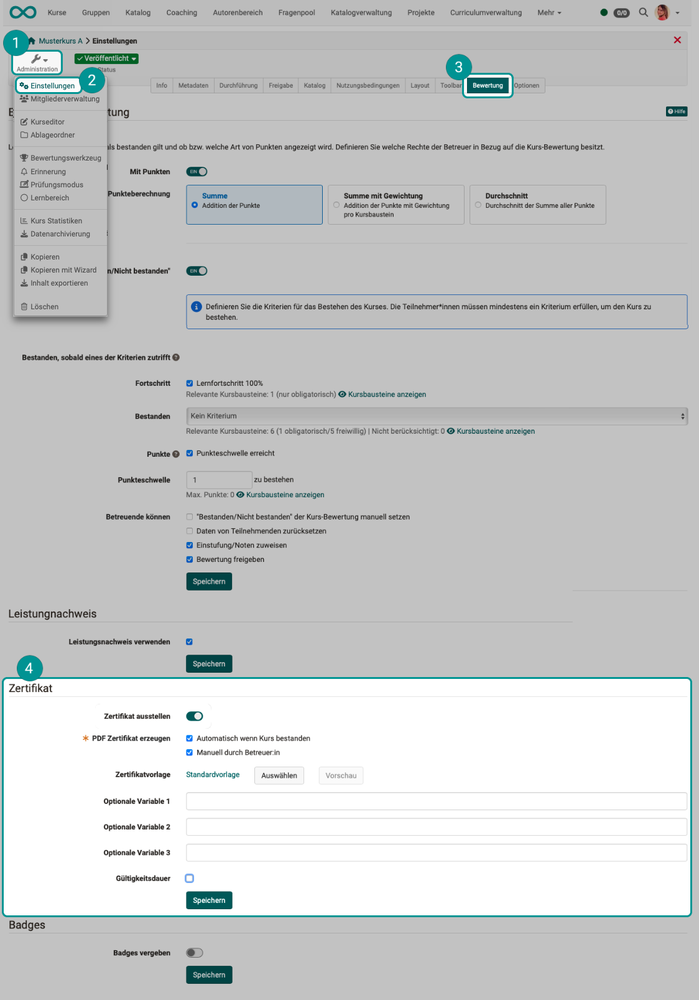

# Course Settings - Tab Assessment: Certifikates and recertification {: #tab_assessment_certificate}

The configuration of a certificate for a course is done in the course settings in the "Assessment" tab.

{ class="lightbox" }

## Certificates {: #certificate}

### What is a certificate? {: #certificate_description}

A **PDF certificate** can be issued as confirmation of attendance at a course or completion of certain course-related activities. It is also possible to issue a certificate without using a transcript of records.

In addition to these course certificates, the certificate program can also issue a certificate for attending multiple courses. Such certificates are awarded within the Course Planner (Implementation).

[More about the certificate program >](../../manual_user/area_modules/Course_Planner_Certification_Programs.md) 

**The following information refers to the certificate for a single course.**

### Who issues a certificate? {: #certificate_issuer}

As the author, you can choose whether the certificate is issued **manually** by coaches and/or **automatically** after passing the course.

The "manual" option allows certificates to be used even in courses without assessable course elements. If the certificate is to be issued manually, the coach can do so in the assessment tool in the performance overview for each individual user.

### Where can the certificates be viewed? {: #certificate_view}

Once the participant has fulfilled all the requirements for passing a course, the certificate is available in the **toolbar of the respective course** under "My Course" in the transcript of records. Users also automatically receive an **email notification** as soon as a certificate has been issued.

### How is validity verified? {: #certificate_validation}

A **validity period** can be specified for the certificate. You can specify the validity period in days, weeks, months, or years. 

To verify the validity of the certificate, the attribute "certificateVerificationUrl" must be added to the template. This allows the certificate to be regenerated at a later date **using a QR code** and compared with the current version. If both versions match, the certificate can be declared valid. However, the QR code for validation is only possible when using an HTML form.

### What happens when a certificate expires? {: #certificate_expiry}

Reminders can be triggered based on the certificate's issue date and expiration date. For example, course participants can receive a notification that the certificate has expired or will expire in a few days, or that **recertification** is now possible.

### Create certificate template {: #certificate_template}

A system-wide PDF template specified by the administrator is usually used as the template for the certificate. If you want to use your own template, you can upload it in the course under **Administration > Settings > Grading > "Certificate" section > Certificate template**.

!!! hint "Note"

    When you use the "**Preview**" button, only a dummy will be displayed.
    Only dummy data is used in a preview, not real values from the database. For example, the current date is displayed everywhere. It should not give the impression that this could be a real certificate. A preview must be deliberately and obviously incorrect.

A PDF template is not a normal PDF file, but must be created using HTML to ensure layout and variables.

This [certificate bot](https://tools.vcrp.de/zertifikatsbot/) allows you to quickly and easily create certificate templates in HTML format. If you want to customize the bot to suit your needs, the [repository](https://gitlab.vcrp.de/openolat/zertifikatsbot) with the publicly available code (MIT license) is available.

The form fields must contain certain variables that will later be replaced by the system with specific data. All attributes can be used as variables. For PDF templates, the variable names are used without the $ prefix, while for HTML forms, they are used with the $ prefix.

The "dateFormatter" object is available for formatting date formats. This allows the "*Raw" formats to be formatted using "formatDate()" or a specified period to be added using formatDateRelative (Date baseLineDate, days, months, years).

Signatures, logos, etc. can be integrated into the certificate as static graphics using the optional variables. The corresponding files must be available with the certificate template for this purpose.

???+ note "Overview of the most important variables:"

    _User:_

      * $fullName
      * $firstName
      * $lastName
      * $birthDay
      * $institutionalName
      * $orgUnit
      * $studySubject
      * ...

        All user attributes are available as variables.

    _Course:_

      * $title
      * $externalReference
      * $authors
      * $from (date)
      * $fromLong (date)
      * $location
      * $to (date)
      * $toLong (date)
      * $expenditureOfWork
      * $mainLanguage

    _Performance data (all course types):_

      * $score
      * $status
      * $grade
      * $gradeLabel
      * $gradeCutValue

    _Performance data (only learning path course):_

      * $maxScore
      * $progress

    _Certificate data:_

      * $dateFirstCertification
      * $dateFirstCertificationLong
      * $dateFirstCertificationRaw
      * $dateCertification
      * $dateCertificationLong
      * $dateCertificationRaw
      * $dateNextRecertification
      * $dateNextRecertificationLong
      * $dateNextRecertificationRaw  

      * $certificateVerificationUrl

    _Relative date:_

      Data calculated relative to a raw date can be specified on the certificate.:

      Method and parameter | Example: $dateNextRecertificationRaw = 15.11.2021 
      ---------|----------
      *Relative date short* | *Output: 22.09.2031*
      $formatter.formatDateRelative(original date, "Voice code", +/- Days, +/-  Months, +/- Years) | $formatter.formatDateRelative($dateNextRecertificationRaw, "en", 7, -2, 10)
      *Relative date long* | *Output: 22. September 2031*
      $formatter.formatDateLongRelative(original date, "Voice code", +/- Days, +/- Months, +/- Years) | $formatter.formatDateRelative($dateNextRecertificationRaw, "en", 7, -2, 10)
     
    _Date from the course description:_

      * $!description  
      * $!objectives  
      * $!requirements  
      * $!credits

    _Optional variables:_

      * $custom1
      * $custom2
      * $custom3

If you would like a certificate template, please contact us at [support@frentix.com](mailto:support@frentix.com) for a quote for a template tailored to your individual requirements.

[To the top of the page ^](#certificate_and_recertification})

---

## Recertification {: #recertification}

### Conditions {: #recertification_conditions}

In order for a recertification process to be set up, certificate creation must first be activated. If a certificate for a course has expired, recertification can be offered to all affected participants.

The recertification option is linked to

* an existing previous (initial) certification
* A defined indication of the earliest date on which recertification is possible.

{ class="shadow lightbox" }

### Activate recertification  {: #recertification_activation}

If recertification is activated, you must specify when recertification should be possible: "at the earliest ... days before the certificate expires."

(The value must be less than the validity period.)

Please note that you can also choose to display course elements only during the initial certification or only during one of the recertifications. This can be determined in learning path courses via exceptions. [More on this >](../learningresources/Learning_path_course_Course_editor.md#exceptions)

### Set up reminders  {: #recertification_reminders}

Before recertification is finally activated, you will be prompted to set up reminders. Define automatically sent messages to affected participants, e.g., as soon as their recertification becomes possible and/or when the validity of the previous certificate has expired.

The data of participating individuals will be reset during recertification (course reset).

Performance records and certificates from previous rounds will be retained.

[To the top of the page ^](#certificate_and_recertification})

---

## Further information {: #further_information}

[Certificates program (Certificates for multiple courses) >](../../manual_user/area_modules/Course_Planner_Certification_Programs.md)

[To the top of the page ^](#certificate_and_recertification})

