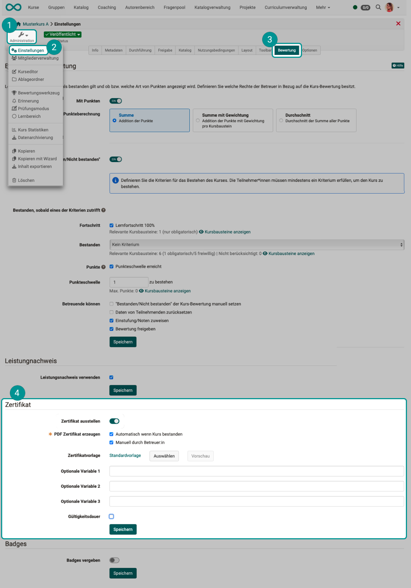
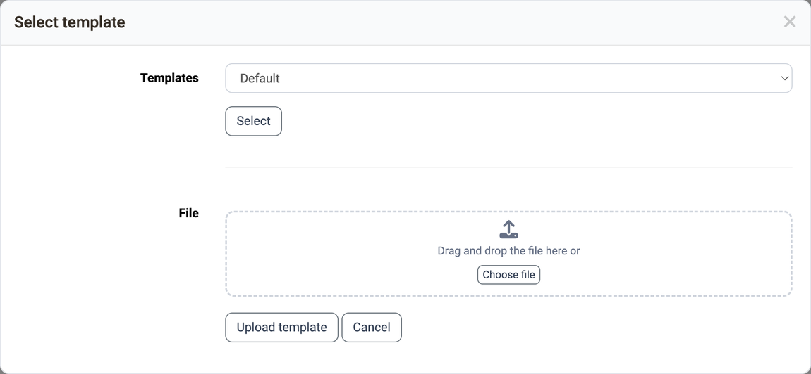
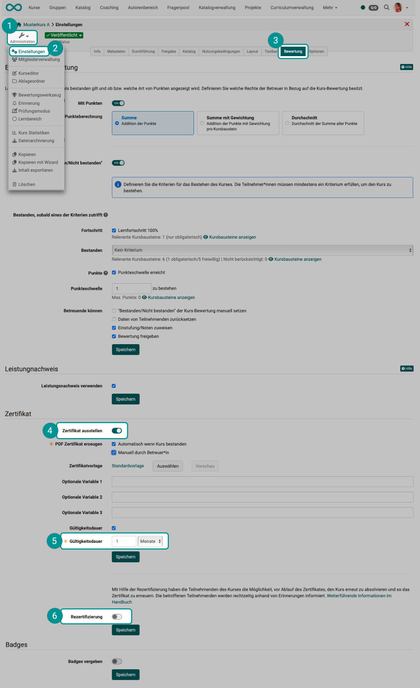

# Course Settings - Tab Assessment: Certificates and recertification {: #certificate_and_recertification}

The configuration of a certificate for a course is done in the course settings in the "Assessment" tab.

{ class="lightbox" }

## Certificates [:octicons-tag-16:{ title="from Release 10.1 (OO-1254)" }](https://track.frentix.com/issue/OO-1254) {: #certificate}

### What is a certificate? {: #certificate_description}

A **PDF certificate** can be issued as confirmation of attendance at a course or completion of certain course-related activities. It is also possible to issue a certificate without using an evidence of achievement.

In addition to these course certificates, the certificate program can also issue a certificate for attending multiple courses. Such certificates are awarded within the Course Planner (Implementation).

[More about the certificate program >](../area_modules/Course_Planner_Certification_Programs.md) 

**The following information refers to the certificate for a single course.**

### Who issues a certificate? {: #certificate_issuer}

As the author, you can choose whether the certificate is issued **manually** by coaches and/or **automatically** after passing the course.

The "manual" option allows certificates to be used even in courses without assessable course elements. If the certificate is to be issued manually, the coach can do so in the [assessment tool](Assessment_tool_overview.md) in the performance overview for each individual user. There, issued certificates can also be viewed and managed later.

### Where can the certificates be viewed? {: #certificate_view}

Once the participant has fulfilled all the requirements for passing a course, the certificate is available in the **toolbar of the respective course** under "My Course" in the evidence of achievement. Users also automatically receive an **email notification** as soon as a certificate has been issued.

### How is validity verified? [:octicons-tag-16:{ title="from Release 11.0 (OO-2071)" }](https://track.frentix.com/issue/OO-2071) {: #certificate_validation}

A **validity period** can be specified for the certificate. You can specify the validity period in days, weeks, months, or years. 

To verify the validity of the certificate, the attribute "certificateVerificationUrl" must be added to the template. This allows the certificate to be regenerated at a later date **using a QR code** and compared with the current version. If both versions match, the certificate can be declared valid. However, the QR code for validation is only possible when using an HTML form.

### What happens when a certificate expires? {: #certificate_expiry}

Reminders can be triggered based on the certificate's issue date and expiration date. For example, course participants can receive a notification that the certificate has expired or will expire in a few days, or that **recertification** is now possible.

### Create certificate template {: #certificate_template}

By default, the supplied default template is used as the template for the certificate. Administrators also provide further system-wide templates for selection. If you want to use your own template, you can upload it in the course under `Administration > Settings > Assessment > "Certificate" section > Certificate template`.

!!! note "Note"

    When you use the "**Preview**" button, only a dummy will be displayed.
    Only dummy data is used in a preview, not real values from the database. For example, the current date is displayed everywhere. It should not give the impression that this could be a real certificate. A preview must be deliberately and obviously incorrect.

A certificate template is not a normal PDF file. Two formats are possible: an HTML template that you upload as a ZIP file with the file "index.html" in the main directory, or a PDF form with form fields that you upload as a PDF file.

The default template supplied is HTML-based and kept simple. HTML templates are the recommended option; PDF forms still work but should only be used if the Gotenberg PDF service is not installed. [:octicons-tag-16:{ title="from Release 21.0 (OO-9585)" }](https://track.frentix.com/issue/OO-9585)

You can check the appearance of the default template directly in OpenOlat: the "Preview" button generates the PDF file "Certificate_preview.pdf" from the currently selected template. Open this file to judge the layout and the placement of the variables.

The "Select" button next to the "Certificate template" field opens the "Select template" dialog. It offers the system-wide templates with the entry "Default" for the default template, and below that the field for your own file.

{ class="shadow lightbox" }

This [certificate bot](https://tools.vcrp.de/zertifikatsbot/){:target="_blank"} allows you to quickly and easily create certificate templates in HTML format. If you want to customize the bot to suit your needs, the [repository](https://gitlab.vcrp.de/openolat/zertifikatsbot){:target="_blank"} with the publicly available code (MIT license) is available.

#### Variables in the certificate template {: #certificate_variables}

The form fields must contain certain variables, also called placeholders. When the certificate is issued, the system replaces them with the data of the person and the course. All attributes can be used as variables. For PDF templates, the variable names are used without the $ prefix, while for HTML forms, they are used with the $ prefix.

The "dateFormatter" object is available for formatting date formats. This allows the "*Raw" formats to be formatted using "formatDate()" or a specified period to be added using formatDateRelative (Date baseLineDate, days, months, years).

Signatures, logos, etc. can be integrated into the certificate as static graphics using the optional variables. The corresponding files must be available with the certificate template for this purpose.

???+ note "Overview of the most important variables:"

    _User:_

      * $fullName
      * $firstName
      * $lastName
      * $birthDay
      * $institutionalName
      * $orgUnit
      * $studySubject
      * ...

        All user attributes are available as variables.

    _Course:_

      * $title
      * $externalReference
      * $authors
      * $from (date)
      * $fromLong (date)
      * $location
      * $to (date)
      * $toLong (date)
      * $expenditureOfWork
      * $mainLanguage

    _Performance data (all course types):_

      * $score
      * $status
      * $grade
      * $gradeLabel
      * $gradeCutValue

    _Performance data (only learning path course):_

      * $maxScore
      * $progress

    _Certificate data:_

      * $dateFirstCertification
      * $dateFirstCertificationLong
      * $dateFirstCertificationRaw
      * $dateCertification
      * $dateCertificationLong
      * $dateCertificationRaw
      * $dateCertificateValidUntil
      * $dateCertificateValidUntilLong
      * $dateCertificateValidUntilRaw

      * $certificateVerificationUrl

    _Relative date:_

      Data calculated relative to a raw date can be specified on the certificate:

      Method and parameter | Example: $dateNextRecertificationRaw = 15.11.2021 
      ---------|----------
      *Relative date short* | *Output: 22.09.2031*
      $formatter.formatDateRelative(original date, "Voice code", +/- Days, +/-  Months, +/- Years) | $formatter.formatDateRelative($dateNextRecertificationRaw, "en", 7, -2, 10)
      *Relative date long* | *Output: 22. September 2031*
      $formatter.formatDateLongRelative(original date, "Voice code", +/- Days, +/- Months, +/- Years) | $formatter.formatDateRelative($dateNextRecertificationRaw, "en", 7, -2, 10)

    _Date from the course description:_

      * $!description
      * $!objectives
      * $!requirements
      * $!credits

    _Optional variables:_

      * $custom1
      * $custom2
      * $custom3

If you would like a certificate template, please contact us at [contact@frentix.com](mailto:contact@frentix.com) for a quote for a template tailored to your individual requirements.

[To the top of the page ^](#certificate_and_recertification)

---

### Print version for pre-printed paper [:octicons-tag-16:{ title="from Release 21.0 (OO-9568)" }](https://track.frentix.com/issue/OO-9568) {: #print_template}

Some organisations print certificates on high-value, pre-printed paper that already carries background colours, graphics, or embossed elements. For this case, an additional **print template** is available that contains only the variable content without the pre-printed elements.

You do not configure the print version in the course settings, but in the certification program. 
[More about the print version in the certification program >](../area_modules/Course_Planner_Certification_Programs.md#config_tab_settings)

[To the top of the page ^](#certificate_and_recertification)

---

## Recertification [:octicons-tag-16:{ title="from Release 18.0 (OO-6808)" }](https://track.frentix.com/issue/OO-6808) {: #recertification}

### Conditions {: #recertification_conditions}

In order for a recertification process to be set up, certificate creation must first be activated. If a certificate for a course has expired, recertification can be offered to all affected participants.

The recertification option is linked to

* an existing previous (initial) certification
* A defined indication of the earliest date on which recertification is possible.

{ class="shadow lightbox" }

### Activate recertification  {: #recertification_activation}

If recertification is activated, you must specify when recertification should be possible: "at the earliest ... days before the certificate expires."

(The value must be less than the validity period.)

Please note that you can also choose to display course elements only during the initial certification or only during one of the recertifications. This can be determined in learning path courses via exceptions. [More on this >](../learningresources/Learning_path_course_Course_editor.md#exceptions)

### Set up reminders  {: #recertification_reminders}

Before recertification is finally activated, you will be prompted to set up reminders. Define automatically sent messages to affected participants, e.g., as soon as their recertification becomes possible and/or when the validity of the previous certificate has expired.

The data of participating individuals will be reset during recertification (course reset).

Evidence of achievement and certificates from previous rounds will be retained.

[To the top of the page ^](#certificate_and_recertification)

---

## Further information {: #further_information}

**Mentioned on this page** 
[Certificates program (Certificates for multiple courses) >](../area_modules/Course_Planner_Certification_Programs.md) 
[Issue and manage certificates in the assessment tool >](Assessment_tool_overview.md) 
[Course Reminders >](Course_Reminders.md) 
[Zertifikatsbot >](https://tools.vcrp.de/zertifikatsbot/) 
[Zertifikatsbot: Repository >](https://gitlab.vcrp.de/openolat/zertifikatsbot) 
[Learning path course - Course editor >](Learning_path_course_Course_editor.md)

**Further reading** 
[Course Settings - Tab Assessment >](Course_Settings_Assessment.md) 
[Assessment tool - reset data >](Assessment_tool_reset_data.md)

[To the top of the page ^](#certificate_and_recertification)

