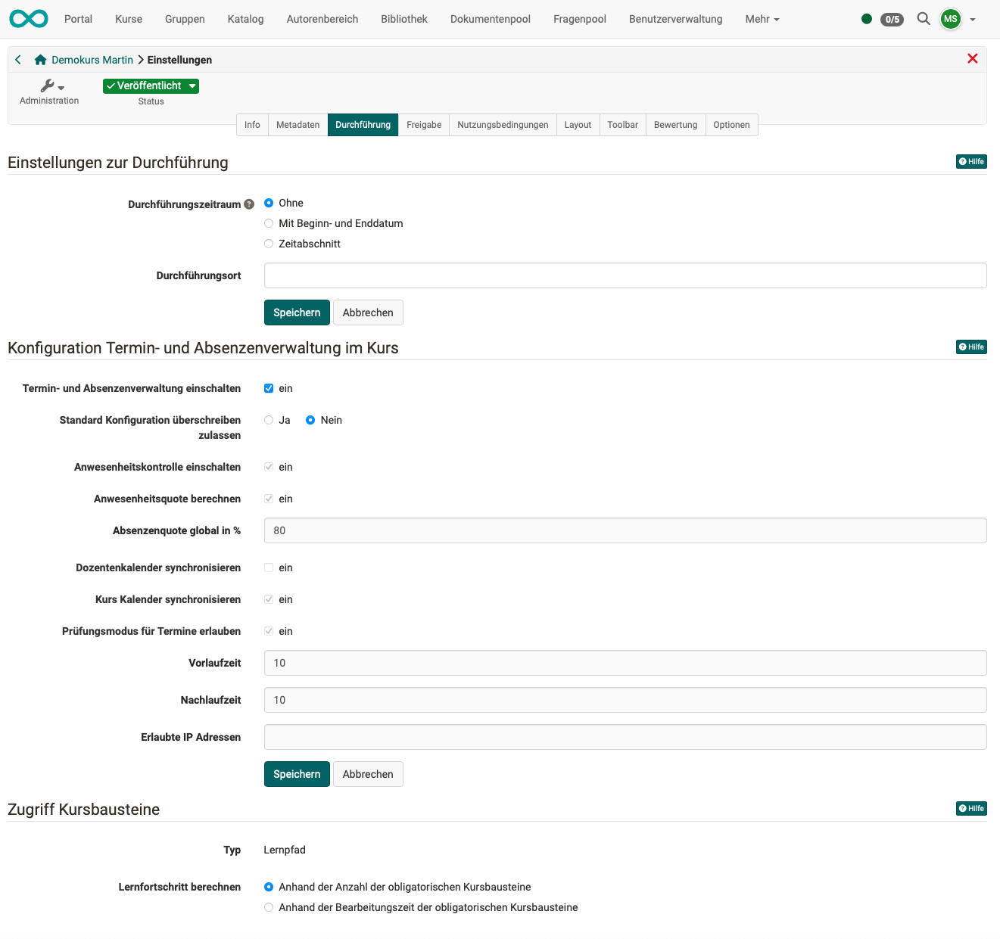

# Einstellungen - Tab Durchführung {: #tab_execution}

{ class="shadow lightbox"}

## Einstellungen zur Durchführung {: #config_execution}

**Durchführungszeitraum** 
- Der Durchführungszeitraum wird in den Informationen der Kursinfo angezeigt. 
- Er ist unabhängig vom Kursstatus und den Zugangsrechten. 
- Er hat keine Auswirkungen auf die Sichtbarkeit und den Zugang für die Kursmitglieder.
- Das Enddatum wird für den Kurs-Lebenszyklus verwendet.
- In herkömmlichen Kursen gilt bei der Berechung von "Bestanden": Ein "Nicht bestanden" wird dann ausgegeben, wenn ein "Bestanden" nach dem Enddatum des Durchführungszeitraums nicht erreicht wurde.
- Auch für viele relative Daten im Kurs werden die hier erfassten Start- und Enddaten benutzt. Z.B. für  Erinnerungen oder im Aufgabenbaustein für das automatische Einziehen der Aufgabe.

**Durchführungsort** 
Die Eingabe in dieses Textfeld wird in der Kursinfo angezeigt.

[Zum Seitenanfang ^](#tab_execution)

---

## Konfiguration Termin- und Absenzenverwaltung im Kurs {: #config_event_and_absence_management}

**Termin- und Absenzenverwaltung einschalten** 
Wird hier für den aktuellen Kurs das Termin- und Absenzenmanagement eingeschaltet, erscheint anschliessend die Option "Termine und Absenzen" unter der (Kurs-)Administration. Als **Kursbesitzer:in** können Sie dort nach Fertigstellung der Konfiguration (zur Laufzeit) Termine und Absenzen erfassen. 

!!! tip "Hinweis"

    Im Unterschied zu Besitzer:innen finden **Betreuer:innen** das Tool zum Erfassen in der Werkzeugleiste. 
    **Teilnehmer:innen** finden ihre Absenzen im [persönlichen Menü ](../personal_menu/Absences.de.md).

**Standard-Konfiguration überschreiben zulassen** 
Ist das Überschreiben nicht zugelassen, wird die Voreinstellung des/der Administrator:in angewendet.
Die nachstehenden Checkboxen und eingabefelder bleiben inaktiv und zeigen den voreingestellten Wert an.

Wird das Überschreiben zugelassen, sind die nachfolgenden Checkboxen und Eingabefelder editierbar und es kann spezifisch für diesen Kurs eine Konfiguration der Termin- und Absenzenverwaltung vorgenommen werden.

**Anwesenheitskontrolle einschalten** 
Wird die Anwesenheitskontrolle eingeschaltet, stehen als weitere Konfigurationsoptionen **"Anwesenheitsquote berechnen"** und **"Absenzenquote global in %"** zur Verfügung.

**Anwesenheitsquote berechnen** 
Die Anwesenheitsquote wird berechnet aus Terminen mit mehreren Einheiten und den Absenzen.

**Beispiel:** 
Ein Termin besteht aus 10 Einheiten. An einer der Einheiten war der/die Teilnehmer:in abwesend. 
=> Es ergibt sich eine Anwesenheitsquote von 90%.

**Absenzenquote global in %** 
Über alle Termine des aktuellen Kurses hinweg wird bei allen Teilnehmer:innen eine globale Anwesenheitsquote errechnet und im persönlichen Menü unter dem Punkt "Absenzen" angezeigt. 
Die hier angegebene globale Absenzquote wird für die Beurteilung der Anwesenheitsquote verwendet.

**Dozentenkalender synchronisieren** 
Ist die Option gewählt, werden Kurs-Termine bei den Dozenten in ihren persönlichen Kalender eingetragen. (Bei den Terminen handelt es sich um Termine mit der Möglichkeit zum Erfassen einer Absenz.)

**Kurskalender synchronisieren** 
Ist die Option gewählt, werden Termine im Kurskalender eingetragen. Ist die Option nicht gewählt, sind nur noch die einfachen Termine im Kurskalender aufgeführt, die Termine mit der Möglichkeit zum Erfassen einer Absenz nicht mehr.

**Prüfungsmodus für Termine erlauben** 
Ist die Option eingeschaltet, kann man bei Terminen im 3-Punkte-Menü eine Option "Als Prüfung markieren" wählen. Dadurch wird dann ein Prüfungsmodus erstellt.

**Vorlaufzeit** 
Die Vorlaufzeit bezieht sich auf "Prüfungsmodus für Termine erlauben". 
Wenn Betreuer:innen oder Besitzer:innen einen Termin "als Prüfung markieren", wird ein Prüfungsmodus mit dieser Vorgabe erstellt. (Alle so erstellen Prüfungsmodi des Kurses haben die gleiche Vorlaufzeit.)

**Nachlaufzeit** 
Die Nachlaufzeit bezieht sich auf "Prüfungsmodus für Termine erlauben". 
Wenn Betreuer oder Besitzer einen Termin als "als Prüfung markieren", wird ein Prüfungsmodus mit dieser Vorgabe erstellt. (Alle so erstellen Prüfungsmodi des Kurses haben die gleiche Nachlaufzeit.)

**Erlaubte IP-Adressen** 
Auch diese Angabe bezieht sich auf "Prüfungsmodus für Termine erlauben".

[Zum Seitenanfang ^](#tab_execution)

---

## Zugriff Kursbausteine {: #access_course_elements}

**Typ** 
Es wird hier angezeigt, ob der aktuelle Kurs ein Lernpfadkurs oder ein herkömmlicher Kurs ist. Der Typ kann hier nicht bearbeitet und geändert werden.

**Lernfortschritt berechnen** 
Der Lernfortschritt kann

- anhand der Anzahl der obligatorischen Kursbausteine
oder
- anhand der Bearbeitungszeit der obligatorischen Kursbausteine berechnet werden.

Freiwillige  Kursbausteine werden nicht berücksichtigt.

[Zum Seitenanfang ^](#tab_execution)

---

## Weiterführende Informationen {: #further_information}

[Basiskonzept Termine und Absenzen >](../basic_concepts/Events_and_Absences.de.md) 
[Aktivierung und Konfiguration des Absenzenmanagements durch Administrator:innen >](../../manual_admin/administration/Modules_Events_and_Absences.de.md) 
[Erfassung und Verwaltung der Absenzen in einem Kurs durch Kursbesitzer:innen >](../learningresources/Events_and_absences.de.md) 
[Erfassung und Verwaltung der Absenzen in einem Kurs durch Betreuer:innen >](../learningresources/x.de.md) 
[Persönliche Absenzen >](../personal_menu/Absences.de.md) 
[Kursübergreifende Absenzenerfassungung im Coachingtool >](../area_modules/Coaching.de.md) 
[Kursübergreifende Absenzenverwaltung durch Absenzenverwalter:innen>](../area_modules/Absence_Management.de.md) 

[Zum Seitenanfang ^](#tab_execution)

