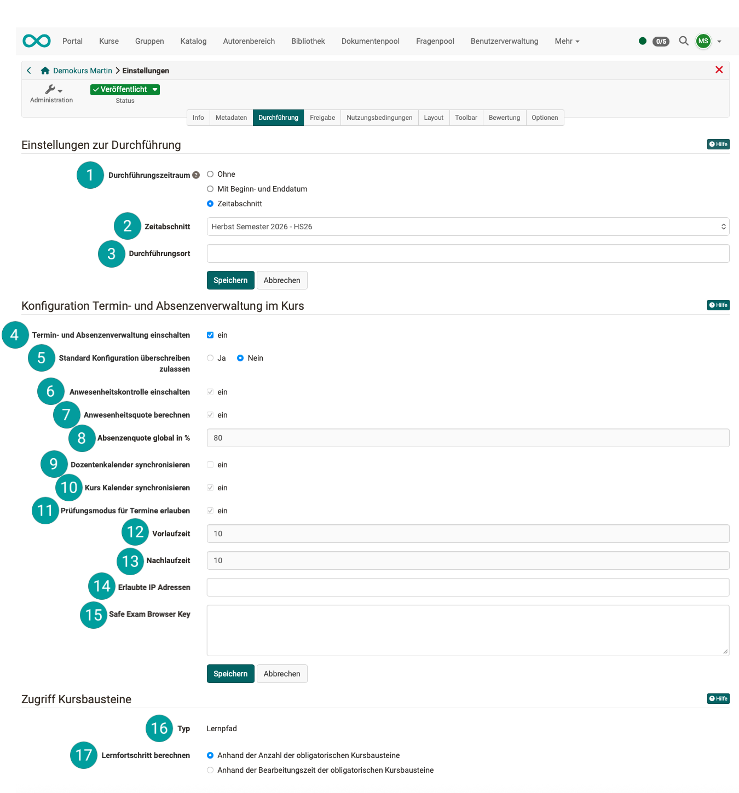

# Kurseinstellungen - Tab Durchführung {: #tab_execution}

Kurse verfügen, im Gegensatz zu anderen Lernressourcen, im Menü "Einstellungen" noch über den Tab "Durchführung".

{ class="shadow lightbox"}

## Einstellungen zur Durchführung {: #config_execution}

 **Durchführungszeitraum**

Bei Lernressourcen vom Typ "Kurs" kann ein Durchführungszeitraum festgelegt werden. Folgende Optionen sind möglich:

* _Ohne_: Wählen Sie diese Option, wenn der Kurs nicht zu einem bestimmten Daten beginnt und aufhört oder Sie den Termin nicht explizit in den Informationen einbauen möchten.

* _Mit Beginn- und Enddatum_: Der Kursbesitzer kann hier das Start- und Enddatum des Kurses eintragen. Dabei ist beim Enddatum der Endtag miteingeschlossen (23:59).

* _Zeitabschnitt_: Bei Wahl dieser Option werden Ihnen vordefiniert Zeitabschnitte, wie z.B. Semester, zur Auswahl angeboten. Siehe Punkt 2.

Ein gewählter Durchführungszeitraum wird in der Kursinfo angezeigt. 

!!! warning "Achtung"

    Diese Einstellung ist nicht zu verwechseln mit dem Kursstatus und hat auch keine Auswirkungen auf die Sichtbarkeit oder den Zugang der Kursmitglieder. 

Folgendes sollte man allerdings beachten: 

Wird "mit Beginn- und Enddatum" gewählt, gelten die hier eingetragenen Daten auch für verschiedene zeitabhängige Funktionen im Kurs, zum Beispiel für Erinnerungen oder im Aufgabenbaustein beim automatischen Einziehen von Aufgaben. 

Das Enddatum des Durchführungszeitraums wird auch für den Kurs-Lebenszyklus verwendet. Welche genauen Konsequenzen damit verbunden sind, legen die OpenOlat-Administrator:innen fest. Z.B. könnte der Kurs 2 Tage nach dem Endtermin auf "beendet" gesetzt und/oder der Kurs 4 Wochen nach dem Termin gelöscht werden. Erkundigen Sie sich am besten, welche Einstellungen in Ihrer OpenOlat-Instanz für den Kurs-Lebenszyklus gelten. 

In herkömmlichen Kursen wird bei der Berechnung von "Bestanden" berücksichtigt, ob das Ergebnis innerhalb des Durchführungszeitraums erreicht wurde. Wird kein "Bestanden" bis zum Enddatum erzielt, erscheint automatisch "Nicht bestanden".

!!! note "Hinweis"

    Beim Einsatz des automatischen Lebenszyklus wird der Kursstatus durch das Enddatum gesteuert.

 **Zeitabschnitt** 
Wenn auf Systemebene vom OpenOlat Administrator Zeitabschnitte (z.B. Semester) konfiguriert wurden, kann bei gewähltem Durchführungszeitraum "Zeitabschnitt" hier eine der vordefinierten Optionen ausgewählt werden. Der Zeitabschnitt erscheint anschliessend als Information in der Kursübersicht. Der Zeitabschnitt ist jedoch unabhängig vom Kursstatus und den Kurszugangsrechten (siehe Kapitel ["Zugangskonfiguration"](../learningresources/Access_configuration.de.md)). Er hat also keine Auswirkung auf die Sichtbarkeit und den Zugang für die Kursmitglieder.

 **Durchführungsort** 
Der Ort, an dem ein Kurs bzw. eine Lernressource durchgeführt wird. Dieser Punkt ist vor allem bei Blended Learning Angeboten sinnvoll. Bei einer reinen online Nutzung kann das Feld auch frei bleiben. Alternativ kann hier "online" oder "Internet" eingetragen werden. 
Die Eingabe in diesem Textfeld wird in der Kursinfo angezeigt.

[Zum Seitenanfang ^](#tab_execution)

---

## Konfiguration Termin- und Absenzenverwaltung im Kurs {: #config_event_and_absence_management}

 **Termin- und Absenzenverwaltung einschalten** 
Wird hier für den aktuellen Kurs das Termin- und Absenzenmanagement eingeschaltet, werden die Option 5 bis 14 zur weiteren Konfiguration angezeigt. 

Darüber hinaus erscheint anschliessend das Menü "Termine und Absenzen" unter der (Kurs-)Administration. Als **Kursbesitzer:in** können Sie dort nach Fertigstellung der Konfiguration (zur Laufzeit) Termine und Absenzen erfassen. 

!!! tip "Hinweis"

    Im Unterschied zu Besitzer:innen finden **Betreuer:innen** das Tool zum Erfassen in der Werkzeugleiste. 
    **Teilnehmer:innen** finden ihre Absenzen im [persönlichen Menü](../personal_menu/Absences.de.md).

 **Standard-Konfiguration überschreiben zulassen** 
Ist das Überschreiben nicht zugelassen, wird die Voreinstellung des/der Administrator:in angewendet.
Die nachstehenden Checkboxen und Eingabefelder bleiben inaktiv und zeigen den voreingestellten Wert an.

Wird das Überschreiben zugelassen, sind die nachfolgenden Checkboxen und Eingabefelder editierbar und es kann spezifisch für diesen Kurs eine Konfiguration der Termin- und Absenzenverwaltung vorgenommen werden.

 **Anwesenheitskontrolle einschalten** 
Wird die Anwesenheitskontrolle eingeschaltet, stehen als weitere Konfigurationsoptionen **"Anwesenheitsquote berechnen"** und **"Absenzenquote global in %"** zur Verfügung.

 **Anwesenheitsquote berechnen** 
Die Anwesenheitsquote wird berechnet aus Terminen mit mehreren Einheiten und den Absenzen.

**Beispiel:** 
Ein Termin besteht aus 10 Einheiten. An einer der Einheiten war der/die Teilnehmer:in abwesend. 
=> Es ergibt sich eine Anwesenheitsquote von 90%.

 **Absenzenquote global in %** 
Über alle Termine des aktuellen Kurses hinweg wird bei allen Teilnehmer:innen eine globale Anwesenheitsquote errechnet und im persönlichen Menü unter dem Punkt "Absenzen" angezeigt. 
Die hier angegebene globale Absenzquote wird für die Beurteilung der Anwesenheitsquote verwendet.

 **Dozentenkalender synchronisieren** 
Ist die Option gewählt, werden Kurs-Termine bei den Dozenten in ihren persönlichen Kalender eingetragen. (Bei den Terminen handelt es sich um Termine mit der Möglichkeit zum Erfassen einer Absenz.)

 **Kurskalender synchronisieren** 
Ist die Option gewählt, werden Termine im Kurskalender eingetragen. Ist die Option nicht gewählt, sind nur noch die einfachen Termine im Kurskalender aufgeführt, die Termine mit der Möglichkeit zum Erfassen einer Absenz nicht mehr.

 **Prüfungsmodus für Termine erlauben** 
Um dieses Feld auswählen zu können, muss die Option "Standard-Konfiguration überschreiben zulassen" ausgewählt sein.
Wird der Prüfungsmodus für Termine erlaubt, kann man bei Terminen im 3-Punkte-Menü eine Option "Als Prüfung markieren" wählen. Dadurch wird dann ein Prüfungsmodus erstellt. Ausserdem werden dann die nachfolgenden Punkte 12 bis 15 angezeigt.

 **Vorlaufzeit** 
Die Vorlaufzeit bezieht sich auf "Prüfungsmodus für Termine erlauben". 
Wenn Betreuer:innen oder Besitzer:innen einen Termin "als Prüfung markieren", wird ein Prüfungsmodus mit dieser Vorgabe erstellt. (Alle so erstellen Prüfungsmodi des Kurses haben die gleiche Vorlaufzeit.)

 **Nachlaufzeit** 
Die Nachlaufzeit bezieht sich auf "Prüfungsmodus für Termine erlauben". 
Wenn Betreuer:innen oder Besitzer:innen einen Termin als "als Prüfung markieren", wird ein Prüfungsmodus mit dieser Vorgabe erstellt. (Alle so erstellen Prüfungsmodi des Kurses haben die gleiche Nachlaufzeit.)

 **Erlaubte IP-Adressen** 
Auch diese Angabe bezieht sich auf "Prüfungsmodus für Termine erlauben".

 **Safe Exam Browser Key** 
Hier kann der Safe Exam Browser Key hinterlegt werden, sofern das Tool verwendet wird.

[Zum Seitenanfang ^](#tab_execution)

---

## Zugriff Kursbausteine {: #access_course_elements}

 **Typ** 
Zur Information wird hier angezeigt, ob der aktuelle Kurs ein Lernpfadkurs oder ein herkömmlicher (klassischer) Kurs ist. 

Herkömmliche Kurse können an dieser Stelle in einen Lernpfad-Kurs konvertiert werden. 

 **Lernfortschritt berechnen**

Für Lernpfad Kurse kann definiert werden ob der angezeigte Kursfortschritt anhand der Anzahl der obligatorischen Kursbausteine oder anhand der Bearbeitungszeit der obligatorischen Kursbausteine berechnet wird. Wird die Bearbeitungszeit gewählt müssen alle obligatorischen Kursbausteine im Kurseditor mit entsprechenden Zeiten versehen werden. 
Freiwillige Kursbausteine werden nicht berücksichtigt.

Herkömmliche Kurse verfügen nicht über die Option "Lernfortschritt".

[Zum Seitenanfang ^](#tab_execution)

---

## Weiterführende Informationen {: #further_information}

[Basiskonzept Termine und Absenzen >](../basic_concepts/Events_and_Absences.de.md) 
[Aktivierung und Konfiguration des Absenzenmanagements durch Administrator:innen >](../../manual_admin/administration/Modules_Events_and_Absences.de.md) 
[Erfassung und Verwaltung der Absenzen in einem Kurs durch Kursbesitzer:innen >](../learningresources/Events_and_absences.de.md) 
[Erfassung und Verwaltung der Absenzen in einem Kurs durch Betreuer:innen >](../learningresources/Toolbar_Events.de.md) 
[Persönliche Absenzen >](../personal_menu/Absences.de.md) 
[Kursübergreifende Absenzenerfassung im Coachingtool >](../area_modules/Coaching.de.md) 
[Kursübergreifende Absenzenverwaltung durch Absenzenverwalter:innen >](../area_modules/Absence_Management.de.md) 

[Zum Seitenanfang ^](#tab_execution)

