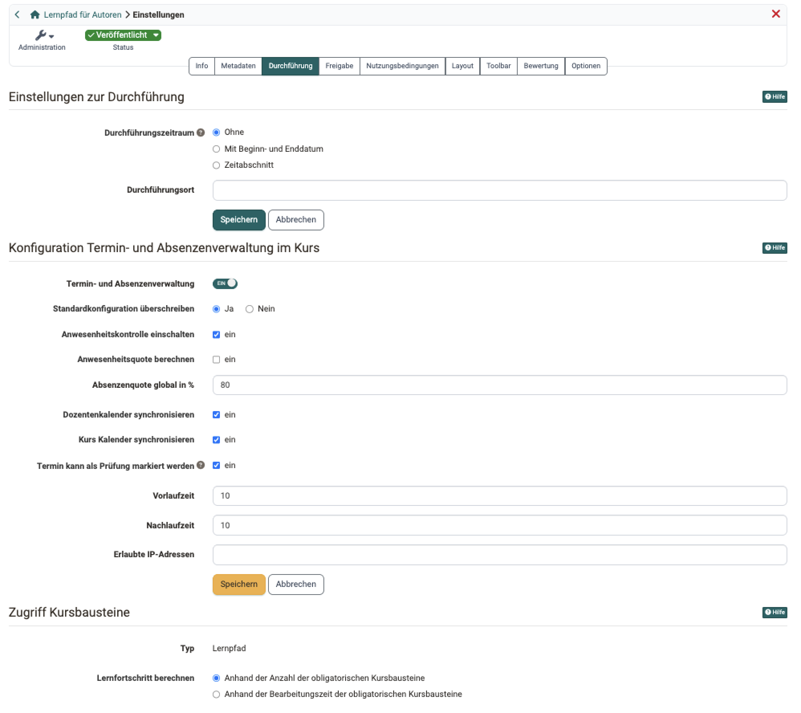

# Kurseinstellungen - Tab Durchführung {: #tab_execution}

Kurse verfügen, im Gegensatz zu anderen Lernressourcen, im Menü "Einstellungen" noch über den Tab "Durchführung".

{ class="shadow lightbox"}

## Einstellungen zur Durchführung {: #config_execution}

#### Durchführungszeitraum {: #execution_period }

Bei Lernressourcen vom Typ "Kurs" kann ein Durchführungszeitraum festgelegt werden. Folgende Optionen sind möglich:

* _Ohne_: Wählen Sie diese Option, wenn der Kurs nicht zu einem bestimmten Daten beginnt und aufhört oder Sie den Termin nicht explizit in den Informationen einbauen möchten.

* _Mit Beginn- und Enddatum_: Der Kursbesitzer kann hier das Start- und Enddatum des Kurses eintragen. Dabei ist beim Enddatum der Endtag miteingeschlossen (23:59).

* _Zeitabschnitt_: Bei Wahl dieser Option werden Ihnen vordefinierte Zeitabschnitte, wie z.B. Semester, zur Auswahl angeboten. Siehe den Abschnitt "Zeitabschnitt".

Ein gewählter Durchführungszeitraum wird in der Kursinfo angezeigt. 

!!! info "Wichtig"

    Diese Einstellung ist nicht zu verwechseln mit dem Kursstatus und hat auch keine Auswirkungen auf die Sichtbarkeit oder den Zugang der Kursmitglieder. 

Folgendes sollte man allerdings beachten: 

Wird "mit Beginn- und Enddatum" gewählt, gelten die hier eingetragenen Daten auch für verschiedene zeitabhängige Funktionen im Kurs, zum Beispiel für Erinnerungen oder im Aufgabenbaustein beim automatischen Einziehen von Aufgaben. 

Das Enddatum des Durchführungszeitraums wird auch für den Kurs-Lebenszyklus verwendet. Welche genauen Konsequenzen damit verbunden sind, legen die OpenOlat-Administrator:innen fest. Z.B. könnte der Kurs 2 Tage nach dem Endtermin auf "beendet" gesetzt und/oder der Kurs 4 Wochen nach dem Termin gelöscht werden. Erkundigen Sie sich am besten, welche Einstellungen in Ihrer OpenOlat-Instanz für den Kurs-Lebenszyklus gelten. 

In herkömmlichen Kursen wird bei der Berechnung von "Bestanden" berücksichtigt, ob das Ergebnis innerhalb des Durchführungszeitraums erreicht wurde. Wird kein "Bestanden" bis zum Enddatum erzielt, erscheint automatisch "Nicht bestanden".

!!! note "Hinweis"

    Beim Einsatz des automatischen Lebenszyklus wird der Kursstatus durch das Enddatum gesteuert.

#### Zeitabschnitt {: #lifecycle }

Wenn auf Systemebene vom OpenOlat Administrator Zeitabschnitte (z.B. Semester) konfiguriert wurden, kann bei gewähltem Durchführungszeitraum "Zeitabschnitt" hier eine der vordefinierten Optionen ausgewählt werden. Der Zeitabschnitt erscheint anschliessend als Information in der Kursübersicht. Der Zeitabschnitt ist jedoch unabhängig vom Kursstatus und den Kurszugangsrechten (siehe Kapitel ["Zugangskonfiguration"](../learningresources/Access_configuration.de.md)). Er hat also keine Auswirkung auf die Sichtbarkeit und den Zugang für die Kursmitglieder.

#### Durchführungsort {: #execution_location }

Der Ort, an dem ein Kurs bzw. eine Lernressource durchgeführt wird. Dieser Punkt ist vor allem bei Blended Learning Angeboten sinnvoll. Bei einer reinen online Nutzung kann das Feld auch frei bleiben. Alternativ kann hier "online" oder "Internet" eingetragen werden. 
Die Eingabe in diesem Textfeld wird in der Kursinfo angezeigt.

[Zum Seitenanfang ^](#tab_execution)

---

## Konfiguration Termin- und Absenzenverwaltung im Kurs {: #config_event_and_absence_management} [:octicons-tag-16:{ title="ab Release 12.0 (OO-2636)" }](https://track.frentix.com/issue/OO-2636)

Diesen Abschnitt bearbeiten **Kursbesitzende**. Betreuende erreichen ihn nicht; sie finden das Werkzeug "Termine" in der Kurs-Werkzeugleiste.

#### Termin- und Absenzenverwaltung {: #lecture_enabled }

Dieser Toggle steht zur Verfügung, wenn das Modul "Termine und Absenzen" [systemweit aktiviert](../../manual_admin/administration/Modules_Events_and_Absences.de.md) ist. Ohne aktiviertes Modul fehlt der ganze Abschnitt "Konfiguration Termin- und Absenzenverwaltung im Kurs" im Tab "Durchführung".

Wird hier für den aktuellen Kurs die Termin- und Absenzenverwaltung eingeschaltet, erscheinen die übrigen Einstellungen dieses Abschnitts. Die Felder "Vorlaufzeit", "Nachlaufzeit", "Erlaubte IP-Adressen" und "Safe Exam Browser Key" kommen erst dazu, wenn "Termin kann als Prüfung markiert werden" eingeschaltet ist.

Darüber hinaus erscheint anschliessend das Menü "Termine und Absenzen" in der Kurs-Administration. Als **Kursbesitzer:in** können Sie dort nach Fertigstellung der Konfiguration (zur Laufzeit) Termine und Absenzen erfassen. 

!!! note "Hinweis"

    Im Unterschied zu Besitzer:innen finden **Betreuer:innen** das Tool zum Erfassen in der Werkzeugleiste. 
    **Teilnehmer:innen** finden ihre Absenzen im [persönlichen Menü](../personal_menu/Absences.de.md).

#### Standardkonfiguration überschreiben {: #config_override }

Wird das Überschreiben mit "Ja" zugelassen, sind die nachfolgenden Checkboxen und Eingabefelder editierbar und es kann spezifisch für diesen Kurs eine Konfiguration der Termin- und Absenzenverwaltung vorgenommen werden.

Steht die Option auf "Nein", wird die Voreinstellung des/der Administrator:in angewendet. Die nachstehenden Checkboxen und Eingabefelder bleiben inaktiv und zeigen den voreingestellten Wert an. Die dort voreingestellten Funktionen sind im Kurs dennoch wirksam.

Ob Sie das Überschreiben überhaupt einschalten können, steuert die Administration mit der Einstellung "Standardkonfiguration". Bei der Auswahlkarte "Überschreibbar" können Sie diesen Punkt frei wählen. Bei "Schreibgeschützt" bleibt er auf "Nein" und ist ausgegraut, sofern das Überschreiben in diesem Kurs nicht schon vorher eingeschaltet war.

!!! note "Sie können die Einstellungen in Ihrem Kurs nicht bearbeiten?"

    Ausgegraute Felder haben zwei mögliche Ursachen. Schauen Sie auf das Feld "Standardkonfiguration überschreiben" selbst:

    - **Es ist anklickbar und steht auf "Nein"**: Setzen Sie es auf "Ja", dann werden die Felder darunter editierbar.
    - **Es ist selbst ausgegraut**: Die Administration hat "Standardkonfiguration" auf "Schreibgeschützt" gesetzt. Für eine Freigabe wenden Sie sich an die OpenOlat-Administration.

    In beiden Fällen sind die angezeigten Vorgabewerte der Administration im Kurs wirksam.

#### Anwesenheitskontrolle einschalten {: #roll_call_enabled }

Wird die Anwesenheitskontrolle eingeschaltet, stehen als weitere Konfigurationsoptionen **"Anwesenheitsquote berechnen"** und **"Absenzenquote global in %"** zur Verfügung.

#### Anwesenheitsquote berechnen {: #attendance_rate_calculation }

Die Anwesenheitsquote wird berechnet aus Terminen mit mehreren Einheiten und den Absenzen.

**Beispiel:** 
Ein Termin besteht aus 10 Einheiten. An einer der Einheiten war der/die Teilnehmer:in abwesend. 
=> Es ergibt sich eine Anwesenheitsquote von 90%.

#### Absenzenquote global in % {: #global_absence_rate }

Über alle Termine des aktuellen Kurses hinweg wird bei allen Teilnehmer:innen eine globale Anwesenheitsquote errechnet und im persönlichen Menü unter dem Punkt "Absenzen" angezeigt. 
Die hier angegebene globale Absenzquote wird für die Beurteilung der Anwesenheitsquote verwendet.

#### Dozentenkalender synchronisieren {: #teacher_calendar_sync }

Ist die Option gewählt, werden Kurs-Termine bei den Dozenten in ihren persönlichen Kalender eingetragen. (Bei den Terminen handelt es sich um Termine mit der Möglichkeit zum Erfassen einer Absenz.)

#### Kurs Kalender synchronisieren {: #course_calendar_sync }

Ist die Option gewählt, werden Termine im Kurskalender eingetragen. Ist die Option nicht gewählt, sind nur noch die einfachen Termine im Kurskalender aufgeführt, die Termine mit der Möglichkeit zum Erfassen einer Absenz nicht mehr.

#### Termin kann als Prüfung markiert werden {: #event_as_exam }

Das Hilfe-Symbol neben der Option zeigt den Text "Wenn diese Option aktiviert ist, kann der Termin als 'Prüfung' markiert werden. Ein markierter Termin wird im Prüfungsmodus durchgeführt, optional mit SEB."

Ist die Option eingeschaltet, kann man bei Terminen im 3-Punkte-Menü die Option "Als Prüfung markieren" wählen. Dadurch wird ein Prüfungsmodus erstellt. Ausserdem erscheinen die nachfolgenden Felder "Vorlaufzeit", "Nachlaufzeit", "Erlaubte IP-Adressen" und "Safe Exam Browser Key" mit den kursweiten Vorgabewerten für diese Prüfungsmodi. Die Vorgabewerte werden beim Markieren übernommen; bereits erstellte Prüfungsmodi bleiben bei späteren Änderungen unverändert.

Die Option erscheint nur, wenn der Prüfungsmodus systemweit eingeschaltet ist. Zum Ändern der Option im Kurs ist "Standardkonfiguration überschreiben" auf "Ja" nötig. Steht das Überschreiben auf "Nein" und ist die Option in der Administration eingeschaltet, erscheint dieses Feld angehakt und inaktiv, und "Als Prüfung markieren" arbeitet mit den Vorgabewerten der Administration.

#### Vorlaufzeit {: #lead_time }

Die Vorlaufzeit bezieht sich auf "Termin kann als Prüfung markiert werden". 
Wenn Betreuer:innen oder Besitzer:innen einen Termin "als Prüfung markieren", wird ein Prüfungsmodus mit dieser Vorgabe erstellt. (Alle so erstellten Prüfungsmodi des Kurses haben die gleiche Vorlaufzeit.)

#### Nachlaufzeit {: #followup_time }

Die Nachlaufzeit bezieht sich auf "Termin kann als Prüfung markiert werden". 
Wenn Betreuer:innen oder Besitzer:innen einen Termin "als Prüfung markieren", wird ein Prüfungsmodus mit dieser Vorgabe erstellt. (Alle so erstellten Prüfungsmodi des Kurses haben die gleiche Nachlaufzeit.)

#### Erlaubte IP-Adressen {: #admissible_ips }

Auch diese Angabe bezieht sich auf "Termin kann als Prüfung markiert werden". 
Die hier erfassten IP-Adressen werden in den Prüfungsmodus übernommen, wenn ein Termin "als Prüfung markiert" wird.

#### Safe Exam Browser Key {: #seb_key }

Dieses Feld ist der kursweite Vorgabewert für die Variante "SEB mit manuellen Keys". Der hinterlegte Key wird übernommen, wenn ein Termin "als Prüfung markiert" und die Prüfung mit dem Safe Exam Browser abgesichert wird. Im Prüfungsmodus des Termins wird der Key zur Information angezeigt und dort nicht bearbeitet.

Das Feld erscheint nur, wenn die Administration bei "Safe Exam Browser - Art der Benutzung" die Variante "SEB mit manuellen Keys" gewählt hat. Sie finden die Einstellung in der System-Administration unter: 
`Administration > Module > Termine / Absenzen`, Tab "Konfiguration".

Bleibt das Feld bei zugelassenem Überschreiben leer, erhalten die Prüfungsmodi dieses Kurses keinen Key; der Key aus der Administration wird in diesem Fall nicht verwendet.

Ist "SEB-Config (empfohlen)" aktiv, wird der Safe Exam Browser pro Prüfung über [Konfigurationsvorlagen](../learningresources/Assessment_mode.de.md) konfiguriert und dieses Feld wird nicht angezeigt. Beim Markieren als Prüfung steht im Prüfungsmodus des Termins das Feld "Konfiguration" mit den aktiven Vorlagen zur Verfügung, wobei die Standardvorlage vorausgewählt ist. Ob die Konfigurationsdatei heruntergeladen werden kann, legt in diesem Fall die Administration fest.

Prüfungsmodi, die direkt über die [Prüfungsverwaltung](../learningresources/Assessment_mode.de.md) erstellt werden, verwenden diesen kursweiten Key nicht. Dort wird die SEB-Variante pro Prüfungsmodus über "Typ von Anwendung" gewählt.

[Zum Seitenanfang ^](#tab_execution)

---

## Zugriff Kursbausteine {: #access_course_elements}

#### Typ {: #course_type }

Zur Information wird hier angezeigt, ob der aktuelle Kurs ein Lernpfadkurs oder ein herkömmlicher (klassischer) Kurs ist. 

Herkömmliche Kurse können an dieser Stelle in einen Lernpfad-Kurs konvertiert werden. 

#### Lernfortschritt berechnen {: #learning_progress }

Für Lernpfad Kurse kann definiert werden ob der angezeigte Kursfortschritt anhand der Anzahl der obligatorischen Kursbausteine oder anhand der Bearbeitungszeit der obligatorischen Kursbausteine berechnet wird. Wird die Bearbeitungszeit gewählt müssen alle obligatorischen Kursbausteine im Kurseditor mit entsprechenden Zeiten versehen werden. 
Freiwillige Kursbausteine werden nicht berücksichtigt.

Herkömmliche Kurse verfügen nicht über die Option "Lernfortschritt".

[Zum Seitenanfang ^](#tab_execution)

---

## Weiterführende Informationen {: #further_information}

**Auf dieser Seite erwähnt** 
[Zugangskonfiguration >](../learningresources/Access_configuration.de.md) 
[Modul Termine und Absenzen >](../../manual_admin/administration/Modules_Events_and_Absences.de.md) 
[Persönliche Absenzen >](../personal_menu/Absences.de.md) 
[Prüfungsmodus >](../learningresources/Assessment_mode.de.md)

**Weiterführend** 
[Basiskonzept Termine und Absenzen >](../basic_concepts/Events_and_Absences.de.md) 
[Erfassung und Verwaltung der Absenzen in einem Kurs durch Kursbesitzer:innen >](../learningresources/Events_and_absences.de.md) 
[Erfassung und Verwaltung der Absenzen in einem Kurs durch Betreuer:innen >](../learningresources/Toolbar_Events.de.md) 
[Kursübergreifende Absenzenerfassung im Coachingtool >](../area_modules/Coaching.de.md) 
[Kursübergreifende Absenzenverwaltung durch Absenzenverwalter:innen >](../area_modules/Absence_Management.de.md)

[Zum Seitenanfang ^](#tab_execution)

