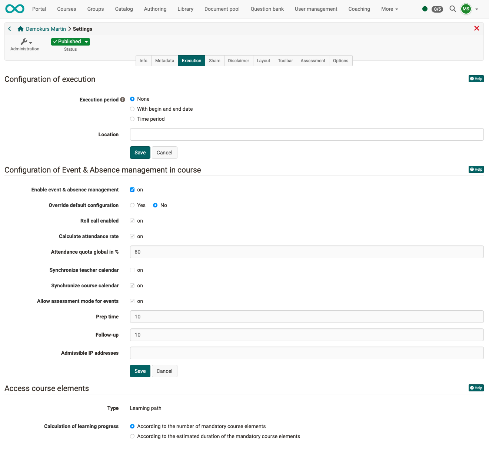

# Course Settings - Tab Execution {: #tab_execution}

{ class="shadow lightbox"}

## Settings for implementation  {: #config_execution}

**Implementation period**

- The implementation period is displayed in the course information.
- It is independent of course status and access rights.
- It has no effect on visibility and access for course members.
- The end date is used for the course lifecycle.
- In conventional courses, the following applies when calculating "Pass": A "Fail" is issued if a "Pass" has not been achieved by the end date of the implementation period.
- The start and end dates recorded here are also used for many relative dates in the course. For example, for reminders or in the task module for automatic task collection.

**Place of implementation** 
The entry in this text field is displayed in the course information.

[To the top of the page ^](#tab_execution)

---

## Configuring event and absence management in the course {: #config_event_and_absence_management}

**Enable event and absence management** 
If event and absence management is activated for the current course, the option "Events and absences" will appear under (course) administration. As the **course owner**, you can enter events and absences there after completing the configuration (at runtime).

!!! tip "Note"

    Unlike owners, **coaches** can find the capture tool in the toolbar. 
    **Members** find their absences in the [Personal Menu](../personal_menu/Absences.md)

**Allow overriding of default configuration** 
If overwriting is not permitted, the administrator's default setting will be applied.
The checkboxes and input fields below will remain inactive and display the default value.

If overwriting is permitted, the following checkboxes and input fields can be edited and a specific configuration of the appointment and absence management can be made for this course.

**Enable attendance monitoring** 
If attendance monitoring is enabled, the additional configuration options **"Calculate attendance rate"** and **"Absence rate globally in %"** are available.

**Calculate attendance rate** 
The attendance rate is calculated based on events with multiple units and absences.

**Example:** 
An appointment consists of 10 sessions. The participant was absent from one of the sessions. 
=> This results in an attendance rate of 90%.

**Global absence rate in %** 
A global attendance rate is calculated for all participants across all dates of the current course and displayed in the personal menu under "Absences."
The global absence rate specified here is used to assess the attendance rate.

**Synchronize lecturer calendar** 
If this option is selected, course dates are entered into the lecturers' personal calendars. (These dates are dates for which absences can be recorded.)

**Synchronize course calendar** 
If this option is selected, events are entered in the course calendar. If this option is not selected, only the simple events are listed in the course calendar; events with the option to record an absence are no longer listed.

**Allow exam mode for events** 
If this option is enabled, you can select "Mark as exam" from the 3-point menu for events. This will then create an exam mode.

**Lead time** 
The lead time refers to "Allow review mode for events."
When instructors or owners "mark an event as an exam," an exam mode is created with this setting. (All exam modes created in this way for the course have the same lead time.)

**Follow-up time** 
The follow-up time refers to "Allow audit mode for events". 
When instructors or owners mark an assignment as "mark as exam," an exam mode is created with this setting. (All exam modes created in this way for the course have the same grace period.)

**Allowed IP addresses** 
This setting also refers to "Allow exam mode for events."

[To the top of the page ^](#tab_execution)

---

## Access course elements {: #access_course_elements}

**Type** 
This shows whether the current course is a learning path course or a traditional course. The type cannot be edited or changed here.

**Calculate learning progress** 
The learning progress can be calculated

- based on the number of compulsory course modules
or
- based on the processing time of the mandatory course modules.

Optional course modules are not taken into account.

[To the top of the page ^](#tab_execution)

---

## Further Informationen {: #further_information}

[Basic concept events and absences >](../basic_concepts/Events_and_Absences.md) 
[Activation and configuration of absence management by administrators >](../../manual_admin/administration/Modules_Events_and_Absences.md) 
[Tracking and managing absences in a course by course owners >](../learningresources/Events_and_absences.md) 
[Tracking and managing absences in a course by coaches >](../learningresources/Toolbar_Events.md) 
[Personal absences >](../personal_menu/Absences.md) 
[Cross-course absence recording in the coaching tool >](../area_modules/Coaching.md) 
[Cross-course absence management by absence administrators >](../area_modules/Absence_Management.md) 

[To the top of the page ^](#tab_execution)

