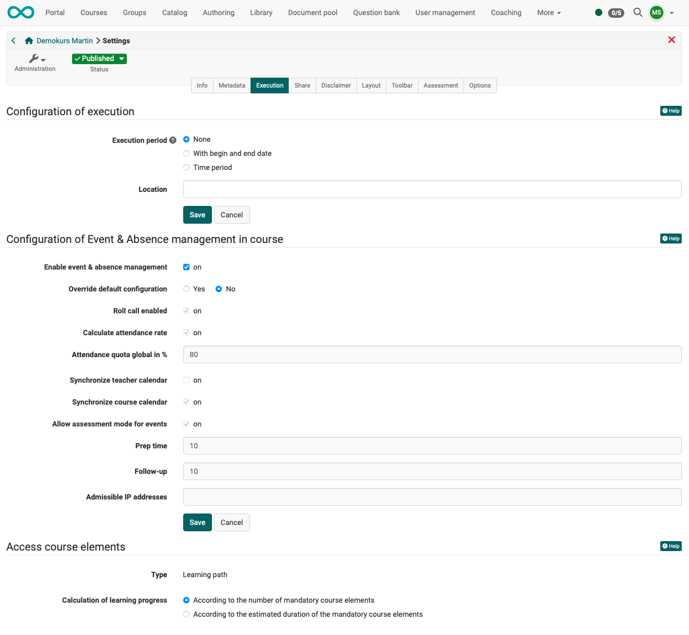

# Course Settings - Tab Execution {: #tab_execution}

Unlike other learning resources, courses still have a "Delivery" tab in the "Settings" menu.

{ class="shadow lightbox"}

## Settings for implementation  {: #config_execution}

 **Implementation period**

For learning resources of the "Course" type, a duration can be specified. The following options are available:

* _Without_: Wählen Sie diese Option, wenn der Kurs nicht zu einem bestimmten Daten beginnt und aufhört oder Sie den Termin nicht explizit in den Informationen einbauen möchten.

* _With start and end dates_: The course owner can enter the start and end dates of the course here. The end date includes the final day (11:59 p.m.).

* _Time period_: If you select this option, you will be presented with predefined time periods, such as semesters, to choose from. See point 2.

The selected course period is displayed in the course information. 

!!! warning "Attention"

    This setting should not be confused with the course status and does not affect the visibility or access of course members. 

However, keep the following in mind: 

If "with start and end dates" is selected, the dates entered here will also apply to various time-dependent functions in the course, such as reminders or the automatic submission of assignments in the assignment module. 

The end date of the course period is also used for the course lifecycle. The exact implications of this are determined by the OpenOlat administrators. For example, the course could be set to "completed" two days after the end date and/or deleted four weeks after the end date. It is best to check which settings apply to the course lifecycle in your OpenOlat instance. 

In traditional courses, the "Pass" status is determined based on whether the result was achieved within the course period. If a "Pass" is not achieved by the end date, "Fail" is automatically displayed.

!!! note "Note"

    When using the automatic lifecycle, the course status is determined by the end date.

 **Time Period** 
If the OpenOlat administrator has configured time periods (e.g., semesters) at the system level, you can select one of the predefined options here when "Time Period" is selected as the implementation period. The time period then appears as information in the course overview. However, the time period is independent of the course status and course access rights (see the chapter ["Access Configuration"](../learningresources/Access_configuration.md)). It therefore has no effect on visibility or access for course members.

 **Implementation place** 
The location where a course or learning resource takes place. This field is particularly useful for blended learning offerings. For courses that are entirely online, this field can be left blank. Alternatively, you can enter "online" or "Internet" here.
The text entered in this field will be displayed in the course information.

[To the top of the page ^](#tab_execution)

---

## Configuring event and absence management in the course {: #config_event_and_absence_management}

 **Enable event and absence management** 
If you enable schedule and absence management for the current course, options 5 through 14 will be displayed for further configuration.

In addition, the "Events and Absences" menu will then appear under (Course) Administration. As the **course owner**, you can enter appointments and absences there once the configuration is complete (at runtime).

!!! tip "Note"

    Unlike owners, **coaches** can find the capture tool in the toolbar. 
    **Members** find their absences in the [Personal Menu](../personal_menu/Absences.md)

 **Allow overriding of default configuration** 
If overwriting is not permitted, the administrator's default setting will be applied.
The checkboxes and input fields below will remain inactive and display the default value.

If overwriting is permitted, the following checkboxes and input fields can be edited and a specific configuration of the event and absence management can be made for this course.

 **Enable attendance monitoring** 
If attendance monitoring is enabled, the additional configuration options **"Calculate attendance rate"** and **"Absence rate globally in %"** are available.

 **Calculate attendance rate** 
The attendance rate is calculated based on events with multiple units and absences.

**Example:** 
An event consists of 10 sessions. The participant was absent from one of the sessions. 
=> This results in an attendance rate of 90%.

 **Global absence rate in %** 
A global attendance rate is calculated for all participants across all dates of the current course and displayed in the personal menu under "Absences".
The global absence rate specified here is used to assess the attendance rate.

 **Synchronize lecturer calendar** 
If this option is selected, course dates are entered into the lecturers' personal calendars. (These dates are dates for which absences can be recorded.)

 **Synchronize course calendar** 
If this option is selected, events are entered in the course calendar. If this option is not selected, only the simple events are listed in the course calendar; events with the option to record an absence are no longer listed.

 **Allow exam mode for events** 
To select this field, the "Allow overriding of default configuration" option must be selected.
If exam mode is enabled for events, you can select the "Mark as exam" option from the three-dot menu for events. This will then create a test mode. In addition, the following items 12 through 15 will be displayed.

 **Lead time** 
The lead time refers to "Allow review mode for events."
When instructors or owners "mark an event as an exam," an exam mode is created with this setting. (All exam modes created in this way for the course have the same lead time.)

 **Follow-up time** 
The follow-up time refers to "Allow audit mode for events". 
When instructors or owners mark an assignment as "mark as exam," an exam mode is created with this setting. (All exam modes created in this way for the course have the same grace period.)

 **Allowed IP addresses** 
This setting also refers to "Allow exam mode for events".

 **Safe Exam Browser Key** 
You can enter the Safe Exam Browser key here if you are using the tool.

[To the top of the page ^](#tab_execution)

---

## Access course elements {: #access_course_elements}

 **Type** 
For your information, this section indicates whether the current course is a learning path course or a traditional (classic) course. 

Existing courses can be converted into a learning path course at this point. 

 **Calculate learning progress**
For learning path courses, you can specify whether the displayed course progress is calculated based on the number of required course modules or based on the time spent on the required course modules. If you select "time spent," all required course modules must be assigned corresponding durations in the course editor. 
Optional course modules are not taken into account.

Traditional courses do not include a "Learning Progress" option.

[To the top of the page ^](#tab_execution)

---

## Further Informationen {: #further_information}

[Basic concept events and absences >](../basic_concepts/Events_and_Absences.md) 
[Activation and configuration of absence management by administrators >](../../manual_admin/administration/Modules_Events_and_Absences.md) 
[Tracking and managing absences in a course by course owners >](../learningresources/Events_and_absences.md) 
[Tracking and managing absences in a course by coaches >](../learningresources/Toolbar_Events.md) 
[Personal absences >](../personal_menu/Absences.md) 
[Cross-course absence recording in the coaching tool >](../area_modules/Coaching.md) 
[Cross-course absence management by absence administrators >](../area_modules/Absence_Management.md) 

[To the top of the page ^](#tab_execution)

