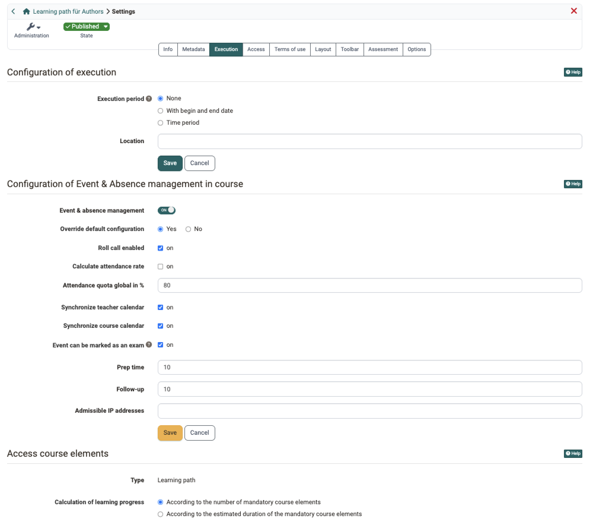

# Course Settings - Tab Execution {: #tab_execution}

Unlike other learning resources, courses still have an "Execution" tab in the "Settings" menu.

{ class="shadow lightbox"}

## Configuration of execution {: #config_execution}

#### Execution period {: #execution_period }

For learning resources of the "Course" type, a duration can be specified. The following options are available:

* _None_: Select this option if the course does not begin and end on a specific date, or if you do not want to include the dates explicitly in the course information.

* _With begin and end date_: The course owner can enter the start and end dates of the course here. The end date includes the final day (11:59 p.m.).

* _Time period_: If you select this option, you will be presented with predefined time periods, such as semesters, to choose from. See the section "Time period".

The selected course period is displayed in the course information. 

!!! info "Important"

    This setting should not be confused with the course status and does not affect the visibility or access of course members. 

However, keep the following in mind: 

If "With begin and end date" is selected, the dates entered here will also apply to various time-dependent functions in the course, such as reminders or the automatic submission of assignments in the assignment module. 

The end date of the course period is also used for the course lifecycle. The exact implications of this are determined by the OpenOlat administrators. For example, the course could be set to "completed" two days after the end date and/or deleted four weeks after the end date. It is best to check which settings apply to the course lifecycle in your OpenOlat instance. 

In traditional courses, the "Pass" status is determined based on whether the result was achieved within the course period. If a "Pass" is not achieved by the end date, "Fail" is automatically displayed.

!!! note "Note"

    When using the automatic lifecycle, the course status is determined by the end date.

#### Time period {: #lifecycle }

If the OpenOlat administrator has configured time periods (e.g., semesters) at the system level, you can select one of the predefined options here when "Time period" is selected as the execution period. The time period then appears as information in the course overview. However, the time period is independent of the course status and course access rights (see the chapter ["Access Configuration"](../learningresources/Access_configuration.md)). It therefore has no effect on visibility or access for course members.

#### Location {: #execution_location }

The location where a course or learning resource takes place. This field is particularly useful for blended learning offerings. For courses that are entirely online, this field can be left blank. Alternatively, you can enter "online" or "Internet" here.
The text entered in this field will be displayed in the course information.

[To the top of the page ^](#tab_execution)

---

## Configuration of Event & Absence management in course {: #config_event_and_absence_management} [:octicons-tag-16:{ title="from Release 12.0 (OO-2636)" }](https://track.frentix.com/issue/OO-2636)

This section is edited by **course owners**. Coaches do not reach it; they find the "Events" tool in the course toolbar.

#### Event & absence management {: #lecture_enabled }

This toggle is available if the module "Events and Absences" is [activated system-wide](../../manual_admin/administration/Modules_Events_and_Absences.md). Without the activated module, the whole section "Configuration of Event & Absence management in course" is missing in the "Execution" tab.

If you enable event and absence management for the current course, the remaining settings of this section appear. The fields "Prep time", "Follow-up", "Admissible IP addresses" and "Safe Exam Browser Keys" are only added once "Event can be marked as an exam" is switched on.

In addition, the "Events and Absences" menu will then appear in the course administration. As the **course owner**, you can enter events and absences there once the configuration is complete (at runtime).

!!! note "Note"

    Unlike owners, **coaches** can find the capture tool in the toolbar. 
    **Participants** find their absences in the [personal menu](../personal_menu/Absences.md).

#### Override default configuration {: #config_override }

If overwriting is permitted with "Yes", the following checkboxes and input fields can be edited and a specific configuration of the event and absence management can be made for this course.

If the option is set to "No", the administrator's default setting will be applied. The checkboxes and input fields below remain inactive and display the default value. The functions preset there are nevertheless effective in the course.

Whether you can switch on overwriting at all is controlled by the administration with the setting "Default configuration". With the selection card "Overridable" you can choose this option freely. With "Read-only" it stays on "No" and is greyed out, unless overwriting was already switched on in this course before.

!!! note "You cannot edit the settings in your course?"

    Greyed-out fields have two possible causes. Look at the field "Override default configuration" itself:

    - **It is clickable and set to "No"**: Set it to "Yes", then the fields below become editable.
    - **It is greyed out itself**: The administration has set "Default configuration" to "Read-only". Please contact the OpenOlat administration for a release.

    In both cases the default values shown are effective in the course.

#### Roll call enabled {: #roll_call_enabled }

If attendance monitoring is enabled, the additional configuration options **"Calculate attendance rate"** and **"Attendance quota global in %"** are available.

#### Calculate attendance rate {: #attendance_rate_calculation }

The attendance rate is calculated based on events with multiple units and absences.

**Example:** 
An event consists of 10 sessions. The participant was absent from one of the sessions. 
=> This results in an attendance rate of 90%.

#### Attendance quota global in % {: #global_absence_rate }

A global attendance rate is calculated for all participants across all dates of the current course and displayed in the personal menu under "Absences".
The global absence rate specified here is used to assess the attendance rate.

#### Synchronize teacher calendar {: #teacher_calendar_sync }

If this option is selected, course dates are entered into the lecturers' personal calendars. (These dates are dates for which absences can be recorded.)

#### Synchronize course calendar {: #course_calendar_sync }

If this option is selected, events are entered in the course calendar. If this option is not selected, only the simple events are listed in the course calendar; events with the option to record an absence are no longer listed.

#### Event can be marked as an exam {: #event_as_exam }

The help icon next to the option shows the text "If this option is enabled, the event can be marked as an 'Exam'. A marked event is executed in assessment mode, optionally with SEB."

If the option is switched on, you can select the "Mark as exam" option from the 3-dot menu for events. This creates an assessment mode. In addition, the following fields "Prep time", "Follow-up", "Admissible IP addresses" and "Safe Exam Browser Keys" appear with the course-wide default values for these assessment modes. The default values are applied when marking; assessment modes already created remain unchanged by later modifications.

The option only appears if the assessment mode is enabled system-wide. To change the option in the course, "Override default configuration" must be set to "Yes". If overwriting is set to "No" and the option is switched on in the administration, this field appears checked and inactive, and "Mark as exam" works with the default values from the administration.

#### Prep time {: #lead_time }

The prep time refers to "Event can be marked as an exam". 
When coaches or owners "mark an event as an exam", an assessment mode is created with this setting. (All assessment modes created in this way for the course have the same prep time.)

#### Follow-up {: #followup_time }

The follow-up refers to "Event can be marked as an exam". 
When coaches or owners "mark an event as an exam", an assessment mode is created with this setting. (All assessment modes created in this way for the course have the same follow-up.)

#### Admissible IP addresses {: #admissible_ips }

This setting also refers to "Event can be marked as an exam". 
The IP addresses entered here are applied to the assessment mode when an event is "marked as exam".

#### Safe Exam Browser Keys {: #seb_key }

This field is the course-wide default value for the "SEB with manual keys" variant. The stored key is applied when an event is "marked as exam" and the exam is secured with the Safe Exam Browser. In the assessment mode of the event, the key is displayed for information and cannot be edited there.

The field only appears if the administration has selected the "SEB with manual keys" variant for "Safe Exam Browser - Type of use". You find the setting in the system administration under: 
`Administration > Modules > Events / Absences`, tab "Configuration".

If the field is left empty while overwriting is permitted, the assessment modes of this course receive no key; the key from the administration is not used in that case.

If "SEB-Config (recommended)" is active, the Safe Exam Browser is configured per exam via [configuration templates](../learningresources/Assessment_mode.md) and this field is not shown. When marking an event as an exam, the field "Configuration" with the active templates is available in the assessment mode of the event, with the default template preselected. Whether the configuration file can be downloaded is determined by the administration in this case.

Assessment modes created directly via the [assessment management](../learningresources/Assessment_mode.md) do not use this course-wide key. There, the SEB variant is chosen per assessment mode via "Type of use".

[To the top of the page ^](#tab_execution)

---

## Access course elements {: #access_course_elements}

#### Type {: #course_type }

For your information, this section indicates whether the current course is a learning path course or a traditional (classic) course. 

Existing courses can be converted into a learning path course at this point. 

#### Calculation of learning progress {: #learning_progress }

For learning path courses, you can specify whether the displayed course progress is calculated based on the number of required course modules or based on the time spent on the required course modules. If you select "time spent," all required course modules must be assigned corresponding durations in the course editor. 
Optional course modules are not taken into account.

Traditional courses do not include a "Learning Progress" option.

[To the top of the page ^](#tab_execution)

---

## Further information {: #further_information}

**Mentioned on this page** 
[Access configuration >](../learningresources/Access_configuration.md) 
[Module Events and Absences >](../../manual_admin/administration/Modules_Events_and_Absences.md) 
[Personal tools: Absences >](../personal_menu/Absences.md) 
[Assessment management: Assessment mode >](../learningresources/Assessment_mode.md)

**Further reading** 
[Basic concept events and absences >](../basic_concepts/Events_and_Absences.md) 
[Events and absences >](../learningresources/Events_and_absences.md) 
[Toolbar: Events >](../learningresources/Toolbar_Events.md) 
[Coaching - Overview >](../area_modules/Coaching.md) 
[Absence management >](../area_modules/Absence_Management.md)

[To the top of the page ^](#tab_execution)
