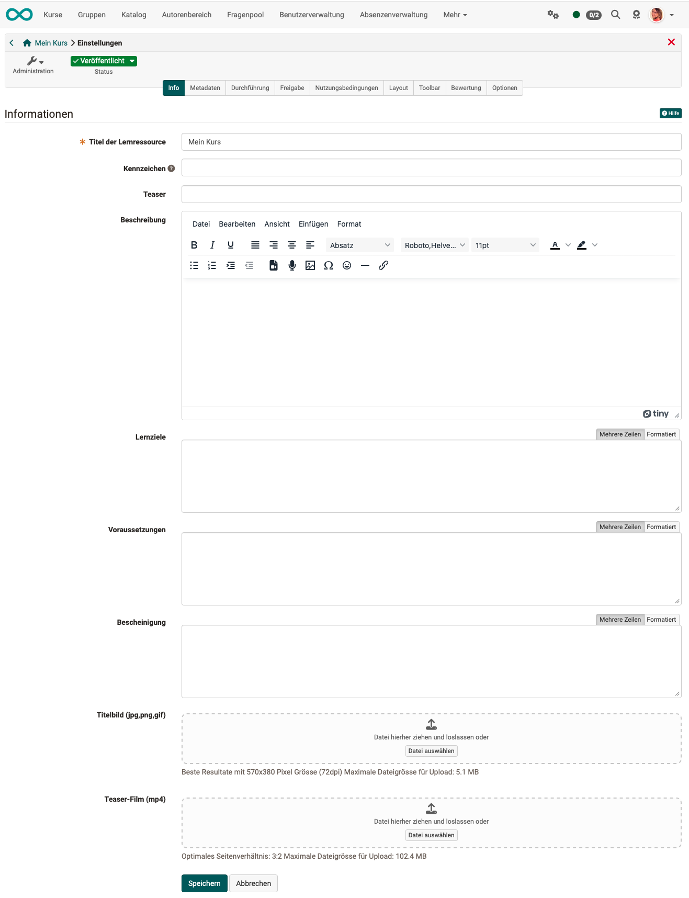

# Kurseinstellungen - Tab Info {: #tab_info}

Jede Lernressource verfügt über eine [Infoseite](../learningresources/Info_page.de.md). Diese kann von den Besitzer:innen der Lernressource inhaltlich gefüllt werden und steht Interessierten nach Veröffentlichung der Lernressource, unabhängig von einer Buchung, bereits vor Betreten der Lernressource zur Verfügung. Das ist z.B. sinnvoll, wenn man die Zielgruppe bereits im Vorfeld informieren möchte.

## Infoseite einrichten {: #configure_info}

Die Einrichtung der [Infoseite](../learningresources/Info_page.de.md) erfolgt im Bereich "Einstellungen" des Menüs "Administration". Besonders die Tabs "Info", "Metadaten" und "Durchführung" sind hierfür relevant. Je ausführlicher Sie die Lernressource beschreiben, umso einfacher kann diese gefunden und desto besser sind Interessierte und spätere Teilnehmer:innen informiert.

(Der Screenshot zeigt die "Einstellungen" eines Kurses. Je nach Lernressource steht nur ein Teil der Tabs zur Verfügung.)

{ class="shadow lightbox" }

**Titel der Lernressource:** Ein Pflichtfeld.
Über diesen Titel (maximal 100 Zeichen) kann die Lernressource auch in der Suchmaske gefunden werden. Geben Sie hier einen möglichst kurzen und präzisen Titel für die Lernressource ein.

**Kennzeichen:** Eine externe Kennung für die Ressource, z.B. die Bezeichnung aus dem Vorlesungsverzeichnis oder eines gedruckten Kurskataloges.

**Teaser:** Text der auf der Kursinfo Seite unterhalb des Titels erscheint und auch in der Darstellung im Menü "Kurse" direkt angezeigt werden kann.

**Beschreibung:** Hier können Sie weitere Informationen zur Lernressource bereitstellen und die Dinge erwähnen, die für die Lernressource wichtig sind.

Geben Sie die **Lernziele** und **Voraussetzungen** Ihres Kurses an, damit Interessierte mehr darüber erfahren.

**Bescheinigung**: Hier können Sie erläutern ob bzw. welche Bescheinigung die Teilnehmer:innen nach der Bearbeitung des Kurses bzw. der Lernressource erhalten und welche Anforderungen damit verknüpft sind.

Ein **Titelbild** (jpg/png-Format) oder ein kleines Video als **Teaser-Film** im mp4 Format runden die Beschreibung ab. Das Bild wird im Katalog und der Infoseite angezeigt. Achten Sie dabei auf die angezeigten technischen Vorgaben und die Upload Grenzen.

Sie sollten unbedingt ein Titelbild oder einen Teaser-Film einstellen. Dadurch gewinnt die Beschreibung deutlich an Attraktivität. Achten Sie bei Bildern darauf, keine Texte oder nur kurze Schlagworte darzustellen und eine zum Kurs bzw. zur Lernressource passende Visualisierung zu verwenden.

---

## Weiterführende Informationen  {: #further_information}

[Weitere Details zur Infoseite > ](../learningresources/Info_page.de.de.md) 
[Zum Seitenanfang ^](#tab_info)

