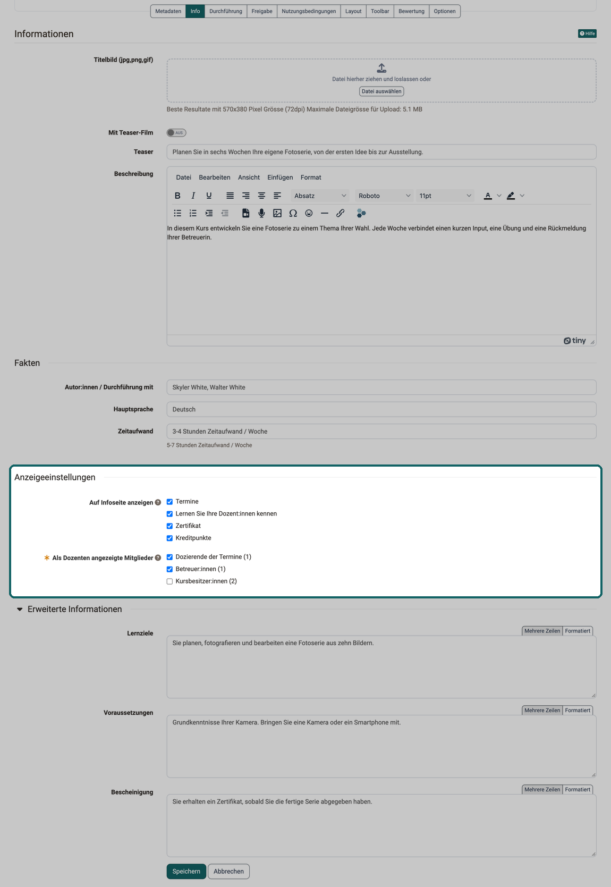

# Kurseinstellungen - Tab Info {: #tab_info}

Jede Lernressource verfügt über eine [Infoseite](../learningresources/General_Functions_Infopage.de.md). Diese kann von den Besitzer:innen der Lernressource inhaltlich gefüllt werden und steht Interessierten nach Veröffentlichung der Lernressource, unabhängig von einer Buchung, bereits vor Betreten der Lernressource zur Verfügung. Das ist z.B. sinnvoll, wenn man die Zielgruppe bereits im Vorfeld informieren möchte. 
Die Angaben in der Kursadministration im Tab "Info" sind die wesentlichen Bestandteile der Infoseite. Weitere Angaben der Infoseite kommen dann noch aus den Tabs "Metadaten" und "Durchführung" oder werden automatisch generiert. 

## Infoseite einrichten {: #configure_info}

Die Einrichtung der [Infoseite](../learningresources/General_Functions_Infopage.de.md) erfolgt unter `Kurs > Administration > Einstellungen` in den Tabs "Metadaten", "Info" und "Durchführung". Je ausführlicher Sie die Lernressource beschreiben, umso einfacher kann diese gefunden und desto besser sind Interessierte und spätere Teilnehmer:innen informiert.

Den **Titel** (Pflichtfeld, höchstens 100 Zeichen) und das **Kennzeichen**, z.B. die Bezeichnung aus dem Vorlesungsverzeichnis oder eines gedruckten Kurskataloges, legen Sie im [Tab "Metadaten"](../learningresources/Course_Settings_Metadata.de.md) fest.

Je nach Lernressource steht nur ein Teil der Tabs zur Verfügung.

{ class="shadow lightbox" title="Tab Info der Kurseinstellungen · 2026.10.09" }

Der Tab "Info" ist in vier Teile gegliedert, in dieser Reihenfolge: "Informationen" mit Titelbild, Teaser-Film, Teaser und Beschreibung, danach die Abschnitte "Fakten", "Anzeigeeinstellungen" und "Erweiterte Informationen". Die Anzeigeeinstellungen und die erweiterten Informationen gibt es nur bei Kursen. Bei anderen Lernressourcen, etwa einem Test oder einem Wiki, zeigt der Tab nur "Informationen" und "Fakten".

!!! info "Wichtig"

    Gehört der Kurs zu genau einer Durchführung vom Typ Einzelkurs im Course Planner, zeigt der Kurs unter "Infoseite" die Infos dieser Durchführung. Die Angaben aus dem Tab "Info" des Kurses erscheinen dann dort nicht. Pflegen Sie die Angaben in den Einstellungen der Durchführung, siehe [Course Planner: Durchführungen](../area_modules/Course_Planner_Implementations.de.md#tab_settings_infos).

Wird die Lernressource von einem externen System verwaltet, pflegt dieses System die Angaben, und einzelne Felder sind gesperrt. Je nach Umfang der Verwaltung fehlen auch die Felder für Titelbild und Teaser-Film, und der Button "Speichern" erscheint nicht. Änderungen laufen dann über die Stelle, die das verwaltende System betreut.

Liegt die Lernressource im Papierkorb, zeigt der Tab alle Angaben nur zum Lesen und ohne Button "Speichern". Nach dem [Wiederherstellen](../learningresources/Course_Delete.de.md) lassen sie sich wieder bearbeiten.

### Informationen {: #information}

Titelbild, Teaser und Beschreibung sind das Erste, was Interessierte auf der Infoseite lesen und sehen.

#### Titelbild (jpg,png,gif) {: #cover_image}

Das Titelbild wird im Katalog und auf der Infoseite angezeigt. Erlaubt sind die Formate jpg, png und gif bis 5 MB. Die besten Resultate erzielen Sie mit 570 × 380 Pixel bei 72 dpi, so steht es auch unter dem Feld. Sobald ein Bild gesetzt ist, verschwindet die Fläche "Datei hierher ziehen und loslassen oder" mit dem Button "Datei auswählen". Das Feld zeigt dann das Bild mit dem Button "Löschen".

Sie sollten unbedingt ein Titelbild oder einen Teaser-Film einstellen. Dadurch gewinnt die Beschreibung deutlich an Attraktivität. Achten Sie bei Bildern darauf, keine Texte oder nur kurze Schlagworte darzustellen und eine zum Kurs bzw. zur Lernressource passende Visualisierung zu verwenden.

#### Mit Teaser-Film {: #with_teaser_movie}

Ein kleines Video im mp4-Format rundet die Beschreibung ab. Der Schalter "Mit Teaser-Film" blendet das Feld "Teaser-Film (mp4)" ein. Der Film darf höchstens 100 MB gross sein, das optimale Seitenverhältnis ist 3:2. Ist noch kein Film hinterlegt, steht der Schalter auf "Aus". Wie beim Titelbild verschwindet die Fläche zum Hochladen, sobald ein Film hinterlegt ist.

#### Teaser {: #teaser}

Text, der auf der Infoseite unterhalb des Titels erscheint und auch in der Darstellung im Menü "Kurse" direkt angezeigt werden kann. Der Teaser hat höchstens 150 Zeichen.

#### Beschreibung {: #description}

Hier können Sie weitere Informationen zur Lernressource bereitstellen und die Dinge erwähnen, die für die Lernressource wichtig sind.

### Fakten [:octicons-tag-16:{ title="ab Release 21.1 (OO-9775)" }](https://track.frentix.com/issue/OO-9775){:target="_blank"} {: #facts}

Die Angaben dieses Abschnitts erscheinen auf der Infoseite unter "Fakten". Dort stehen sie zusammen mit Angaben aus anderen Tabs, etwa dem Durchführungszeitraum aus dem Tab "Durchführung".

#### Autor:innen / Durchführung mit {: #authors}

Ein freies Textfeld für die Namen der Personen, die den Kurs verantworten oder durchführen. Das Feld ist unabhängig von der Auswahl unter "Als Dozenten angezeigte Mitglieder" in den Anzeigeeinstellungen: Hier schreiben Sie Namen von Hand, dort wählen Sie Rollen aus den Mitgliedern des Kurses.

#### Hauptsprache {: #main_language}

Die Sprache, in der der Kurs hauptsächlich stattfindet.

#### Zeitaufwand {: #expenditure_of_work}

Der Aufwand, mit dem Teilnehmer:innen rechnen müssen. Das Beispiel unter dem Feld zeigt die übliche Form: "5-7 Stunden Zeitaufwand / Woche".

### Anzeigeeinstellungen [:octicons-tag-16:{ title="ab Release 21.1 (OO-9756)" }](https://track.frentix.com/issue/OO-9756){:target="_blank"} {: #display_settings}

Mit den Anzeigeeinstellungen bestimmen Sie, welche Abschnitte die Infoseite Ihres Kurses zeigt und wer dort als Dozent:in erscheint. So zeigt die Infoseite genau das, was Interessierte für ihre Entscheidung brauchen.

Ein neu erstellter Kurs startet mit den Standardwerten, die Administrator:innen im [Modul Kurs](../../manual_admin/administration/Modules_Course.de.md#default_settings) festlegen. Eine Kopie übernimmt die Anzeigeeinstellungen des Originals. Die Standardwerte im [Modul Course Planner](../../manual_admin/administration/Modules_Course_Planner.de.md#default_settings) gelten nur für Durchführungen, nicht für Kurse. Durchführungen im Course Planner haben dieselben Anzeigeeinstellungen, die Unterschiede beschreibt [Course Planner: Durchführungen](../area_modules/Course_Planner_Implementations.de.md#tab_settings_infos).

#### Auf Infoseite anzeigen {: #display_on_info_page}

Jede gewählte Option blendet auf der Infoseite einen Abschnitt oder eine Angabe ein:

- **Termine**: die Termine des Kurses. Die Option steht zur Wahl, wenn die [Termin- und Absenzenverwaltung](../learningresources/Course_Settings_Execution.de.md#lecture_enabled) für den Kurs eingeschaltet ist.
- **Lernen Sie Ihre Dozent:innen kennen**: den Abschnitt mit den Personen, die den Kurs unterrichten. Wer dort erscheint, legen Sie unter "Als Dozenten angezeigte Mitglieder" fest.
- **Zertifikat**: unter "Fakten" die Angabe, dass der Kurs ein Zertifikat ausstellt. Die Option steht zur Wahl, wenn im [Tab "Bewertung"](../learningresources/Course_Settings_Assessment.de.md#section_certificate) Zertifikate eingeschaltet sind.
- **Kreditpunkte**: unter "Fakten" die Kreditpunkte, die der Kurs vergibt. Die Option steht zur Wahl, wenn im [Tab "Bewertung"](../learningresources/Course_Settings_Assessment.de.md#section_credit_points) Kreditpunkte eingeschaltet sind.

Wird der Kurs von einem externen System verwaltet, können einzelne Optionen ausgegraut sein. Sie lassen sich dann nur im verwaltenden System ändern.

#### Als Dozenten angezeigte Mitglieder {: #taught_by}

Diese Auswahl erscheint erst, wenn "Lernen Sie Ihre Dozent:innen kennen" gewählt ist. Dann ist mindestens eine Rolle Pflicht: Ohne Auswahl lässt sich das Formular nicht speichern, und unter dem Feld steht "Bitte füllen Sie dieses Feld aus." Wählen Sie "Lernen Sie Ihre Dozent:innen kennen" neu aus, sind die Rollen vorgewählt, die Administrator:innen im Modul Kurs als Standard festlegen.

- **Dozierende der Termine**: die Personen, die in den Terminen des Kurses als Dozent:in eingetragen sind.
- **Betreuer:innen**: die Mitglieder mit der Rolle Betreuer:in.
- **Kursbesitzer:innen**: die Mitglieder mit der Rolle Besitzer:in.

Die Zahl in Klammern nennt, wie viele Personen der Kurs in dieser Rolle hat. Steht dort 0, zeigt die Rolle auf der Infoseite niemanden an. Ohne eingeschaltete Termin- und Absenzenverwaltung steht bei "Dozierende der Termine" immer 0.

Welche Abschnitte die Infoseite insgesamt zeigt und woher ihre Angaben stammen, zeigt die Tabelle unter [Informationen der Infoseite](../learningresources/General_Functions_Infopage.de.md#content).

### Erweiterte Informationen {: #additional_information}

Die Angaben dieses Abschnitts erscheinen auf der Infoseite als eigene Abschnitte. Der Abschnitt ist zugeklappt, bis Sie ihn über seinen Titel aufklappen. OpenOlat merkt sich für jede Person, ob er auf- oder zugeklappt ist.

#### Lernziele {: #objectives}

Was die Teilnehmer:innen nach dem Kurs wissen oder können.

#### Voraussetzungen {: #requirements}

Was Interessierte mitbringen sollten, etwa Vorkenntnisse oder Material. Das Feld fasst höchstens 2000 Zeichen.

#### Bescheinigung {: #credits}

Hier können Sie erläutern ob bzw. welche Bescheinigung die Teilnehmer:innen nach der Bearbeitung des Kurses bzw. der Lernressource erhalten und welche Anforderungen damit verknüpft sind. Das Feld fasst höchstens 2000 Zeichen.

---

## Weiterführende Informationen {: #further_information}

**Auf dieser Seite erwähnt** 
[Allgemeine Funktionen: Infoseite >](../learningresources/General_Functions_Infopage.de.md) 
[Kurseinstellungen - Tab Metadaten >](../learningresources/Course_Settings_Metadata.de.md) 
[Course Planner: Durchführungen >](../area_modules/Course_Planner_Implementations.de.md) 
[Löschen (eines Kurses/einer Lernressource) >](../learningresources/Course_Delete.de.md) 
[Modul Kurs >](../../manual_admin/administration/Modules_Course.de.md) 
[Modul Course Planner >](../../manual_admin/administration/Modules_Course_Planner.de.md) 
[Kurseinstellungen - Tab Durchführung >](../learningresources/Course_Settings_Execution.de.md) 
[Kurseinstellungen - Tab Bewertung >](../learningresources/Course_Settings_Assessment.de.md)

**Weiterführend** 
[Toolbar: Infoseite >](../learningresources/Info_page.de.md) 
[Kurseinstellungen >](../learningresources/Course_Settings.de.md)

[Zum Seitenanfang ^](#tab_info)
