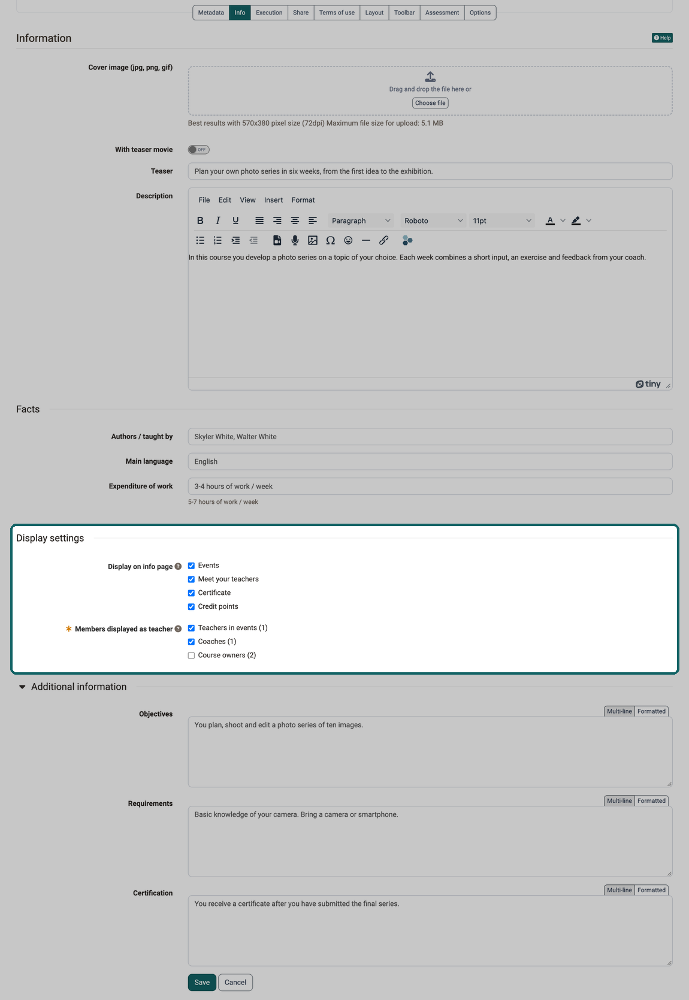

# Course Settings - Tab Info {: #tab_info}

Each learning resource has an [information page](../learningresources/General_Functions_Infopage.md). The owner of the learning resource can fill this page with content, and once the learning resource has been published, it is available to interested parties even before they access the learning resource, regardless of whether they have booked it. This is useful, for example, if you want to inform the target group in advance. 
The information in the course administration in the "Info" tab is the essential content of the info page. Additional information for the info page comes from the "Metadata" and "Execution" tabs or is generated automatically.

## Set up info page {: #configure_info}

The [info page](../learningresources/General_Functions_Infopage.md) is set up under `Course > Administration > Settings` in the tabs "Metadata", "Info" and "Execution". The more detailed you describe the learning resource, the easier it can be found and the better informed interested parties and later participants are.

You define the **Title** (mandatory field, maximum 100 characters) and the **Reference**, for example the name from the course catalog or a printed course catalog, in the ["Metadata" tab](../learningresources/Course_Settings_Metadata.md).

Depending on the learning resource, only some of the tabs are available.

{ class="shadow lightbox" title="Info tab of the course settings · 2026.10.09" }

The "Info" tab is divided into four parts, in this order: "Information" with cover image, teaser movie, teaser and description, followed by the sections "Facts", "Display settings" and "Additional information". The display settings and the additional information only exist for courses. For other learning resources, such as a test or a wiki, the tab only shows "Information" and "Facts".

!!! info "Important"

    If the course belongs to exactly one implementation of type Single course in the Course Planner, the course shows the information of this implementation under "Info page". The details from the "Info" tab of the course then do not appear there. Maintain the details in the settings of the implementation, see [Course Planner: Implementations](../area_modules/Course_Planner_Implementations.md#tab_settings_infos).

If the learning resource is managed by an external system, this system maintains the details, and individual fields are locked. Depending on the scope of the management, the fields for cover image and teaser movie are also missing, and the "Save" button does not appear. Changes then go through the people responsible for the managing system.

If the learning resource is in the trash, the tab shows all details read-only and without the "Save" button. After [restoring](../learningresources/Course_Delete.md) the learning resource, the details can be edited again.

### Information {: #information}

The cover image, teaser and description are the first things interested parties read and see on the info page.

#### Cover image (jpg, png, gif) {: #cover_image}

The cover image is displayed in the catalog and on the info page. The formats jpg, png and gif up to 5 MB are allowed. You get the best results with 570 × 380 pixels at 72 dpi, as also stated below the field. As soon as an image is set, the area "Drag and drop the file here or" with the "Choose file" button disappears. The field then shows the image with the "Delete" button.

You should definitely set a cover image or teaser movie. This makes the description much more attractive. Make sure that you do not display any text or just short keywords and that you use a visualization that matches the course or learning resource.

#### With teaser movie {: #with_teaser_movie}

A small video in mp4 format completes the description. The "With teaser movie" toggle shows the "Teaser movie (mp4)" field. The movie may be at most 100 MB in size, the optimal aspect ratio is 3:2. If no movie has been added yet, the toggle is set to "Off". As with the cover image, the upload area disappears as soon as a movie has been added.

#### Teaser {: #teaser}

Text that appears below the title on the info page and can also be displayed directly in the "Courses" menu. The teaser has a maximum of 150 characters.

#### Description {: #description}

Here you can provide more information about the learning resource and mention the things that are important for the learning resource.

### Facts [:octicons-tag-16:{ title="from Release 21.1 (OO-9775)" }](https://track.frentix.com/issue/OO-9775){:target="_blank"} {: #facts}

The details in this section appear on the info page under "Facts". There they are shown together with details from other tabs, for example the execution period from the "Execution" tab.

#### Authors / taught by {: #authors}

A free text field for the names of the persons who are responsible for the course or run it. The field is independent of the selection under "Members displayed as teacher" in the display settings: here you write names by hand, there you select roles from the members of the course.

#### Main language {: #main_language}

The language in which the course mainly takes place.

#### Expenditure of work {: #expenditure_of_work}

The workload that participants have to expect. The example below the field shows the usual form: "5-7 hours of work / week".

### Display settings [:octicons-tag-16:{ title="from Release 21.1 (OO-9756)" }](https://track.frentix.com/issue/OO-9756){:target="_blank"} {: #display_settings}

With the display settings you determine which sections the info page of your course shows and who appears there as teacher. This way the info page shows exactly what interested parties need for their decision.

A newly created course starts with the default values that administrators define in the [Module Course](../../manual_admin/administration/Modules_Course.md#default_settings). A copy adopts the display settings of the original. The default values in the [Module Course Planner](../../manual_admin/administration/Modules_Course_Planner.md#default_settings) only apply to implementations, not to courses. Implementations in the Course Planner have the same display settings, the differences are described in [Course Planner: Implementations](../area_modules/Course_Planner_Implementations.md#tab_settings_infos).

#### Display on info page {: #display_on_info_page}

Each selected option shows a section or a detail on the info page:

- **Events**: the events of the course. The option is available if the [Event & absence management](../learningresources/Course_Settings_Execution.md#lecture_enabled) is switched on for the course.
- **Meet your teachers**: the section with the persons who teach the course. You define who appears there under "Members displayed as teacher".
- **Certificate**: under "Facts", the information that the course issues a certificate. The option is available if certificates are switched on in the ["Assessment" tab](../learningresources/Course_Settings_Assessment.md#section_certificate).
- **Credit points**: under "Facts", the credit points the course awards. The option is available if credit points are switched on in the ["Assessment" tab](../learningresources/Course_Settings_Assessment.md#section_credit_points).

If the course is managed by an external system, individual options can be greyed out. They can then only be changed in the managing system.

#### Members displayed as teacher {: #taught_by}

This selection only appears once "Meet your teachers" is selected. At least one role is then mandatory: without a selection the form cannot be saved, and "Please fill in this field." appears below the field. If you select "Meet your teachers" again, the roles that administrators define as default in the Module Course are preselected.

- **Teachers in events**: the persons who are entered as teachers in the events of the course.
- **Coaches**: the members with the role coach.
- **Course owners**: the members with the role owner.

The number in brackets states how many persons the course has in this role. If it shows 0, the role shows nobody on the info page. Without Event & absence management switched on, "Teachers in events" always shows 0.

Which sections the info page shows overall and where their details come from is shown in the table under [Content of the info page](../learningresources/General_Functions_Infopage.md#content).

### Additional information {: #additional_information}

The details in this section appear on the info page as separate sections. The section is collapsed until you expand it via its title. OpenOlat remembers for each person whether it is expanded or collapsed.

#### Objectives {: #objectives}

What the participants know or can do after the course.

#### Requirements {: #requirements}

What interested parties should bring along, for example prior knowledge or material. The field holds a maximum of 2000 characters.

#### Certification {: #credits}

Here you can explain whether or which certification the participants receive after completing the course or learning resource and which requirements are linked to it. The field holds a maximum of 2000 characters.

---

## Further information {: #further_information}

**Mentioned on this page** 
[General Functions: Info Page >](../learningresources/General_Functions_Infopage.md) 
[Course Settings - Tab Metadata >](../learningresources/Course_Settings_Metadata.md) 
[Course Planner: Implementations >](../area_modules/Course_Planner_Implementations.md) 
[Delete (a course or learning resource) >](../learningresources/Course_Delete.md) 
[Module Course >](../../manual_admin/administration/Modules_Course.md) 
[Module Course Planner >](../../manual_admin/administration/Modules_Course_Planner.md) 
[Course Settings - Tab Execution >](../learningresources/Course_Settings_Execution.md) 
[Course Settings - Tab Assessment >](../learningresources/Course_Settings_Assessment.md)

**Further reading** 
[Toolbar: Info page >](../learningresources/Info_page.md) 
[Course Settings >](../learningresources/Course_Settings.md)

[To the top of the page ^](#tab_info)
