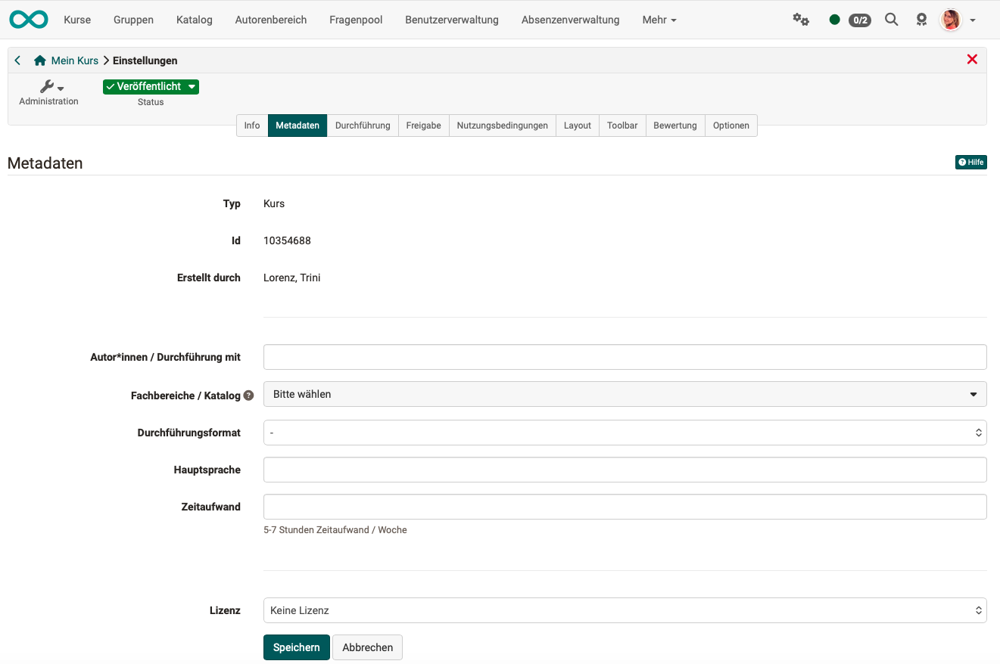
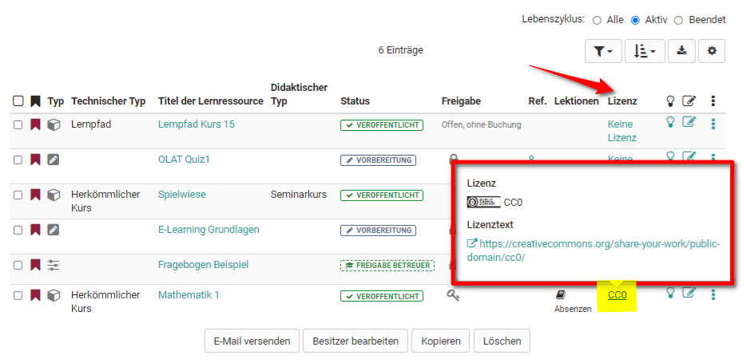

# Kurseinstellungen - Tab Metadaten {: #tab_metadata}

Im Reiter "Metadaten" nehmen Sie weitere Einstellungen für die Infoseite vor.

{ class="shadow lightbox" }

**Autor:innen/Durchführung mit**: Hier können die zuständigen Ansprechpartner oder Lehrenden eingetragen werden. Sie müssen nicht mit dem Ersteller der Lernressource übereinstimmen. Das Feld ist ein reines Textfeld, der Inhalt wird lediglich auf der Kursübersichtsseite angezeigt.

**Fachbereiche/Katalog**: Sofern Taxonomien definiert sind, können hier passende Fachbereiche ausgewählt werden. Die Fachbereiche werden auch für die Einordnung im Katalog verwendet. Siehe dazu [Katalog 2.0](../area_modules/catalog2.0.de.md).

**Durchführungsformat**: Kurse können hier einer der ausgewählten Formate zugeordnet werden. Die Zuordnung hat aber keinerlei Auswirkung auf die wirkliche Ausgestaltung des Kurses. Auch können die Begriffe von unterschiedlichen Autoren verschieden verwendet werden.

**Hauptsprache**: Tragen Sie die Sprache ein, in der die Lernressource erstellt wurde bzw. die Sprache in der der Kurs, Test o.ä. durchgeführt wird. Es wird keine Selektion von Kursen anhand der Benutzersprache und dieses Feldes durchgeführt.

Auch der **Zeitaufwand** für die Lernressource kann hier eingetragen werden.

**Lizenz**: Wählen Sie im Drop-Down Menü aus unter welcher Lizenz die Lernressource stehen soll. Die Grundeinstellung ist "Keine Lizenz", weitere Einstellungen der Creative Commons können hier ebenfalls verwendet werden. Welche Lizenzen genau eingestellt werden können definiert der Admin in den allgemeinen OpenOlat Einstellungen.

Typische Lizenzen sind

* YouTube Lizenz
* All rights reserved
* CC BY-NC-ND
* CC BY-NC-SA
* CC-BY-NC
* CC-BY-ND
* CC BY-SA
* CC BY
* CC0
* Public domain
* Keine Lizenz

In der Übersicht des Autorenbereichs werden die zugeordneten Lizenzen in der Spalte "Lizenz" angezeigt. Mit Klick auf die Lizenz erhalten Sie dazu detaillierte Informationen.

Was sich genau hinter welcher Lizenz verbirgt können Sie [hier](https://creativecommons.org/licenses/?lang=de)nachlesen. Ergänzend zur Lizenz kann auch der **Lizenzgeber** eingetragen werden.

!!! note "Wichtig"

    Überlegen Sie sich genau unter welche Lizenz Sie einen Kurs oder eine andere Lernressource stellen wollen. Wenn Sie verstärkt OER (open educational resources) erstellen wollen, sind die Creative Commons Lizenzen ein passender Ansatz. Beachten Sie aber für alle verwendeten Materialien unbedingt das Urheberrecht, damit Ihre Angaben korrekt sind.

---

## Weiterführende Informationen  {: #further_information}

[Weitere Details zur Taxonomie > ](../../manual_admin/administration/Modules_Taxonomy.de.md) 
[Weitere Details zur Infoseite > ](../learningresources/Info_page.de.md) 
[Zum Seitenanfang ^](#tab_metadata)