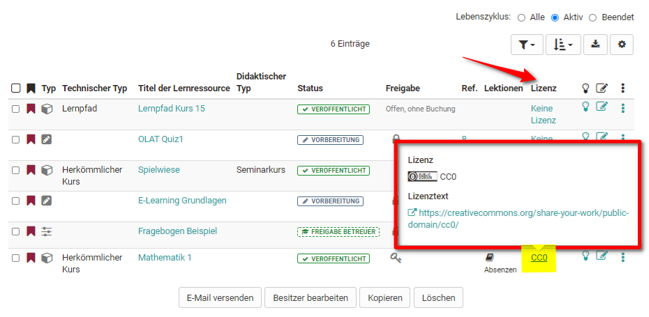

# Kurseinstellungen - Tab Metadaten {: #tab_metadata}

Im Tab "Metadaten" legen Sie fest, wie die Lernressource heisst und wie sie eingeordnet wird. Mit diesen Angaben finden Interessierte die Lernressource in Listen, im Katalog und in der Suche.

Der Tab "Metadaten" beschreibt, was die Lernressource ist. Der [Tab "Info"](../learningresources/Course_Settings_Info.de.md) beschreibt, wie sie sich Interessierten auf der Infoseite zeigt. Wer den Kurs finden lassen will, arbeitet an den Metadaten, wer ihn erklären will, an der Info.

Der Tab "Metadaten" ist der erste Tab der Einstellungen: 
`Kurs > Administration > Einstellungen > Tab "Metadaten"`

Nach dem Erstellen, Kopieren oder Importieren einer Lernressource öffnet OpenOlat die Einstellungen direkt auf diesem Tab. So prüfen Sie Titel und Kennzeichen gleich zu Beginn. Bearbeiten können den Tab Besitzer:innen der Lernressource, Lernressourcenverwalter:innen und Administrator:innen, bei Kursen ausserdem Personen, denen in der [Mitgliederverwaltung](../learningresources/Members_management.de.md) das Recht "Kurseditor" erteilt wurde.

Jede Lernressource hat diesen Tab. Einzelne Felder gibt es nur bei Kursen oder nur, wenn die System-Administration ein Modul eingeschaltet hat. Das steht beim jeweiligen Feld.

#### Titel [:octicons-tag-16:{ title="ab Release 21.1 (OO-9775)" }](https://track.frentix.com/issue/OO-9775){:target="_blank"} {: #title}

Unter dem Titel erscheint die Lernressource in Listen, im Katalog und in der Suche. Wählen Sie ihn kurz und eindeutig, damit Interessierte die Lernressource wiedererkennen. Der Titel ist ein Pflichtfeld mit höchstens 100 Zeichen. In den Dialogen zum Importieren und Kopieren heisst dasselbe Feld "Titel der Lernressource". Verwaltet ein externes System den Titel, ist das Feld gesperrt.

#### Kennzeichen {: #externalref}

Das Kennzeichen ist eine Kennung, die Sie selbst vergeben, zum Beispiel die Bezeichnung aus dem Vorlesungsverzeichnis oder aus einem gedruckten Kurskatalog. Die Id dagegen vergibt OpenOlat automatisch. Das Kennzeichen erscheint in der Kursübersicht, und die Liste im Autorenbereich führt es als eigene Spalte, nach der Sie sortieren können. Der Import in den Course Planner erkennt Kurse und Templates an ihrem Kennzeichen, siehe [Course Planner: Import / Export](../area_modules/Course_Planner_Import_Export.de.md#identifier_matching).

Wird die Lernressource von einem externen System verwaltet, steht das Kennzeichen als Text da und lässt sich nicht ändern.

#### Typ {: #type}

Die Art der Lernressource, zum Beispiel Kurs oder Test. Der Typ ist mit dem Erstellen festgelegt und lässt sich nicht ändern.

Neben dem Typ öffnet ein Button das Fenster "Über diesen Kurs" mit technischen Angaben wie der Id, der Ersteller:in und den Besitzer:innen. Bei anderen Lernressourcen heisst der Button nach deren Typ, zum Beispiel "Über diesen Test". Mehr dazu unter [Über diesen Kurs](../learningresources/Info_page.de.md#about) [:octicons-tag-16:{ title="ab Release 21.1 (OO-9760)" }](https://track.frentix.com/issue/OO-9760){:target="_blank"}.

#### Durchführungsformat {: #educational_type}

Ordnet einen Kurs einem Format zu, zum Beispiel Blended Learning oder Selbststudium. Das Format dient der Einordnung, etwa als Filter im Autorenbereich, und ändert nichts am Aufbau des Kurses. Welche Formate zur Wahl stehen, legt die System-Administration im [Modul Kurs](../../manual_admin/administration/Modules_Course.de.md#implementation_formats) fest. Das Feld gibt es nur bei Kursen.

#### Fachbereiche {: #taxonomy_levels}

Mit den Fachbereichen ordnen Sie die Lernressource thematisch ein. Ist der [Katalog](../area_modules/catalog2.0.de.md) eingeschaltet, heisst das Feld "Fachbereiche / Katalog": Die Fachbereiche bestimmen dann auch, in welcher Microsite des Katalogs die Lernressource erscheint.

Das Feld erscheint, wenn die System-Administration das [Modul Taxonomie](../../manual_admin/administration/Modules_Taxonomy.de.md) eingeschaltet und unter `Administration > Module > Lernressource` mindestens eine Taxonomie ausgewählt hat, siehe [Modul Lernressource](../../manual_admin/administration/Modules_Learning_Resource.de.md#tab_settings).

#### Lizenz {: #license}

Mit der Lizenz legen Sie fest, wie andere die Lernressource nutzen dürfen. Das Feld erscheint, wenn die System-Administration Lizenzen für Lernressourcen eingeschaltet hat, unter `Administration > Core-Konfiguration > Lizenzen`. Dort legt sie auch fest, welche Lizenzen zur Wahl stehen und welche bei einer neuen Lernressource vorausgewählt ist, siehe [Lizenzen](../../manual_admin/administration/Licenses.de.md#licences_initial).

OpenOlat bringt diese Lizenzen mit:

* CC0, CC BY, CC BY-SA, CC BY-ND, CC BY-NC, CC BY-NC-SA und CC BY-NC-ND
* Public domain
* All rights reserved
* YouTube Lizenz
* Freitext
* Keine Lizenz

Was hinter den Creative-Commons-Lizenzen steht, erklärt [creativecommons.org](https://creativecommons.org/licenses/?lang=de){:target="_blank"}.

Sobald eine Lizenz gewählt ist, erscheint das Feld "Lizenzgeber" für die Person oder Organisation, welche die Lizenz vergibt. Mit "Freitext" erscheint zusätzlich das Feld "Lizenztext" für eine eigene Lizenzbeschreibung. Enthält die Lernressource Elemente mit eigener Lizenz, listet OpenOlat diese unter "Details Element-Lizenzen" auf. Wählen Sie dann für die Lernressource eine Lizenz, die mindestens so restriktiv ist wie die Lizenzen der Elemente.

In der Liste des Autorenbereichs zeigt die Spalte "Lizenz" die Lizenz jeder Lernressource. Die Spalte ist ausgeblendet, bis Sie sie über "Spalten auswählen" einblenden. Ein Klick auf den Namen der Lizenz zeigt die Lizenz und den Link zum Lizenztext.

{ class="shadow lightbox" title="Liste der Lernressourcen im Autorenbereich" }

!!! tip "Tipp"

    Überlegen Sie sich genau, unter welche Lizenz Sie einen Kurs oder eine andere Lernressource stellen wollen. Wenn Sie verstärkt OER (Open Educational Resources) erstellen wollen, sind die Creative-Commons-Lizenzen ein passender Ansatz. Beachten Sie aber für alle verwendeten Materialien unbedingt das Urheberrecht, damit Ihre Angaben korrekt sind.

---

## Weiterführende Informationen {: #further_information}

**Auf dieser Seite erwähnt** 
[Kurseinstellungen - Tab Info >](../learningresources/Course_Settings_Info.de.md) 
[Mitgliederverwaltung >](../learningresources/Members_management.de.md) 
[Course Planner: Import / Export >](../area_modules/Course_Planner_Import_Export.de.md) 
[Toolbar: Infoseite >](../learningresources/Info_page.de.md) 
[Modul Kurs >](../../manual_admin/administration/Modules_Course.de.md) 
[Katalog 2.0: Übersicht >](../area_modules/catalog2.0.de.md) 
[Modul Taxonomie >](../../manual_admin/administration/Modules_Taxonomy.de.md) 
[Modul Lernressource >](../../manual_admin/administration/Modules_Learning_Resource.de.md) 
[Lizenzen >](../../manual_admin/administration/Licenses.de.md) 
[Creative Commons Lizenzen >](https://creativecommons.org/licenses/?lang=de)

**Weiterführend** 
[Kurseinstellungen >](../learningresources/Course_Settings.de.md) 
[Allgemeine Funktionen: Infoseite >](../learningresources/General_Functions_Infopage.de.md)

[Zum Seitenanfang ^](#tab_metadata)
