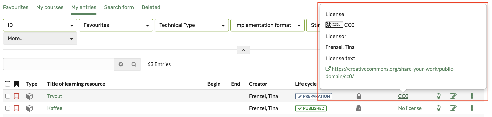

# Course Settings - Tab Metadata {: #tab_metadata}

In the "Metadata" tab you can make further settings for the info page.

 **Authors**:  Here you can enter the responsible contact persons or
lecturers. They do not have to match the creator of the learning resource. The
field is a plain text field, the content is only displayed on the course
overview page.  

 **Subjects**: If defined, suitable subject areas can be selected here. The subject areas are also used for classification in the catalog. Look further here [Catalog 2.0](../area_modules/catalog2.0.md).

 **Implementation format**: Courses can be assigned to one of the selected
format here. However, the assignment has no effect on the actual design of
the course. Also, the terms can be used differently by different authors. 

 **Main language**: Enter the language in which the learning resource was
created or the language in which the course, test, etc. will be conducted.
There is no selection of courses based on the user language and this field.

The **time required** for the learning resource can also be entered here.

 **License** : Select in the drop down menu under which license the learning resource should be. The
default setting is "All rights reserved", further settings of the Creative
Commons can also be used here. The administrator defines which licenses can be
set in the general OLAT settings.

Typical license are

  * CC BY-NC-ND
  * CC BY-NC-SA
  * CC-BY-NC
  * CC BY-SA
  * CC BY
  * CC0

In the overview of the authoring area, the assigned licenses are displayed in the "License" column. Click on the license to get detailed information about it.

What exactly hides behind which license you can read [here](https://creativecommons.org/licenses/). In addition to the license, the  **licensor**  can also be registered.

Important: Think carefully about which license you want to use for a course or
other learning resource. If you want to create more OER (open educational
resources), the Creative Commons licenses are a suitable approach. But be sure
to respect the copyright for all materials used so that your information is
correct.
