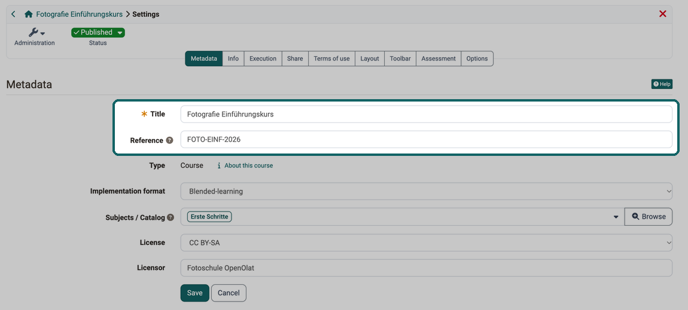
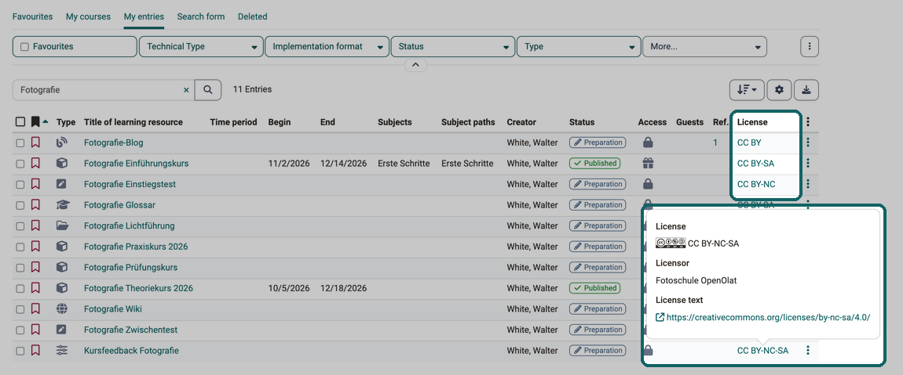

# Course Settings - Tab Metadata {: #tab_metadata}

In the "Metadata" tab you define what the learning resource is called and how it is classified. With these details, interested parties find the learning resource in lists, in the catalog and in the search.

The "Metadata" tab describes what the learning resource is. The ["Info" tab](../learningresources/Course_Settings_Info.md) describes how it presents itself to interested parties on the info page. If you want people to find the course, you work on the metadata; if you want to explain it, you work on the info.

The "Metadata" tab is the first tab of the settings: 
`Course > Administration > Settings > Tab "Metadata"`

{ class="shadow lightbox" title="Metadata tab of the course settings · 2026.10.09" }

After creating, copying or importing a learning resource, OpenOlat opens the settings directly on this tab. This way you check the title and reference right at the start. The tab can be edited by owners of the learning resource, learning resource managers and administrators, and for courses also by persons who have been granted the "Course editor" right in the [Members management](../learningresources/Members_management.md).

Every learning resource has this tab. Some fields only exist for courses or only if the system administration has switched on a module. This is stated for each field.

#### Title [:octicons-tag-16:{ title="from Release 21.1 (OO-9775)" }](https://track.frentix.com/issue/OO-9775){:target="_blank"} {: #title}

The learning resource appears under its title in lists, in the catalog and in the search. Choose a short and unique title so that interested parties recognize the learning resource. The title is a mandatory field with a maximum of 100 characters. In the dialogs for importing and copying, the same field is called "Title of learning resource". If an external system manages the title, the field is locked.

#### Reference {: #externalref}

The reference is an identifier that you assign yourself, for example the designation from the university course directory or from a printed course catalog. The ID, in contrast, is assigned automatically by OpenOlat. The reference appears in the course overview, and the list in Authoring shows it as a separate column that you can sort by. The import into the Course Planner recognizes courses and templates by their reference, see [Course Planner: Import / Export](../area_modules/Course_Planner_Import_Export.md#identifier_matching).

If the learning resource is managed by an external system, the reference is shown as text and cannot be changed.

#### Type {: #type}

The kind of learning resource, for example course or test. The type is fixed when the learning resource is created and cannot be changed.

Next to the type, a button opens the window "About this course" with technical details such as the ID, the creator and the owners. For other learning resources, the button is named after their type, for example "About this test". More about this under [About this course](../learningresources/Info_page.md#about) [:octicons-tag-16:{ title="from Release 21.1 (OO-9760)" }](https://track.frentix.com/issue/OO-9760){:target="_blank"}.

#### Implementation format {: #educational_type}

Assigns a course to a format, for example Blended-learning or Self-study. The format serves for classification, for example as a filter in Authoring, and does not change the structure of the course. The system administration defines which formats are available in the [Module Course](../../manual_admin/administration/Modules_Course.md#implementation_formats). The field only exists for courses.

#### Subjects {: #taxonomy_levels}

With the subjects you classify the learning resource by topic. If the [catalog](../area_modules/catalog2.0.md) is switched on, the field is called "Subjects / Catalog". The subjects then also determine in which microsite of the catalog the learning resource appears.

The field appears if the system administration has switched on the [Module Taxonomy](../../manual_admin/administration/Modules_Taxonomy.md) and selected at least one taxonomy under `Administration > Modules > Learning resource`, see [Module Learning resource](../../manual_admin/administration/Modules_Learning_Resource.md#tab_settings).

#### License {: #license}

With the license you define how others may use the learning resource. The field appears if the system administration has switched on licenses for learning resources, under `Administration > Core functions > Licenses`. There it also defines which licenses are available and which one is preselected for a new learning resource, see [Licenses](../../manual_admin/administration/Licenses.md#licences_initial).

OpenOlat comes with these licenses:

* CC0, CC BY, CC BY-SA, CC BY-ND, CC BY-NC, CC BY-NC-SA and CC BY-NC-ND
* Public domain
* All rights reserved
* YouTube license
* Free text
* No license

What lies behind the Creative Commons licenses is explained at [creativecommons.org](https://creativecommons.org/licenses/){:target="_blank"}.

As soon as a license other than "No license" is selected, the field "Licensor" appears for the person or organisation that grants the license. With "Free text", the field "License text" also appears for your own license description. If the learning resource contains items with their own license, OpenOlat lists them under "Items license details". Then select a license for the learning resource that is at least as restrictive as the licenses of the items.

In the list in Authoring, the "License" column shows the license of each learning resource. The column is hidden until you show it via "Displayed columns". A click on the name of the license opens a window with the license, the licensor and the license text, shown as a link for Creative Commons licenses.

{ class="shadow lightbox" title="My entries tab in Authoring · 2026.10.09" }

!!! tip "Tip"

    Think carefully about which license you want to use for a course or other learning resource. If you want to create more OER (Open Educational Resources), the Creative Commons licenses are a suitable approach. But be sure to respect the copyright for all materials used so that your information is correct.

---

## Further information {: #further_information}

**Mentioned on this page** 
[Course Settings - Tab Info >](../learningresources/Course_Settings_Info.md) 
[Members management >](../learningresources/Members_management.md) 
[Course Planner: Import / Export >](../area_modules/Course_Planner_Import_Export.md) 
[Toolbar: Info page >](../learningresources/Info_page.md) 
[Module Course >](../../manual_admin/administration/Modules_Course.md) 
[Catalog 2.0: Overview >](../area_modules/catalog2.0.md) 
[Module Taxonomy >](../../manual_admin/administration/Modules_Taxonomy.md) 
[Module Learning resource >](../../manual_admin/administration/Modules_Learning_Resource.md) 
[Licenses >](../../manual_admin/administration/Licenses.md) 
[Creative Commons licenses >](https://creativecommons.org/licenses/)

**Further reading** 
[Course Settings >](../learningresources/Course_Settings.md) 
[General Functions: Info Page >](../learningresources/General_Functions_Infopage.md)

[To the top of the page ^](#tab_metadata)
