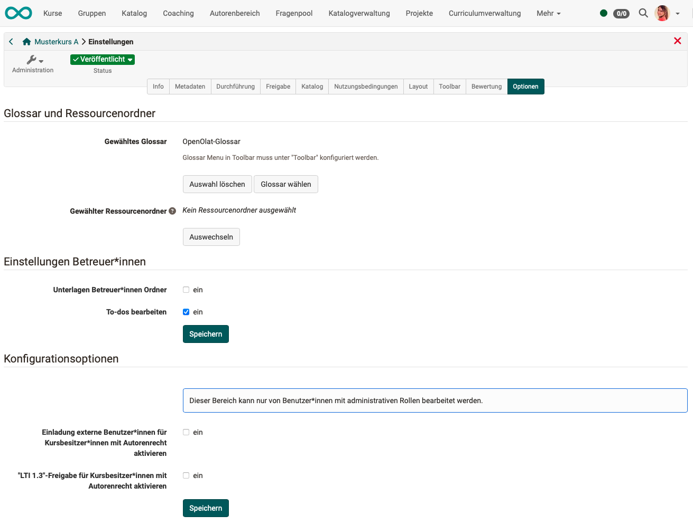
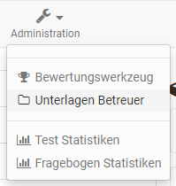

# Kurseinstellungen - Tab Optionen {: #course_settings_options}

Unter **Administration > Einstellungen > Optionen** können Sie

* ein kurspezifisches [Glossar](../learningresources/Using_Additional_Course_Features.de.md) 
* einen [Ressourcenordner](../learningresources/index.de.md) 
* und einen speziellen Ordner für Betreuer:innen

einrichten, sowie (mit entsprechender Berechtigung) ein paar spezielle Konfigurationen aktivieren. 

{ class="shadow lightbox" }

## Glossar einbinden

Sie können hier entweder eine Verbindung zu einem bereits erstellten Glossar herstellen oder im erscheinenden Menü ein neues Glossar erstellen.  Sobald ein Glossar gewählt wurde, kann es auch im Tab "Toolbar" aktiviert werden.

[Zum Seitenanfang ^](#course_settings)

## Ressourcenordner einbinden

Sie können hier entweder eine Verbindung zu einer bereits erstellten Lernressource "Ressourcenordner" herstellen oder im erscheinenden Menü einen neuen Ressourcenordner erstellen. Die Dateien des Ressourcenordners erscheinen anschließend im Ablageordner des Kurses im automatisch erstellten Unterordner "_sharedfolder“.

Standardmässig sind die Dateien des Ressourcenordners im Kurs schreibgeschützt und eine Bearbeitung nur direkt in der Lernressource, nicht aber im Ablageordner des Kurses oder bei der Einbindung über Einzelseiten im Kurseditor möglich. Soll eine Bearbeitung aber auch im Kurs möglich sein, muss in den Optionen der Kurseinstellungen der Haken bei "Schreibgeschützt" entfernt werden.

Weitere Informationen und eine Schritt-für-Schritt-Anleitung zur Einbindung eines Ressourcenorders finden Sie im Bereich [How to](../../manual_how-to/multiple_use/multiple_use.de.md).

**Beachten Sie:**  Sie können lediglich _einen_ Ressourcenordner pro Kurs einbinden. Überlegen Sie deshalb im Vorfeld genau, welche Dateien Sie über einen kursübergreifenden Ressourcenordner statt des kursbezogenen Ablageordners organisieren möchten.

[Zum Seitenanfang ^](#course_settings)

## Einstellungen Betreuer:innen

Im Menü "Optionen" kann ein kursweiter **Ordner für die Betreuer:innen** des Kurses aktiviert werden. In diesem Ordner können dann alle Kursbetreuer:innen Dokumente ablegen, anschauen, bearbeiten oder löschen. Auch die Erstellung von Unterordnern ist im eingerichteten Bereich möglich.

Als Ort für den Ordner kann entweder ein bereits existierender Ordner aus dem Ablageordner des Kurses gewählt oder ein neuer Ordner speziell für die Betreuer:innen generiert werden. Wird "Automatisch generierter Ordner" gewählt, haben die Betreuer keinen Zugriff auf weitere Dateien, die sich im Ablageordner des Kurses befinden, während Kursersteller:innen bzw. Personen mit Zugriff auf den Kurseditor die Dateien der Betreuer:innen im automatisch generierten Ordner "_coachdocuments"_ im Ablageordner sehen können. Das bedeutet Kursbesitzer:innen haben immer auch Zugriff auf die Dateien des Betreuerordners und können sie auch für die Verknüpfung mit bestimmten Kursbausteinen z.B. einer Einzelseite nutzen. Umgekehrt erhalten Betreuer:innen aber auch mit dem neuen Ordner _keine_ Möglichkeit Dateien in die Kursstruktur zu integrieren.

Im Menü Administration erscheint sowohl für Betreuer:innen als auch für Besitzer:innen des Kurses das neue Untermenü "Unterlagen Betreuer:innen".

{ class="shadow" }

Sollen Betreuer:innen kurspezifische **To-dos** verwenden können, aktivieren Sie diese Option ebenfalls in diesem Abschnitt.

[Zum Seitenanfang ^](#course_settings)

## Weitere Konfigurationsoptionen 

Benutzer*innen mit administrativen Rollen (Lernressourcenveralter:in, Administrator:in) erhalten im Tab "Optionen" zusätzlich die folgenden Möglichkeiten angezeigt:

* Option **"Einladung externe Benutzer:innen für Kursbesitzer:innen mit Autorenrecht aktivieren"** 
    In Kursen können auch externe Benutzer:innen teilnehmen (ohne Mitgliederstatus). Sie müssen aber ausdrücklich von einem/einer Kursbesitzer:in mit Autorenrecht dazu eingeladen werden. Die Möglichkeit zum Einladen muss mit dieser Option aktiviert werden. Dann kann auch ein Kursbesitzer mit Autorenrecht in der Mitgliederverwaltung externe Benutzerinnen einladen (Button "Mitglieder hinzufügen" erhält Zusatzoption "Externe Mitglieder einladen") 

* Option **"LTI 1.3-Freigabe für Kursbesitzer:innen mit Autorenrecht aktivieren"** 
    Im Tab "Freigabe" der Kurseinstellungen kann erlaubt werden, dass auch Personen von anderen Lernplattformen aus auf einen OpenOlat-Kurs zugreifen können. Dazu müssen verschiedene Konfigurationen vorgenommen werden. Dies ist normalerweise nur Benutzer:innen mit administrativen Rollen möglich. 
    Wird diese Option aktiviert, ist die Einrichtung der LTI-Freigabe auch Kursbesitzer:innen mit Autorenrecht erlaubt.

[Mehr zum LTI-Zugang > ](../learningresources/LTI_Share_courses.de.md) 
[Zum Seitenanfang ^](#course_settings)