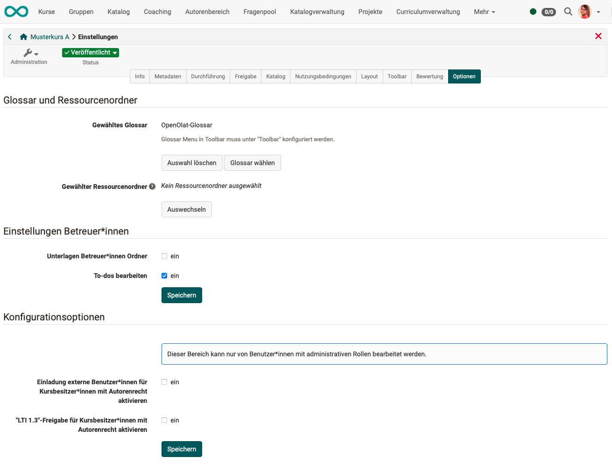
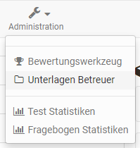

# Course Settings - Tab Options {: #course_settings_options}

Under `Course > Administration > Settings > Options` you can set up

* a course-specific [glossary](../learningresources/Using_Additional_Course_Features.md)
* a [resource folder](../learningresources/index.md)
* and a special folder for coaches

and, with the appropriate authorization, activate a few special configurations.

{ class="shadow lightbox" }

## Include glossary

You can either connect to an already created glossary here or create a new glossary in the menu that appears. Once a glossary has been selected, it can also be activated in the "Toolbar" tab.

[To the top of the page ^](#course_settings_options)

## Include resource folder

You can either connect to an already created "Resource folder" learning resource here or create a new resource folder in the menu that appears. The files of the resource folder then appear in the course's storage folder, in the automatically created subfolder "_sharedfolder".

By default, the files of the resource folder are read-only in the course, and editing is only possible directly in the learning resource, not in the course's storage folder or when embedding via single pages in the course editor. If editing should also be possible in the course, the checkbox at "Read only" must be cleared in the course settings options.

For more information and a step-by-step guide on including a resource folder, see the [How to](../../manual_how-to/docs/multiple_use/multiple_use.md) section.

**Please note:**  You can only include _one_ resource folder per course. Consider in advance which files you want to organize through a cross-course resource folder instead of the course-specific storage folder.

[To the top of the page ^](#course_settings_options)

## Coach settings

In the "Options" menu, a course-wide **coach folder** can be activated. In this folder, all coaches of the course can then store, view, edit, or delete documents. Creating subfolders is also possible in the configured area.

As the location for the folder, you can either choose an already existing folder from the course's storage folder or generate a new folder specifically for the coaches. If "Automatically generated folder" is selected, coaches have no access to other files located in the course's storage folder, while course creators or persons with access to the course editor can see the coaches' files in the automatically generated folder "_coachdocuments_" in the storage folder. This means course owners always have access to the files of the coach folder and can also use them for linking to certain course elements, for example a single page. Conversely, even with the new folder, coaches get _no_ way to integrate files into the course structure.

In the Administration menu, the new "Coach documents" submenu appears both for coaches and for owners of the course.

{ class="shadow lightbox" }

If coaches should be able to use course-specific **to-dos**, activate this option in this section as well.

[To the top of the page ^](#course_settings_options)

## Access in status "Finished" [:octicons-tag-16:{ title="from Release 21.0 (OO-9298)" }](https://track.frentix.com/issue/OO-9298)

In the "Access" section, you define what access participants have to this course once it reaches the status "Finished".

With **"Adopt system default"**, the default specified by the administration applies; the currently valid default is shown in brackets. Select **"Override"** to set a different value for this course:

* **Read-only access:** The course content remains available to participants in read mode.
* **No access:** Participants no longer have access to the content. When they open it, a notice page appears referring them to the responsible contact person.

[To the top of the page ^](#course_settings_options)

## Further configuration options

Users with administrative roles (learning resource manager, administrator) are also shown the following options in the "Options" tab:

* Option **"Activate invitation of external users for course owners with author rights"** 
    External users can also participate in courses (without member status). However, they must be explicitly invited to do so by a course owner with author rights. The option to invite them must be activated with this setting. A course owner with author rights can then also invite external users in the members management (the "Add members" button gets the additional option "Invite external members").

* Option **"Activate LTI 1.3 sharing for course owners with author rights"** 
    In the "Share" tab of the course settings, it can be allowed that people from other learning platforms access an OpenOlat course. Various configurations must be made for this. This is normally only possible for users with administrative roles. 
    If this option is activated, setting up the LTI sharing is also allowed for course owners with author rights.

## Further information {: #further_information}

**Mentioned on this page** 
[Using Additional Course Features >](../learningresources/Using_Additional_Course_Features.md) 
[Various Types of Learning Resources >](../learningresources/index.md) 
[How can I use the same files in several courses? >](../../manual_how-to/docs/multiple_use/multiple_use.md) 
[Course Settings - Tab Share: Configure LTI access to a course >](../learningresources/LTI_Share_courses.md)

**Further reading** 
[Course Settings >](../learningresources/Course_Settings.md) 
[Course Settings - Tab Assessment >](../learningresources/Course_Settings_Assessment.md) 
[Access configuration >](../learningresources/Access_configuration.md)

[To the top of the page ^](#course_settings_options)
