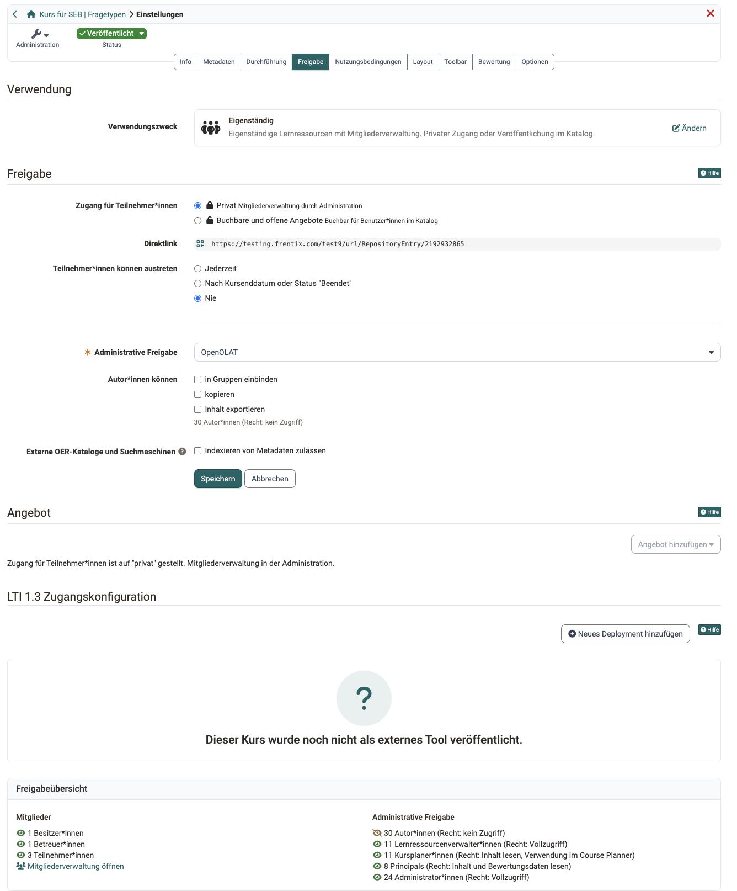
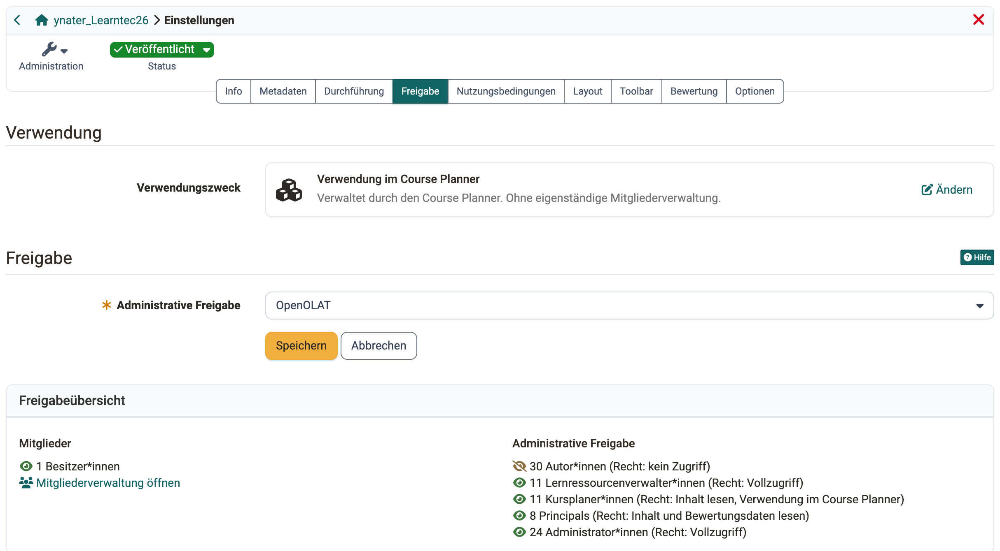
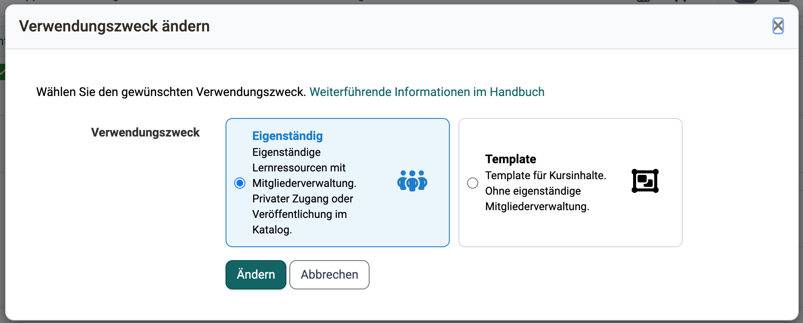
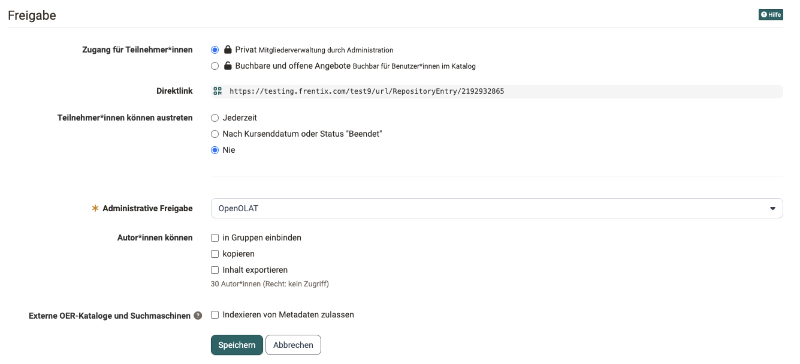

# Kurseinstellungen - Tab Freigabe {: #tab_share}

Im Tab Freigabe finden Sie diese Abschnitte. Welche davon ein Kurs tatsächlich zeigt, hängt an seinem Verwendungszweck: siehe [Welche Abschnitte erscheinen?](#sections_by_usage)

[Verwendung](#section_usage) 
[Freigabe](#section_share) 
[Angebot](#section_offer) 
[LTI 1.3 Zugriffskonfiguration](#section_LTI) 
[Freigabeübersicht](#section_share_overview) 

 

{ class="shadow lightbox"}

---

## Welche Abschnitte erscheinen? {: #sections_by_usage}

Der Tab Freigabe sieht nicht bei jedem Kurs gleich aus. Ausschlaggebend ist der Verwendungszweck im [Abschnitt Verwendung](#section_usage). Ein eigenständiger Kurs regelt Zugang, Buchung und Austritt selbst und zeigt darum alle Abschnitte. Bei einem Kurs im Course Planner übernimmt der Course Planner diese Aufgaben, und die entsprechenden Einstellungen entfallen im Kurs. Ein Template hat keine Teilnehmenden, deshalb entfällt dort alles, was den Zugang von Teilnehmenden betrifft.

| Abschnitt oder Einstellung | Eigenständig | Verwendung im Course Planner | Template |
|---|---|---|---|
| Verwendung | ja | ja | ja |
| Freigabe: Zugang für Teilnehmer:innen | ja | nein | nein |
| Freigabe: Direktlink | ja | nein | ja |
| Freigabe: Teilnehmer:innen können austreten | ja | nein | nein |
| Freigabe: Administrative Freigabe | ja | ja | ja |
| Freigabe: Autor:innen können | ja | nein | ja, ohne "in Gruppen einbinden" |
| Freigabe: Externe OER-Kataloge und Suchmaschinen | ja | nein | nein |
| Angebot | ja | nein | nein |
| LTI 1.3 Zugangskonfiguration | ja | nein | nein |
| Freigabeübersicht | ja | ja | ja |

Bei einem Kurs im Course Planner bleibt im Abschnitt Freigabe deshalb nur die Administrative Freigabe stehen. Mitgliedschaft, Buchung und Austritt regeln Sie dort in der Durchführung des Course Planner. Auch die Freigabeübersicht fällt kürzer aus: Sie zählt nur die Besitzer:innen, weil der Kurs selbst keine Betreuer:innen und Teilnehmer:innen verwaltet.

{ class="shadow lightbox"}

!!! note "Hinweis"

    Der Abschnitt Externe OER-Kataloge und Suchmaschinen erscheint zusätzlich nur, wenn das Modul OAI-PMH aktiviert ist, und die Administrative Freigabe nur, wenn das Modul Organisationseinheiten aktiviert ist. Den Verwendungszweck "Verwendung im Course Planner" gibt es nur, wenn das Modul Course Planner aktiviert ist.

Die Beschreibungen der folgenden Abschnitte gehen vom Verwendungszweck "Eigenständig" aus.

[Zum Seitenanfang ^](#tab_share)

---

## Abschnitt Verwendung [:octicons-tag-16:{ title="ab Release 18.2.0 (OO-7277)" }](https://track.frentix.com/issue/OO-7277) {: #section_usage}

Wird kein Course Planner verwendet, sind die Kurse eigenständig.

{ class="shadow lightbox"}

!!! info "Wichtig"

    Durch Klick auf "Ändern" kann eine andere Verwendung gewählt werden. Beachten Sie jedoch, dass bei anderen Verwendungen die Mitgliederverwaltung nicht im Kurs erfolgt. Deshalb ist eine Änderung nicht mehr möglich, wenn bereits Mitglieder zu einem Kurs hinzugefügt wurden.

Der Dialog "Verwendungszweck ändern" bietet nur die Verwendungszwecke an, zu denen Sie wechseln können. Der aktuelle Verwendungszweck steht deshalb nicht in der Auswahl. Sperrt eine Voraussetzung den Wechsel, nennt der Dialog sie über der Auswahl.

{ class="shadow lightbox"}

**Eigenständig** 
Eigenständige Lernressourcen besitzen eine eigene Mitgliederverwaltung. Zum Hinzufügen neuer Mitglieder öffnen Sie also `Kurs > Administration > Mitgliederverwaltung`. 
Der Zugang kann mit der Buchungsmethode "Privat" durch Eintragung als Mitglied (z.B. durch Kursbesitzer:innen), durch Vergabe eines Zugangscodes oder über eine Veröffentlichung im Katalog erfolgen.

**Verwendung im Course Planner** 
Wird der Kurs in ein Produkt des Course Planner eingebunden, werden die Mitgliedschaften durch den Course Planner vergeben und verwaltet. Der Kurs benötigt dann keine zweite, eigenständige Mitgliederverwaltung.

**Template** 
Auch diese Kurse sind durch den Course Planner verwaltet und ohne eigenständige Mitgliederverwaltung. Der Unterschied zur Option "Verwendung im Course Planner" besteht darin, dass ein Template zur Instanzierung verwendet wird. Der Kurs in einer Durchführung wird erst zu einem bestimmten Zeitpunkt aus diesem Template erstellt (instanziert).

!!! tip "Tipp"

    Achten Sie beim Erstellen neuer Kurse darauf, welcher Verwendungszweck voreingestellt ist. Administrator:innen können den standardmässigen Verwendungszweck für neue Kurse in der System-Administration einstellen unter: 
    `Administration > Module > Modul Course Planner > Tab Course Planner`

[Zum Seitenanfang ^](#tab_share)

---

## Abschnitt Freigabe {: #section_share}

{ class="shadow lightbox"}

**Zugang für Teilnehmer:innen** 
Bei der Wahl **"Privat"** werden die Teilnehmenden durch die Kursbesitzer:in bzw. Personen, die über das Recht der Mitgliederverwaltung verfügen, hinzugefügt. Dies geschieht unter `Kurs > Administration > Mitgliederverwaltung`. Es ist also wie eine persönliche Einladung in den Kurs durch Kursbesitzer:innen. 
Bei der Wahl der Option **"Buchbare und offene Angebote"** können die Lernenden einen Kurs selbst buchen, müssen aber eventuell (je nach Einstellung) ein Passwort eingeben. Soll die Buchung nach Wahl eines Angebots im Katalog erfolgen, muss ebenfalls diese Option angewählt sein. 

**Direktlink**  
Wenn Sie diesen Link weitergeben, kann damit dieser Kurs direkt aufgerufen werden. Ist die Person noch nicht in OpenOlat bekannt (registriert) und eingeloggt, erscheint zunächst der Login-Bildschirm.

#### Teilnehmer:innen können austreten [:octicons-tag-16:{ title="ab Release 20.3.0 (OO-9272)" }](https://track.frentix.com/issue/OO-9272) {: #section_share_leave}
**Jederzeit**: Möchten Teilnehmende ihre Mitgliedschaft im Kurs selbst beenden, können sie das jederzeit tun. 
**Nach Kursenddatum oder Status "Beendet"**: Ein Beenden der Kursmitgliedschaft aus Eigeninitiative der Teilnehmenden ist erst möglich, sobald der Durchführungszeitraum abgelaufen ist oder der Kurs den Status "Beendet" hat. Wurde diese Option gewählt, ohne zuvor in der Beschreibung einen Durchführungszeitraum zu wählen, ist ein Austritt erst möglich, sobald der Kurs den Status "Beendet" erhält. 
**Nie**: Der Besuch des Kurses ist Pflicht und Teilnehmer:innen können deshalb nicht selbst austreten.

!!! info "Wichtig"

    Diese Einstellung gibt es nur bei Kursen mit dem Verwendungszweck **"Eigenständig"**. Verwaltet stattdessen der Course Planner den Kurs (Verwendungszweck **"Verwendung im Course Planner"**), erscheint sie im Tab Freigabe nicht, und den Teilnehmenden steht die Funktion "Kurs verlassen" nicht zur Verfügung. Der Austritt aus einer Durchführung erfolgt dann über den Course Planner und damit über die Verwaltung Ihrer Organisation.

**Administrative Freigabe** 
Aus den hier ausgewählten Organisationseinheiten können Personen mit bestimmten übergeordneten Rollen (z.B. Administrator:innen, Lernressourcenverwalter:innen) ebenfalls auf diesen Kurs zugreifen. Weil es diese Rollen pro Organisationseinheit gibt (z.B. Admin für Abteilung xy), können Sie hier bestimmen, welche Organisationseinheiten administrativen Zugriff auf Ihren Kurs erhalten werden.
Ist das Modul Organisationseinheiten nicht aktiviert, finden Sie hier nur eine einzige Organisation (in der Regel "OpenOlat").  
Wieviele Personen administrativ zugreifen können, sehen Sie in der [Freigabeübersicht >](#section_share_overview)

**Autor:innen können** 
Erlauben Sie hier, was andere Autor:innen mit Ihrem Kurs tun dürfen: **"in Gruppen einbinden"**, **"kopieren"** und **"Inhalt exportieren"**. Bei anderen Lernressourcen als Kursen heisst die erste Option "in Kurse einbinden".

**Externe OER-Kataloge und Suchmaschinen** 
Mit OAI-PMH lassen sich Metadaten von Lernressourcen für Internet-Portale oder Kataloge ausserhalb OpenOlat freigeben, damit Suchmaschinen einen Inhalt besser finden können. (OER = Open Educational Resources)

Die Funktion muss zunächst generell durch einen/eine Administrator:in aktiviert werden. 
Damit die Informationen eines ganz bestimmten Kurses an die Suchmaschinen weiter gegeben werden, muss anschliessend der/die jeweilige Autor:in (Kursbesitzer:in) dies für den eigenen Kurs erlauben.

Mehr über OER finden Sie hier: 
How-To: [Kurse zur Indexierung freigeben >](../../manual_how-to/oai_pmh/oai_pmh.de.md#wie-sehe-ich-im-autorenbereich-welche-kurselernressourcen-zur-indexierung-freigegeben-sind) 
Admin-Handbuch: [Modul OAI PMH >](../../manual_admin/administration/Modules_OAI.de.md)

[Zum Seitenanfang ^](#tab_share)

---

## Abschnitt Angebote [:octicons-tag-16:{ title="ab Release 17.0.0 (OO-6141)" }](https://track.frentix.com/issue/OO-6141) {: #section_offer}

{ class="shadow lightbox"}

Damit ein Kurs im Katalog aufgeführt wird, muss ein Angebot erstellt werden. Es können auch mehrere Angebote erstellt werden, wenn der gleiche Kurs zu verschiedenen Bedingungen angeboten werden soll (z.B. kostenlos für eine bestimmte Zielgruppe, kostenpflichtig für andere).

Damit ein Angebot für den Katalog erstellt werden kann, muss im Abschnitt "Freigabe" bei "Zugang für Teilnehmer:innen" die Option "Buchbare und offene Angebote" gewählt sein. 

Mehr über Angebote und den Katalog finden Sie hier: 
[Katalog >](../area_modules/catalog2.0.de.md) 
[Angebotsarten >](../learningresources/Offer_Types.de.md) 
[Angebote erstellen >](../area_modules/catalog2.0_angebote.de.md) 
[Anbieten von Durchführungen im Katalog >](../area_modules/Course_Planner_Implementations.de.md#tab_catalog) 

[Zum Seitenanfang ^](#tab_share)

---

## Abschnitt LTI 1.3 Zugriffskonfiguration [:octicons-tag-16:{ title="ab Release 18.2.3 (OO-7664)" }](https://track.frentix.com/issue/OO-7664) {: #section_LTI}

OpenOlat-Kurse können via LTI 1.3 auch von einem anderen LMS aus aufgerufen werden. Für diesen Zugriff von aussen braucht es aber Sicherheitsvorkehrungen und genau festgelegte Berechtigungen. 
In diesem Abschnitt können Sie dazu ein sogenanntes Deployment einrichten, um den Kurs für ein anderes LMS aufrufbar zu machen.

Mehr über die Freigabe eines Kurses via LTI finden Sie hier: 
[LTI Zugang zu einem Kurs konfigurieren >](../learningresources/LTI_Share_courses.de.md) 

[Zum Seitenanfang ^](#tab_share)

---

## Freigabeübersicht {: #section_share_overview}

{ class="shadow lightbox"}

Im Block **Mitglieder** finden Sie die Anzahl der Kursmitglieder, aufgegliedert nach Besitzer:innen, Betreuer:innen und Teilnehmer:innen.

Im Block **Administrative Freigabe** sind alle Personen aufgeführt, die aufgrund ihrer Rolle ebenfalls Zugriff auf diesen Kurs haben.

Wurde der Kurs Gruppen zugeordnet, finden Sie die betreffenden Gruppen im Block **Gruppen** angezeigt.

Wurde der Kurs im Course Planner einem Produkt zugeordnet, finden Sie die Verwendungen im Block **Produkt** angezeigt.

[Zum Seitenanfang ^](#tab_share)

---

## Weiterführende Informationen {: #further_information}

[Zugangskonfiguration/Freigabe >](../learningresources/Access_configuration.de.md) 
[Katalog >](../area_modules/catalog2.0.de.md) 
[Angebotsarten >](../learningresources/Offer_Types.de.md) 
[Angebote erstellen >](../area_modules/catalog2.0_angebote.de.md) 
[Anbieten von Durchführungen im Katalog >](../area_modules/Course_Planner_Implementations.de.md#tab_catalog) 
[LTI Zugang zu einem Kurs konfigurieren >](../learningresources/LTI_Share_courses.de.md) 

[Zum Seitenanfang ^](#tab_share)

