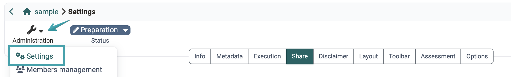
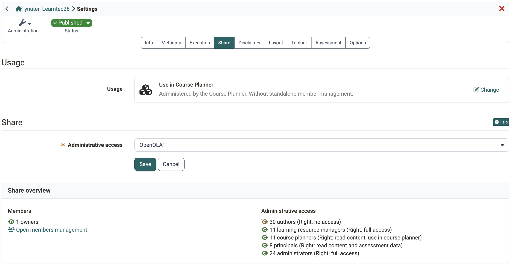
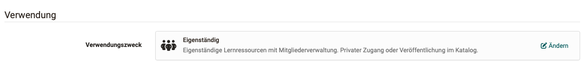
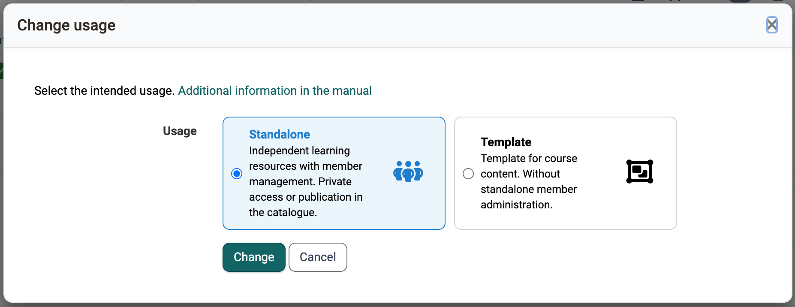
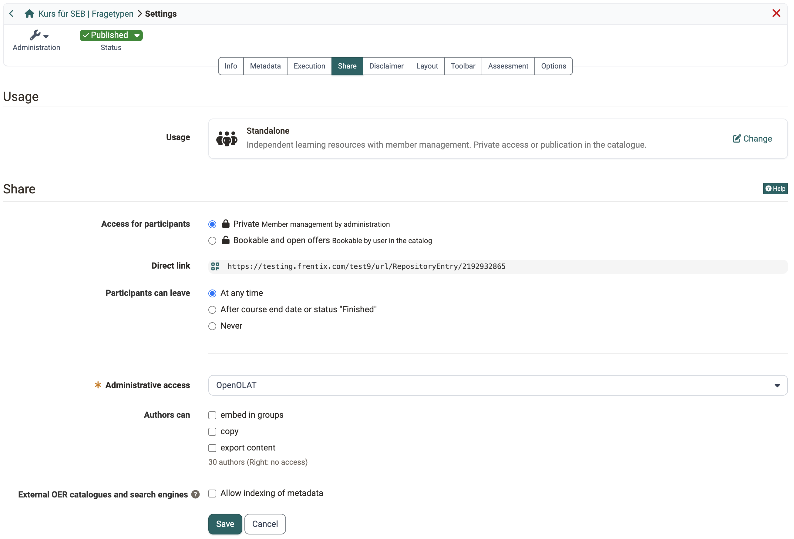
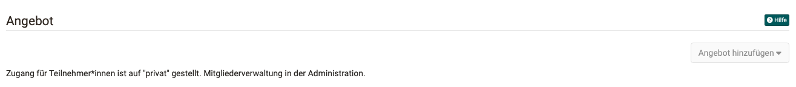
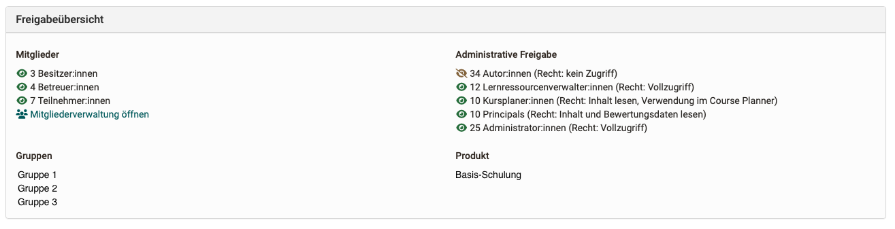

# Course settings - Tab Share {: #tab_share}

You open the Share tab in the course via `Course > Administration > Settings > Tab "Share"`.

{ class="shadow lightbox"}

In the Share tab, you will find these sections. Which of them a course actually shows depends on its usage: see [Which sections appear?](#sections_by_usage)

[Usage](#section_usage) 
[Share](#section_share) 
[Offer](#section_offer) 
[LTI 1.3 access configuration](#section_LTI) 
[Share overview](#section_share_overview) 

---

## Which sections appear? {: #sections_by_usage}

The Share tab does not look the same for every course. What matters is the usage set in the [Usage section](#section_usage). A standalone course controls access, booking and leaving on its own and therefore shows all sections. For a course in the Course Planner, the Course Planner takes over these tasks, and the corresponding settings are dropped from the course. A template has no participants, so everything that concerns participant access is dropped there.

| Section or setting | Standalone | Use in Course Planner | Template |
|---|---|---|---|
| Usage | yes | yes | yes |
| Share: Access for participants | yes | no | no |
| Share: Direct link | yes | no | yes |
| Share: Participants can leave | yes | no | no |
| Share: Administrative access | yes | yes | yes |
| Share: Authors can | yes | no | yes, without "embed in groups" |
| Share: External OER catalogues and search engines | yes | no | no |
| Offer | yes | no | no |
| LTI 1.3 access configuration | yes | no | no |
| Share overview | yes | yes | yes |

For a course in the Course Planner, only the administrative access therefore remains in the Share section. Membership, booking and leaving are handled in the implementation in the Course Planner. The share overview is shorter too: it counts only the owners, because the course itself manages no coaches and no participants.

{ class="shadow lightbox"}

!!! note "Note"

    The External OER catalogues and search engines section additionally appears only if the OAI-PMH module is activated, and the administrative access only if the Organisational units module is activated. The usage "Use in Course Planner" exists only if the Course Planner module is activated.

The descriptions of the following sections assume the usage "Standalone".

[To the top of the page ^](#tab_share)

---

## Section usage [:octicons-tag-16:{ title="from Release 18.2.0 (OO-7277)" }](https://track.frentix.com/issue/OO-7277) {: #section_usage}

If no Course Planner is used, the courses are independent.

{ class="shadow lightbox"}

!!! info "Important"

    By clicking on "Change," you can select a different use. Please note, however, that member management is not carried out in the course for other uses. Therefore, it is no longer possible to make changes once members have already been added to a course.

The "Change usage" dialog offers only the usages you can switch to. The current usage is therefore not in the selection. If a precondition blocks the switch, the dialog names it above the selection.

{ class="shadow lightbox"}

**Standalone** 
Independent learning resources have their own member management system. To add new members, open `Course > Administration > Member management`. 
Access can be granted using the "Private" booking method by registering as a member (e.g., by course owners), by assigning an access code, or by publishing it in the catalog.

**Use in Course Planner** 
If the course is integrated into a product of the Course Planner, memberships are assigned and managed by the Course Planner. The course then does not require a second, separate membership management system.

**Template** 
These courses are also managed by the Course Planner and do not require separate member management. The difference to the "Use in Course Planner" option is that a template is used for instantiation. The course in a run is only created (instantiated) from this template at a specific point in time.

!!! tip "Note"

    When creating new courses, pay attention to the default usage setting. Administrators can set the default usage for new courses in the system administration under: 
    `Administration > Modules > Module Course Planner > Course Planner tab`

[To the top of the page ^](#tab_share)

---

## Section Share {: #section_share}

{ class="shadow lightbox"}

**Access for participants** 
If you select **"Private"**, participants will be added by the course owner or persons who have member management rights. This is done under `Course > Administration > Member management`. It is therefore like a personal invitation to the course by the course owner.
When selecting the option **"Bookable and open offers"**, learners can book a course themselves, but may have to enter a password (depending on the settings). If the booking is to be made after selecting an offer in the catalog, this option must also be selected. 

**Direct link**  
If you share this link, this course can be accessed directly. If the person is not yet known (registered) in OpenOlat and logged in, the login screen will appear first.

#### Participants can leave [:octicons-tag-16:{ title="from Release 20.3.0 (OO-9272)" }](https://track.frentix.com/issue/OO-9272) {: #section_share_leave}
**At any time**: If participants wish to terminate their membership in the course themselves, they can do so at any time. 
**After course end date or status "Finished"**: Participants can only terminate their course membership on their own initiative once the implementation period has ended or the course has the status "Finished". If this option is selected without first selecting an implementation period in the description, participants can only leave once the course reaches the status "Finished". 
**Never**: Attendance at the course is compulsory, so participants cannot withdraw themselves.

!!! info "Important"

    This setting exists only for courses with the usage **"Standalone"**. If the Course Planner manages the course instead (usage **"Use in Course Planner"**), it does not appear in the Share tab, and the "Leave course" function is not available to the participants. Leaving an implementation is then done via the Course Planner and thus via the administration of your organisation.

**Administrative access** 
People with certain higher-level roles (e.g., administrators, learning resource managers) can also access this course from the organizational units selected here. Because these roles exist per organizational unit (e.g., admin for department xy), you can determine here which organizational units will have administrative access to your course.
If the Organizational Units module is not activated, you will only find a single organization here (usually "OpenOlat"). 
You can see how many people have administrative access in the [share overview >](#section_share_overview).

**Authors can** 
Allow here what other authors may do with your course: **"embed in groups"**, **"copy"** and **"export content"**. For learning resources other than courses, the first option is called "embed in courses".

**External OER catalogs and search engines** 
OAI-PMH allows metadata from learning resources to be shared with Internet portals or catalogs outside OpenOlat, enabling search engines to find content more easily. (OER = Open Educational Resources)

The function must first be activated by an administrator. 
In order for the information about a specific course to be passed on to search engines, the respective author (course owner) must then allow this for their own course.

Find out more about OER here: 
How-to: [Release courses for indexing >](../../manual_how-to/oai_pmh/oai_pmh.md#wie-sehe-ich-im-autorenbereich-welche-kurselernressourcen-zur-indexierung-freigegeben-sind) 
Admin Manual: [Modul OAI PMH >](../../manual_admin/administration/Modules_OAI.md)

[To the top of the page ^](#tab_share)

---

## Section offers [:octicons-tag-16:{ title="from Release 17.0.0 (OO-6141)" }](https://track.frentix.com/issue/OO-6141) {: #section_offer}

{ class="shadow lightbox"}

In order for a course to be listed in the catalog, an offer must be created. Multiple offers can also be created if the same course is to be offered under different conditions (e.g., free of charge for a specific target group, subject to a fee for others).

In order to create an offer for the catalog, the option "Bookable and open offers" must be selected in the "Approval" section under "Access for participants." 

You can find more information about offers and the catalog here: 
[Catalog >](../area_modules/catalog2.0.md) 
[Offer types >](../learningresources/Offer_Types.md) 
[Create offers >](../area_modules/catalog2.0_angebote.md) 
[Offering implementations in the catalog >](../area_modules/Course_Planner_Implementations.md#tab_catalog) 

[To the top of the page ^](#tab_share)

---

## Section LTI 1.3  [:octicons-tag-16:{ title="from Release 18.2.3 (OO-7664)" }](https://track.frentix.com/issue/OO-7664) {: #section_LTI}

OpenOlat courses can also be accessed from another LMS via LTI 1.3. However, this external access requires security measures and precisely defined permissions. 
In this section, you can set up a deployment to make the course accessible for another LMS.
You can find more information about sharing a course via LTI here: 
[Configuring LTI access to a course >](../learningresources/LTI_Share_courses.md) 

[To the top of the page ^](#tab_share)

---

## Section Share Overview {: #section_share_overview}

{ class="shadow lightbox"}

In the **Members** block, you will find the number of course members, broken down by owners, coaches, and participants.

The **Administrative access** block lists all persons who also have access to this course due to their role.

If the course has been assigned to groups, you will find the relevant groups displayed in the **Groups** block.

If the course has been assigned to a product in the Course Planner, you will find the uses displayed in the **Product** block.

[To the top of the page ^](#tab_share)

---

## Further information {: #further_information}

**Mentioned on this page**
[How can I have my courses found by search engines? >](../../manual_how-to/oai_pmh/oai_pmh.md) 
[Module OAI-PMH >](../../manual_admin/administration/Modules_OAI.md) 
[Catalog 2.0 - Overview >](../area_modules/catalog2.0.md) 
[Offer types >](../learningresources/Offer_Types.md) 
[Catalog 2.0 - Offers >](../area_modules/catalog2.0_angebote.md) 
[Course Planner: Implementations >](../area_modules/Course_Planner_Implementations.md) 
[Course Settings - Tab Share: Configure LTI access to a course >](../learningresources/LTI_Share_courses.md)

**Further reading**
[Access configuration >](../learningresources/Access_configuration.md)

[To the top of the page ^](#tab_share)
