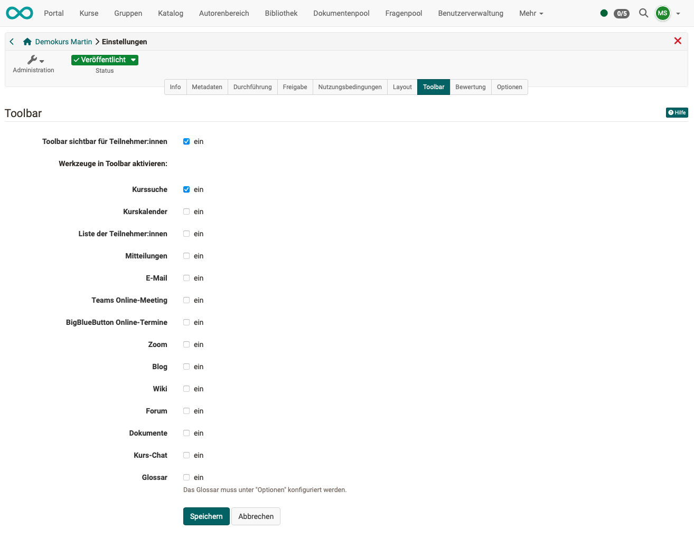

# Kurseinstellungen - Tab Toolbar {: #tab_toolbar}

Wird hier festgelegt, dass die Toolbar im aktuellen Kurs für die Teilnehmer:innen angezeigt werden soll, kann anschliessend ausgewählt werden, welche der Tools zur Verfügung gestellt werden.

{ class="shadow lightbox"}

[Zum Seitenanfang ^](#tab_toolbar)

---

