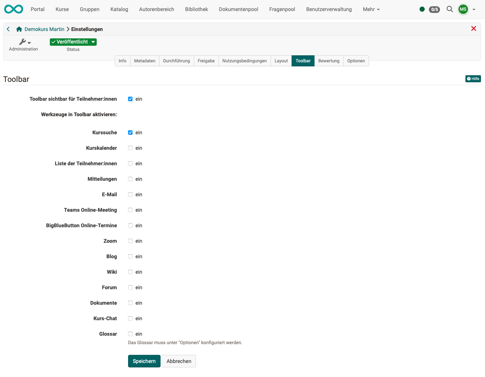
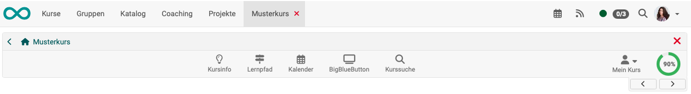
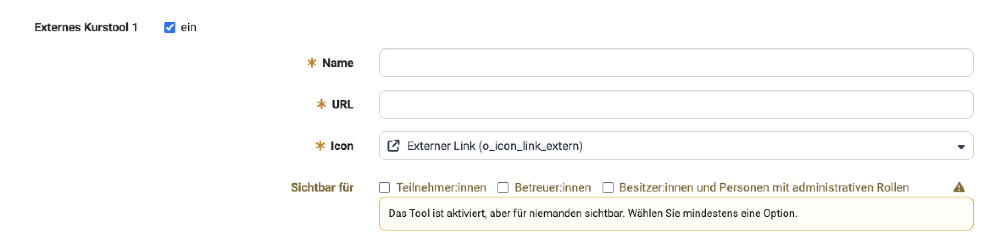
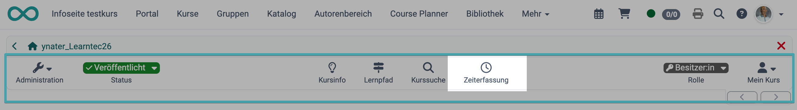

# Kurseinstellungen - Tab Toolbar {: #tab_toolbar}

Wird hier festgelegt, dass die Toolbar im aktuellen Kurs für die Teilnehmer:innen angezeigt werden soll, kann anschliessend ausgewählt werden, welche der Tools zur Verfügung gestellt werden.

{ class="shadow lightbox"}

Auf diesem Weg können Tools, die kontinuierlich zur Verfügung stehen sollen, an einer zentralen Stelle aufgerufen werden.

**Beispiel:**

{ class="shadow lightbox" }

 Zu den [Tools](../learningresources/Using_Additional_Course_Features.de.md) der Toolbar zählen neben der Kurssuche, dem Glossar und dem Kurs-Chat diverse Werkzeuge, die auch als Kursbausteine aufrufbar sind, z.B. Kalender, Teilnehmerliste, E-Mail, Blog, Wiki, Forum und Dokumenten Ordner. Bei [Wiki](../learningresources/Wiki.de.md) und [Blog](../learningresources/Blog.de.md) kann auch auf bereits erstellte Lernressourcen zurückgegriffen werden. Die anderen Tools ähneln zwar den entsprechenden Kursbausteinen, bieten aber nicht alle weiteren Konfigurationsmöglichkeiten, wie sie in den Kursbausteinen im Kurseditor zur Verfügung stehen.

Die Nutzung der Tools der Toolbar ist besonders für linear gestaltete [Lernpfad Kurse](Learning_path_course.de.md) wichtig, um unabhängig von einer sequenziellen Abfolge der Lernschritt, wichtige Tools kontinuierlich und zentral zur Verfügung zu stellen.

[Zum Seitenanfang ^](#tab_toolbar)

---

## Externe Kurstools [:octicons-tag-16:{ title="ab Release 21.0 (OO-9488)" }](https://track.frentix.com/issue/OO-9488) {: #external_tools}

Der Tab "Toolbar" enthält vier aufklappbare Abschnitte **"Externes Kurstool 1"** bis **"Externes Kurstool 4"**. Jedes Tool kann unabhängig aktiviert und mit Name, URL, Icon und rollenbasierter Sichtbarkeit konfiguriert werden.

{ class="shadow lightbox"}

| Feld | Beschreibung |
|---|---|
| **Aktiviert** | Schaltet das Tool ein. Wenn aktiviert, sind alle weiteren Felder Pflichtfelder. |
| **Name** | Bezeichnung in der Toolbar, max. 64 Zeichen. |
| **URL** | Absolute URL beginnend mit `http://` oder `https://`. Relative URLs, Anker, `javascript:`, `data:`, `mailto:`, `tel:` und protokollrelative Links werden abgelehnt. |
| **Icon** | Auswahl aus dem Icon-Katalog (rund 30 Einträge, z.B. Link, E-Mail, Kalender, Stundenplan, Absenzen-Management, Schulportal). |
| **Sichtbar für** | Separate Checkboxen für *Teilnehmer:innen*, *Betreuer:innen* sowie *Besitzer:innen und Personen mit administrativen Rollen* (nicht additiv). Administrator:innen, Lernressourcenverwalter:innen, Principals und Kursplaner:innen sehen das Tool, wenn die Besitzer-Option ausgewählt ist. Ist ein Tool aktiviert, aber keine Option gewählt, zeigt das Formular eine Warnung an. |

{ class="shadow lightbox"}

**Kurs kopieren / importieren**

- Die Konfiguration aller vier externen Kurstools wird beim **Kopieren** eines Kurses mitübernommen.
- Beim **Importieren** eines Kurses werden alle vier Tools auf *deaktiviert* zurückgesetzt, damit der Importer sie bewusst aktivieren kann.

!!! info "Wichtig"
    Externe Kurstools öffnen immer in einem neuen Browserfenster. Es werden keine Nutzerdaten (Name, E-Mail usw.) an das Zielsystem übertragen.

[Zum Seitenanfang ^](#tab_toolbar)

---

