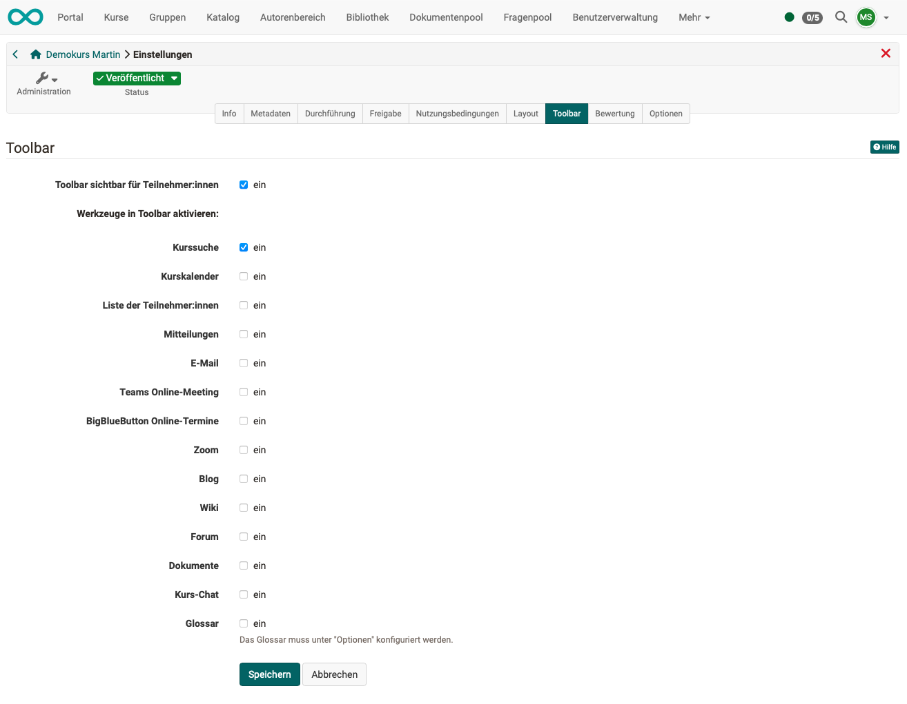
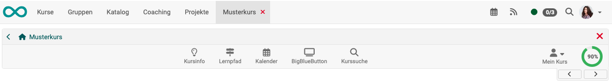
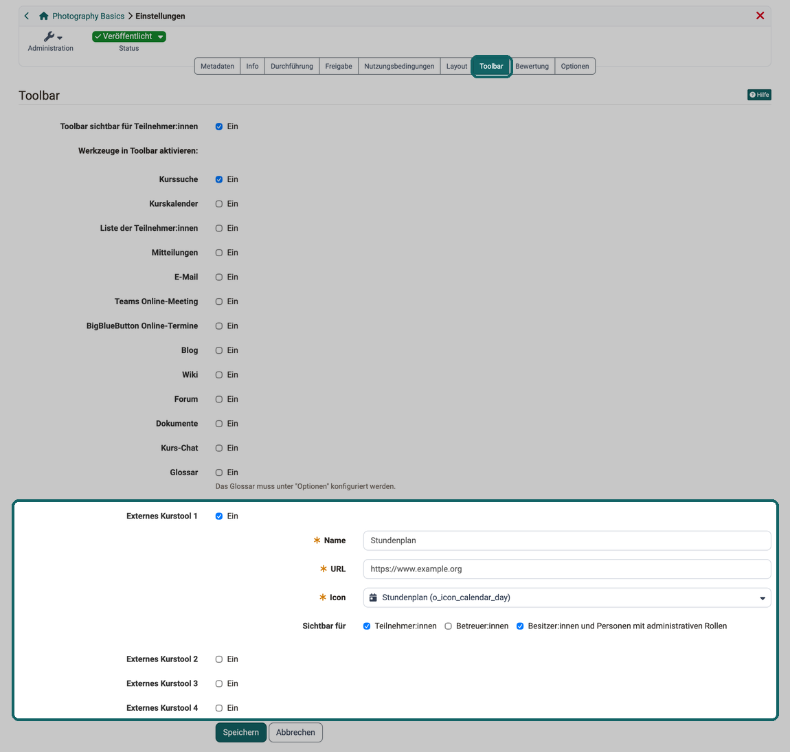
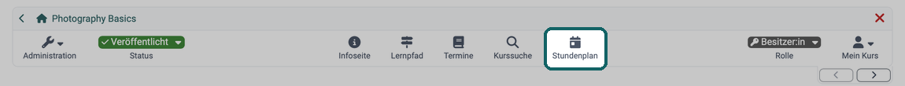

# Kurseinstellungen - Tab Toolbar {: #tab_toolbar}

Wird hier festgelegt, dass die Toolbar im aktuellen Kurs für die Teilnehmer:innen angezeigt werden soll, kann anschliessend ausgewählt werden, welche der Tools zur Verfügung gestellt werden.

{ class="shadow lightbox" title="Tab Toolbar der Kurseinstellungen" }

Auf diesem Weg können Tools, die kontinuierlich zur Verfügung stehen sollen, an einer zentralen Stelle aufgerufen werden.

**Beispiel:**

{ class="shadow lightbox" title="Toolbar eines Kurses" }

 Zu den [Tools](../learningresources/Using_Additional_Course_Features.de.md) der Toolbar zählen neben der Kurssuche, dem Glossar und dem Kurs-Chat diverse Werkzeuge, die auch als Kursbausteine aufrufbar sind, z.B. Kalender, Teilnehmerliste, E-Mail, Blog, Wiki, Forum und Dokumenten Ordner. Bei [Wiki](../learningresources/Wiki.de.md) und [Blog](../learningresources/Blog.de.md) kann auch auf bereits erstellte Lernressourcen zurückgegriffen werden. Die anderen Tools ähneln zwar den entsprechenden Kursbausteinen, bieten aber nicht alle weiteren Konfigurationsmöglichkeiten, wie sie in den Kursbausteinen im Kurseditor zur Verfügung stehen.

Die Nutzung der Tools der Toolbar ist besonders für linear gestaltete [Lernpfad Kurse](Learning_path_course.de.md) wichtig, um unabhängig von einer sequenziellen Abfolge der Lernschritte wichtige Tools kontinuierlich und zentral zur Verfügung zu stellen.

[Zum Seitenanfang ^](#tab_toolbar)

---

## Externe Kurstools [:octicons-tag-16:{ title="ab Release 21.0 (OO-9488)" }](https://track.frentix.com/issue/OO-9488) {: #external_tools}

Arbeiten Ihre Teilnehmer:innen neben dem Kurs mit weiteren Webanwendungen, etwa einem Stundenplan oder einem Schulportal, legen Sie die Links dorthin als externe Kurstools direkt in die Toolbar des Kurses. Pro Kurs stehen vier externe Kurstools zur Verfügung.

Eingerichtet werden sie unter `Kurs > Administration > Einstellungen > Tab "Toolbar"`. Die Zeilen **"Externes Kurstool 1"** bis **"Externes Kurstool 4"** stehen unter den Werkzeugen der Toolbar. Sie erscheinen nur, wenn bei "Toolbar sichtbar für Teilnehmer:innen" die Checkbox "Ein" aktiviert ist. Aktivieren Sie bei einem Tool die Checkbox "Ein", erscheinen darunter die Felder Name, URL, Icon und Sichtbar für.

{ class="shadow lightbox" title="Externe Kurstools im Tab Toolbar der Kurseinstellungen · 2026.10.02" }

| Feld | Beschreibung |
|---|---|
| **Name** | Bezeichnung in der Toolbar, max. 64 Zeichen. Pflichtfeld. |
| **URL** | Absolute URL beginnend mit `http://` oder `https://`. Relative URLs, Anker, `javascript:`, `data:`, `mailto:`, `tel:` und protokollrelative Links werden abgelehnt. Pflichtfeld. |
| **Icon** | Auswahl aus dem Icon-Katalog (rund 30 Einträge, z.B. Link, E-Mail, Kalender, Stundenplan, Absenzen-Management, Schulportal). Pflichtfeld. |
| **Sichtbar für** | Separate Checkboxen für *Teilnehmer:innen*, *Betreuer:innen* sowie *Besitzer:innen und Personen mit administrativen Rollen*. Jede Option gilt nur für ihre Rolle: Ein Tool, das nur für Teilnehmer:innen sichtbar ist, sehen Betreuer:innen nicht. Administrator:innen, Lernressourcenverwalter:innen, Principals und Kursplaner:innen sehen das Tool, wenn die Option für Besitzer:innen ausgewählt ist. Bei einem neu eingeschalteten Tool ist diese Option vorausgewählt. Ist keine Option gewählt, zeigt das Formular die Warnung "Das Tool ist aktiviert, aber für niemanden sichtbar. Wählen Sie mindestens eine Option." Gespeichert wird das Tool trotzdem, in der Toolbar sieht es dann niemand. |

{ class="shadow lightbox" title="Externes Kurstool in der Toolbar des Kurses · 2026.10.02" }

!!! warning "Achtung"
    Entfernen Sie bei einem Tool die Checkbox "Ein" oder schalten Sie "Toolbar sichtbar für Teilnehmer:innen" aus, löscht OpenOlat beim Speichern Name, URL und Icon der betroffenen Tools, die Auswahl unter Sichtbar für wird zurückgesetzt. Beim erneuten Einschalten erfassen Sie die Angaben neu.

**Kurs kopieren / importieren**

- Die Konfiguration aller vier externen Kurstools wird beim **Kopieren** eines Kurses mitübernommen.
- Beim **Importieren** eines Kurses sind alle vier Tools ausgeschaltet. Name, URL und Icon werden nicht übernommen und müssen im importierten Kurs neu erfasst werden.

!!! info "Wichtig"
    Externe Kurstools öffnen immer in einem neuen Browserfenster. Es werden keine Nutzerdaten (Name, E-Mail usw.) an das Zielsystem übertragen.

[Zum Seitenanfang ^](#tab_toolbar)

---

## Weiterführende Informationen {: #further_information}

[Einsatz weiterer Kursfunktionen der Toolbar >](Using_Additional_Course_Features.de.md) 
[Wiki erstellen >](Wiki.de.md) 
[Blog: Übersicht >](Blog.de.md) 
[Lernpfadkurs - Überblick >](Learning_path_course.de.md) 
[Kurseinstellungen >](Course_Settings.de.md) 
[Kurseinstellungen - Tab Optionen >](Course_Settings_Options.de.md)

[Zum Seitenanfang ^](#tab_toolbar)

