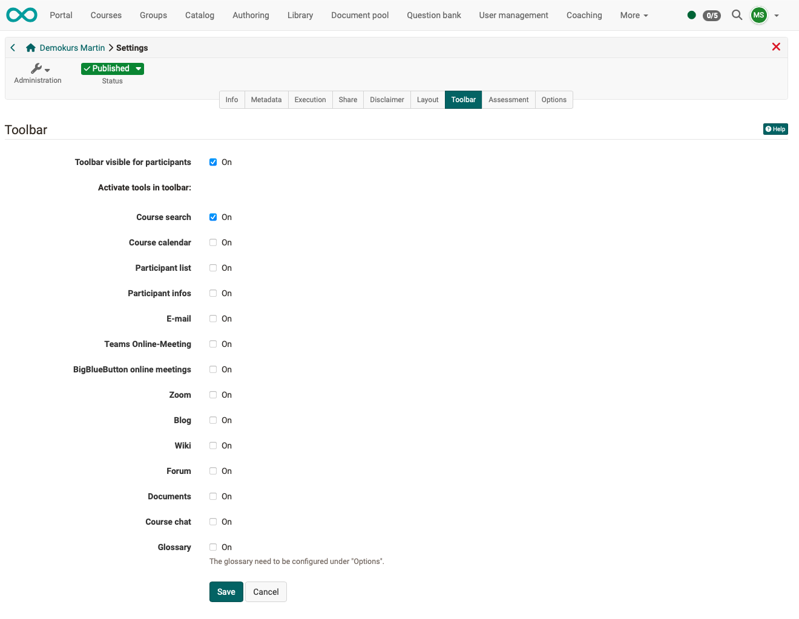

# Course Settings - Tab Toolbar {: #tab_toolbar}

If you specify here that the toolbar should be displayed for the participants in the current course, you can then select which of the tools should be made available.

{ class="shadow lightbox"}

In this way, tools that are to be continuously available can be accessed from a central location.

**Example:**

{ class="shadow lightbox" }

In addition to course search, glossary and course chat these tools include various [tools](../learningresources/Using_Additional_Course_Features.md) that can also be called up as course element, e.g. calendar, list of participants, e-mail, blog, wiki, forum, and documents folder. In the case of [Wiki](../learningresources/Wiki.md) and [Blog](../learningresources/Blog.md), it is also possible to fall back on learning resources that have already been created. The other tools are similar to the corresponding course elements, but do not offer the further configuration options as they are available in the course elements in the course editor.

The use of the tools in the toolbar is particularly important for linear [Learning path courses](Learning_path_course.md) in order to make important tools available continuously and centrally, regardless of the sequential order of the learning steps.

[To the top of the page ^](#tab_toolbar)

---

