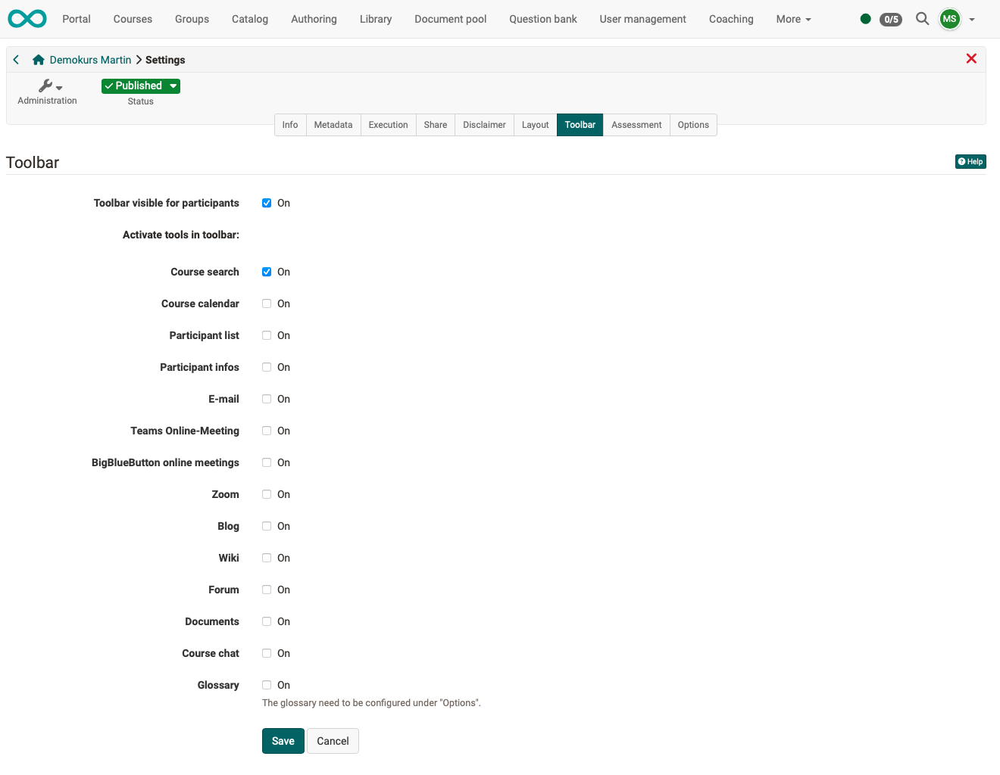
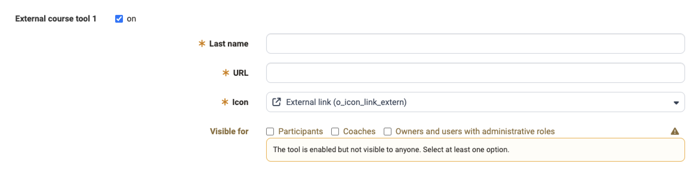
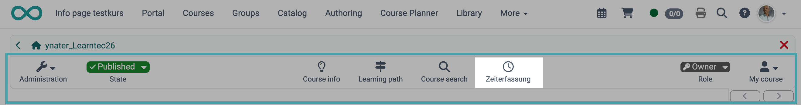

# Course Settings - Tab Toolbar {: #tab_toolbar}

If you specify here that the toolbar should be displayed for the participants in the current course, you can then select which of the tools should be made available.

{ class="shadow lightbox"}

In this way, tools that are to be continuously available can be accessed from a central location.

**Example:**

{ class="shadow lightbox" }

In addition to course search, glossary and course chat these tools include various [tools](../learningresources/Using_Additional_Course_Features.md) that can also be called up as course element, e.g. calendar, list of participants, e-mail, blog, wiki, forum, and documents folder. In the case of [Wiki](../learningresources/Wiki.md) and [Blog](../learningresources/Blog.md), it is also possible to fall back on learning resources that have already been created. The other tools are similar to the corresponding course elements, but do not offer the further configuration options as they are available in the course elements in the course editor.

The use of the tools in the toolbar is particularly important for linear [Learning path courses](Learning_path_course.md) in order to make important tools available continuously and centrally, regardless of the sequential order of the learning steps.

[To the top of the page ^](#tab_toolbar)

---

## External course tools [:octicons-tag-16:{ title="from Release 21.0 (OO-9488)" }](https://track.frentix.com/issue/OO-9488) {: #external_tools}

The "Toolbar" tab contains four collapsible sections **"External course tool 1"** to **"External course tool 4"**. Each tool can be enabled independently and configured with a name, URL, icon and role-based visibility.

{ class="shadow lightbox"}

| Field | Description |
|---|---|
| **Enabled** | Switches the tool on. When enabled, all other fields are mandatory. |
| **Name** | Label shown in the toolbar, max. 64 characters. |
| **URL** | Absolute URL starting with `http://` or `https://`. Relative URLs, anchors, `javascript:`, `data:`, `mailto:`, `tel:` and protocol-relative links are rejected. |
| **Icon** | Selection from the icon catalog (around 30 entries, e.g. Link, E-mail, Calendar, Timetable, Absence management, School portal). |
| **Visible to** | Separate checkboxes for *Participants*, *Coaches* and *Owners and users with administrative roles* (non-additive). Administrators, learning resource managers, principals and course planners see the tool when the owner option is selected. If a tool is enabled but no option is selected, the form displays a warning. |

{ class="shadow lightbox"}

**Course copy / import**

- The configuration of all four external course tools is included when a course is **copied**.
- On course **import**, all four tools are reset to *disabled* so the importer can activate them deliberately.

!!! info "Important"
    External course tools always open in a new browser window. No user data (name, e-mail etc.) is passed to the target system.

[To the top of the page ^](#tab_toolbar)

---

