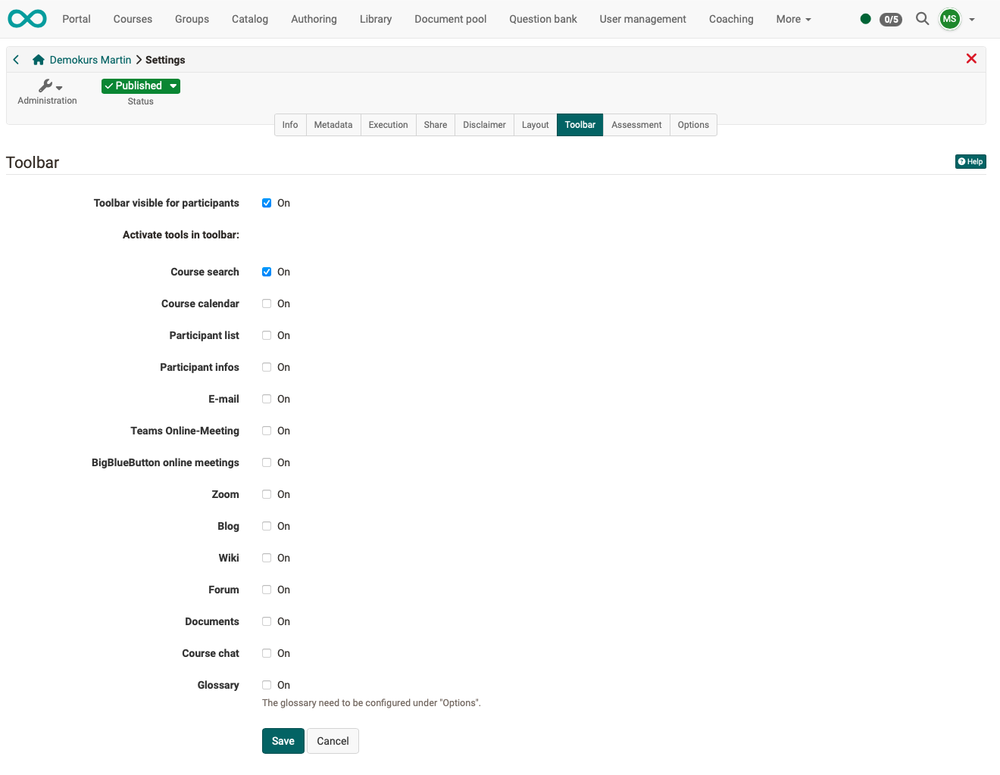
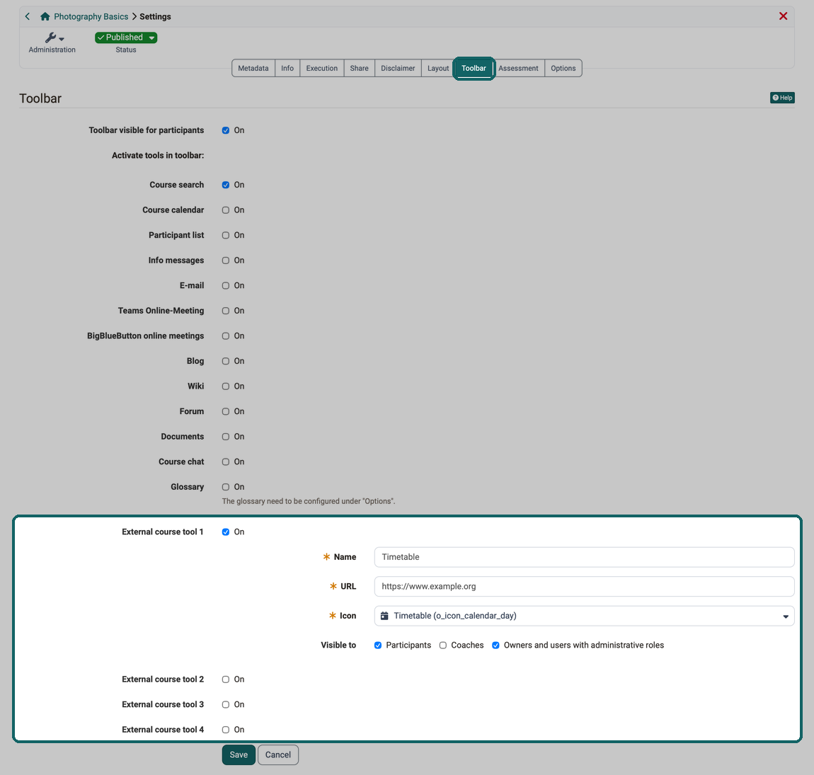
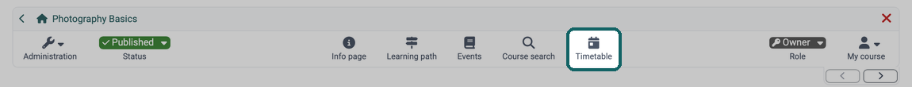

# Course Settings - Tab Toolbar {: #tab_toolbar}

If you specify here that the toolbar should be displayed for the participants in the current course, you can then select which of the tools should be made available.

{ class="shadow lightbox" title="Toolbar tab of the course settings" }

In this way, tools that are to be continuously available can be accessed from a central location.

**Example:**

{ class="shadow lightbox" title="Toolbar of a course" }

In addition to course search, glossary and course chat these tools include various [tools](../learningresources/Using_Additional_Course_Features.md) that can also be called up as course element, e.g. calendar, list of participants, e-mail, blog, wiki, forum, and documents folder. In the case of [Wiki](../learningresources/Wiki.md) and [Blog](../learningresources/Blog.md), it is also possible to fall back on learning resources that have already been created. The other tools are similar to the corresponding course elements, but do not offer the further configuration options as they are available in the course elements in the course editor.

The use of the tools in the toolbar is particularly important for linear [Learning path courses](Learning_path_course.md) in order to make important tools available continuously and centrally, regardless of the sequential order of the learning steps.

[To the top of the page ^](#tab_toolbar)

---

## External course tools [:octicons-tag-16:{ title="from Release 21.0 (OO-9488)" }](https://track.frentix.com/issue/OO-9488) {: #external_tools}

If your participants work with other web applications alongside the course, such as a timetable or a school portal, you place the links to them as external course tools directly in the course toolbar. Four external course tools are available per course.

They are set up under `Course > Administration > Settings > Tab "Toolbar"`. The rows **"External course tool 1"** to **"External course tool 4"** are located below the toolbar tools. They only appear if the checkbox "On" is activated for "Toolbar visible for participants". If you activate the checkbox "On" for a tool, the fields Name, URL, Icon and Visible to appear below it.

{ class="shadow lightbox" title="External course tools in the Toolbar tab of the course settings · 2026.10.02" }

| Field | Description |
|---|---|
| **Name** | Label shown in the toolbar, max. 64 characters. Mandatory field. |
| **URL** | Absolute URL starting with `http://` or `https://`. Relative URLs, anchors, `javascript:`, `data:`, `mailto:`, `tel:` and protocol-relative links are rejected. Mandatory field. |
| **Icon** | Selection from the icon catalog (around 30 entries, e.g. Link, E-mail, Calendar, Timetable, Absence management, School portal). Mandatory field. |
| **Visible to** | Separate checkboxes for *Participants*, *Coaches* and *Owners and users with administrative roles*. Each option applies to its own role only: a tool that is visible to participants only is not seen by coaches. Administrators, learning resource managers, principals and course planners see the tool when the option for owners is selected. For a newly switched on tool, this option is preselected. If no option is selected, the form displays the warning "The tool is enabled but not visible to anyone. Select at least one option." The tool is saved anyway, and then nobody sees it in the toolbar. |

{ class="shadow lightbox" title="External course tool in the course toolbar · 2026.10.02" }

!!! warning "Attention"
    If you remove the checkbox "On" for a tool or switch off "Toolbar visible for participants", OpenOlat deletes the name, URL and icon of the affected tools when saving, and the selection under Visible to is reset. When you switch them on again, you enter the details again.

**Course copy / import**

- The configuration of all four external course tools is included when a course is **copied**.
- On course **import**, all four tools are switched off. Name, URL and icon are not taken over and must be entered again in the imported course.

!!! info "Important"
    External course tools always open in a new browser window. No user data (name, e-mail etc.) is passed to the target system.

[To the top of the page ^](#tab_toolbar)

---

## Further information {: #further_information}

[Using Additional Course Features >](Using_Additional_Course_Features.md) 
[Creating Wikis >](Wiki.md) 
[Blog: Overview >](Blog.md) 
[Learning path course - Overview >](Learning_path_course.md) 
[Course Settings >](Course_Settings.md) 
[Course Settings - Tab Options >](Course_Settings_Options.md)

[To the top of the page ^](#tab_toolbar)

