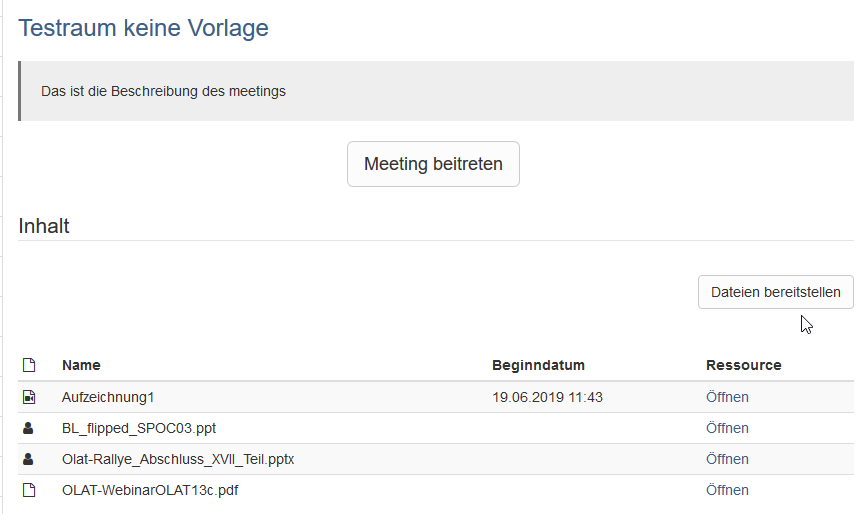
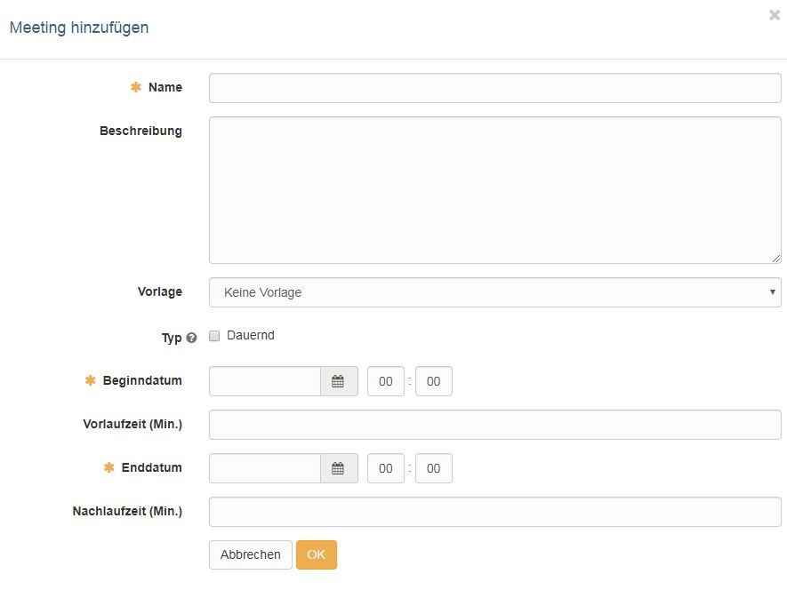
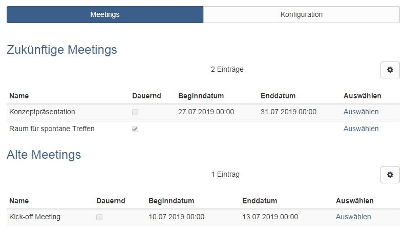

# Kursbaustein "Adobe Connect"

!!! warning "Achtung"

    Adobe Connect ist eine kommerzielle Software. Um den Kursbaustein zu nutzen ist eine separate Lizenz und ein Serverhosting erforderlich.

## Tool Spezifisches

Standardmässig sind Kursbesitzer und Betreuer Adobe Connect Verwalter und
Kursteilnehme sind Connect Teilnehmende ohne weitere Rechte.

Im Connect Raum stehen diverse Elemente (Pods) zur Verfügung, die miteinander
kombiniert und in „Layouts“ organisiert werden können. So können u.a.
Präsentationsdateien hochgeladen und auch ein Veranstaltungsmitschnitt
aktiviert werden. Sowohl die hochgeladenen Präsentationsdateien als auch die
Aufzeichnungen sind in OpenOlat für die Kursbesitzer und Betreuer sichtbar und
können den Kursteilnehmenden alle oder teilweise zur Verfügung gestellt
werden.

  
## Konfiguration im Kurseditor

Hier steht der Reiter Konfiguration für weitere Einstellungen zur Verfügung. 

## Konfiguration im Kursrun (geschlossener Editor)

Nachdem der Kursbaustein hinzugefügt wurde, muss ein Meetingraum im Tab
"Konfiguration" über den Button "Meeting hinzufügen" erstellt werden.
Anschliessend erscheint der folgende Dialog:

Unter dem eingetragenen Namen wird der Raum im Bereich der Meetings angezeigt.
Die Beschreibung wird sichtbar nachdem man den Raum ausgewählt hat.

Sofern vorhanden können Sie eine vom Hosting-Server bereitgestellte Vorlage
verwenden oder "Keine Vorlage" wählen. Definieren Sie auch ob der Raum
permanent (=dauernd) oder nur zu einem bestimmten Termin zur Verfügung stehen
soll. Bei einem termingebundenen Raum können Sie noch ein Vorlauf und
Nachlaufzeit ergänzen.

Unabhängig von der Raumkonfiguration kann der Zugang zum Kursbaustein des
Virtuellen Klassenzimmers auch wie alle anderen Kursbausteine über  die Tabs
Sichtbarkeit und Zugang im Kurseditor konfiguriert werden.

Ein eingebauter Adobe Connect Kursbaustein kann mehrere unterschiedlich
konfigurierte Meeting-Räume enthalten. Je nach Konfiguration in der OpenOlat
Administration führen alle eingerichteten Meetings in denselben oder
verschiedene Adobe Connect Räume.

Im Tab "Meetings" wird die Übersicht der eingerichteten virtuellen Räume so
angezeigt, wie sie auch für Teilnehmende sichtbar sind. Terminlich
abgelaufene, termingebundene Meetings werden entsprechend gekennzeichnet.

Über "Auswählen" gelangt man in das entsprechende virtuelle Klassenzimmer.
Beim ersten Aufruf muss man sich für das Meeting "anmelden" und anschließend
hat man die Möglichkeit über ein weiteres Dialogfenster dem Meeting
beizutreten. Mit "Meeting beitreten" gelangt man in das Virtuelle
Klassenzimmer und sämtliche raumspezifischen Werkzeuge stehen zur Verfügung.  
  
!!! note "Link zu weiteren Infos"

    Adobe Connect Anbieter Webseite: <https://www.adobe.com/de/products/adobeconnect.html>

    Da viele Hochschulen in Deutschland den [DFN Server](https://www.conf.dfn.de/webkonferenzdienst-ueber-adobe-connect/)für Adobe Connect nutzen, können auch die entsprechenden Informationen interessant sein.

