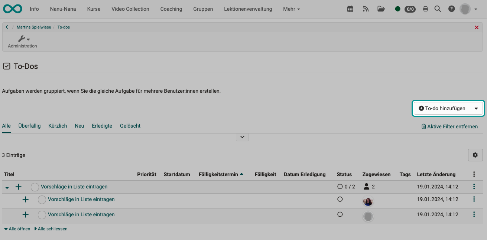

# To-dos im Kurs

:octicons-tag-24: Release 18.2

## Wo erstelle ich im Kurs To-dos?

Die To-dos, die einen bestimmten Kurs betreffen, können direkt im Kurs unter **Administration > To-dos** erstellt werden.  

{ class="shadow lightbox" }

## Wer kann im Kurs To-dos erstellen?

In einem Kurs können To-dos von **Kursbesitzer:innen** und **Betreuer:innen** erstellt werden. Daneben auch von allen Systemrollen, die **administrativen Zugriff** auf den Kurs haben (Lernressourcenverwalter, Administrator, usw.).

## To-dos für alle Kursteilnehmer 

Es ist häufig der Fall, dass Kursbesitzer oder Betreuer einen Auftrag (To-do) an alle Kursteilnehmer vergeben möchten. Deshalb besteht im Kurs die Möglichkeit, To-dos an alle Kursteilnehmer zu vergeben oder an Einzelpersonen. Den Button zum Erstellen eines neuen To-dos finden Sie rechts oben über der Liste.  

{ class="shadow lightbox" }

Im zweiten Schritt des Wizards können Sie entscheiden, ob das To-do für alle Kursteilnehmer oder nur für eine Einzelperson gelten soll. 

{ class="shadow lightbox" }

## To-dos für Einzelpersonen

Neben der vorstehend gezeigten Option, können Sie zum Erstellen eines To-dos für eine Einzelperson auch auf den kleinen Pfeil neben dem Button "To-do hinzufügen" klicken. Dann zeigt sich ein Drop-Down, das ebenfalls zur Erstellungsmaske führt.

{ class="shadow lightbox" }

## Wie wird über die To-dos informiert?  

Wurde von Betreuer:innen oder Kursbesitzer:innen ein To-do erstellt, erscheint es bei den Empfängern **im persönlichen Menü** unter der Option **"To-dos"**.

{ class="shadow lightbox" }

Klicken Sie auf die grossen Plus-Symbole am Anfang der Zeile um die Details zu sehen.

## Weitere Informationen

To-dos können an mehreren Stellen in OpenOlat erstellt werden. Weitere Information finden Sie auch hier:

[Allgemeines zu To-dos](../basic_concepts/To_Dos_Basics.de.md) 
[To-dos im persönlichen Menü](../personal_menu/To-Dos.de.md) 
[To-dos innerhalb eines Projektes](../area_modules/Project_Todos.de.md) 
[To-dos im Kursbaustein Aufgabe](../learningresources/Course_Element_Task.de.md) 
[Massnahmen To-dos im Qualitätsmanagement](../area_modules/Quality_Management_To-dos.de.md)
