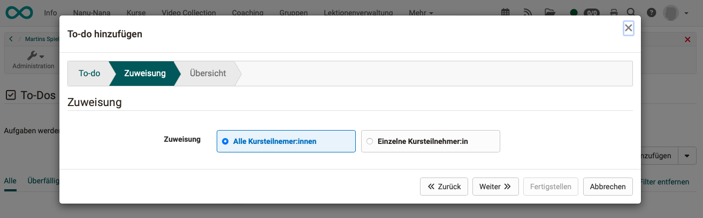

# To-dos in the course

:octicons-tag-24: Release 18.2

## Where do I create to-dos in the course?

To-dos affecting a specific course can be created directly under **Administration > To-dos**.

{ class="shadow lightbox" }

## Who can create to-dos in courses?

To-dos can be created in a course by **course owners** and **coaches**. Also from all system roles that have **administrative access** to the course (learning resource manager, administrator, etc.).

## To-dos for all course participants

It is often the case that course owners or coaches want to give an assignment (to-do) to all course participants. It is therefore possible to assign to-dos to all course participants or to individuals during the course. The button for creating a new to-do can be found at the top right of the list.

{ class="shadow lightbox" }

In the second step of the wizard, you can decide whether the to-do should apply to all course participants or just one individual.

{ class="shadow lightbox" }

## To-dos for individuals

In addition to the option shown above, you can also click on the small arrow next to the "Add to-do" button to create a to-do for an individual. A drop-down menu will then appear, which will also take you to the creation screen.

{ class="shadow lightbox" }

## How are you informed about the to-dos?

If a to-do has been created by coaches or course owners, it will appear for the recipients **in the personal menu** under the **"To-dos "** option.

{ class="shadow lightbox" }

Click on the large plus symbols at the beginning of the line to see the details.

## More information

To-dos can be created in several places in OpenOlat. You can also find more information here:

[General information on To-dos](../basic_concepts/To_Dos_Basics.md) 
[To-dos in the Personal Menu](../personal_menu/To-Dos.md) 
[To-dos within a Project](../area_modules/Project_Todos.md) 
[To-dos in the course element "Task"](../learningresources/Course_Element_Task.md)