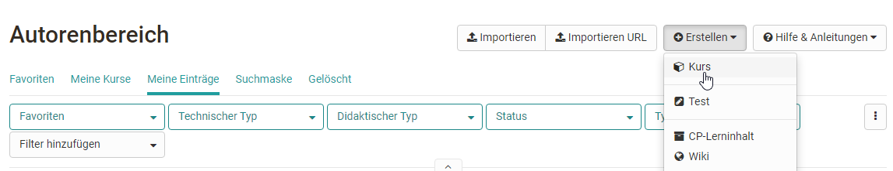
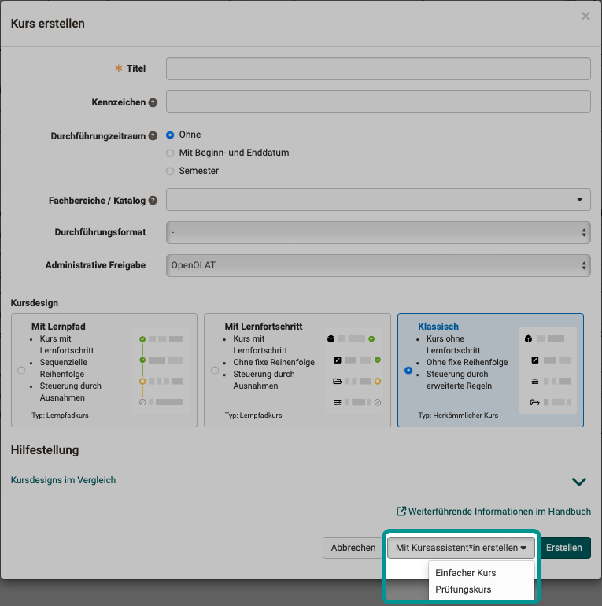

# Kurs erstellen

:octicons-device-camera-video-24: **Video-Einführung**: [Voraussetzungen für Autoren](<https://www.youtube.com/embed/L0jc_LBKXLE>){:target="_blank”}  
:octicons-device-camera-video-24: **Video-Einführung**: [Login](<https://www.youtube.com/embed/tI7ag7i6zXc>){:target="_blank”}  

{ class="shadow" }

Dieses Kapitel ist für Kursautoren geschrieben und zeigt Ihnen wie man einen Kurs erstellt, einrichtet und konfiguriert.

Es gibt zwei Varianten von OpenOlat Kursen: Herkömmliche Kurse und [Lernpfad Kurse](Learning_path_course.de.md), die sich teilweise in den Konfigurationsmöglichkeiten unterscheiden. Lernpfad Kurse verfügen u.a. über eine [Fortschrittsanzeige](Learning_path_course_Participant_view.de.md). Im Autorenbereich können sich Kursbesitzer durch einblenden der Spalte "Technischer Typ" direkt anzeigen lassen, ob es sich bei einem Kurs um einen Lernpfad Kurs oder einen herkömmlichen Kurs handelt.

## Wie können Sie starten?

Verschaffen Sie sich am besten zunächst einen Überblick über den gesamten
[Kurszyklus](General_Information.de.md) und schauen Sie sich dann die einzelnen Bereiche an. Die konkreten [Kursbausteine](Course_Elements.de.md), die Sie für den Aufbau von Kursen verwenden können, werden in einem separaten Kapitel ausführlich erläutert. Die Erstellung der Kursstruktur erfolgt sowohl bei
Lernpfad Kursen als auch bei herkömmlichen Kursen im Kurseditor.

Zusätzlich kann beim Anlegen eines Kurses auch ein Wizard für Einsteiger oder auch ein spezieller Prüfungskurs angelegt werden. Für die meisten Lehrszenarien ist allerdings die Standardeinstellung ohne Wizard die passende Wahl.

{ class="shadow lightbox" }

:octicons-device-camera-video-24: **Video-Einführung**: [Kursbausteine einfügen](<https://www.youtube.com/embed/AJ76e3urdKA>){:target="_blank”} 