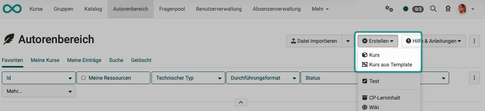
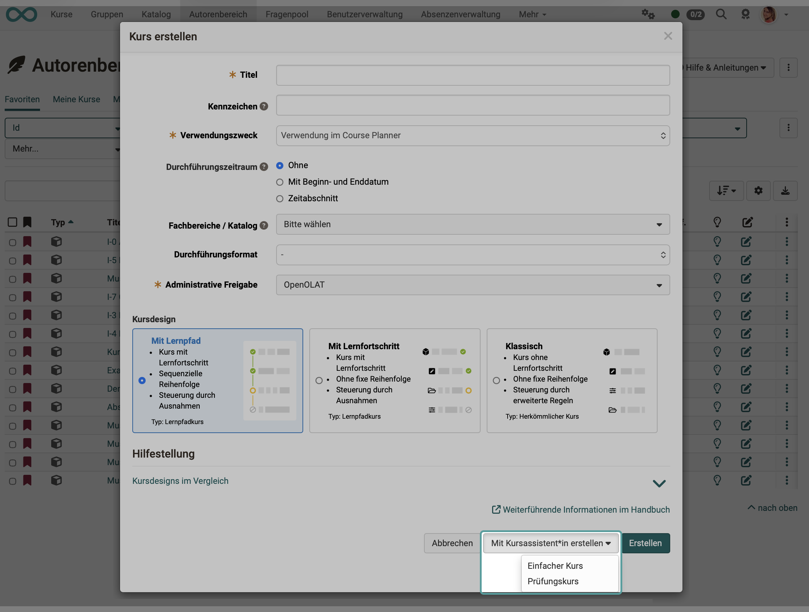

# Kurs erstellen {: #creating_course}

:octicons-device-camera-video-24: **Video-Einführung**: [Voraussetzungen für Autoren](<https://www.youtube.com/embed/L0jc_LBKXLE>){:target="_blank”}  
:octicons-device-camera-video-24: **Video-Einführung**: [Login](<https://www.youtube.com/embed/tI7ag7i6zXc>){:target="_blank”}  

{ class="shadow lightbox" }

Dieses Kapitel ist für Kursautoren geschrieben und zeigt Ihnen wie man einen Kurs erstellt, einrichtet und konfiguriert.

Es gibt zwei Varianten von OpenOlat Kursen: Herkömmliche Kurse und [Lernpfad Kurse](Learning_path_course.de.md), die sich teilweise in den Konfigurationsmöglichkeiten unterscheiden. Lernpfad Kurse verfügen u.a. über eine [Fortschrittsanzeige](Learning_path_course_Participant_view.de.md). Im Autorenbereich können sich Kursbesitzer durch einblenden der Spalte "Technischer Typ" direkt anzeigen lassen, ob es sich bei einem Kurs um einen Lernpfad Kurs oder einen herkömmlichen Kurs handelt.

## Wie können Sie starten? {: #how_to_start}

Verschaffen Sie sich am besten zunächst einen Überblick über den gesamten
[Kurszyklus](General_Information.de.md) und schauen Sie sich dann die einzelnen Bereiche an. Die konkreten [Kursbausteine](Course_Elements.de.md), die Sie für den Aufbau von Kursen verwenden können, werden in einem separaten Kapitel ausführlich erläutert. Die Erstellung der Kursstruktur erfolgt sowohl bei
Lernpfad Kursen als auch bei herkömmlichen Kursen im Kurseditor.

Zusätzlich kann beim Anlegen eines Kurses auch ein Wizard für Einsteiger oder auch ein spezieller Prüfungskurs angelegt werden. Für die meisten Lehrszenarien ist allerdings die Standardeinstellung ohne Wizard die passende Wahl.

{ class="shadow lightbox" }

:octicons-device-camera-video-24: **Video-Einführung**: [Kursbausteine einfügen](<https://www.youtube.com/embed/AJ76e3urdKA>){:target="_blank”} 

[Zum Seitenanfang ^](#creating_course)

---

## Verwendungszweck {: #purpose}

Wenn Sie einen neuen Kurs erstellen, werden Sie gebeten, einen Verwendungszweck anzugeben:

* **Eigenständig:** Ein solcher Kurs hat eine eigene Mitgliederverwaltung.
* **Verwendung im Course Planner:** Wird ein Kurs im Course Planner verwendet, werden die Mitgliedschaften durch den Course Planner eingetragen, sobald der Kurs im Course Planner einem Element zugeordnet wird.
* **Template:** Ein Template kann sowohl für die Erstellung eigenständiger Kurse als auch im Course Planner verwendet werden. Ein Template ist ohne eigene Mitgliederverwaltung.

!!! tip "Empfehlung"

    Wenn Sie mit dem Konzept des Course Planners noch nicht vertraut sind, wählen Sie den Verwendungszweck "Eigenständig".

!!! tip "Hinweis zum nachträglichen Ändern des Verwendungszwecks"

    Die beim Erstellen des Kurses getroffene Entscheidung für einen bestimmten Verwendungszweck kann später noch geändert werden unter **(Kurs-)Administration > Einstellungen > Tab "Freigabe"**. 
    Sind aber z.B. schon Teilnehmer:innen einem eigenständigen Kurs zugeordnet, die vielleicht sogar schon Ergebnisse erzielt haben, kann eine Änderung des Verwendungszwecks nicht mehr vorgenommen werden.

Welcher Wechsel möglich ist, hängt vom aktuellen und vom gewünschten Verwendungszweck ab. Der Wechsel erfolgt über **"Verwendungszweck ändern"** und ist nur möglich, wenn die jeweiligen Vorbedingungen erfüllt sind:

| von \ zu | Eigenständig | Verwendung im Course Planner | Template |
| --- | --- | --- | --- |
| **Eigenständig** |  | (a) | (a) und (b) |
| **Verwendung im Course Planner** | (b) |  | (a) und (b) |
| **Template** | (b) | (a) |  |

(a) keine Mitglieder ausser Besitzer:innen, keine Gruppen, die auch in anderen Kursen eingebunden sind, und Zugang für Teilnehmer:innen auf "Privat" 
(b) keine Verwendung durch den Course Planner

Vorhandene Angebote (Buchungen) werden beim Wechsel des Verwendungszwecks gelöscht.

Unabhängig vom Wechsel des Verwendungszwecks lässt sich über das Werkzeuge-Menü des Kurses aus einem bestehenden Kurs mit **"Als Template speichern"** eine Template-Kopie und aus einem Template mit **"Als Kurs instanziieren"** ein neuer Kurs erstellen. Dabei entsteht jeweils eine neue Lernressource; der ursprüngliche Eintrag bleibt unverändert.

{ class="shadow lightbox" }

[Zum Seitenanfang ^](#creating_course)

---

## Weitere Informationen {: #further_information}

[Speichern eines Kurses als Template >](../../manual_user/learningresources/Course_Copy_Template.de.md)

[Zum Seitenanfang ^](#creating_course)

