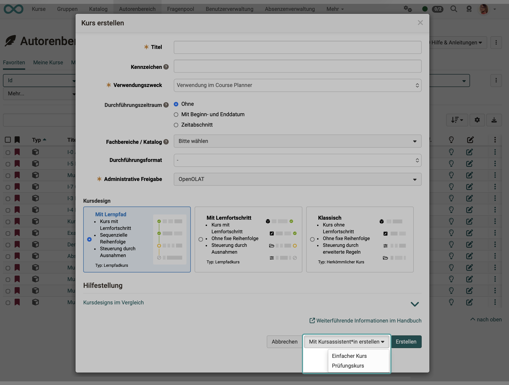

# Kurs erstellen {: #creating_course}

:octicons-device-camera-video-24: **Video-Einführung**: [Voraussetzungen für Autoren](<https://www.youtube.com/embed/L0jc_LBKXLE>){:target="_blank"}  
:octicons-device-camera-video-24: **Video-Einführung**: [Login](<https://www.youtube.com/embed/tI7ag7i6zXc>){:target="_blank"}  

{ class="shadow lightbox" }

Dieses Kapitel ist für Kursautor:innen geschrieben und zeigt Ihnen, wie Sie einen Kurs erstellen, einrichten und konfigurieren.

Es gibt zwei Varianten von OpenOlat-Kursen: herkömmliche Kurse und [Lernpfadkurse](Learning_path_course.de.md), die sich teilweise in den Konfigurationsmöglichkeiten unterscheiden. Lernpfadkurse verfügen u.a. über eine [Fortschrittsanzeige](Learning_path_course_Participant_view.de.md). Im Autorenbereich können sich Kursbesitzer:innen durch Einblenden der Spalte "Technischer Typ" direkt anzeigen lassen, ob es sich bei einem Kurs um einen Lernpfadkurs oder einen herkömmlichen Kurs handelt.

## Wie können Sie starten? {: #how_to_start}

Verschaffen Sie sich am besten zunächst einen Überblick über den gesamten
[Kurszyklus](General_Information.de.md) und schauen Sie sich dann die einzelnen Bereiche an. Die konkreten [Kursbausteine](Course_Elements.de.md), die Sie für den Aufbau von Kursen verwenden können, werden in einem separaten Kapitel ausführlich erläutert. Die Erstellung der Kursstruktur erfolgt sowohl bei
Lernpfadkursen als auch bei herkömmlichen Kursen im Kurseditor.

Das Kursdesign wählen Sie im Dialog "Kurs erstellen": "Mit Lernpfad" und "Mit Lernfortschritt" ergeben einen Lernpfadkurs, "Klassisch" einen herkömmlichen Kurs.

Zusätzlich lässt sich ein Kurs über "Mit Kursassistent:in erstellen" als "Einfacher Kurs" oder als "Prüfungskurs" anlegen. Für die meisten Lehrszenarien ist allerdings der Button "Erstellen" ohne Kursassistent:in die passende Wahl.

{ class="shadow lightbox" }

:octicons-device-camera-video-24: **Video-Einführung**: [Kursbausteine einfügen](<https://www.youtube.com/embed/AJ76e3urdKA>){:target="_blank"}

[Zum Seitenanfang ^](#creating_course)

---

## Verwendungszweck {: #purpose}

Wenn Sie einen neuen Kurs erstellen, werden Sie gebeten, einen Verwendungszweck anzugeben:

* **Eigenständig:** Ein solcher Kurs hat eine eigene Mitgliederverwaltung.
* **Verwendung im Course Planner:** Wird ein Kurs im Course Planner verwendet, werden die Mitgliedschaften durch den Course Planner eingetragen, sobald der Kurs im Course Planner einem Element zugeordnet wird.
* **Template:** Ein Template kann sowohl für die Erstellung eigenständiger Kurse als auch im Course Planner verwendet werden. Ein Template ist ohne eigene Mitgliederverwaltung.

!!! tip "Empfehlung"

    Wenn Sie mit dem Konzept des Course Planners noch nicht vertraut sind, wählen Sie den Verwendungszweck "Eigenständig".

Die beim Erstellen des Kurses getroffene Entscheidung für einen Verwendungszweck lässt sich später ändern unter `Kurs > Administration > Einstellungen > Tab "Freigabe"` über "Verwendungszweck ändern". Welcher Wechsel möglich ist, hängt vom aktuellen und vom gewünschten Verwendungszweck ab und setzt die jeweiligen Vorbedingungen voraus:

| von \ zu | Eigenständig | Verwendung im Course Planner | Template |
| --- | --- | --- | --- |
| **Eigenständig** |  | (a) | (a) und (b) |
| **Verwendung im Course Planner** | (b) |  | (a) und (b) |
| **Template** | (b) | (a) |  |

(a) keine Mitglieder ausser Besitzer:innen, keine Gruppen, die auch in anderen Kursen eingebunden sind, und Zugang für Teilnehmer:innen auf "Privat" 
(b) keine Verwendung durch den Course Planner

Sind einem eigenständigen Kurs also bereits Teilnehmer:innen zugeordnet, die vielleicht sogar schon Ergebnisse erzielt haben, kann der Verwendungszweck nicht mehr geändert werden. Vorhandene Angebote (Buchungen) werden beim Wechsel des Verwendungszwecks gelöscht.

Unabhängig vom Wechsel des Verwendungszwecks lässt sich über das Werkzeuge-Menü des Kurses aus einem bestehenden Kurs mit **"Als Template speichern"** eine Template-Kopie und aus einem Template mit **"Als Kurs instanziieren"** ein neuer Kurs erstellen. Dabei entsteht jeweils eine neue Lernressource; der ursprüngliche Eintrag bleibt unverändert.

{ class="shadow lightbox" }

[Zum Seitenanfang ^](#creating_course)

---

## Weiterführende Informationen {: #further_information}

[Lernpfadkurs - Überblick >](Learning_path_course.de.md) 
[Lernpfadkurs - Teilnehmeransicht >](Learning_path_course_Participant_view.de.md) 
[Allgemeines >](General_Information.de.md) 
[Kursbausteine >](Course_Elements.de.md) 
[Speichern (eines Kurses) als Template >](Course_Copy_Template.de.md)

**youtube** 
[Voraussetzungen für Autoren](<https://www.youtube.com/embed/L0jc_LBKXLE>) 
[Login](<https://www.youtube.com/embed/tI7ag7i6zXc>) 
[Kursbausteine einfügen](<https://www.youtube.com/embed/AJ76e3urdKA>)

[Zum Seitenanfang ^](#creating_course)
