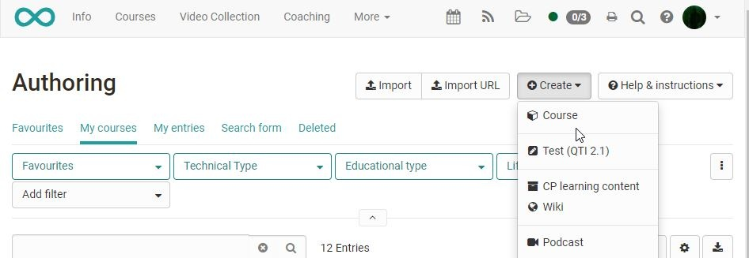
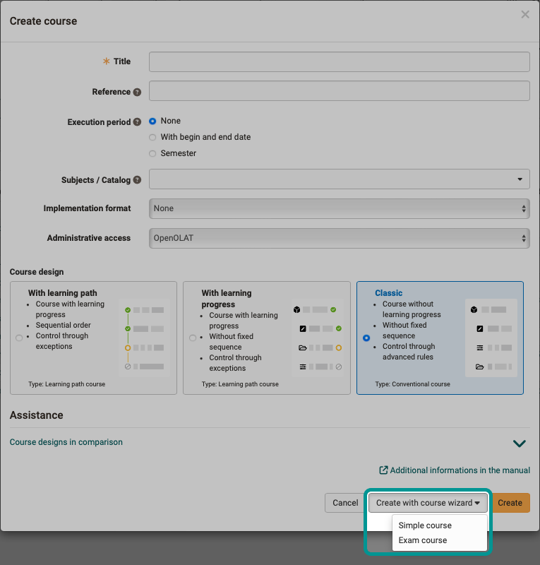

# Creating Courses

{ class="shadow" }

This chapter is written for course authors and shows you the way to your own course.

There are two variants of OpenOlat courses: Conventional courses and [Learning path courses](Learning_path_course.md), which differ partly in the configuration options.
Learning path courses have, among other things, a [progress indicator](Learning_path_course_Participant_view.md), whereas conventional courses are suitable for more complex scenarios with more differentiated selective approvals. In the authoring area, course owners can directly display whether a course is a learning path course or a conventional course by displaying the "Technical type" column.

## How can you get started?

It is best to first get an overview of the entire [course cycle](General_Information.md) and then go on to look at the individual areas. The specific [course elements](Course_Elements.md) you can use to build courses are explained in detail in a separate chapter. The course structure is created in the course editor for both learning path courses and conventional courses.  

Additionally, when creating a course, a wizard for beginners or a special exam course can be created. For most teaching scenarios, however, the default setting without a wizard is the appropriate choice.

{ class="shadow lightbox" }

