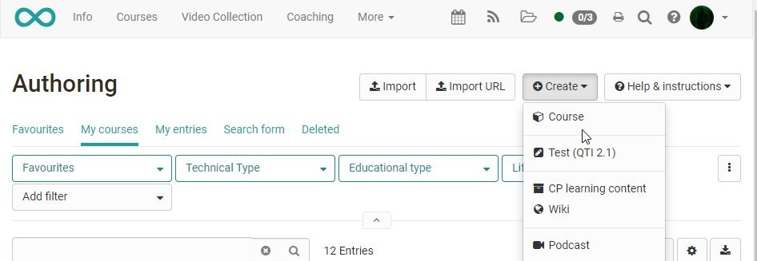
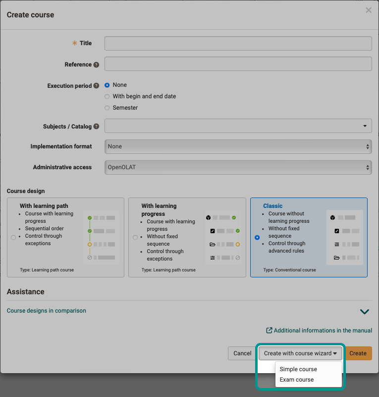
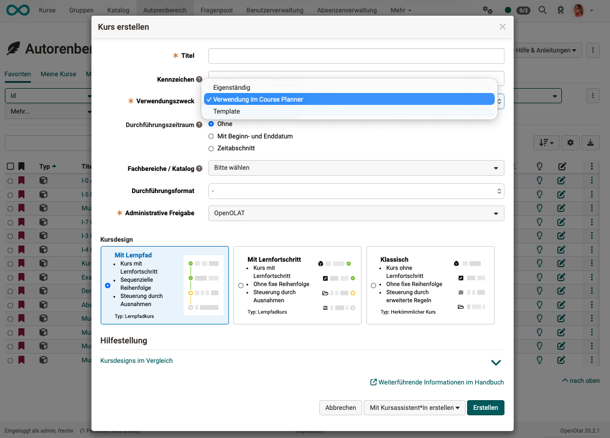

# Creating Courses {: #creating_course}

{ class="shadow" }

This chapter is written for course authors and shows you the way to your own course.

There are two variants of OpenOlat courses: Conventional courses and [Learning path courses](Learning_path_course.md), which differ partly in the configuration options.
Learning path courses have, among other things, a [progress indicator](Learning_path_course_Participant_view.md), whereas conventional courses are suitable for more complex scenarios with more differentiated selective approvals. In the authoring area, course owners can directly display whether a course is a learning path course or a conventional course by displaying the "Technical type" column.

## How can you get started? {: #how_to_start}

It is best to first get an overview of the entire [course cycle](General_Information.md) and then go on to look at the individual areas. The specific [course elements](Course_Elements.md) you can use to build courses are explained in detail in a separate chapter. The course structure is created in the course editor for both learning path courses and conventional courses.  

Additionally, when creating a course, a wizard for beginners or a special exam course can be created. For most teaching scenarios, however, the default setting without a wizard is the appropriate choice.

{ class="shadow lightbox" }

[To the top of the page ^](#creating_course)

---

## Purpose {: #purpose}

When you create a new course, you will be asked to specify a purpose:

* **Independent:** This type of course has its own member management system.
* **Use in Course Planner:** If a course is used in different versions in Course Planner, participants must be assigned to the different versions, not to the course. (Otherwise, they would be participants in all versions.)
* **Template:** With the Course Planner, courses can be planned in advance in various formats and then instantiated at a later date from a course template. Such a template does not include its own member management.

!!! tip "Suggestion"

    If you are not yet familiar with the concept of the Course Planner, select the intended use "Independent."

!!! tip "Note on changing the intended use retrospectively"

    The decision made when creating the course for a specific purpose can be changed later under  **(Course) Administration > Settings > "Share" tab**. 
    However, if participants have already been assigned to an independent course, for example, and may even have already achieved results, it is no longer possible to change the intended use.

Which change is possible depends on the current and the desired purpose. The change is made via **"Change usage"** and is only possible if the respective preconditions are met:

| from \ to | Independent | Use in Course Planner | Template |
| --- | --- | --- | --- |
| **Independent** |  | (a) | (a) and (b) |
| **Use in Course Planner** | (b) |  | (a) and (b) |
| **Template** | (b) | (a) |  |

(a) no members except owners, no groups that are also referenced by other courses, and access for participants set to "Private" 
(b) not used by the Course Planner

Existing offers (bookings) are deleted when the purpose is changed.

Independently of changing the purpose, you can use the course's tools menu to create a template copy from an existing course with **"Save as template"** and a new course from a template with **"Instantiate as course"**. In each case a new learning resource is created; the original entry remains unchanged.

{ class="shadow lightbox" }

[To the top of the page ^](#creating_course)

---

## Further information {: #further_information}

[Saving a course as a template >](../../manual_user/learningresources/Course_Copy_Template.md)

[To the top of the page ^](#creating_course)

