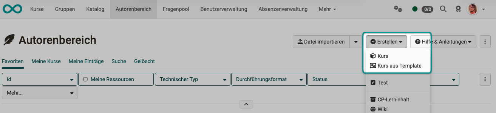
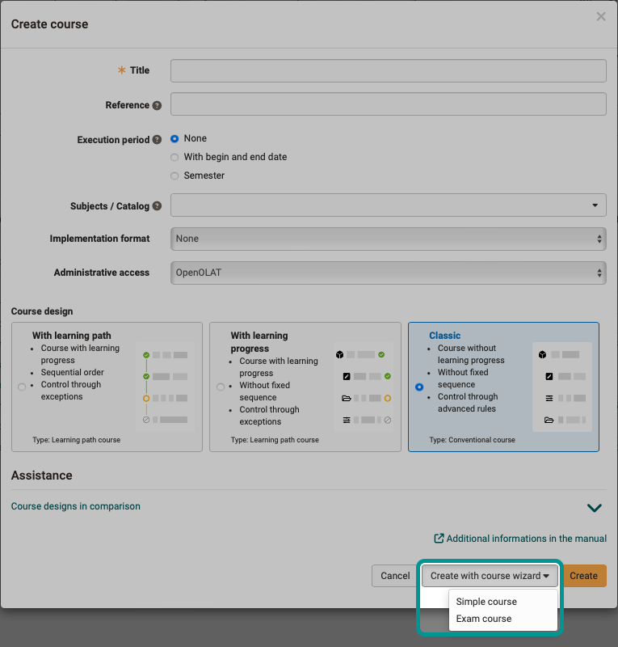
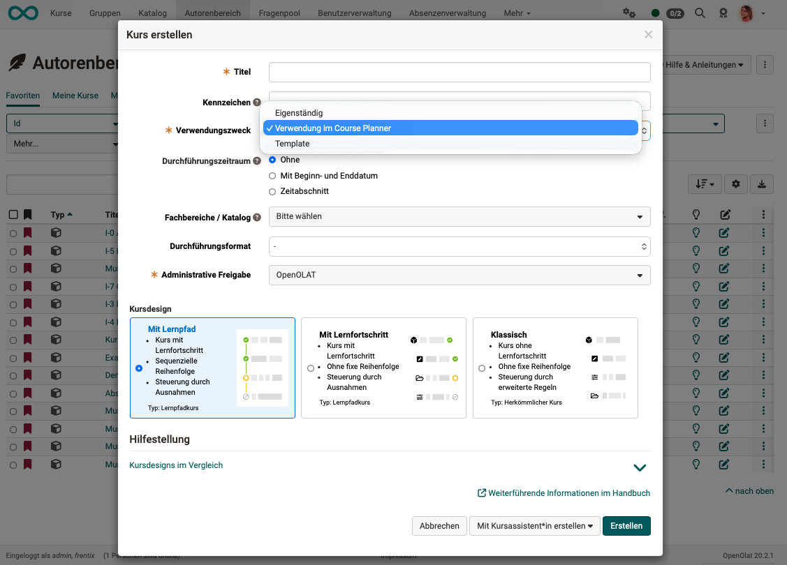

# Creating Courses {: #creating_course}

:octicons-device-camera-video-24: **Video introduction (German)**: [Voraussetzungen für Autoren](<https://www.youtube.com/embed/L0jc_LBKXLE>){:target="_blank"}  
:octicons-device-camera-video-24: **Video introduction (German)**: [Login](<https://www.youtube.com/embed/tI7ag7i6zXc>){:target="_blank"}  

{ class="shadow lightbox" }

This chapter is written for course authors and shows you how to create, set up and configure a course.

There are two variants of OpenOlat courses: conventional courses and [learning path courses](Learning_path_course.md), which differ partly in the configuration options. Learning path courses have, among other things, a [progress indicator](Learning_path_course_Participant_view.md). In the authoring area, course owners can directly display whether a course is a learning path course or a conventional course by displaying the "Technical type" column.

## How can you get started? {: #how_to_start}

It is best to first get an overview of the entire [course cycle](General_Information.md) and then go on to look at the individual areas. The specific [course elements](Course_Elements.md) you can use to build courses are explained in detail in a separate chapter. The course structure is created in the course editor for both learning path courses and conventional courses.

You choose the course design in the "Create course" dialog: "With learning path" and "With learning progress" result in a learning path course, "Classic" in a conventional course.

Additionally, a course can be created via "Create with course wizard" as a "Simple course" or an "Exam course". For most teaching scenarios, however, the "Create" button without course wizard is the appropriate choice.

{ class="shadow lightbox" }

:octicons-device-camera-video-24: **Video introduction (German)**: [Kursbausteine einfügen](<https://www.youtube.com/embed/AJ76e3urdKA>){:target="_blank"}

[To the top of the page ^](#creating_course)

---

## Usage {: #purpose}

When you create a new course, you will be asked to specify a usage:

* **Standalone:** Such a course has its own member management.
* **Use in Course Planner:** If a course is used in the Course Planner, the Course Planner enters the memberships as soon as the course is assigned to an element in the Course Planner.
* **Template:** A template can be used both to create standalone courses and in the Course Planner. A template has no member management of its own.

!!! tip "Recommendation"

    If you are not yet familiar with the concept of the Course Planner, select the usage "Standalone".

The usage chosen when creating the course can be changed later under `Course > Administration > Settings > Tab "Share"` via "Change usage". Which change is possible depends on the current and the desired usage and requires the respective preconditions:

| from \ to | Standalone | Use in Course Planner | Template |
| --- | --- | --- | --- |
| **Standalone** |  | (a) | (a) and (b) |
| **Use in Course Planner** | (b) |  | (a) and (b) |
| **Template** | (b) | (a) |  |

(a) no members except owners, no groups that are also referenced by other courses, and access for participants set to "Private" 
(b) not used by the Course Planner

So if participants have already been assigned to a standalone course, and may even have achieved results, the usage can no longer be changed. Existing offers (bookings) are deleted when the usage is changed.

Independently of changing the usage, you can use the course's tools menu to create a template copy from an existing course with **"Save as template"** and a new course from a template with **"Instantiate as course"**. In each case a new learning resource is created; the original entry remains unchanged.

{ class="shadow lightbox" }

[To the top of the page ^](#creating_course)

---

## Further information {: #further_information}

[Learning path course - Overview >](Learning_path_course.md) 
[Learning path course - Participant view >](Learning_path_course_Participant_view.md) 
[General Information >](General_Information.md) 
[Types of Course Elements >](Course_Elements.md) 
[Save (a course) as template >](Course_Copy_Template.md)

**youtube** 
[Voraussetzungen für Autoren](<https://www.youtube.com/embed/L0jc_LBKXLE>) 
[Login](<https://www.youtube.com/embed/tI7ag7i6zXc>) 
[Kursbausteine einfügen](<https://www.youtube.com/embed/AJ76e3urdKA>)

[To the top of the page ^](#creating_course)
