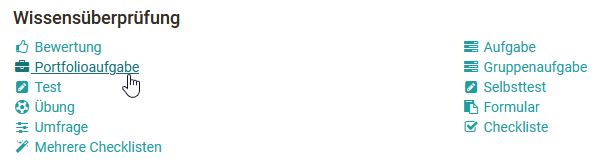
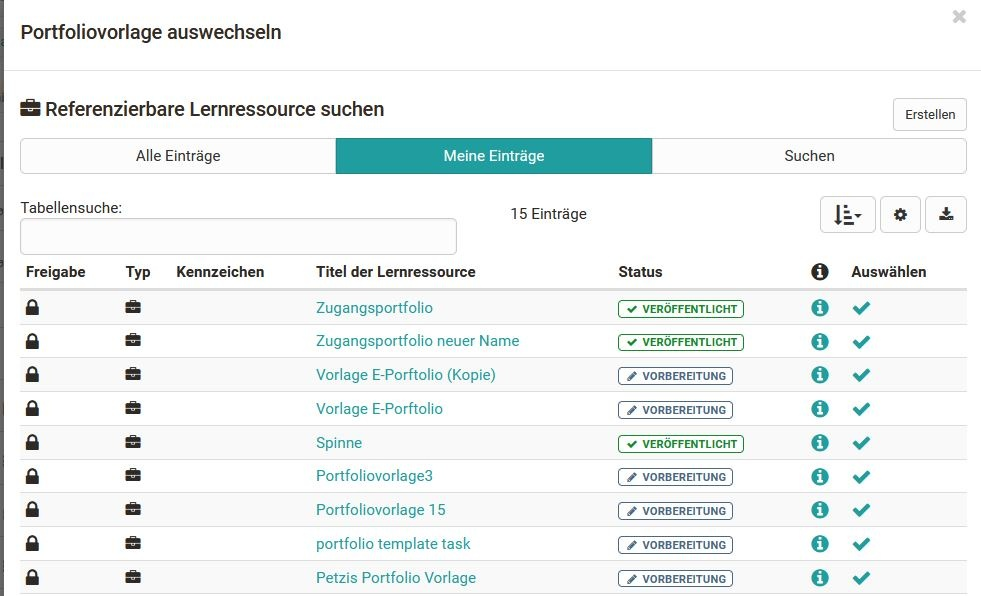

# Portfolioaufgabe erstellen

Um eine erstellte und eingerichtete Portfolio 2.0 Vorlage in einen OpenOlat
Kurs einzubinden, fügen Sie Ihrem Kurs den Kursbaustein Portfolioaufgabe hinzu.
Gehen Sie hierfür wie folgt vor:

## 1. Kurseditor öffnen und Kursbaustein Portfolioaufgabe einfügen  

a) Im Autorenbereich unter „Meine Einträge“ Kurs suchen und öffnen.

b) Oben im Dropdown-Menü „Administration” des Kurses auf „Kurseditor” klicken.  

c) Oben im Pop-Up „Kursbausteine einfügen“ „Portfolioaufgabe“ wählen.  

{ class="shadow lightbox" }

d) Im Tab „Titel und Beschreibung“ kurzen Titel des Kursbausteins eingeben und
speichern.  

## 2. Vorlage in den Kurs hinzufügen  

Nun muss dem Kursbaustein Portfolioaufgabe eine passende Lernressource Portfolio 2.0 Vorlage zugeordnet werden.

a) Im Tab Lerninhalt "Portfoliovorlage wählen oder erstellen" anklicken.

{ class="shadow lightbox" }

b) Unter "Meine Einträge" zuvor erstellte Vorlage auswählen.  

Alternativ kann über den Button "Erstellen" eine neue Portfolio 2.0 Vorlage erstellt werden.  

Damit ein Portfolio mit Punkten bewertet werden kann, muss die Portfolio 2.0
Vorlage als Kursbaustein einem Kurs hinzugefügt werden und der Haken bei
"Punkte vergeben" im Tab "Bewertung" des Kursbausteins Portfolioaufgabe
gesetzt sein.

## 3. Finalisieren 

Nachdem der Kursbaustein hinzugefügt und eingerichtet ist, muss der gesamte
Kurs wie gewohnt publiziert werden. Klicken Sie hierfür auf die Option
"Publizieren" im Kurseditor und folgen Sie den nächsten Schritten, oder
schliessen Sie einfach den Kurseditor, um schnell zu publizieren.

Die Portfolio 2.0 Vorlage steht nun im Kurs zur Verfügung, und Teilnehmende
können die Portfolioaufgabe abholen und bearbeiten.

