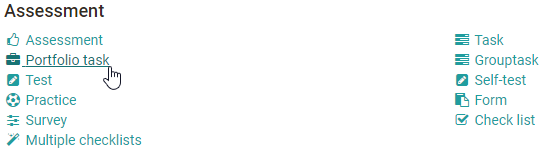
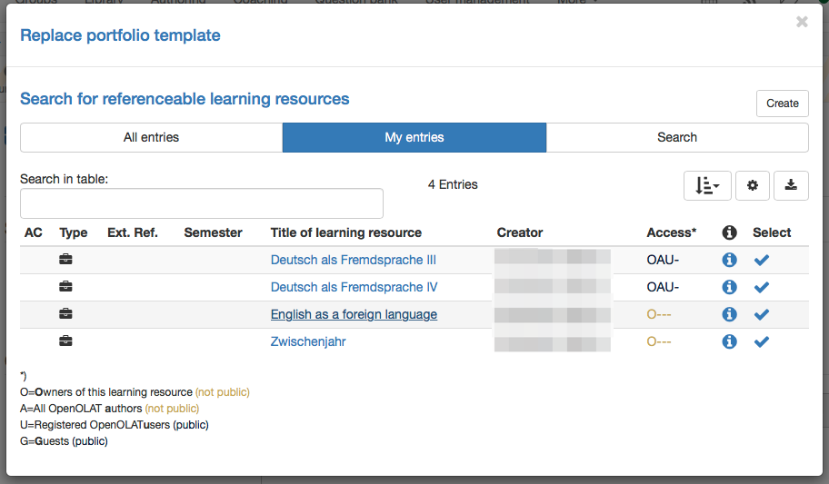

# Creating Portfolio Tasks

To integrate a created and configured Portfolio 2.0 template into an OpenOlat
course, add the course element "Portfolio task" to your course. Proceed as
follows:

## 1. Open course editor and insert the course element Portfolio task  

a) In Authoring, under "My entries", search for the course and open it.

b) Click "Course editor" in the dropdown menu "Administration" of the course.  

c) In the pop-up "Insert course elements" select "Portfolio task".

{ class="shadow lightbox" }

d) Insert a short title of the course element in the tab "Title and
description" and save.

## 2. Add template to the course  

Now the course element "Portfolio task" needs a matching learning resource
Portfolio 2.0 template.

a) In the tab "Learning content", click "Select or create portfolio
template".

{ class="shadow lightbox" }

b) Under "My entries" select the template created before.

Alternatively, a new Portfolio 2.0 template can be created with the button
"Create".

To grade a Portfolio with a score, the Portfolio 2.0 template has to be added
to a course as a course element, and the checkbox "Score granted" in the tab
"Assessment" of the course element "Portfolio task" has to be enabled.

## 3. Finalize

After the course element has been added and configured, the complete course
must be published as usual. Click the option "Publish" in the course editor
and follow the next steps, or simply close the course editor to publish
quickly.

The Portfolio 2.0 template is now available in the course, and participants
can collect the portfolio task and work on it.

