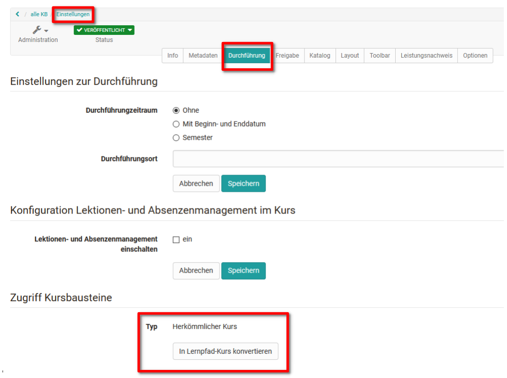
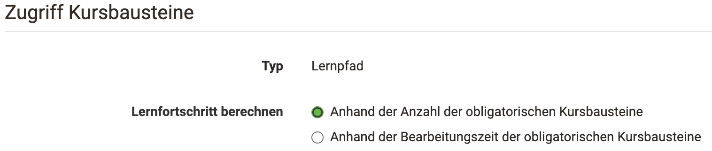
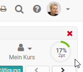
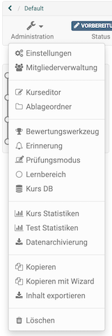

# Lernpfad Kurse erstellen

:octicons-device-camera-video-24: **Video-Einführung**: [Lernpfade einrichten](<https://www.youtube.com/embed/7TFx8877Uaw>){:target="_blank”}

Die Erstellung sowohl von herkömmlichen als auch von Lernpfad Kursen erfolgt
im Autorenbereich unter "Meine Einträge" oder "Favoriten" -> Erstellen ->
Kurs. Anschließend kann der gewünschte Kurstyp gewählt werden.

Bereits existierende, herkömmliche Kurse können in Lernpfad Kurse umgewandelt
werden. Einen entsprechenden Link findet man in der Kurs Administration und
auch im Bereich ["Einstellungen"](../learningresources/Course_Settings.de.md) im Tab "Durchführung". Bei der Konvertierung kann ab :octicons-tag-24: Release 18.1.  auch der gewünschte Kurstyp für die Konvertierung "Mit Lernpfad" oder "Mit Lernfortschritt" ausgewählt werden. 

:octicons-device-camera-video-24: **Video-Einführung**: [Herkömmliche Kurse in Kurse mit Lernpfad umwandeln](<https://www.youtube.com/embed/0Y39TXKwVqc>){:target="_blank”}

Bei der Umwandlung wird eine Kopie des Kurses angelegt. Kurse die eine
Portfolioaufgabe oder einen alten Fragebogen enthalten, können allerdings
nicht umgewandelt werden. Hier müssen zunächst die entsprechenden
Kursbausteine entfernt werden und dann die Umwandlung noch einmal gestartet
werden.

!!! warning "Achtung"

    Eine Umwandlung eines Lernpfad Kurses in einen herkömmlichen Kurs ist nicht
    möglich!

## Konfiguration zur Berechnung des Lernfortschritts

:octicons-device-camera-video-24: **Video-Einführung**: [Lernfortschritt berechnen](<https://www.youtube.com/embed/j8Yfkht2gQU>){:target="_blank”}

Gehen Sie in die Kursadministration und wählen Sie die "Einstellungen". Im Tab
"Durchführung" kann definiert werden wie der Lernfortschritt des Kurses
berechnet wird. Der Kursfortschritt kann basierend auf der Anzahl der
erfolgreich bearbeiteten obligatorischen Kursbausteine definiert werden.
Alternativ kann jeder obligatorische Kursbaustein mit einer zu erwartenden
Bearbeitungszeit versehen werden und der Fortschritt sich auf die bereits
absolvierten Zeiteinheiten beziehen.

 
Die Berechnungsgrundlage beeinflusst dann den für die Lernenden angezeigten
Fortschritt, der in der Grafik rechts oben und im Bereich "Lernpfad" der Toolbar angezeigt
wird.

:octicons-device-camera-video-24: **Video-Einführung**: [Wie sehe ich den Lernfortschritt von mir betreuter Teilnehmer?](<https://www.youtube.com/embed/VO7TyxN9EOA>){:target="_blank”}

:octicons-device-camera-video-24: **Video-Einführung**: [Wie sehe ich meinen Lernfortschritt?](<https://www.youtube.com/embed/sC2si_giXY8>){:target="_blank”}

Darüber hinaus kann in den "Einstellungen" im Tab "Bewertung" noch definiert werden, ob auch die Gesamtpunkte des Kurses in der Fortschrittsgrafikanzeige erscheinen sollen (Summe oder Durchschnitt) und ob und wie ein Bestehen des Kurses berechnet wird.
  

## Lernpfad Kurse kopieren

Wie alle Lernressourcen können auch Lernpfad Kurse kopiert werden. Neu ist jedoch seit OpenOlat 16 die Möglichkeit einen Lernpfad mit Hilfe eines Wizards zu kopieren. Auf diesem Weg können weitere Detaileinstellungen vor dem Kopiervorgang vorgenommen werden, so dass eine spätere Überarbeitung entfällt. Folgende Dinge können eingestellt werden:

  * ob bei Änderung des Durchführungszeitraums alle Datumseinstellungen automatisch angepasst werden
  * ob alle bisherigen Besitzer und Betreuer mitkopiert werden
  * ob Gruppen mitkopiert werden
  * ob Aufgabenstellungen und Musterlösungen kopiert werden
  * ob Nutzungsbedingungen übernommen werden
  * ob einzelne Kursbausteine obligatorisch oder freiwillig sind
  * sowie weitere Datumsangaben zu den einzelnen Kursbausteinen

