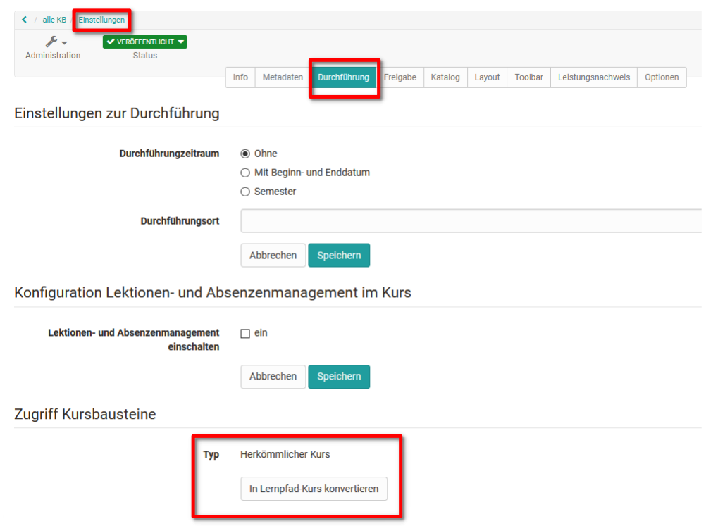
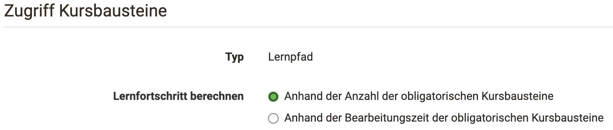
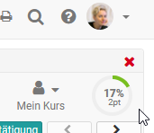
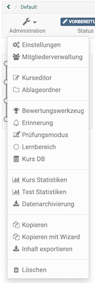

# Lernpfadkurse erstellen {: #creating_learning_path_courses}

:octicons-device-camera-video-24: **Video-Einführung**: [Lernpfade einrichten](<https://www.youtube.com/embed/7TFx8877Uaw>){:target="_blank"}

Herkömmliche Kurse und Lernpfadkurse erstellen Sie über `Autorenbereich > Erstellen > Kurs`. Im Dialog "Kurs erstellen" wählen Sie das Kursdesign: "Mit Lernpfad" oder "Mit Lernfortschritt" ergibt einen Lernpfadkurs, "Klassisch" einen herkömmlichen Kurs.

## Herkömmliche Kurse umwandeln {: #convert_course}

Bestehende herkömmliche Kurse lassen sich in Lernpfadkurse umwandeln. Die Aktion "Als Lernpfad duplizieren" finden Sie unter `Kurs > Administration` sowie unter `Kurs > Administration > Einstellungen` im Tab "Durchführung", Abschnitt "Zugriff Kursbausteine". Details zur Aktion finden Sie auf der Seite [Kurs-Administration: Übersicht](../learningresources/Administration.de.md#duplicate_as_learning_path). [:octicons-tag-16:{ title="ab Release 20.2 (OO-8967)" }](https://track.frentix.com/issue/OO-8967)

Im Dialog "Kursdesign wählen" legen Sie fest, ob die Kopie das Kursdesign "Mit Lernpfad" (sequenzielle Reihenfolge) oder "Mit Lernfortschritt" (ohne fixe Reihenfolge) erhält. Mit "Duplizieren und konvertieren" starten Sie die Umwandlung. [:octicons-tag-16:{ title="ab Release 18.1 (OO-7035)" }](https://track.frentix.com/issue/OO-7035)

:octicons-device-camera-video-24: **Video-Einführung**: [Herkömmliche Kurse in Kurse mit Lernpfad umwandeln](<https://www.youtube.com/embed/0Y39TXKwVqc>){:target="_blank"}

{ class="shadow lightbox" }

Beim Umwandeln legt OpenOlat eine Kopie des Kurses an; der herkömmliche Kurs bleibt erhalten. Kurse mit Kursbausteinen, die in Lernpfadkursen nicht unterstützt werden, lassen sich nicht umwandeln. OpenOlat listet die betroffenen Kursbausteine im Dialog "Nicht unterstützte Kursbausteine" auf. Entfernen Sie diese Kursbausteine und starten Sie die Umwandlung erneut.

!!! info "Wichtig"

    Ein Lernpfadkurs lässt sich nicht in einen herkömmlichen Kurs umwandeln.

## Konfiguration zur Berechnung des Lernfortschritts

:octicons-device-camera-video-24: **Video-Einführung**: [Lernfortschritt berechnen](<https://www.youtube.com/embed/j8Yfkht2gQU>){:target="_blank"}

Öffnen Sie `Kurs > Administration > Einstellungen`, Tab "Durchführung". Im Abschnitt "Zugriff Kursbausteine" legen Sie unter "Lernfortschritt berechnen" fest, wie OpenOlat den Lernfortschritt des Kurses berechnet:

* **Anhand der Anzahl der obligatorischen Kursbausteine**: Jeder erledigte obligatorische Kursbaustein zählt gleich viel.
* **Anhand der Bearbeitungszeit der obligatorischen Kursbausteine**: Jeder obligatorische Kursbaustein trägt im Kurseditor eine geschätzte Bearbeitungszeit. Der Fortschritt ergibt sich aus den bereits absolvierten Zeiteinheiten. Beim Wechsel auf diese Option fragt OpenOlat nach einem Initialwert, den es bei Kursbausteinen ohne Bearbeitungszeit einträgt.

{ class="shadow lightbox" }

Die Berechnungsgrundlage bestimmt den Fortschritt, den die Lernenden in der Fortschrittsgrafik rechts oben in der Kurs-Toolbar und im Bereich "Lernpfad" sehen.

:octicons-device-camera-video-24: **Video-Einführung**: [Wie sehe ich den Lernfortschritt von mir betreuter Teilnehmer?](<https://www.youtube.com/embed/VO7TyxN9EOA>){:target="_blank"}

:octicons-device-camera-video-24: **Video-Einführung**: [Wie sehe ich meinen Lernfortschritt?](<https://www.youtube.com/embed/sC2si_giXY8>){:target="_blank"}

Unter `Kurs > Administration > Einstellungen`, Tab "Bewertung", legen Sie zusätzlich fest, ob die Fortschrittsgrafik auch die Gesamtpunkte des Kurses anzeigt (Summe oder Durchschnitt) und ob und wie der Kurs als bestanden gilt. Mehr dazu unter [Kurseinstellungen, Tab Bewertung](../learningresources/Course_Settings.de.md#assessment).

{ class="shadow lightbox" }

## Lernpfadkurse kopieren {: #copy_learning_path_course}

Wie alle Lernressourcen lassen sich Lernpfadkurse kopieren. Zusätzlich steht unter `Kurs > Administration > Kopieren mit Wizard` ein Assistent zur Verfügung, mit dem Sie Detaileinstellungen vor dem Kopieren festlegen. So müssen Sie die Kopie nicht nachbearbeiten. Sie können festlegen:

* ob bei einer Änderung des Durchführungszeitraums alle Datumseinstellungen automatisch angepasst werden
* ob die bisherigen Besitzer:innen und Betreuer:innen mitkopiert werden
* ob Gruppen mitkopiert werden
* ob Aufgabenstellungen und Musterlösungen kopiert werden
* ob Nutzungsbedingungen übernommen werden
* ob einzelne Kursbausteine obligatorisch oder freiwillig sind
* weitere Datumsangaben zu den einzelnen Kursbausteinen

{ class="shadow lightbox" }

## Weiterführende Informationen {: #further_information}

**Auf dieser Seite erwähnt** 
[Kurs-Administration: Übersicht >](../learningresources/Administration.de.md) 
[Kurseinstellungen >](../learningresources/Course_Settings.de.md)

**Weiterführend** 
[Lernpfadkurs - Überblick >](../learningresources/Learning_path_course.de.md) 
[Lernpfadkurs - Kurseditor >](../learningresources/Learning_path_course_Course_editor.de.md) 
[Lernpfadkurs - Teilnehmeransicht >](../learningresources/Learning_path_course_Participant_view.de.md) 
[Kopieren eines Kurses mit Wizard >](../learningresources/Course_Copy_Wizard.de.md)

**youtube** 
[Lernpfade einrichten](<https://www.youtube.com/embed/7TFx8877Uaw>) 
[Herkömmliche Kurse in Kurse mit Lernpfad umwandeln](<https://www.youtube.com/embed/0Y39TXKwVqc>) 
[Lernfortschritt berechnen](<https://www.youtube.com/embed/j8Yfkht2gQU>) 
[Wie sehe ich den Lernfortschritt von mir betreuter Teilnehmer?](<https://www.youtube.com/embed/VO7TyxN9EOA>) 
[Wie sehe ich meinen Lernfortschritt?](<https://www.youtube.com/embed/sC2si_giXY8>)

[Zum Seitenanfang ^](#creating_learning_path_courses)
