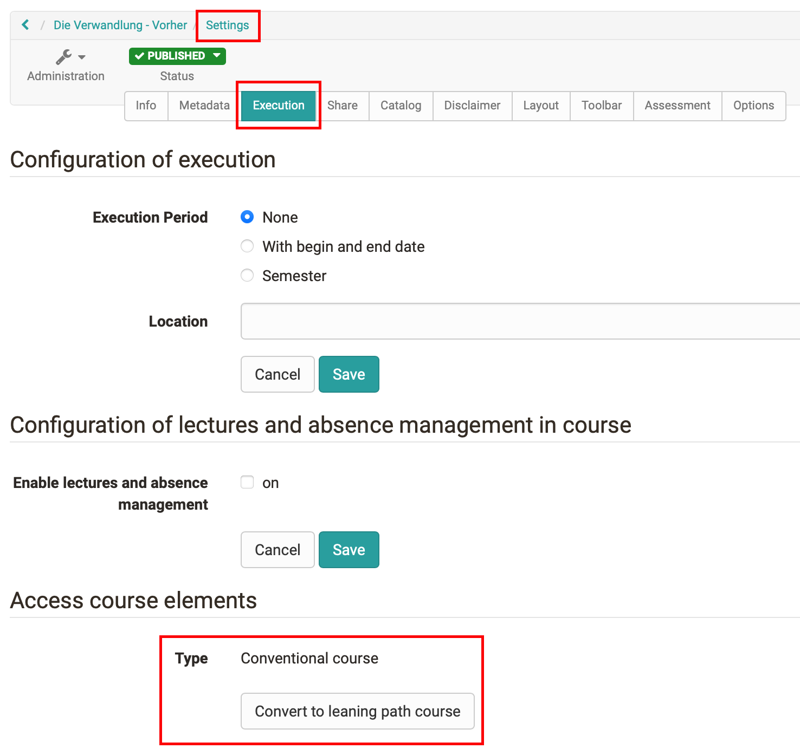
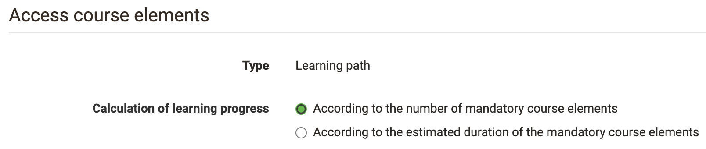
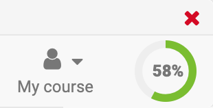
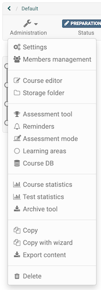

# Creating learning path courses {: #creating_learning_path_courses}

:octicons-device-camera-video-24: **Video Introduction (German)**: [Lernpfade einrichten](<https://www.youtube.com/embed/7TFx8877Uaw>){:target="_blank"}

You create conventional courses and learning path courses via `Authoring > Create > Course`. In the "Create course" dialog you select the course design: "With learning path" or "With learning progress" results in a learning path course, "Classic" in a conventional course.

## Converting conventional courses {: #convert_course}

Existing conventional courses can be converted into learning path courses. You find the action "Duplicate as learning path" under `Course > Administration` and under `Course > Administration > Settings` in the tab "Execution", section "Access course elements". Details on the action can be found on the page [Course Administration: Overview](../learningresources/Administration.md#duplicate_as_learning_path). [:octicons-tag-16:{ title="from Release 20.2 (OO-8967)" }](https://track.frentix.com/issue/OO-8967)

In the dialog "Select course design" you define whether the copy gets the course design "With learning path" (sequential order) or "With learning progress" (without fixed sequence). "Duplicate & convert" starts the conversion. [:octicons-tag-16:{ title="from Release 18.1 (OO-7035)" }](https://track.frentix.com/issue/OO-7035)

:octicons-device-camera-video-24: **Video Introduction (German)**: [Herkömmliche Kurse in Kurse mit Lernpfad umwandeln](<https://www.youtube.com/embed/0Y39TXKwVqc>){:target="_blank"}

{ class="shadow lightbox" }

During the conversion OpenOlat creates a copy of the course; the conventional course is retained. Courses with course elements that are not supported in learning path courses cannot be converted. OpenOlat lists the affected course elements in the dialog "Unsupported course elements". Remove these course elements and start the conversion again.

!!! info "Important"

    A learning path course cannot be converted into a conventional course.

## Configuration for calculating the learning progress

:octicons-device-camera-video-24: **Video Introduction (German)**: [Lernfortschritt berechnen](<https://www.youtube.com/embed/j8Yfkht2gQU>){:target="_blank"}

Open `Course > Administration > Settings`, tab "Execution". In the section "Access course elements" you define under "Calculation of learning progress" how OpenOlat calculates the learning progress of the course:

* **According to the number of mandatory course elements**: Each completed mandatory course element counts equally.
* **According to the estimated duration of the mandatory course elements**: Each mandatory course element carries an estimated learning time in the course editor. The progress results from the time units already completed. When you switch to this option, OpenOlat asks for an initial value, which it enters for course elements without a learning time.

{ class="shadow lightbox" }

The calculation basis determines the progress that learners see in the progress graphic at the top right of the course toolbar and in the "Learning path" area.

:octicons-device-camera-video-24: **Video Introduction (German)**: [Wie sehe ich den Lernfortschritt von mir betreuter Teilnehmer?](<https://www.youtube.com/embed/VO7TyxN9EOA>){:target="_blank"}

:octicons-device-camera-video-24: **Video Introduction (German)**: [Wie sehe ich meinen Lernfortschritt?](<https://www.youtube.com/embed/sC2si_giXY8>){:target="_blank"}

Under `Course > Administration > Settings`, tab "Assessment", you additionally define whether the progress graphic also displays the total score of the course (sum or average) and whether and how the course counts as passed. More on this under [Course Settings, tab Assessment](../learningresources/Course_Settings.md#assessment).

{ class="shadow lightbox" }

## Copying learning path courses {: #copy_learning_path_course}

Like all learning resources, learning path courses can be copied. In addition, a wizard is available under `Course > Administration > Copy with wizard` with which you define detailed settings before copying. This way you do not need to rework the copy. You can define:

* whether all date settings are adjusted automatically when the execution period changes
* whether the previous owners and coaches are copied as well
* whether groups are copied as well
* whether assignments and sample solutions are copied
* whether terms of use are taken over
* whether individual course elements are mandatory or optional
* further dates for the individual course elements

{ class="shadow lightbox" }

## Further information {: #further_information}

**Mentioned on this page** 
[Course Administration: Overview >](../learningresources/Administration.md) 
[Course Settings >](../learningresources/Course_Settings.md)

**Further reading** 
[Learning path course - Overview >](../learningresources/Learning_path_course.md) 
[Learning path course - Course editor >](../learningresources/Learning_path_course_Course_editor.md) 
[Learning path course - Participant view >](../learningresources/Learning_path_course_Participant_view.md) 
[Copy a course with wizard >](../learningresources/Course_Copy_Wizard.md)

**youtube** 
[Lernpfade einrichten](<https://www.youtube.com/embed/7TFx8877Uaw>) 
[Herkömmliche Kurse in Kurse mit Lernpfad umwandeln](<https://www.youtube.com/embed/0Y39TXKwVqc>) 
[Lernfortschritt berechnen](<https://www.youtube.com/embed/j8Yfkht2gQU>) 
[Wie sehe ich den Lernfortschritt von mir betreuter Teilnehmer?](<https://www.youtube.com/embed/VO7TyxN9EOA>) 
[Wie sehe ich meinen Lernfortschritt?](<https://www.youtube.com/embed/sC2si_giXY8>)

[To the top of the page ^](#creating_learning_path_courses)
