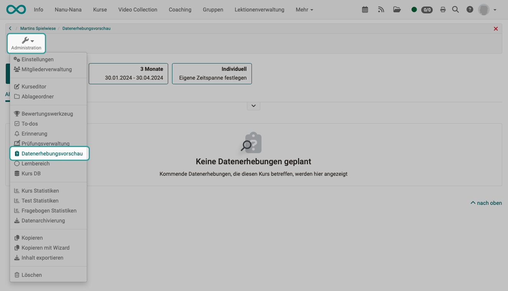
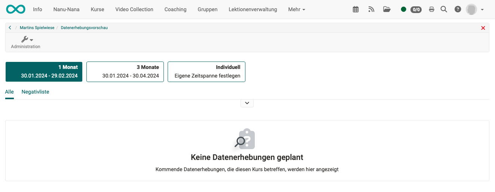

# Datenerhebungsvorschau {: #Data_Collection_Preview}

[:octicons-tag-16:{ title="ab Release 18.2 (OO-7399)" }](https://track.frentix.com/issue/OO-7399)

## Was ist eine Datenerhebungsvorschau?

In OpenOlat kann ein **Modul "Qualitätsmanagement"** eingebunden werden. Damit können kursübergreifend Umfragen (basierend auf Formularen) erstellt und ausgewertet werden. Beispielsweise könnte ein Kursbaustein "Umfrage" zu Beginn des Kurses und ein weiterer Kursbaustein "Umfrage" am Ende des Kurses eingebaut sein.

Für die **Erstellung und Auswertung** solcher Umfragen ist eine Person mit der **Rolle "Qualitätsmanager:in"** vorgesehen. Sie sieht dann kursübergreifend auch alle Ergebnisse der Umfragen.

Wurde in einen Kurs ein Kursbaustein eingefügt, mit dem die Qualität erfasst werden soll, dann haben auch die  Kursbesitzer:innen dieses bestimmten Kurses ein berechtigtes Interesse, etwas über die Umfrage zu erfahren.

Mit der Datenerhebungsvorschau wird den **Kursbesitzer:innen** angezeigt, welche Erhebungen geplant sind.

{ class="shadow lightbox" }

{ class="shadow lightbox" }

!!! info "Wichtig"

    Kursbesitzer:innen haben hier nur Leserecht. Die Planung, wann Daten erhoben werden, ist den Qualitätsmanager:innen vorbehalten.

**Negativliste:** 
Wurde eine Datenerhebung vorbereitet, bezieht sie sich in aller Regel auf mehrere Kurse und Kursbausteine. Wird z.B. eine Erhebung kurz vor Ferienbeginn geplant, kann es sein, dass ein bestimmter Kurs am letzten Tag vor den Ferien nicht mehr besucht werden wird. Damit das Ergebnis der gesamten Erhebung dann trotzdem transparent bleibt, kann dieser Kurs an diesem Tag als Ausnahme erfasst werden und erscheint dann in der Negativliste.

## Aktivierung

Damit Datenerhebungen zur Qualitätssicherung durchgeführt werden können, muss das Modul "Qualitätsmanagement" von einem/einer Administrator:in eingebunden worden sein.

Innerhalb der Konfiguration des Moduls unter `Administration > Module > Qualitätsmanagement` muss dann die Option "Datenerhebungsvorschau" aktiviert werden. Erst dann erscheint für Kursbesitzer:innen und Betreuer:innen die Option im Kursmenü "Administration".

Siehe [Modul Qualitätsmanagement](../../manual_admin/administration/Modules_Quality_Management.de.md).

## Weiterführende Informationen {: #further_information}

**Auf dieser Seite erwähnt** 
[Modul Qualitätsmanagement >](../../manual_admin/administration/Modules_Quality_Management.de.md)

**Weiterführend** 
[Qualitätsmanagement: Datenerhebungsvorschau >](../area_modules/Quality_Management_Data_Collection_Preview.de.md) 
[Qualitätsmanagement: Übersicht >](../area_modules/Quality_Management.de.md) 
[Qualitätsmanagement: Datenerhebung >](../area_modules/Quality_Management_Data_Collections.de.md)

[Zum Seitenanfang ^](#Data_Collection_Preview)

