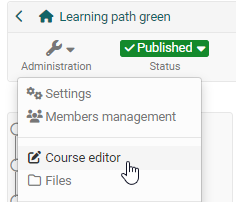
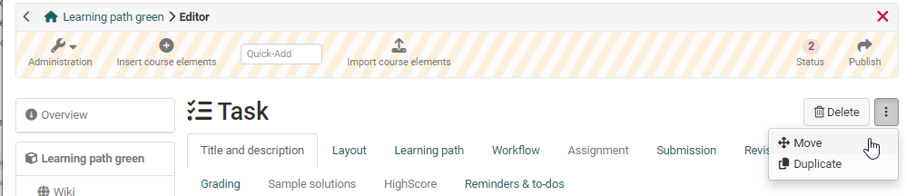
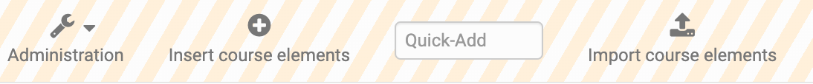
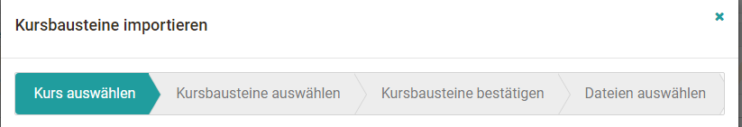

# Deleting, Moving and Copying Course Elements

You can make changes to your course in the course editor. You can access the course editor by starting the course and selecting the option "Course editor"
in the menu under "Administration".

In order to delete, duplicate or move a course element, you have to select the course element first. Then the corresponding menu appears in the top right.

The respective action refers to the currently selected course element and all subordinate course elements. In the Move or Duplicate window, select the position under which you want to insert the course element and select the corresponding arrow: Up to insert the new element above, down to insert the element below, and the curved arrow to insert the element below. Likewise, it is possible to move course elements simply by means of "Drag&Drop" in the course structure on the left.

Duplicating course elements is recommended if, for example, you want to offer
offer group work and want to use the same structure several times.

The changes for deleting, moving and copying course elements have to be published to become effective for the course participants. As long as you have not published them, deleted course elements can be
be restored.

## Importing course elements

If you have already created a comprehensive course structure in another course you would like to continue using, it is a good idea to copy these course elements into the desired course via "Import course elements".

### The way:

a) Select the desired course in which the course element(s) to be copied are located.

b) Select the course element(s) you want to transfer.
Subordinate course elements are automatically selected, but can be deselected again by removing the check mark.

c) All selected course elements will be displayed to you once again. For some course elements such as podcast, blog, wiki, task, group task or folder, even more settings can be made for the copy process. For example, the files of the course element folder can be copied as well. A blog, wiki, or podcast can either be reused, recreated, or
created or not further configured for the moment. In the case of tasks and group tasks, the stored task definition and the sample solution can be copied or not.

d) In the next step, the files located in the storage folder of the course to be copied will appear and can be selected if necessary. The files associated with the selected course elements are already preselected. However, it is possible to change the setting at this point.

**Please note:**

* When copying course elements, groups will not be copied. So for group tasks, enrollments either new groups have to be created or existing groups have to be linked later on

* When copying forums, the forum posts will not be copied.

* When copying BigBlueButton, no rooms and appointments will be copied.
  

## Changes to the current course

You decide the time when the changes appear in the current course. All users who edit the course at the time of publishing must restart the course. Unsaved forum posts or test results will be lost! If users are in the course and you can postpone publishing to a later date, we recommend that you cancel the publishing process and repeat it later.

  

