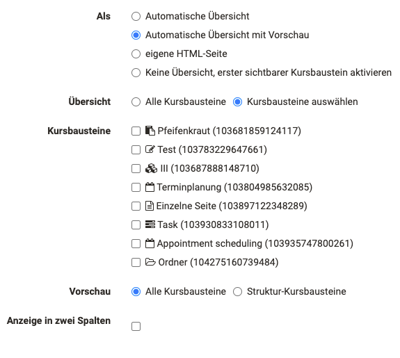
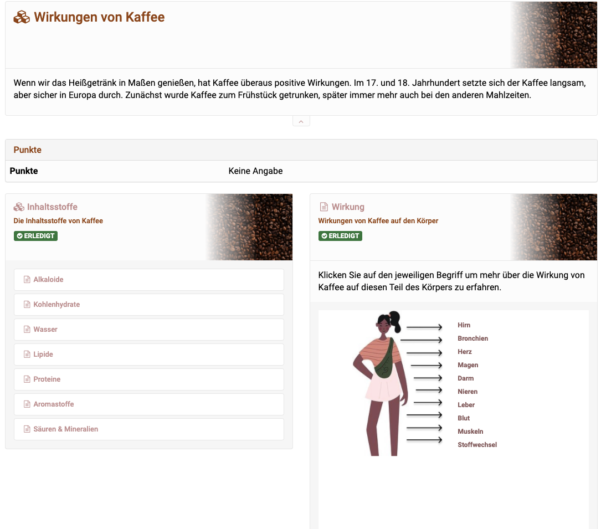

# Design possibilities of courses and course elements

The presentation of a course and the built-in course elements can be configured by the course owner. The basic settings for this are defined in the course administration in the tab "Layout". Further details and adjustments can be made in the course editor for the respective course elements, especially in the tabs "Title and description" and "Layout". 

## Layout Settings in the Course administration
  
### Tab "Layout" 

In the tab Layout of the course settings the default style of the display can be defined. These include: Selecting a background image, defining the style, and assigning a color category.

Course owners can upload their own image (maximum 4 MB) to display the course elements, choose an image from the library or do without an image altogether. The image can be positioned on the right or on the left, displayed as a gradient on the right or full-screen.
 
  

## Layout settings in the course editor

In the course editor, the tabs "Title and description" and "Layout" can be used for further configuration of the course layout.

### Tab "Titel and description" 

In the tab "Title and description" of a course element, in addition to the title and the general short description of the course element, extended information can be provided, which will be displayed as information in the upper part of the course element: Learning objectives, instructions, and specific guidance for coaches. 

**Learning objectives:** Describe here what exactly you want to achieve with the course element. For example, in the case of structural modules, the learning objectives for the entire subordinate area can be explained. In general, you should check for which course elements a description of the learning objectives is relevant.
  
**Instructions:** Instruction or learning guidance for participants in the course. Explain in more detail here what you want learners to do with this course element. 
  
**Notes for coaches**
Further information about this course element can be left for the coaches here. This information is visible only to coaches and owners of the course.

### Tab "Layout" 

In the tab Layout of a course element it is possible to change and overwrite the default settings made in the "Settings" of the course administration for each individual course element.

For the background image, style and color category, you can choose between "Course standard", "Inherited" and "Course element specific". The course default refers to the basic settings of the administration. Inherited refers to the setting of the parent course element. And with "Course element specific" you can make a special configuration for the selected course element. 

**Display**: Choose whether or not to display the info defined in the "Title and Description" tab.

  

### Automatic overview

On the top course note and all structure course elements, further settings for the display can be made in the tab "Overview". One advantage is the use of the automatic overview, especially as an orientation aid for the user. Here you can select all or specific course elements for the automatic overview.

!!! Tip "Hint"

    Try out the different displays and check which one suits your purposes best. Do not overload the display. Too many texts, images and information quickly lead to a confusing presentation.
