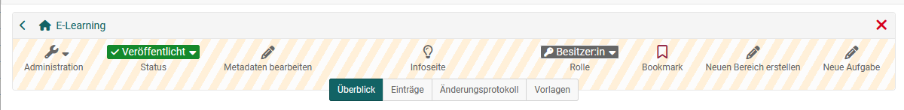

# Detailansicht einer Lernressource

Eine Lernressource besteht aus verschiedenen Bereichen.  Auch wenn sich die Lernressourcen bezüglich Aufbau und Struktur unterscheiden, verfügen alle über eine Toolbar. 

## Toolbar von Lernressourcen

Über die Toolbar ist ein Zugriff auf die "Infoseite" der Lernressource möglich. Besitzende der Lernressource  sehen ihre Rolle (z.B. Besitzer:in) und können über die Toolbar die Menüs der Administration der Lernressource aufrufen. Auch der Status der Lernressource (z.B. veröffentlicht) wird in der Toolbar angezeigt und kann hier von Besitzenden geändert werden. Zudem lässt sich ein Bookmark auf die Lernressource setzen.

Je nach Lernressource können sich auch weitere Elemente in der Toolbar befinden. Was sich genau in der Toolbar befindet und sichtbar ist hängt ab von: 
-	dem Typ der Lernressource
-	der Rolle in der man auf die Lernressource schaut 
-	ob man sich Bearbeitungs- oder Ansichtsmodus befindet
-	der konkreten Konfiguration (siehe Einstellungen)

Hier ein paar **Toolbar-Beispiele:**

Beispiel für eine typische Toolbar, die für die meisten Lernressourcen wie Blog, Podcast, Formular, Glossar, Ressourcenordner Video oder Wiki gilt: 

Die Toolbar eines Kurses kann dagegen noch weitere Elemente und Werkzeuge enthalten:

Die Toolbar der Portfolio 2.0 Vorlage dient eher der Konfiguration: 

## Administration von Lernressourcen
Im Menü "Administration" einer Lernressource können weitere Untermenüs für die Konfiguration aufgerufen werden. 

Alle Lernressourcen verfügen über die Menüs:
* Einstellungen
* Mitgliederverwaltung
* Kopieren
* Inhalt exportieren
* Löschen

Sowie je nach Lernressource weitere Menüs. 

In den **"Einstellungen"** werden generelle Informationen zur Lernressource hinterlegt, Metadaten konfiguriert, die Freigabe eingerichtet, ein Katalogeintrag definiert und weitere Lernressource spezifische Einstellungen vorgenommen. Weitere Informationen zu ein einzelnen Einstellungen mit Blick auf Kurse finden Sie unter  [Kurseinstellungen](../learningresources/Course_Settings.de.md).

In der **Mitgliederverwaltung** können weitere Besitzer:innen der Lernressource hinzugefügt werden. 

**Kopieren**, erstellt eine Kopie der Lernressource. Die so angelegte neue Lernressource erscheint anschliessend ebenfalls im Autorenbereich. 

**Inhalt exportieren**, ermöglicht einen Download der Lernressource, z.B. als Backup-Datei (zip file). Diese Datei kann später wieder in OpenOlat importiert werden. Auf diese Weise können Lernressourcen auch in andere OpenOlat Instanzen übertragen werden.

**Löschen** führt dazu, dass die Lernressource als "gelöscht* markiert wird. Sie erscheint dann im Autorenbereich im Tab  "Gelöscht" (Papierkorb Funktion). Solange sich die Lernressource noch im Papierkorb befindet kann sie wiederhergestellt oder auch dauerhaft gelöscht werden. 

 