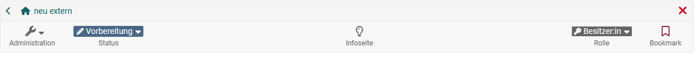
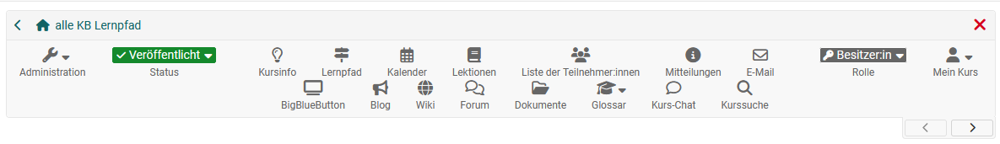
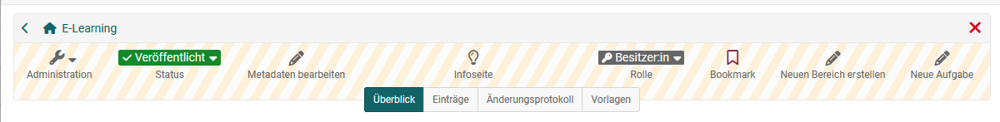

#  Detailed View of Learning Resources

A learning resource consists of different areas.  Even if the learning resources differ in terms of structure, they all have a toolbar.

## Toolbar of learning resources

The toolbar provides access to the "info page" of the learning resource. Owners of the learning resource can see their role (e.g. owner) and can access the administration menus of the learning resource via the toolbar. The status of the learning resource (e.g. published) is also displayed in the toolbar and can be changed here by the owner. A bookmark can also be placed on the learning resource.

Depending on the learning resource, there may also be other elements in the toolbar. What exactly is in the toolbar and is visible depends on:
- the type of learning resource
- the role in which you are viewing the learning resource
- whether you are in edit or view mode
- the particular configuration (see Settings)

Here are a few **toolbar examples:**

Example of a typical toolbar that applies to most learning resources such as blog, podcast, form, glossary, resource folder video or wiki:

The toolbar of a course, on the other hand, can contain other elements and tools:

The toolbar of the Portfolio 2.0 template is more for configuration purposes: 

## Administration of the learning resource
Further submenus for configuration can be called up in the "Administration" menu of a learning resource. 

All learning resources have menus:
* Settings
* Member management
* Copy
* Export content
* Delete

As well as other menus depending on the learning resource. 

In the **"Settings"**, general information about the learning resource is stored, metadata is configured, sharing is set up, a catalog entry is defined and other learning resource-specific settings are made. Further information on individual settings with regard to courses can be found under [Course settings](../learningresources/Course_Settings.md).

Additional owners can be added to the learning resource in the **Member management**. 

**Copy**, creates a copy of the learning resource. The new learning resource created in this way will then also appear in the authoring area. 

**Export content**, allows you to download the learning resource, e.g. as a backup file (zip file). This file can later be imported back into OpenOlat. In this way, learning resources can also be transferred to other OpenOlat instances.

**Delete** causes the learning resource to be marked as "Deleted". It will then appear in the "Deleted" tab in the author area (trash bin function). As long as the learning resource is still in the trash bin, it can be restored or permanently deleted. 

